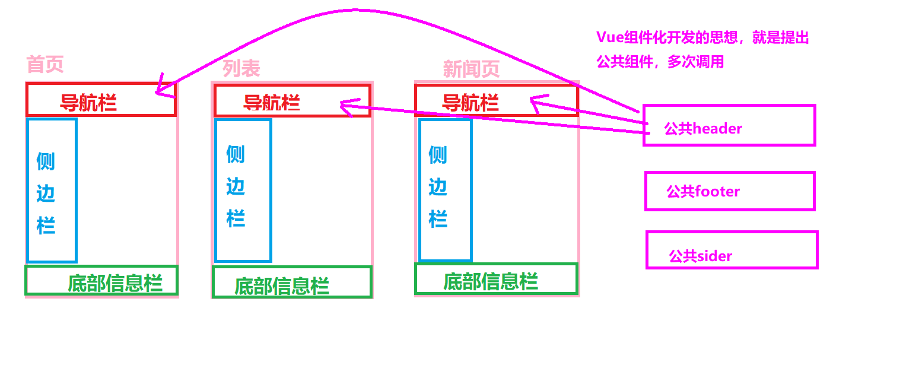

# 框架知识介绍

### 1、为什么要学习流行框架？

企业为了提高开发效率：在企业中，时间就是效率，效率就是金钱；

 + 提高开发效率的发展历程

   原生JS -> Jquery之类的类库 -> 前端模板引擎 -> Angular.js / Vue.js/React（能够帮助我们减少不必要的DOM操作；提高渲染效率；【前端程序员只需要关心数据的业务逻辑，不再关心DOM是如何渲染的了】）


### 2、前端框架与库的区别？

- 功能层面

  jquery库：操作DOM+网络请求

  框架：提供全方位功能，齐全

  如果把库比作肯德基的小套餐的话，框架就类似于KFC的全家桶级别的。

  库是以提供API为主，像JQuery提供了大量的API，如果是框架呢，就是提供基础性的服务为主，像React、Vue有虚拟Dom的支持，都会一些基础性的服务，可以节省实际开发的代码量。

- 代码层面

  库：是为了实现某个功能，而调用某个函数；

  框架：帮助我们运行编写好的代码（步骤：1、初始化框架自身的一些行为；2、执行你编写好的代码；3、释放一些资源）。

- 总结

  库：单一某个层面；可以任何地方调用库

  框架：大而沉，把代码给框架去执行。是一套完整的解决方案；对项目的侵入性较大，项目如果需要更换框架，则需要重新架构整个项目。


# React 基本使用

**主要内容**

* React介绍
* jsx语法、元素渲染
* 组件
* props

**学习目标**

 知识点| 要求 
 -| :- 
 React介绍 | 掌握 
 jsx语法、元素渲染 | 掌握 
 组件 | 掌握 
 props | 掌握 


## 一、React介绍

### 1.1 介绍

​	React 起源于 Facebook 的内部项目，因为该公司对市场上所有 JavaScript MVC 框架，都不满意，就决定自己写一套，用来架设 Instagram 的网站。做出来以后，发现这套东西很好用，就在2013年5月开源了。由于 React 的设计思想极其独特，属于革命性创新，性能出众，代码逻辑却非常简单。所以，越来越多的人开始关注和使用

React主要是用于构建用户界面的 JavaScript 库，实现单页面应用。

特点：声明式设计（采用声明范式）、高效、灵活、JSX语法、组件、单向响应的数据流、数据双向绑定

react中文网：https://react.docschina.org/


#### 1.1.2.  React 的描述 

1) 用于构建用户界面的 JavaScript 库(只关注于 View) 

2) 由 Facebook 开源 

#### 1.1.3. React 的特点 

1) Declarative(声明式编码) 

2) Component-Based(组件化编码) 

3) Learn Once, Write Anywhere(支持客户端与服务器渲染) 

4) 高效 

5) 单向数据流


#### 1.1.4. React 高效的原因 

1) 虚拟(virtual)DOM, 不总是直接操作 DOM

2) DOM Diff 算法, 最小化页面重绘


#### 1.1.5. 相关 js 库 

1) react.js: React 的核心库 

2) react-dom.js: 提供操作 DOM 的 react 扩展库 

3) babel.min.js: 解析 JSX 语法代码转为纯 JS 语法代码的库


### 1.2 工具

谷歌react调试工具：react develpoer tools，用于调试react

 redux调试工具：redux devTools，用于调试redux

 markdown文本，创建的文件后缀是.md结尾的，是在github，npm,码云等代码托管平台上使用一种文本格式，在这种网站上会自动展示.md文件的内容，主要是说明功能


### 1.3 初识React

#### CND引入

引入核心文件：

```html
<!-- 引入react核心库 -->
<script src="https://unpkg.com/react@17/umd/react.development.js"></script>
<!-- 引入react-dom，用于支持react操作DOM -->
<script src="https://unpkg.com/react-dom@17/umd/react-dom.development.js"></script>

<!-- 引入babel，用于将jsx转为js -->
<script src="https://unpkg.com/@babel/standalone/babel.min.js"></script>
```


```react
<!-- 准备好一个容器，用于让react渲染用 -->
<div id="root"></div>
<!-- 下面一定要将javascript改为babel，含义是：让babel翻译script标签中的代码。 -->
<script type="text/babel">

   //1.创建虚拟DOM
	const VDOM = <h1>Hello,React</h1> //此处一定不要写引号，因为VDOM不是字符串！！！

	//2.使用react语法将VDOM转为真实DOM，插入页面
	ReactDOM.render(VDOM,document.getElementById('root'))

</script>
```

##### 元素渲染

​	元素描述了你在屏幕上想看到的内容，是构成 React 应用的最小砖块，与浏览器的 DOM 元素不同，React 元素是创建开销极小的普通对象。React DOM 会负责更新 DOM 来与 React 元素保持一致

**语法：ReactDOM.render(**element**,**parentNode**)**

​	参数1：element为要显示的元素。可以是双标签形式的，也可以是单标签形式的，如果是单标签必须有结束符号

​	参数2：parentNode为元素要显示在页面的哪个标签中。

​	3.渲染方法一般一个项目中只有一个。其他页面通过组件引入或者路由访问。 

​	4.更新已渲染的元素:React 元素是不可变对象。一旦被创建，你就无法更改它的子元素或者属性。一个元素就像电影的单帧：它代表了某个特定时刻的 UI。更新 UI 唯一的方式是创建一个全新的元素，并将其传入 ReactDOM.render()


##### 代码演示

```jsx
function tick() {
  const element = (
    <div>
      <h1>Hello, world!</h1>
      <h2>It is {new Date().toLocaleTimeString()}.</h2>
    </div>
  );
  ReactDOM.render(element , document.getElementById('root'));
}
setInterval(tick, 1000);
```


### 1.4 对比：虚拟DOM与真实DOM

```js
//1.创建虚拟DOM
const VDOM = <h1>Hello,React</h1> 
const TDOM = document.getElementById('root')
console.log('虚拟DOM',VDOM); //对象
console.log('真实DOM',TDOM);

debugger;
console.log(typeof VDOM);
console.log(VDOM instanceof Object); //true
```


##### 虚拟DOM：

1. 虚拟DOM本质就是JS对象
2. 虚拟DOM特点就是 “轻”，
3. 虚拟DOM最终需要React转化为真实DOM，才能够呈现在页面上


### 1.5 虚拟DOM的两种创建方式

#### 第一种：==jsx== 创建虚拟DOM

```jsx
//1.创建虚拟DOM
const VDOM = (
    <h1 id="title">
        <span>Hello,React</span>
    </h1>
    )
```


#### 第二种：js 语法创建虚拟DOM

```js
//1.创建虚拟DOM
const VDOM = React.createElement('h1',{id:'title',className:'box'},React.createElement('span',{},'Hello,React'))
```


### 1.3 安装

npx create-react-app my-app

通过这个指令一键搭建react环境，基于webpack的

cd my-app  	进入文件夹

npm start  	启动

复制空白环境

复制已经下载好的空白环境到目标位置

cd my-app 		进入文件夹

cnpm i    安装

npm start 		启动

### 1.4 项目介绍

1. 目录结构
2. webpack暴露文件说明


## 二、jsx语法、元素渲染

### 2.1  jsx语法介绍

React特殊语法：js或者jsx语法  框架底层：javascript 或者 typescript（ ts tsx）

HTML 语言直接写在 JavaScript 语言之中，不加任何引号，这就是 JSX（JavaScript and XML） 的语法，JSX,是一种 JavaScript 的语法扩展，它允许 HTML 与 JavaScript 的混写。

 JSX 是一个表达式，可以在 if 语句和 map循环的代码块中使用 JSX，将 JSX 赋值给变量，把 JSX 当作参数传入，以及从函数中返回 JSX

### 2.1 为什么使用JSX？

#### createElement()的问题

1. 繁琐不简洁。 
2. 不直观，无法一眼看出所描述的结构。 
3. 不优雅，用户体验不爽。 


#### 总结

- 本质：React.createElement(component,props,...children)的语法糖，
- 作用：简化创建虚拟Dom
- 优势：声明式语法更加直观、与HTML结构相同，降低了学习成本、提升开发效率 
- JSX 是 React 的核心内容。


### 2.2 JSX使用步骤

1. 使用 JSX 语法创建 react 元素 

   ```jsx
   // 使用 JSX 语法，创建 react 元素： 
   const title = <h1>Hello JSX</h1> 
   ```

2. 使用 ReactDOM.render() 方法渲染 react 元素到页面中 

   ```jsx
   // 渲染创建好的React元素 
   ReactDOM.render(title, root) 
   ```


#### 在脚手架中使用JSX

1. JSX 不是标准的 ECMAScript 语法，它是 ECMAScript 的语法扩展。 
2. 需要使用 babel 编译处理后，才能在浏览器环境中使用。 
3. create-react-app 脚手架中已经默认有该配置，无需手动配置。 

`注意`: ==**JSX是React.createElement方法的语法糖**==


### 2.3 元素渲染

#### 嵌入 JS 表达式 

- 数据存储在JS中 

- 语法：{ JavaScript表达式 }  

- 注意：语法中是**单大括号**，不是双大括号！ 

  ```jsx
  const name = 'Jack' 
  const div = ( 
    <div>你好，我叫：{name}</div> 
  ) 
  ```

#### 使用注意

- 单大括号中可以使用任意的 JavaScript 表达式 （值，变量，函数调用，三元运算符，数组(基本类型，jsx)）
- **JSX 自身也是 JS 表达式** 
- 注意：不能在{}中出现语句和对象（比如：if/for，{a:100} 等） 


#### JSX样式处理

##### 行内样式-style

* style属性{{属性:值}}

```jsx
<h1 style={{ color: 'red', backgroundColor: '#eee' }}> 
  JSX的样式处理 
</h1> 
```


##### 类名-className(推荐)

* 属性名小驼峰命名

```jsx
<h1 className="title"> 
 JSX的样式处理 
</h1> 
```


## 三、脚手架环境安装

### 3.1 安装

#### 安装方式：

 1. 普通安装 直接安装

    ```bash
    npx create-react-app project 
    ```

    通过这个指令一键搭建react环境，基于webpack的，是用npx来调用create-react-app 这个命令。

    cd my-app  	进入文件夹

    npm run start /  npm start  	启动

    

    复制已经下载好的空白环境到目标位置

    cd my-app 		进入文件夹

    cnpm i    安装

    npm start 		启动

    

    说明：
            ==创建项目名称 不能包含驼峰命名法==

    

2. 安装全局变量

   ```bash
   npm i create-react-app -g  安装环境
   create-react-app project   创建项目 create-react-app base
   ```

   把create-react-app命令安装到全局

3. 安装yarn 

   ```bash
   npm i yarn -g
   ```

   关于yarn的命令：

   ```bash
   #安装
   yarn add 模块名字@xx.xx -D  
   ```

   

   

#### create-react-app 执行慢的解决方法：

```bash
$ npm config set registry https://registry.npm.taobao.org
# 配置后可通过下面方式来验证是否成功
$ npm config get registry
# 或 npm info express
```


### 报错处理：


参考：https://blog.csdn.net/weixin_36775115/article/details/103599176

1、以管理员身份打开 PowerShell：

2、打开了[命令行](https://so.csdn.net/so/search?q=命令行&spm=1001.2101.3001.7020)之后,输入 `set-ExecutionPolicy RemoteSigned`，并且把权限改权限为A，然后通过 `get-ExecutionPolicy` 查看当前的状态：


3、关闭VScode重启


### 3.2 项目介绍

1. 目录结构

   

2. webpack暴露文件说明

   ```bash
   yarn start  # 启动react项目 搭建本地服务
   yarn build  # 打包项目 
   yarn test   #测试（忽略）
   yarn eject # 暴露webpack.config.js 这个操作不可逆
   ```

   yarn build   备注：

   （a）直接打包后 生成build文件目录  index.html 直接右键访问 需要修改路径

   ​		1.  ./static/xxx   2. 图片位置

   （b）打包之前修改配置文件 修改路径问题，package.json文件

   ```json
   homepage:'./',
   ```

   

### 3.3 样式的模块化

```jsx
import React, { Component } from 'react'
// 样式模块化
import hello from './index.module.css'

export default class Hello extends Component {
    render() {
        // 引入hello模块下的title样式
        return <h2 className={hello.title}>Hello, React!</h2>
    }
}
```

CSS文件后缀需要写出 `index.module.css`


---


ReactDOM.render渲染的可以是React元素都可以，可以是JS语法，虚拟DOM，还可以是用React创建的DOM元素

### 3.4 index.js:

```react
// console.log(App());
// let obj = App();
//渲染React页面语法:ReactDom.render(React内容,根元素)
ReactDOM.render(
  <React.StrictMode>
    <Home />
  </React.StrictMode>,
  // React.createElement('h2',{className:'hh'},'标题123'),
  // <div>看看我显示吗</div>,//jsx语法 
  // obj,//渲染React虚拟DOM 
  document.getElementById('root')
);
```


## 四、组件

### 4.1 概念区分

模块：一般是指一个js文件，但在webpack中模块指任何文件。

模块化：针对工程，项目层面。一个项目有很多的模块（或者JS文件）

组件：一个文件，包含html，css，js

组件化：针对工程，项目层面。


#### 认识组件化

- 组件化思想

  

  

  标准：要想组合到一块，肯定有不同的标准；有了标准，不同的程序员写出的代码都可以通用。

  分治：把不同的功能封装到不同的组件当中，这样每个组件都可以不同的生产。同理，在实际开发中，有利于不同的团队独立开发。

  重用：换组件

  组合：通过组合形成不同的产品

- 说明

  通常在框架中，我们将一个完整的页面分成很多个组件。每个组件都用于实现页面的一个具体功能块。而每一个组件又可以进行细分。

  组件是一个单独功能模块的封装：这个模块有属于自己的HTML模板，也有属于自己的数据data。使用时，把组件当作是一个标签。其实组件就是制作自定义的标签，这些标签在HTML中是没有的。

  

  ​	在React当中，组件从概念上类似于 JavaScript 函数。它接受任意的入参（即 “props”），并返回用于描述页面展示内容的 React 元素。组件允许你将 UI 拆分为独立可复用的代码片段，并对每个片段进行独立构思。


### 4.2 创建方式

1. 函数形式

   ```jsx
   function Index(){
   <!-- 页面结构 -->
   return <div><h1>hello react</h1></div>
   }
   ```

   

2. 类形式

   ```jsx
   class Home extends React.Component{
   <!-- 页面结构 -->
   render(){
   	return(
           <div>
           <h2>home页面</h2>
           </div>
       )
      }
   }
   ```

3. 组件导出和使用

   组件的导出使用es6模块的导出语法。可以使用 export default 组件名，也可以使用 export {组件名} 

   组件的引入实现es6模块的引入语法。可以使用 import 组件名 from ‘组件路径’

4. 注意

    1.组件名称首字母必须大写

     2.组件的页面结构只能有一个顶层标签,不能出现兄弟关系，页面如果比较复杂，需要使用小括号包裹起来


### 4.3 条件渲染

​	在 React 中，你可以创建不同的组件来封装各种你需要的行为。然后还可以根据应用的状态变化只渲染其中的一部分。

React 中的条件渲染和 JavaScript 中的一致，使用 JavaScript 操作符 if 或条件运算符来创建表示当前状态的元素，然后让 React 根据它们来更新 UI。

代码演示

```jsx
function Greeting(props) {
  const isLoggedIn = props.isLoggedIn;
  if (isLoggedIn) {
    return <UserGreeting />;
  }
  return <GuestGreeting />;
}
 
ReactDOM.render(
  // 尝试修改 isLoggedIn={true}:
  <Greeting isLoggedIn={false} />,
  document.getElementById('example')
);
```


三目运算

条件渲染的另一种方法是使用 JavaScript 的条件运算符:

```js
condition ? true : false。
```

### 4.4 列表渲染

```jsx
const numbers = [1, 2, 3, 4, 5];
const listItems = numbers.map((numbers) =>
  <li>{numbers}</li>
);
 
ReactDOM.render(
  <ul>{listItems}</ul>,
  document.getElementById('example')
);
```

Keys

Keys 可以在 DOM 中的某些元素被增加或删除的时候帮助 React 识别哪些元素发生了变化。因此你应当给数组中的每一个元素赋予一个确定的标识。

```jsx
const numbers = [1, 2, 3, 4, 5];
const listItems = numbers.map((number) =>
  <li key={number.toString()}>
    {number}
  </li>
);
```

一个元素的 key 最好是这个元素在列表中拥有的一个独一无二的字符串。通常，我们使用来自数据的 id 作为元素的 key:

```jsx
const todoItems = todos.map((todo) =>
  <li key={todo.id}>
    {todo.text}
  </li>
);
```

当元素没有确定的 id 时，你可以使用他的序列号索引 index 作为 key：

```jsx
const todoItems = todos.map((todo, index) =>
  // 只有在没有确定的 id 时使用
  <li key={index}>
    {todo.text}
  </li>
);
```

如果列表可以重新排序，我们不建议使用索引来进行排序，因为这会导致渲染变得很慢。


## 五、props

### 5.1 介绍

​	当 React 元素为用户自定义组件时，它会将 JSX 所接收的属性（attributes）转换为单个对象传递给组件，这个对象被称之为 “props”。


### 5.2 语法

父组件中：调用子组件时通过属性形式传递

```jsx
<Head msg={"父组件传递的数据"}  id='123'>
```

子组件中：通过props接受

```jsx
class Head extends React.Component{
    render(){
        return(
       		 <div>{this.props.msg}</div>   
        )
    }
}
```


### 5.3 Props只读属性

**props 父组件向子组件传递数据**

```jsx
function Welcome(props) {
  //props.name = ‘newValue’; 这句会报错，因为props是只读属性，不能重新复制
  return <h1>Hello, {props.name}</h1>;
}

const element = <Welcome name="Sara" />;
ReactDOM.render(
  element,
  document.getElementById('root')
)
```

### 练习


