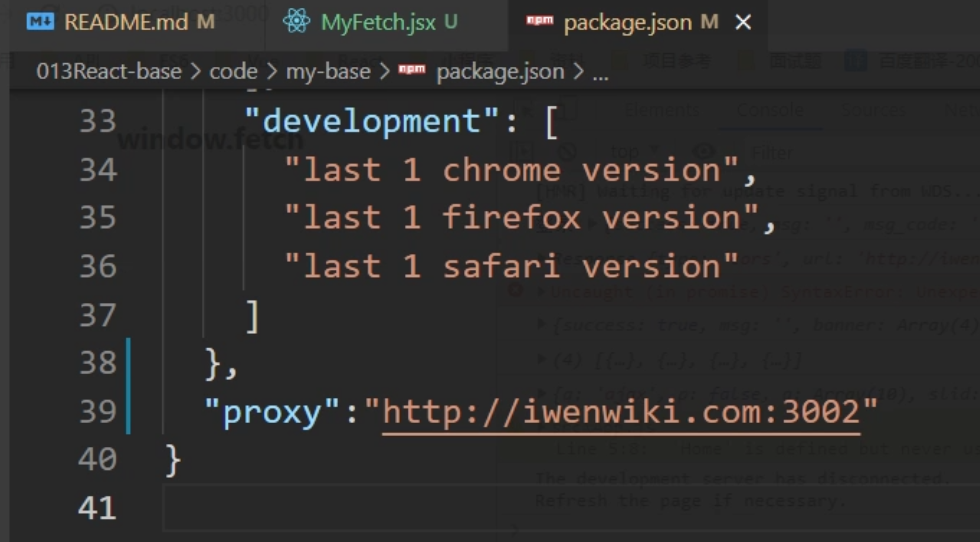

### 回顾：

1、定义状态state

```jsx
constructor(){
    super();
    this.state={
        xx:xxx,
    }
}

num=10;
```

访问：

```jsx
this.state.xx  this.xx
```

特点：

(1)组件内部  （2）响应式的  （3）访问

响应式：数据变化，视图跟着变

简写：

```jsx
state={
    xx:xxx
}
```

ES6  class


2、修改state

两种方式：

第一种：对象方式

```jsx
this.setState({
    msg:'456',
    count:this.state.count+10
})
```

第二种：函数方式

```jsx
this.setState((state,props)=>{
    return{
        count:state.count+10
    }
})
```

区别：

- 对象方式：异步的，也有可能是同步   在事件环（宏任务、微任务）中，就变成了同步的

  多次操作合并成一次，而且取最后一次的结果

  ```jsx
  change=()=>{
      this.setState({
          count:this.state.count+10
      })
      this.setState({
          count:this.state.count+10
      })
      this.setState({
          count:this.state.count+10
      },()=>{
          console.log(this.state.count);  //20
      })
      console.log(this.state.count);  //10
      //.....
      
  }
  ```

- 函数方式

  永远都是同步

  ```js
  change=()=>{
      this.setState((state,props)=>{
          return{
              count:state.count+10
          }
      })
      this.setState((state,props)=>{
          return{
              count:state.count+10
          }
      })
      this.setState((state,props)=>{
          return{
              count:state.count+10
          }
      })
      //...
  }
  ```

  

3、事件处理

（1）定义事件： on+事件名={this.函数名}

简写：on+事件名={()=>{ }}

（2）事件执行

- this指向

  - 普通函数：没有this

  - 箭头函数：this 指向当前实例

  - 让普通函数拥有this：（两种方式）

    - 第一种：直接绑定this

      ```html
      <button onClick={this.change.bind(this)}></button>
      ```

    - 第二种：构造函数中指定

      ```js
      constructor(){
          this.change=this.change.bind(this);
      }
      ```

      

- 参数

  - 箭头函数第一个参数就是事件对象
  - 普通函数：bind(this,1,2,4)

- 事件对象

  - 普通函数：
    - 有参数：最后一个就是事件对象
    - 无参数：第一个就是事件对象


4、生命周期

概念：组件从创建到销毁的过程。

7个，即将废掉3，还剩4个，  新增2个。

componentWillMount() 组件将要

==componentDidMount()== 发送网络请求，操作DOM

==shouldComponentUpdate（）== 问询，true,false

componentWillUpdae()

==componentDidUpdate()==

willprops

==componentWillUnmount（）== 收尾


# React 组件基础

**主要内容**

* 表单
* PropTypes类型检测
* 组合
* 网络请求

**学习目标**

 知识点| 要求 
 -| :- 
 表单 | 掌握 
 PropTypes类型检测 | 掌握 
 组合 | 掌握 
 网络请求 | 掌握 


## 一、表单

### 1.1 受控组件

​	介绍：在 HTML 中，表单元素通常自己维护 value值，并根据用户输入进行更新。而在 React 中，可变状态（mutable state）通常保存在组件的 state 属性中，并且只能通过使用 setState()来更新，使 React 的 state 成为“唯一数据源”。

语法：

```jsx
<input type="text" value={this.state.value}  onChange={this.handleChange} />
handleChange(event) {
  this.setState({value: event.target.value});
}
```

常见的受控组件

```
  input 
  textarea
  select
```


提交功能,阻止form标签的默认行为

```jsx
<form action="https://www.baidu.com" onSubmit={this.sub}>
    用户名：<input type="text" name='username' value={this.state.username} onChange={this.cname} />
    密码：<input type="password" name='password' value={this.state.pwd} onChange={this.cpwd.bind(this)} />
    <button type='submit'>提交</button>
</form>
sub =(e)=>{
    // 阻止默认事件
    e.preventDefault();
}
```

### 1.2 非受控组件

​	在大多数情况下，我们推荐使用 受控组件 来处理表单数据。在一个受控组件中，表单数据是由 React 组件来管理的。另一种替代方案是使用非受控组件，这时表单数据将交由 DOM 节点来处理，可以使用 ref 来从 DOM 节点中获取表单数据。


**1. 创建步骤：**

创建Ref语法：this.myRef = React.createRef()

绑定到元素上：<E ref={this.myRef}></E>

获DOM元素：this.myRef.current


**2. 使用**

```jsx
class NameForm extends React.Component {
  constructor(props) {
    super(props);
    this.handleSubmit = this.handleSubmit.bind(this);
    this.input = React.createRef();
  }

  handleSubmit(event) {
    alert('A name was submitted: ' + this.input.current.value);
    event.preventDefault();
  }

  render() {
    return (
      <form onSubmit={this.handleSubmit}>
        <label>
          Name:
          <input type="text" ref={this.input} />
        </label>
        <input type="submit" value="Submit" />
      </form>
    );
  }
}
```

## 二、PropTypes类型检测

### 2.1 介绍

PropTypes 提供一系列验证器，可用于确保组件接收到的数据类型是有效的。

### 2.2 使用步骤

1. 导入组件

```jsx
import PropTypes from 'prop-types';
```

2. 演示案例

```jsx
import PropTypes from 'prop-types';

class Greeting extends React.Component {
  render() {
    return (
      <h1>Hello, {this.props.name}</h1>
    );
  }
}

Greeting.propTypes = {
  name: PropTypes.string
};
```

3. 检验语法

```jsx
import PropTypes from 'prop-types';

MyComponent.propTypes = {
  // 你可以将属性声明为 JS 原生类型，默认情况下
  // 这些属性都是可选的。
  optionalArray: PropTypes.array,
  optionalBool: PropTypes.bool,
  optionalFunc: PropTypes.func,
  optionalNumber: PropTypes.number,
  optionalObject: PropTypes.object,
  optionalString: PropTypes.string,
  optionalSymbol: PropTypes.symbol,

  // 任何可被渲染的元素（包括数字、字符串、元素或数组）
  // (或 Fragment) 也包含这些类型。
  optionalNode: PropTypes.node,

  // 一个 React 元素。
  optionalElement: PropTypes.element,

  // 一个 React 元素类型（即，MyComponent）。
  optionalElementType: PropTypes.elementType,

  // 你也可以声明 prop 为类的实例，这里使用
  // JS 的 instanceof 操作符。
  optionalMessage: PropTypes.instanceOf(Message),

  // 你可以让你的 prop 只能是特定的值，指定它为
  // 枚举类型。
  optionalEnum: PropTypes.oneOf(['News', 'Photos']),

  // 一个对象可以是几种类型中的任意一个类型
  optionalUnion: PropTypes.oneOfType([
    PropTypes.string,
    PropTypes.number,
    PropTypes.instanceOf(Message)
  ]),

  // 可以指定一个数组由某一类型的元素组成
  optionalArrayOf: PropTypes.arrayOf(PropTypes.number),

  // 可以指定一个对象由某一类型的值组成
  optionalObjectOf: PropTypes.objectOf(PropTypes.number),

  // 可以指定一个对象由特定的类型值组成
  optionalObjectWithShape: PropTypes.shape({
    color: PropTypes.string,
    fontSize: PropTypes.number
  }),
  
  // An object with warnings on extra properties
  optionalObjectWithStrictShape: PropTypes.exact({
    name: PropTypes.string,
    quantity: PropTypes.number
  }),   

  // 你可以在任何 PropTypes 属性后面加上 `isRequired` ，确保
  // 这个 prop 没有被提供时，会打印警告信息。
  requiredFunc: PropTypes.func.isRequired,

  // 任意类型的数据
  requiredAny: PropTypes.any.isRequired,

  // 你可以指定一个自定义验证器。它在验证失败时应返回一个 Error 对象。
  // 请不要使用 `console.warn` 或抛出异常，因为这在 `onOfType` 中不会起作用。
  customProp: function(props, propName, componentName) {
    if (!/matchme/.test(props[propName])) {
      return new Error(
        'Invalid prop `' + propName + '` supplied to' +
        ' `' + componentName + '`. Validation failed.'
      );
    }
  },

  // 你也可以提供一个自定义的 `arrayOf` 或 `objectOf` 验证器。
  // 它应该在验证失败时返回一个 Error 对象。
  // 验证器将验证数组或对象中的每个值。验证器的前两个参数
  // 第一个是数组或对象本身
  // 第二个是他们当前的键。
  customArrayProp: PropTypes.arrayOf(function(propValue, key, componentName, location, propFullName) {
    if (!/matchme/.test(propValue[key])) {
      return new Error(
        'Invalid prop `' + propFullName + '` supplied to' +
        ' `' + componentName + '`. Validation failed.'
      );
    }
  })
};
```

4. 默认值

```jsx
组件名.defaultProps={
props属性名:默认值
}
```

5. 代码演示

```jsx
import React from 'react'
// 引入prop-types库
import propTypes from 'prop-types'

export default class Home extends React.Component{
    render(){
        return(
            <div>
                <h1>props类型检测</h1>
                <p>{this.props.data}</p>
            </div>
        )
    }
}

// 定义检测
Home.propTypes={
    data:propTypes.string.isRequired,
    msg:propTypes.oneOfType([
        propTypes.string,
        propTypes.array
    ])
}
// 定义默认值
Home.defaultProps={
    data:'默认值'
}
```

## 三、组合   -- 插槽

### 3.1 介绍

​	有些组件无法提前知晓它们子组件的具体内容。在 Sidebar（侧边栏）和 Dialog（对话框）等展现通用容器（box）的组件中特别容易遇到这种情况。我们建议这些组件使用一个特殊的 children prop 来将他们的子组件传递到渲染结果中。


### 3.2 语法

 1.组件定义中使用 **this.props.children** 接收内容。

2.组件调用时在组件内部写具体内容

```jsx
//定义的组件：
function FancyBorder(props) {
  return (
    <div className={'FancyBorder FancyBorder-' + props.color}>
      {props.children}
    </div>
  );
}
//组件调用：
function WelcomeDialog() {
  return (
    <FancyBorder color="blue">
      <h1 className="Dialog-title">
        Welcome
      </h1>
      <p className="Dialog-message">
        Thank you for visiting our spacecraft!
      </p>
    </FancyBorder>
  );
}
```


### 3.3 案例

​	

​	

### 3.4 代码演示

弹框组件

```jsx
import React, { Component } from 'react'
import './style.css'
export default class Dialog extends Component {
    close =()=>{
        this.props.hide();
    }
    render() {
        return (
            <div className='bg' style={ {visibility:this.props.visible } }>
                <div className='box'>
                    <div className='top'>
                        <h4>扫码登录</h4>
                        <span className='close' onClick={this.close}>X</span>
                    </div>

                    {/* 内容区域 不知道放什么 */}
                    <div className='content'>
                        { this.props.children }
                    </div>

                </div>
            </div>
        )
    }
}

```

百度组件

```jsx
import React, { Component } from 'react'
import Dialog from './Dialog'
//导入图片
import baidu from '../../assets/img/baidu.png'
export default class Baidu extends Component {
    //创建ref 
    constructor(){
        super()
        this.state={
            visible:'hidden',
            visible2:'hidden',
        }
    }
    //定义函数
    showDialog=()=>{
        this.setState({
            visible:'visible'
        })
    }
    showDialog2=()=>{
        this.setState({
            visible2:'visible'
        })
    }
    hide=()=>{
        this.setState({
            visible:'hidden',
            visible2:'hidden'
        })
    }
    //渲染页面
    render() {
        return (
            <div>
                <h3>百度登录首页--测试组合使用</h3>
                <button onClick={this.showDialog}>扫码登录</button>
                <button onClick={this.showDialog2}>账号登录</button>
                {/* 弹框显示二维码 */}
                <Dialog visible={this.state.visible} hide={this.hide}>
                    
                </Dialog>

                {/* 账号密码登录 */}
                <Dialog visible={this.state.visible2} hide={this.hide}>
                    <form action="" method="get">
                        账号: <input type="text" />
                        <br />
                        <br />
                        密码:
                        <input type="text" />
                    </form>
                </Dialog>


            </div>
        )
    }
}
```


## 四、网络请求

### 4.1 网络请求方式

​	

方式如下：

1. jquery
2. fetch
3. axios


### 4.2 fetch网络请求

**介绍**

1. 是es6中提供的一种新的网络请求方式。Fetch API 提供了一个 JavaScript接口，用于访问和操纵HTTP管道的部分，不是ajax了。

2. fetch方法是一个全局方法，可以在任意位置使用

3. fetch()返回的 Promise ，使用 .then()获取请求成功的结果， 使用.catch捕获错误信息

4. 默认情况下，fetch 不会从服务端发送或接收任何 cookies，要发送 cookies，必须设置 credentials 选项，credentials的默认值是 same-origin


**语法**

```js
fetch(url, {
  body: JSON.stringify(data), // must match 'Content-Type' header
  cache: 'no-cache', // *default, no-cache, reload, force-cache, only-if-cached
  credentials: 'same-origin', // include, same-origin, omit
		//omit: 默认值，忽略cookie的发送
		//same-origin: 表示cookie只能同域发送，不能跨域发送
		//include: cookie既可以同域发送，也可以跨域发送

  headers: {
    'user-agent': 'Mozilla/4.0 MDN Example',
    'content-type': 'application/json'
  },
  method: 'POST', // *GET, POST, PUT, DELETE, etc.
  mode: 'cors', // no-cors, cors, *same-origin
  redirect: 'follow', // manual, *follow, error
  referrer: 'no-referrer', // *client, no-referrer
})
```


**参数说明：**

 1.url, 网络请求地址

 2.参数2是一个大的配置项

​	body:要网后台发生的数据 ,数据格式是 'key=value&key=value'

​	cache:是否缓存

​	credentials：是否发生和接收cookie

​	headers：请求头，如果是post请求，需要配置

​		**{'content-type':'application/x-www-form-urlencoded'}**

​	method:请求方式

​	mode:是否允许跨域


**返回值**

fetch()返回的 Promise对象，使用 .then()获取请求成功的结果，这个结果是一个Response 对象，使用前需要解析，解析方法有：

blob()：解析成二进制

json()：解析成JSON对象

text()：解析成文本


**代码演示**

```js
fetch('http://iwenwiki.com/api/blueberrypai/getIndexBanner.php')
  .then(function(data){
    return data.json()
  })
  .then(function(res){
    console.log(res)
  })
```

**请求参数**

get请求

```js
fetch('url?key=value&key=value')
```

post请求

```js
fetch('url',{
  body:'key=value&key=value',
  headers:{
    'content-type':'application/x-www-form-urlencoded'
  }
})
```


### 4.3 axios 网络请求

Axios 是一个基于 promise 的 HTTP 库，可以用在浏览器和 node.js 中。

**特点**

- 从浏览器中创建 [XMLHttpRequests](https://developer.mozilla.org/en-US/docs/Web/API/XMLHttpRequest)
- 从 node.js 创建 [http](http://nodejs.org/api/http.html) 请求
- 支持 [Promise] API
- 拦截请求和响应
- 转换请求数据和响应数据
- 取消请求
- 自动转换 JSON 数据
- 客户端支持防御 [XSRF]


**安装**

使用 npm:

```shell
$ npm install axios
```

使用 bower:

```shell
$ bower install axios
```

使用 cdn:

```js
<script src="https://unpkg.com/axios/dist/axios.min.js"></script>
```


**执行 `GET` 请求**

```js
// 为给定 ID 的 user 创建请求
axios.get('/user?ID=12345')
  .then(function (response) {
    console.log(response);
  })
  .catch(function (error) {
    console.log(error);
  });

// 可选地，上面的请求可以这样做
axios.get('/user', {
    params: {
      ID: 12345
    }
  })
  .then(function (response) {
    console.log(response);
  })
  .catch(function (error) {
    console.log(error);
  });
```


**执行 `POST` 请求**

```js
axios.post('/user', {
    firstName: 'Fred',
    lastName: 'Flintstone'
  })
  .then(function (response) {
    console.log(response);
  })
  .catch(function (error) {
    console.log(error);
  });
```

```js
// 发送 POST 请求
axios({
  method: 'post',
  url: '/user/12345',
  data: {
    firstName: 'Fred',
    lastName: 'Flintstone'
  }
});
```

**执行多个并发请求**

```js
function getUserAccount() {
  return axios.get('/user/12345');
}

function getUserPermissions() {
  return axios.get('/user/12345/permissions');
}

axios.all([getUserAccount(), getUserPermissions()])
  .then(axios.spread(function (acct, perms) {
    // 两个请求现在都执行完成
  }));
```


### 4.4 网络请求案例

​	


### 4.5 跨域请求

cors代理

参考地址：

https://github.com/facebook/create-react-app/blob/bb64e31a81eb12d688c14713dce812143688750a/docusaurus/docs/proxying-api-requests-in-development.md

1.在package.json文件中配置

```js
{
  "proxy":"代理路径"
}
```

一般使用在后台接口写好了，使用时跨域的一种解决方案

在网络请求中使用：

fetch('/具体接口名称')


1. 配置package.json字段

​      "proxy": "http://localhost:4000",//目标地址 

​      缺点：只能写一次

​	 


2.使用中间件 http-proxy-middleware

1.下载 npm i -S http-proxy-middleware

2.在src目录下创建一个setupProxy.js文件，在这个文件中写配置

3.配置 npm  i http-proxy-middleware -S

```
   1. 安装： npm  i http-proxy-middleware -S 
   2. 创建文件：src/setupProxy.js
   3. const { createProxyMiddleware } = require('http-proxy-middleware');
   4. setupProxy.js
              module.exports = function(app) {
                 app.use(
                     '/api',
                     createProxyMiddleware({
                                target: 'http://localhost:5000',
                                changeOrigin: true,
                        })
                 );
              };
```

4.网络请求中使用方式

  fetch('/api/具体接口名称')

5.一般使用在后台接口还没出来，前台人员自己测试使用


#### 第三种方式：

webpackDevServer.config.js:

```js
proxy: {
      '/api': {
        target: 'http://iwenwiki.com:3002', //真实地址
        changeOrigin: true, //允许跨域
        pathRewrite: {
          "^/api": '', //路径重写
        }
      }
    }
```


## 五、作业

### 5.1 效果图

​	

