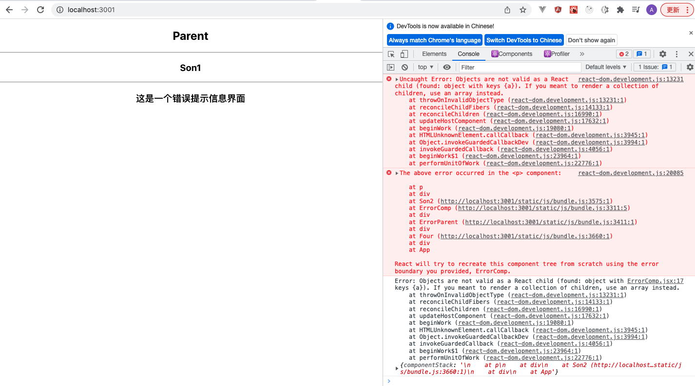

### 回顾：

1、受控组件（状态受React管控的组件）

表单：HTML 本身自己维护状态  

（1）value：绑定state里状态

（2）onChange()： e.target.value =》state


2、非受控组件（状态不受React管控的组件）

步骤：

（1）创建ref  构造函数  this.myref=React.createRef();

（2）绑定到指定的DOM

（3）获取：this.myRef.current

3、ref 功能：

（1）获取DOM元素

（2）获取子组件实例  

```jsx
<Child ref={this.myRef} mg="123"/>
```


4、类型检测 PropTypes 校验

```jsx
import PropTypes from 'prop-types'


组件.proTypes={
    num:PropTypes.number,
    msg:PropTypes.string.isRequired,
}

Child.defaultProps={
    num:200,
}
```


5、组合

子组件在定义的时候，不知道这一块要显示什么内容，才预留空间。

步骤：

1、子组件   预留空间

```js
{this.props.children}
```

2、父组件调用

```html
<CHild> xxx </CHild>  <CHild> YYY </CHild>
```


5、网络请求

请求方式：原生、jquery 、fetch、axios

fetch

```js
fetch(url)
```


# React 组件进阶

**主要内容**

* Context
* 错误边界
* Refs 转发
* 高阶组件
* 性能优化

**学习目标**

 知识点| 要求 
 -| :- 
 Context | 掌握 
 错误边界 | 掌握 
 Refs 转发 | 掌握 
 高阶组件 | 掌握 
 性能优化 | 掌握 

 React组件之间通信（传值）方式：
 1.父组件向子组件传值 props接收
 2.子组件向父组件传值 （自定义事件/回调函数传参）（状态提升）
 3.兄弟组件传值（子组件->父组件=>子组件） 靠他爸
 4.ref 父组件可以获取子组件的属性和方法
 5.context


## 一、Context

### 1.1 介绍

Context 提供了一个无需为每层组件手动添加 props，就能在组件树间进行数据传递的方法

跨层级传值

### 1.2 语法

**创建Context**

```jsx
const Mycontext = React.createContext()
```

##### 提供数据

创建的Context上提供了一个Provider属性,整体作为标签使用，这个标签上提供的一个属性value，作用是提供数据

```jsx
 <Mycontext.Provider value='abcd'>

	   <Comp />

 </Mycontext.Provider>
```


##### 使用数据

**第一种写法：Context.Consumer使用数据 **  ==标签形式==

作用：就是使用Provider上提供的数据
使用：也是作为标签使用

```jsx
<Mycontext.Consumer>
     {value => <Comp />}
</Mycontext.Consumer>
```


**第二种写法：Class.contextType **  ==属性形式==

作用：也是获取Provider上提供的数据

使用：作为组件的一个属性使用

```jsx
Class.contextType = Mycontext
```

在组件内部会自动生成一个数据，存储在组件的context属性上

这种形式还有另外一种写法

```jsx
static contextType = Mycontext
```


**Class.contextType 和 Context.Consumer 的区别**

1. Class.contextType使用时会自动在组件上添加一个属性 context，存储离当前组件最近的Provider提供的数据，不能写多个

2. Context.Consumer 可以写多个，能获取到所有Provider提供数据

3. 动态的数据，还可以传递方法

```jsx
<Mycontext.Provider value={{data:this.state,onchange:this.onchange}}> </Mycontext.Provider>
```


## 二、错误边界

### 2.1 介绍

React中如果组件使用有错误，React会把页面中的组件全部卸载，会造成页面白屏,这种体验是不好的

​	在React 16 版本后，添加了一个功能，错误边界，错误边界作用：当React运行中有错误时，这时显示一个备用的页面，不显示白屏，还可以把报错信息发送到指定的位置

### 2.2 定义

 错误边界也是一个组件，这个组件必须是class定义的，同时这个组件中必须有以下两个生命周期函数中的至少一个

  static getDerivedStateFromError 

 渲染备用 UI

   componentDidCatch

打印错误信息，可以把错误信息发送到指定位置

```jsx
import React, { Component } from 'react'


class ErrorBoundary extends React.Component {
  constructor(props) {
    super(props);
    this.state = { hasError: false };
  }

  static getDerivedStateFromError(error) {
    // 更新 state 使下一次渲染能够显示降级后的 UI
    return { hasError: true };
  }

  componentDidCatch(error, errorInfo) {
    // 你同样可以将错误日志上报给服务器
    console.log(error, errorInfo);
  }

  render() {
    if (this.state.hasError) {
      // 你可以自定义降级后的 UI 并渲染
      return <h1>Something went wrong.</h1>;
    }

    return this.props.children; 
  }
}
```


### 2.3 使用

 <错误边界><Comp /></错误边界>

  当Comp组件发生错误时，错误边界组件就生效了


作用：错误还在，只是关闭错误页面之后，不是空白页面。有错误提醒。




## 三、Refs 转发

### 3.1 介绍

 Ref 转发是一项将 ref 自动地通过组件传递到其一子组件的技巧


### 3.2 使用

1. 创建ref

```jsx
const myref = React.createRef();
```

  2. 定义组件使用React.forwardRef来定义

```jsx
  const Comp = React.forwardRef((props,ref)=>
                                (<div>
            <div ref={ref}>组件内部的一个元素</div>
    </div>)
                               )
```

  3. 使用组件

```jsx
    <Comp ref={this.myref} />
```

4. 获取DOM元素

```jsx
 this.myref.current
```


## 四、高阶组件

### 4.1 介绍

​	高阶组件（HOC）是 React 中用于复用组件逻辑的一种高级技巧。HOC 自身不是 React API 的一部分，它是一种基于 React 的组合特性而形成的设计模式

高阶组件是参数为组件，返回值为新组件的函数。

高阶函数：函数参数是函数，或者返回值是函数。  增强功能

### 4.2 语法

```jsx
function Hoc(Comp){
    ...
    return function(){
        return <NewComp />
    }
}
```


### 4.3 使用

1. 如果需对传入的组件进行拓展，比如添加事件，需要使用到React的一个API

```jsx
React.cloneElement(element,    [props],    [...children]  )
```

2. 使用高阶组件时会可能会用到一个React的API

```js
React.Children:提供了用于处理 this.props.children 不透明数据结构的实用方法 

React.Children.map(children,function(item){    })
```


### 4.4 统计组件加载案例

高阶组件

```js
//引入react 
import React, {Component} from 'react'
function showTime(Com) {
    return class extends Component {
        constructor() {
            super()
            this.state = {
                nowTime: new Date().getTime(),
                loading: 0 //统计时长
            }
        }
        //生命周期 渲染组件完毕 组件进入运行中
        componentDidMount() {
            let nowTime = this.state.nowTime;
            //获取当前的时间 
            let endTime = new Date().getTime();
            console.log('---组件加载时长：', endTime - nowTime);
            this.setState({
                loading:endTime - nowTime
            })
        }
        render(){
            return <Com loading={this.state.loading}/>
        }
    }
}
export default showTime
```

其他组件使用

```jsx
import React, { Component } from 'react'
import showTime from './showTime'
class News extends Component {
    render() {
        return (
            <div>
                <h3>news组件</h3>
                <p>加载时长：{this.props.loading}</p>
            </div>
        )
    }
}

export default showTime(News)

```


## 五、性能优化

### 5.1 shouldComponentUpdate

  作用：是否允许组件更新界面


组件加载更新

父组件：

```jsx
import React, { Component } from 'react'
import Son1 from './Son1';
import Son2 from './Son2';
import Son3 from './Son3';
import Son4 from './Son4';
import Son5 from './Son5';

export default class Parent extends Component {
    constructor(){
        super()
        this.state={
            count:10,
            info:'啦啦啦'
        }
    }
    render() {
        console.log('parent组件加载');
        return (
            <div>
                <h2>parent组件</h2>
                <p>count:{this.state.count}</p>
                <button onClick={()=>this.setState({count:this.state.count +5 })}>修改count</button>
                <hr />
                <Son1/>
                <hr />
                <Son2 info='啦啦啦' count={this.state.count}/>
                <hr />
                <Son3/>
                <hr />
                <Son4 info='啦啦啦' count={this.state.count}/>
                <hr />
                <Son5/>
            </div>
        )
    }
}

```

子组件

```jsx
import React, { Component } from 'react'

export default class Son4 extends Component {
    constructor(){
        super()
        this.state={
            num:100
        }
    }
    shouldComponentUpdate(nextProps,nextState){
        for(let key in nextProps){
            //判断对象里面的属性值 是否相等
            if(nextProps[key] !== this.props[key]){
                return true;
            }
       }

       for(let key in nextState){
            //判断对象里面的属性值 是否相等
            if(nextState[key] !== this.state[key]){
                return true;
            }
       }
    
       return false;//返回true或者false
    }
    render() {
        console.log('son4 render');
        return (
            <div>
                <h3>son4组件</h3>
                <p>数据num： {this.state.num}</p>
                <button onClick={()=>this.setState({num:this.state.num -5 })}>修改自身的num</button>
            </div>
        )
    }
}

```


### 5.2 PureComponent

PureComponent来定义类形式组件，只有当props或state发生改变时才会触发组件更新

```jsx
class SUN extends PureComponent{}
```


### 5.3 组件注销

收尾工作

组件注销时要把组件绑定的全局事件，定时器，网络请求，setState取消了，否则组件可能会报错，还有可能影响其他组件的允许。

```jsx
  componentWillUnmount(){

    <!-- 取消全局事件监听 -->

    window.removeEventListener('scroll',this.scrollFn)

    <!-- 取消定时器 -->

    clearInterval(this.timer)

    // 清空setState的执行

    this.setState = (state, callback) => {

     return;

    }

   <!-- 取消ajax请求 -->

   <!-- axios -->

}
```


