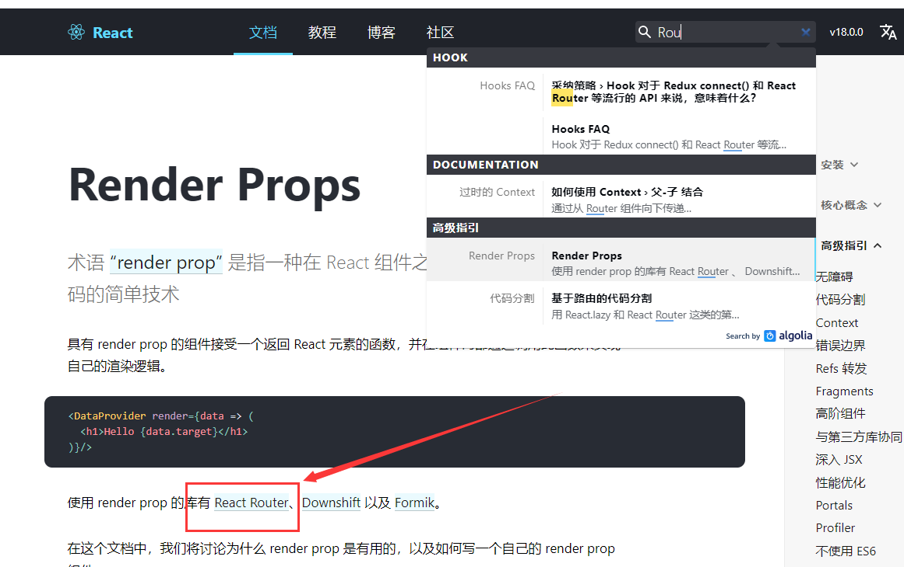

# 回顾

1、深层传递 context.js

why：props

- 定义: 中央仓库

  ```js
  const myContext=React.createContext();
  export default myContext;
  ```

  

- 提供数据

  ```html
  <myContext.Provider value={{msg:'123',fn:fn}}>
      <组件 />
  </myContext.Provider>
  ```

- 使用：第一种：标签方式

  ```html
  <myContext.Consumer>
      {
      	value=>(<div>
      	</div>
      </div> )
      }
  </myContext.Consumer>
  ```

  第二种：属性方式：

  ```js
  class Child .....{
      // this.context
      static contextType=myContext;
  }
  
  Child.contextType=myContext
  ```


2、refs转发

​	ref: 1）获取dom 2)获取子组件实例

refs转发：目的：获取子组件里面的dom 元素

语法：

1)父组件： const myRef=React.createRef();

2)绑定 子组件上：  `<Son ref={this.myRef}/>`

3)定义子组件：

```jsx
React.forwardRef((props,ref)=>{
    
})
```


3、错误边界

4、高阶组件：参数是组件，返回值是新组件

目的：增强原来功能

语法：

```jsx
function HOCFn(Com){
    
    
    return class extends React.Component{
        return <Com title='123'/>
    }
    
}

```

使用

```jsx

export default HOCFn(Comp)
```


5、性能优化

1）shouldCompoentUpdate(nextProps,nextState)

2）React.PureComponent 只要让子组件定义继承自于

3）组件注销 ComponentWillUnmount() 收尾工作  清除定时器、注销事件绑定


# 补充：

## Fragments

#### 介绍

​    空容器 不会渲染 Fragments 允许你将子列表分组，而无需向 DOM 添加额外节点 

​	包括的空标签容器，不被渲染


### 使用

   ```html
<React.Fragment>
	 <td></td><td></td><td></td>
</React.Fragment>
   ```

### 简写

```html
 <> xxx  </>
```


有些场景，必须用，比如table。插入到表格 tr 里的子组件，破坏了表格原来的样式。

```jsx
//简写
<>
    <td>语文</td>
    <td>数学</td>
    <td>数学</td>
</>

// 复杂写法
<React.Fragment>
    <td>语文</td>
    <td>数学</td>
    <td>数学</td>
</React.Fragment>
```


## 带参数的高阶组件

函数柯里化：Currying

```jsx
add(2,3,4)
add(2)(3) (4)

function  Currying(a){
    return function(b){
        return function(c){
            return a+b+c
        }
    }
}
Currying(2)(3)(4)
```


```jsx
// 定义带参数的高阶组件函数 调用： HOCParams()()
export function HOCParams(val, fn) { //参数

    console.log('高阶组件接受到的参数：', val, fn);

    return function (Comp) { //接受组件作为参数
        return class extends React.Component {
            render() {
                return <Comp title='高阶组件处理过的' {...val} fn={fn}/>
            }
        }
    }

}
```

使用：

```jsx
import {HOCParams} from './showTime'

class CompParams extends Component {
  render() {
    console.log("===============",this.props);
    return (
      <div>
          <h3>传参数高阶组件</h3>
          接受的参数：{this.props.title}
      </div>
    )
  }
}

export default HOCParams({user:'zhangsan',pwd:'123'},function(){})(CompParams)
```


# React 路由

**主要内容**

* 路由安装
* 路由配置

**学习目标**

 知识点| 要求 
 -| :- 
 路由安装 | 掌握 
 路由配置 | 掌握 


## 补充：路由概念与原理

### 1、什么是路由

- 说明

  路由本质就是对应关系。

- 分类

  在前端技术发展过程中，主要经历了三个阶段：后端路由阶段、前后端分离阶段和前端路由阶段。

### 2、路由发展阶段

#### 后端路由阶段

- 说明

  后端路由：根据不同的URL请求，返回不同的内容，本质是URL请求地址与服务器资源之间的对应关系。

  

- 优点

  当我们页面中需要请求不同的路径内容时, 交给服务器来进行处理, 服务器渲染好整个页面, 并且将页面返回给客户顿。这种情况下渲染好的页面, 不需要单独加载任何的js和css, 可以直接交给浏览器展示, 有利于SEO的优化。

- 缺点

  1. 一种情况是整个页面的模块由后端人员来编写和维护的。
  2. 另一种情况是前端开发人员如果要开发页面, 需要通过PHP和Java等语言来编写页面代码。而且，前后端未分离的情况下，HTML代码和数据以及对应的逻辑会混在一起, 编写和维护都是非常糟糕的事情。
  3. 后端渲染存在性能问题的，假设用户与服务器之间经常有提交表单这样的数据交互行为，那么后端路由就会造成网页的频繁刷新，用户体验非常差。


#### 前后端分离阶段

- 说明

  随着Ajax的出现。有了前后端分离的开发模式。后端只提供API来返回数据, 前端通过Ajax获取数据, 并且可以通过JavaScript将数据渲染到页面中。

- 优点

  1. 这样做最大的优点前后端责任的清晰, 后端专注于数据上, 前端专注于交互和可视化上。并且当移动端(iOS/Android)出现后, 后端不需要进行任何处理, 依然使用之前的一套API即可。目前很多的网站依然采用这种模式开发。
  2. 实现前端页面的局部刷新，很大程度上提高了用户体验，前端渲染提高性能。

- 缺点

  不支持浏览器的前进后退操作，也就是说浏览器是无法保存用户在网页上的浏览状态的。

  

#### 前端路由阶段

- 说明

  随着SPA（Single Page Application）单页面应用程序的出现，我们进入了前端路由阶段。SPA整个网站只有一个页面，内容的变化通过Ajax局部更新实现、同时支持浏览器地址栏的前进和后退操作。在单页面应用程序中，这种通过==hash改变来切换页面的方式==，称作前端路由。

  前端路由是根据不同的用户事件，显示不同的页面内容。本质：==用户事件与事件处理函数之间的对应关系==。最主要的特点就是在前后端分离的基础上加了一层前端路由，也就是前端来维护一套路由规则。

  

- 原理

  对于单页面应用程序来说，主要通过URL中的hash(#号)来实现不同页面之间的切换（hash的变化会导致浏览器记录访问历史的变化、但是hash的变化不会触发新的URL请求）所以，hash这种方案是最常见前端路由实现方案。

  

- 优点

  1. 提高用户对网页性能的体验
  2. 让网页响应速度更快

  

### 概念区分：

非路由组件：直接添加到父组件里子组件

```jsx
<App>
	<Header/>
</App>
```


路由组件：通过路由跳转的组件


## 一、路由安装

### 1.1 路由介绍

单页面得特点：只需要加载一次主页面，通过局部刷新，就可以实现跳转或者切换页面

优点：加载速度快，用户体验比较好

缺点：

\- 第一次加载比传统要慢一点
\- 不利seo
\- 页面相对复杂

\- 返回键




### 1.2 路由安装

1、安装：npm install --save react-router-dom@5.3

2、引入页面：import {HashRouter as Router,BrowserRouter,Route,Switch,Redirect } from "react-router-dom"

3、建路由组件


4、配置：

```jsx
<HashRouter>
    <Switch>
        <Route exact path='/' component={Home}/>
        <Route path='/news' component={News}/>
        <Route path='/about' component={About}/>
    
    </Switch>
</HashRouter>
```

5、参数说明

1. HashRouter、BrowserRouter：路由包裹容器

   HashRouter ：地址栏里  #，是基于window.location.hash

   BrowserRouter:  地址栏  /，是基于HTML5 history API (pushState, replaceState, popstate)事件

   HashRouter as Router  取别名

   具体用哪一种，需要后端支持

2. Route 定义路由走向  路由规则   

   path：匹配路径 

   component：加载指定组件

   exact ：精准匹配 严格匹配

3. Switch  只能匹配一个路由规则

   


### 1.3 路由效果

​	


## 二、路由配置

### 2.1 路由配置

​	元素描述了你在屏幕上想看到的内容，是构成 React 应用的最小砖块，与浏览器的 DOM 元素不同，React 元素是创建开销极小的普通对象。React DOM 会负责更新 DOM 来与 React 元素保持一致

```jsx
import logo from './logo.svg';
import './App.css';
// 引入router
import {HashRouter as Router,BrowserRouter,Route,Switch,Redirect} from 'react-router-dom'
import Home from './pages/Home';
import News from './pages/News';
import About from './pages/About';

function App() {
  return (
    <div className="App">
      <Router>
        <Switch>
          {/* /news */}
          <Route exact path={'/'} component={Home}/>
          <Route  path={'/news'} component={News}/>
          <Route path={'/about'} component={About}/>
        </Switch>
      </Router>

    </div>
  );
}

export default App;

```


### 2.2 定义导航

```jsx
import {Link} from 'react-router-dom'
<Link to='about'></Link>
```


### 2.3 路由嵌套（二级路由）

​	

```jsx
<News path="/news">
  <Route path="/news/ball" component={ NewsBall }></Route>
  <Route path="/news/sports" component={ NewsSports }></Route>
</News>
```

访问子级路由

​	访问：/news/ball


1. 嵌套路由界面（根页面） 配置路由规则，作为根标签

   

2. 配置路由规则

3. 根页面： 路由出口、路由导航


### 2.4 路由重定向

from：来自于哪里的路径  to：重定向到的地址  

```jsx
<Redirect from='/*' to='/'/>
```

方式1：Redirect

```jsx
<Route path="/news" render={() => (<Redirect to='/news/ball'/>)}></Route>
```

方式2：编程式导航

```jsx
this.props.history.push("path")this.props.history.replace("path")
```


### 2.5 路由参数(动态路由)

1. 定义：在Route中定义,以冒号+变量名定义

```jsx
<Route path='about/:id' component={About}>
```

2. 调用：调用时要给具体的值

```jsx
<Link to='about/23'>about</Link>
```

3. 接收路由参数:在路由加载的组件中接收

​	需要在生命周期函数(不限DidMount) 

```jsx
componentDidMount(){
	this.props.match.params.id
}
```


### 2.6 路由高亮

```jsx
import {NavLink} from 'react-router-dom'
```

配置：

1. 把Link换成 NavLink

1. 在css中定义active类名的样式

	


声明式导航：通过标签控制页面跳转

### 2.7 编程式导航(即 JS控制组件跳转)

**编程式导航**

   1. 注意点：当前的组件需要配置路由配置 <Route path='' component={}/> 才有this.props.路由相关信息

      

​     2. 配置路由 this.props

​       1.  history:路由跳转方式api方法 可以实现路由跳转js

​       2.  location:

​       3.  match : 路由配置信息 - 包含：路由path 路由的参数 路由的url地址 

   

   **路由跳转方式**

​     1. this.props.history.go() 返回功能

​        1. go(1) 前进

​        2. go(-1) 返回上一层

​        3. go(-2) 返回上二层


​     2. this.props.history.goBack() 返回上一层

​     3. this.props.history.push('/path路径') 跳转进入某一个路径 有返回功能 /path/参数

​     4. this.props.history.replace('/path路径') 跳转进入某一个路径 并关闭当前的页面 没有返回功能


## react-router-dom@6（了解）

参考链接：

https://www.jianshu.com/p/03234215a90e


### 路由配置

嵌套路由：路由根据层级嵌套可以实现路由嵌套 (v5版本子路由写在父路由path值上)

索引路由: 父组件的默认路由 或者 子路由的路径都不匹配时 渲染

无匹配路由：当路由的路径都不匹配时 渲染 (v6版本废弃了Redirect重定向)

```jsx
import React from "react";
import ReactDom from 'react-dom';
import App from './App';
import {BrowserRouter, Route, Routes} from 'react-router-dom'
import Home from "./pages/Home";
import About from "./pages/About";
import News from "./pages/About/News";
import Message from "./pages/About/Message";
import Detail from "./pages/About/Message/Detail";

ReactDom.render(
  <BrowserRouter>
    {/* Routes代替v5版本Switch */}
    <Routes>
      {/* 一级路由 */}
      <Route path='/' element={<App />}>
        {/* 二级路由 */}
        <Route path='Home' element={<Home/>}></Route>
        <Route path='About' element={<About />}>
          {/* 三级路由 */}
          <Route path='message' element={<Message />}>
            {/* 路由路径接收params参数 */}
            <Route path=':detailID' element={<Detail />}></Route>
            {/* 索引路由：父组件的默认路由 子路由的路径都不匹配时 */}
            <Route index element={<main><h2>您还没选择任意选项</h2></main>}></Route>
          </Route>
          <Route path='news' element={<News/>}></Route>
        </Route>
        {/* 无匹配路由 */}
        <Route path='*' element={<p>无效路径</p>}></Route>
      </Route>
    </Routes>
  </BrowserRouter>,
  document.getElementById('root')
)
```


### 路由嵌套

当路由被嵌套时，一般认为网页的某一部分保持不变，只有网页的子部分发生变化。

例如，如果你访问一个简单的博客，则始终显示该博客的标题，然后在其下方显示一个博客文章列表。但是，当你单击博客文章时，博客文章列表将替换为该特定博客文章的内容或描述。

在React Router v5中，必须明确定义嵌套路由，React Router v6并非如此。它从React Router库中挑选了一个名为 `Outlet` 的最佳元素，为特定路由呈现任何匹配的子元素。首先，从 `react-router-dom` 库中导入 `Outlet`：

```javascript
import { Outlet } from 'react-router-dom';
```


### 路由重定向

https://reactrouter.com/docs/en/v6/api#navigate

#### 官网：

https://reactrouter.com/docs/en/v6

#### 学习网站：

https://segmentfault.com/a/1190000023684163


引入

```js
import { Navigate } from "react-router-dom";
```


重定向是通过指定了`replace`属性的`Navigate`组件单独完成的。

```jsx
<Navigate replace to="/" />
```

如果要从路径复制重定向，则需要与`Route`组合。

```jsx
//当输入  /* 任意信息，重定向到首页
<Route path='/*' element={<Navigate replace to="/" />} />
```


# 回顾：

路由：

作用：根据路由链接，切换页面

### 区分概念：

非路由组件：定义的公共的子组件，页面中的一部分 commonHeader、commonFooter  components/

路由组件：通过点击路由链接跳转


### 步骤：

1. 安装

   ```bash
   npm i react-router-dom@5.3 -S
   ```

   

2. 引入

   ```jsx
   import {HashRouter as Router,BrowerRouter,Route,Switch,Redirect} from 'react-router-dom'
   ```

   

3. 创建路由组件

   pages/    views/

4. 路由配置

   ```jsx
   <Router>
   	<Switch>
       	<Route path='/home' compoent={Home}/>
           <Route path='/news' compoent={News}/>
       </Switch>
   </Router>
   ```

   

5. 参数说明

   HashRouter： 基于window.localtion.hash  实现    url: #

   BrowerRouter：基于H5 history API(pushState，replaceState，popState)  url: 没有#  需要后台支持，如果不支持，404错误


访问：

http://localhost:3000/#/home


6、导航链接

声明式导航：通过标签跳转

```html
<Link to='/'>首页</Link>
<Link to='/news'>新闻</Link>
<Link to='/doc/hello'>新闻</Link>
```


Link

NavLink    .active{}

编程式导航：JS跳转

this.props.history.push('/news')

方法：go()、goBack()、forward()、


7、嵌套路由

```jsx
<Route path='/home' compoent={Home}/>
<Route path='/news' compoent={News}/>

<Main path='/doc'>
    <Redirect  to='/doc/hello'/>
	<Route path='/doc/hello' component={Hello}></Route>
	<Route path='/doc/ele' component={ElE}></Route>
    
</Main>
<Redirect from='/*' to='/news'/>
```

8、动态路由

```jsx
<Route path='/about/:id' compoent={News}/>
```

导航：

```html
<Link to='/about/123'>关于</Link>
```

使用

```js
{this.props.match.params.id}
```


==注意：==

嵌套路由 Main  没有 this.props.history 

导入

```js
import {withRouter} from 'react-router-dom'

class Main.....{
    
}

export default withRouter(Main)
```


