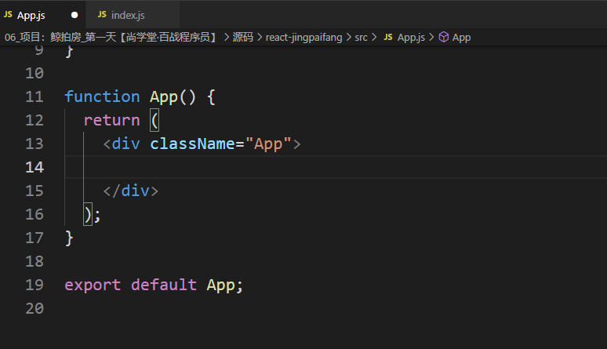
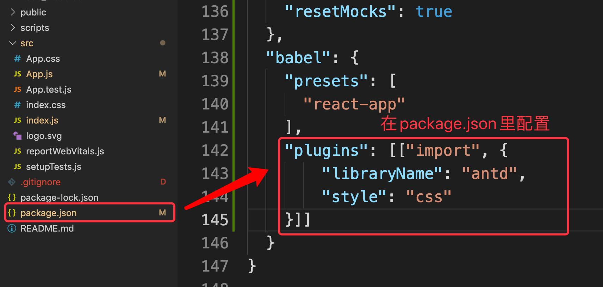
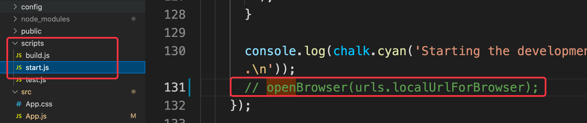
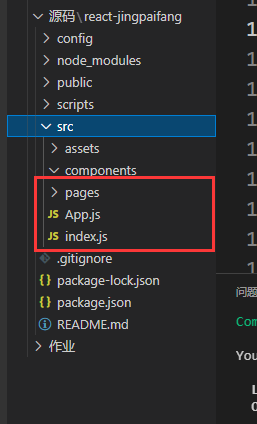
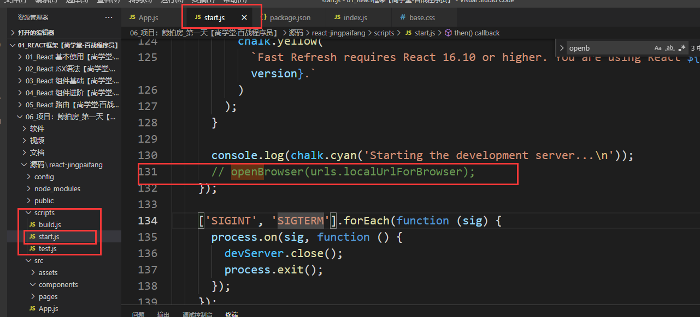
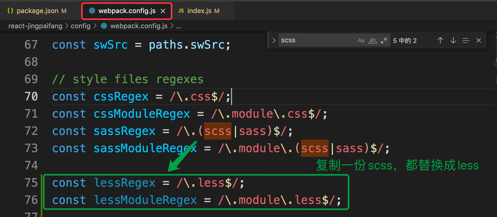
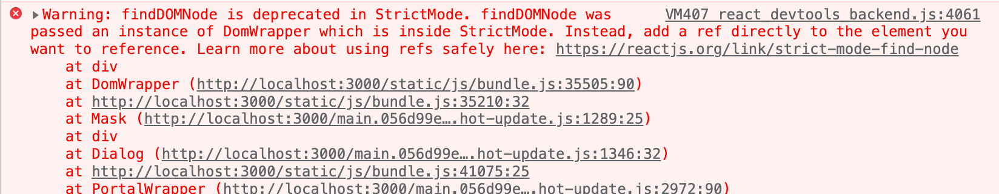
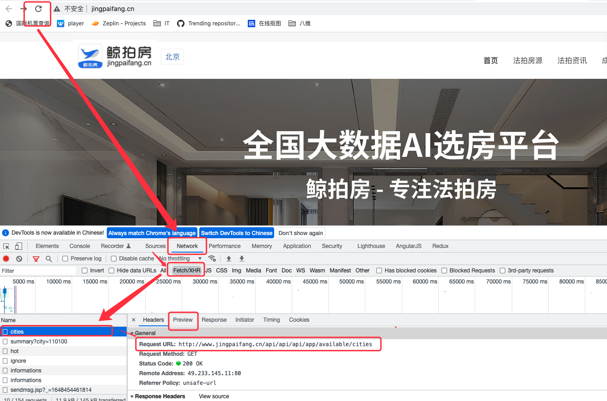
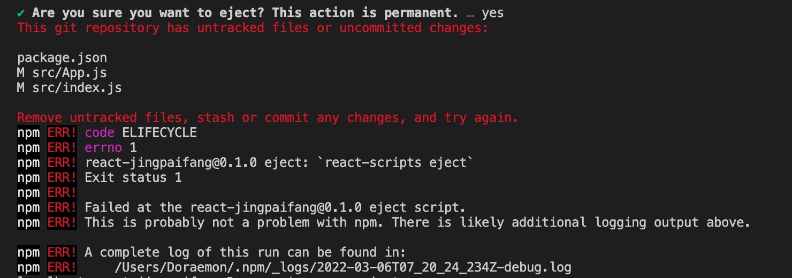

# 项目：鲸拍房_第一天

**主要内容**

* Ant Design库
* 路由配置
* less配置
* 导航菜单
* 首页搜索区域

**学习目标**

 知识点| 要求 
 -| :- 
 Ant Design库 | 掌握 
 路由配置 | 掌握 
 less配置 | 掌握 
 导航菜单 | 掌握 
 首页搜索区域 | 掌握 


## 一、Ant Design库

### 1.1 Ant Design库介绍

`antd` 是基于 Ant Design 设计体系的 React UI 组件库，主要用于研发企业级中后台产品。

​	


✨ 特性

- 🌈 提炼自企业级中后台产品的交互语言和视觉风格。
- 📦 开箱即用的高质量 React 组件。
- 🛡 使用 TypeScript 开发，提供完整的类型定义文件。
- ⚙️ 全链路开发和设计工具体系。
- 🌍 数十个国际化语言支持。
- 🎨 深入每个细节的主题定制能力。


### 创建项目：

```bash
npx create-react-app project 

npm i create-react-app -g
create-react-app react-jingpaifang
```


步骤：

1、创建项目：

create-react-app react-jingpaifang

2、降版本   

npm i react@17 react-dom@17 -S

3、安装antd

npm install antd --save

4、删掉app.js 里的header



5、随便引入按钮测试 antd


### 1.2 安装

使用 npm 或 yarn 安装

**我们推荐使用 npm 或 yarn 的方式进行开发**，不仅可在开发环境轻松调试，也可放心地在生产环境打包部署使用，享受整个生态圈和工具链带来的诸多好处。

```bash
$ npm install antd --save
$ yarn add antd
```

如果你的网络环境不佳，推荐使用 [cnpm]。

引入样式

```js
import 'antd/dist/antd.css'; // or 'antd/dist/antd.less'
```


### 1.3 Ant Design库加载样式

1. 全局引入

2. import 'antd/dist/antd.css'

​     优点：导入了所有的组件的样式 使用组件的时候不用考虑样式

​     缺点：导入无用的组件的css样式 


  3. 按需引入

​     1. 安装配置：babel-plugin-import (推荐) 

​      gitHub：https://github.com/ant-design/babel-plugin-import

​     2. npm run eject 暴露webpack.config.js 

​     3. npm install babel-plugin-import --save-dev

   4. 配置一个根目录(src)文件  (注：暴露了webpack后需要删除package.json文件里面的babel配置)

      .babelrc：

```.babelrc
{
    "presets": [
       "react-app"
       ],
    "plugins": [["import", {
        "libraryName": "antd",
        "style": "css"
    }]]
}
```


或者 package.json:




#### 关闭浏览器自启动（需要暴露Webpack）：




#### React关闭Eslint（需要暴露Webpack）:

在 package.json 中修改为一下

```js
"eslintConfig": {
	"extends": "react-app",
	"rules": {
        "no-undef": "off",
        "no-restricted-globals": "off",
        "no-unused-vars": "off"
	 }
}
```


### 1.4 基本使用

​	

代码演示

```jsx
import { Button } from 'antd';

ReactDOM.render(
  <>
    <Button type="primary">Primary Button</Button>
    <Button>Default Button</Button>
    <Button type="dashed">Dashed Button</Button>
    <br />
    <Button type="text">Text Button</Button>
    <Button type="link">Link Button</Button>
  </>,
  mountNode,
);
```


## 二、路由配置

### 项目准备

1. 删除无用的组件 文件

   

2. 创建初始化文件 base.css (公司内部)

3. 创建对应的文件 components  pages/views 

4. 安装路由 react-router-dom    ==axios==  

   ```bash
   npm install --save react-router-dom@5.3  axios
   ```

5. React关闭Eslint（需要暴露Webpack）:

   在 package.json 中修改为一下

   ```js
   "eslintConfig": {
   	"extends": "react-app",
   	"rules": {
           "no-undef": "off",
           "no-restricted-globals": "off",
           "no-unused-vars": "off"
   	 }
   }
   ```

6. 关闭浏览器自启动

   


### 2.1 效果图

​	


### 2.2 路由配置代码

```jsx
//导入路由配置模块
import { HashRouter as Router, Route, Switch, Redirect, Link } from 'react-router-dom'
//导入组件
import Layout from './pages/Layout/Layout'
import Login from './pages/Login/Login'
import Home from './pages/Home/Home'
import News from './pages/News/News'
import House from './pages/House/House'
function App() {
  return (
    <Router>
      <Switch>
        {/* 登录界面 */}
        <Route path='/login' component={Login} />
        
        {/* 布局界面 */}
        <Layout path='/'>
          <Switch>
            <Route exact path='/' component={Home} />
            <Route path='/house' component={House} />
            <Route path='/news' component={News} />
          </Switch>
        </Layout>

      </Switch>
    </Router>
  );
}

export default App;
```


## 三、less配置

### 3.1 安装less

​	React 脚手架里面已经配置了 Sass，只需要安装 Sass即可；但是，并没有配置 Less，这需要我们去配置 webpack.config.js

1. 安装（注意版本）

   ```js
   npm i less less-loader@7.x -S
   ```

2. npm run eject

3. 配置修改 webpack.config.js  复制一份sass修改less


config/webpack.config.js:




### 3.2 修改配置文件

然而你会发现使用脚手架创建的项目中并找不到这个文件，原因就是你需要暴露它才能看到它：

```bash
npm run eject
```

​	

**真正配置 Less**

```js
const lessRegex = /\.less$/;
const lessModuleRegex = /\.module\.less$/;
```


```js
{
  test: lessRegex,
  exclude: lessModuleRegex,
  use: getStyleLoaders({
    importLoaders: 1,
    modules: true,
    sourceMap: isEnvProduction && shouldUseSourceMap
  },
    "less-loader"
  ),
  sideEffects: true
},
{
  test: lessModuleRegex,
  use: getStyleLoaders({
    importLoaders: 1,
    sourceMap: isEnvProduction && shouldUseSourceMap,
    modules: true,
    getLocalIdent: getCSSModuleLocalIdent
  },
    "less-loader"
  )
},

```

配置好重启启动项目就可以了


## 四、导航菜单

### 4.1 效果展示

​	

### 4.2 代码演示

#### 布局组件 Layout.jsx :

```jsx
import React, { Component } from 'react'
import MyMenu from './MyMenu/MyMenu'
export default class Layout extends Component {
    render() {
        return (
            <div>
               {/* 导航区域 */}
                <MyMenu/>
               {/* 路由出口 */}
               {
                   this.props.children
               }
            </div>
        )
    }
}

```


#### 导航组件 MyMenu.jsx布局

```jsx
import React, { Component } from 'react'
import { NavLink } from 'react-router-dom'
import logo from '../../../assets/images/logo.jpg'
import { Menu, Dropdown } from 'antd';
import { DownOutlined } from '@ant-design/icons';
import './style.scss'
// import styles from './style.module.scss'
import api from '../../../api/index'
export default class MyMenu extends Component {
    constructor(){
        super()
        this.state={
            citys:[],//城市列表
        }
    }
     //网络请求
    componentDidMount(){
        api.getCity()
        .then(res=>{
            console.log(res.data);
            console.log(res.data.data);
            this.setState({
                citys:res.data.data
            })
        })
    }
    //函数
    onClick=({key})=>{
        console.log('当前选择的城市id为：',key);
    }

    render() {
        const menu = (
            // 获取菜单点击的key 也就是城市的标识 id    onClick={onClick}
            <Menu onClick={this.onClick}>
                {
                    this.state.citys.map((ele)=>{
                        return <Menu.Item key={ele.id}>
                                <a rel="noopener noreferrer" href="##">
                                    {ele.name}
                                </a>
                            </Menu.Item>
                    })
                }
            </Menu>
        )
        return (
            <div className='menu'>
                <div className='container'>
                    <div className='left'>
                        
                        {/* 城市切换 */}
                        <Dropdown overlay={menu}>
                            <a className="ant-dropdown-link" onClick={e => e.preventDefault()}>
                                北 京 <DownOutlined />
                            </a>
                        </Dropdown>

                    </div>
                    <div className='right'>
                        <NavLink exact to='/'>首页</NavLink>
                        <NavLink to='/house'>法拍房源</NavLink>
                        <NavLink to='/news'>法拍资讯</NavLink>
                        <NavLink to='/aa'>成功案例</NavLink>
                        <NavLink to='/bb'>关于我们</NavLink>
                        <span>登录/注册</span>
                    </div>
                </div>
            </div>
        )
    }
   
}

```


#### 样式 MyMenu.module.less：

```less
.menu {
    background-color: #fff;
    font-size: 16px;

    .container {
        display: flex;
        width: 1200px;
        height: 80px;
        line-height: 80px;
        margin: 0 auto;
    

        .left {
            flex: 1;
        }

        .right {
            a {
                color: #333;
                padding: 0 20px;
                display: inline-block;
            }

            .active {
                font-weight: bold;
            }
        }
    }
}
```


#### 请求地址：

```js
const api= {
    city:'http://www.jingpaifang.cn/api/api/api/app/available/cities', //请求城市列表，
    houseInfo:'http://www.jingpaifang.cn/api/api/api/app/daily/summary?city=110100', //房源信息
    ignore:"/api/api/api/app/search/houses/ignore",//捡漏房源
}

export default api;
```


严格模式不支持低版本导致的问题，关闭严格模式




## 五、首页搜索区域

### 5.1 效果图

​		

### 5.2 代码演示

```jsx
import React, { Component } from 'react'
import { Input } from 'antd';
import api from '../../api/index'
import styles from './style.module.less'
const { Search } = Input;
export default class Home extends Component {
    constructor() {
        super()
        this.state = {
            houseInfo: {},//房源信息
        }
    }
    //生命周期
    componentDidMount() {
        //房源信息------------------------------------
        api.getHouseInfo()
            .then(res => {
                console.log('房源信息---', res.data);
                this.setState({
                    houseInfo: res.data.data
                })
            })
        //捡漏房源
        api.getIgnore({ pageNo: 0, pageSize: 9, authorId: "129465", sortId: 1, city: 110100 })
            .then(res => {
                console.log('捡漏房源', res.data);
            })
    }
    //函数
    onSearch = (value) => {
        console.log(value);
    }
    render() {
        return (
            <div>
                {/* 1. 搜索区域 */}
                <div className={styles.main}>
                    <div className={styles['main-content']}>
                        <ul className={styles['main-info']}>
                            <li>
                                今日
                                <div className={styles.info}> 法拍快讯</div>
                            </li>
                            <li>
                                {this.state.houseInfo.addCount} 套
                                <div className={styles.info}>今日上拍</div>
                            </li>
                            <li>
                                {this.state.houseInfo.overCount} 套
                                <div className={styles.info}>今日成交</div>
                            </li>
                            <li>
                                {this.state.houseInfo.strikeCount} 套
                                <div className={styles.info}>今日流拍</div>
                            </li>
                            <li>
                                {this.state.houseInfo.cancelCount} 套
                                <div className={styles.info}>今日撤拍</div>
                            </li>
                        </ul>
                        {/*搜搜 */}
                        <div className={styles.search}>
                            {/* <Input placeholder="请输入你喜欢的房源" className={styles.input} /> */}
                            <Search
                                placeholder="请输入你喜欢的房源"
                                allowClear
                                enterButton="搜索"
                                size="large"
                                onSearch={this.onSearch}
                            />
                        </div>
                    </div>
                </div>

                {/* 2. 热门房源 */}

                {/* 3. 捡漏 */}


            </div>
        )
    }
}

```

样式

```less
.main{
    height: 600px;
    background: url('../../assets/images/banner3.jpg') no-repeat top center;
    width: 100%;
    overflow: hidden;
    .main-content{
        width: 1200px;
        margin:  0 auto;
        position: relative;
        margin-top: 360px;
        .main-info{
            display: flex;
            padding:0 200px;
            li{
                flex: 1;
                text-align: center;
                color: #fff;
                font-size: 20px;
                font-weight: bold;
                border-right: 1px solid rgb(219, 219, 219);
            }
            .info{
                color: #aaa;
                margin-top: 4px;
                font-size: 18px;
            }
            li:last-child{
                border-right: 0;
            }
        }
    }
    .search {
        padding:0 60px;
    }
}
```


### 5.3 请求接口配置



```js
/**
 * 公共的请求方法
 */
import base from './base'
import axios from 'axios'

const api = {
    /**
     * 切换城市
     */
    getCity() {
        return axios.get(base.host+base.city)
    },
    /**
     * 当前城市的拍房源信息
     */
    getHouseInfo() {
        return axios.get(base.host+base.houseInfo)
    },
    /**
     * 捡漏房源
     * {pageNo: 0, pageSize: 9, authorId: "129465", sortId: 1, city: 110100}
     */
    getIgnore(params){
        return axios.post(base.host+base.ignore,params)
    }
}

export default api
```


## ==报错处理==

### 1、` npm run eject` 暴露文件出错



是git地址的问题，输入下面命令行就行了:

```
1 git add .
2 git commit -m "Save before ejecting"
3 npm run eject
```

命令结束后出现Ejected successfully!即暴露webpack配置文件成功。


# 4.3 axios 网络请求

Axios 是一个基于 promise 的 HTTP 库，可以用在浏览器和 node.js 中。

**特点**

- 从浏览器中创建 [XMLHttpRequests](https://developer.mozilla.org/en-US/docs/Web/API/XMLHttpRequest)
- 从 node.js 创建 [http](http://nodejs.org/api/http.html) 请求
- ==支持 [Promise] API==
- ==拦截请求和响应==
- 转换请求数据和响应数据
- ==取消请求==
- ==自动转换 JSON 数据==
- 客户端支持防御 [XSRF]


```jsx
axios.get('http://iwenwiki.com/api/blueberrypai/getIndexBanner.php')
    .then(res=>{
    console.log('=========================',res.data);
})
```


**安装**

使用 npm:

```shell
$ npm install axios
```

使用 bower:

```shell
$ bower install axios
```

使用 cdn:

```js
<script src="https://unpkg.com/axios/dist/axios.min.js"></script>
```


**执行 `GET` 请求**

```js
import Axios from 'axios'

// 为给定 ID 的 user 创建请求
Axios.get('http://iwenwiki.com/api/blueberrypai/getIndexBanner.php')
  .then(function (response) {
    console.log(response);
  })
  .catch(function (error) {
    console.log(error);
  });

// 可选地，上面的请求可以这样做
axios.get('http://localhost:8000?user', {
    params: {
      ID: 12345，
      msg：'123'
    }
  })
  .then(function (response) {
    console.log(response);
  })
  .catch(function (error) {
    console.log(error);
  });
```


**执行 `POST` 请求**

```js
axios.post('/foo/user', {
    user_id: 'iwen@qq.com',
    password: 'iwen143',
    verification_code:'crfvw'
  })
  .then(function (response) {
    console.log(response);
  })
  .catch(function (error) {
    console.log(error);
  });
```

```js
// 发送 POST 请求
axios({
  method: 'post',
  url: '/user/12345',
  data: {
    firstName: 'Fred',
    lastName: 'Flintstone'
  }
});
```

**执行多个并发请求**

```js
function getUserAccount() {
  return axios.get('/user/12345');
}

function getUserPermissions() {
  return axios.get('/user/12345/permissions');
}

axios.all([getUserAccount(), getUserPermissions()])
  .then(axios.spread(function (acct, perms) {
    // 两个请求现在都执行完成
  }));

axios.race([funA(),funB(),funC()]) //比赛
.then(res=>{
    console.log(1111)
})
```

