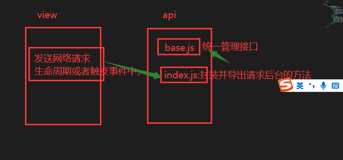

# 项目：鲸拍房_第二天

**主要内容**

* 捡漏房源
* 成交故事
* 法拍资讯
* 法拍房源

**学习目标**

 知识点| 要求 
 -| :- 
 捡漏房源 | 掌握 
 成交故事 | 掌握 
 法拍资讯 | 掌握 
 法拍房源 | 掌握 





## 一、捡漏房源

### 1.1 效果图

​	

### 1.2 代码演示

捡漏房源组件

```jsx
import React, { Component } from 'react'
import styles from './style.module.less'
import logo from '../../../assets/images/logo.jpg'
export default class Ignore extends Component {
    render() {
        console.log('接受父组件传递的数据props', this.props.ignore);
        return (
            <div>
                <h2 className={styles.title}>捡漏房源 | <span className={styles.span}>IGNORE HOUSES</span></h2>
                <div className={styles.list}>
                    {
                        this.props.ignore.map((ele) => {
                            return <div className={styles.item} key={ele.uniqueId}>
                                <div className={styles.icon}>{ele.auctionStatusValue}</div>
                                
                                <div className={styles.info}>
                                    <div className={styles.th}>{ele.houseLocation}{ele.shortTitle}</div>
                                    <div>{ele.floorArea}㎡ | {ele.orientation} | {ele.roomHall}</div>
                                    <div className={styles.money}>起拍价 
                                        <span className={styles.num}> {Math.ceil(ele.startPrice/10000)}</span> 万 
                                        市场价{Math.ceil(ele.marketPrice/10000)}万 
                                    </div>
                                    <div className={styles.shop}> 
                                        <span className={styles.btn}>{ele.discount}</span>
                                        <span className={styles.btn}>{ele.auctionStageValue}</span> 
                                        <span className={styles.btn}>{ele.houseType}</span> 
                                    </div>
                                    <ul className={styles.bottom}>
                                        <li className={styles.mark}>{ele.auctionStageValue}</li>
                                        <li>{ele.endTime}结束</li>
                                    </ul>
                                </div>
                            </div>
                        })
                    }

                </div>
            </div>
        )
    }
}

```

对应样式

```less
.title {
    margin-top: 30px;
    margin-bottom: 40px;
    font-weight: bold;
    font-size: 24px;

    .span {
        font-size: 18px;
        color: #888;
    }
}

.list {
    display: flex;

    .item {
        width: 290px;
        height: 432px;
        background: #fff;
        margin-bottom: 20px;
        margin-right: 13px;
        position: relative;
    }

    .icon {
        position: absolute;
        left: 0;
        top: 10px;
        width: 70px;
        height: 25px;
        color: #fff;
        text-align: center;
        line-height: 25px;
        font-size: 14px;
        background: url('../../../assets/images/hicon.png') 0% 0% / 100% 100% no-repeat;
        display: block;
    }

    .info {
        padding: 10px;

        .th {
            font-size: 18px;
            color: #333;
            text-align: left;
            min-height: 55px;
            height: 60px;
            overflow: hidden;
            text-overflow: ellipsis;
            display: -webkit-box;
            -webkit-line-clamp: 2;
            -webkit-box-orient: vertical;
        }

        .money {
            margin-top: 4px;
            margin-bottom: 4px;
            .num {
                color: #b83932;
                font-weight: 700;
                font-size: 24px;
            }
        }

        .money:hover {
            color: #096dd9;
        }

        .shop {
            .btn {
                background-color: #ecf5ff;
                display: inline-block;
                height: 32px;
                margin-right: 10px;
                padding: 0 10px;
                line-height: 30px;
                font-size: 12px;
                color: #409eff;
                border: 1px solid #d9ecff;
                border-radius: 4px;
                box-sizing: border-box;
                white-space: nowrap;
            }
        }

        .bottom {
            height: 28px;
            font-size: 14px;
            margin-top: 10px;
            text-align: left;

            li {
                background: rgb(246, 246, 246);
                z-index: 99;
                padding-left: 5px;
                color: rgb(102, 102, 102);
                line-height: 28px;
                height: 28px;
                padding-right: 5px;
                float: left;
                margin-right: 3px;
                height: 28px;
                text-align: left;
                font-weight: 700;
                line-height: 28px;
                position: relative;
            }

            .mark {
                padding-left: 5px;
                color: #fff;
                background-color: #17aa6b;
            }
        }
    }
}
```

首页组件获取动态数据

```jsx
import React, { Component } from 'react'
import { Input, Tabs } from 'antd';
import api from '../../api/index'
import styles from './style.module.less'
import Ignore from './Ignore/Ignore'
import Infomation from './Infomation/Infomation'
import full1 from '../../assets/images/full1.png'
import full2 from '../../assets/images/full2.png'
import full3 from '../../assets/images/full3.png'
import qiye from '../../assets/images/qiye.png'
import service from '../../assets/images/service.jpg'
import Bottom from '../../components/MyBottom/Bottom'
import './antstyle.less'
const { Search } = Input;
const { TabPane } = Tabs;
export default class Home extends Component {
    constructor() {
        super()
        this.state = {
            houseInfo: {},//房源信息
            ignore: [],//捡漏房源
            successList: [],//成功故事列表容器
            cityId: 110100,//北京id
            infoList: [],//法拍资讯列表数据
        }
    }
    //生命周期
    componentDidMount() {
        //1. 今日房源信息统计------------------------------------
        api.getHouseInfo({
            city: 110100
        })
            .then(res => {
                console.log('房源统计信息---', res.data);
                this.setState({
                    houseInfo: res.data.data
                })
            })
        //2. 捡漏房源 ----------------------------------------
        api.getIgnore({ pageNo: 0, pageSize: 4, city: 110100 })
            .then(res => {
                console.log('捡漏房源----', res.data);
                this.setState({
                    ignore: res.data.data.content
                })
            })
    }
    //函数
    onSearch = (value) => {
        console.log(value);
    }
    render() {
        return (
            <div>
                {/* 1. 搜索区域 */}
                <div className={styles.main}>
                    <div className={styles['main-content']}>
                        <ul className={styles['main-info']}>
                            <li>
                                今日
                                <div className={styles.info}> 法拍快讯</div>
                            </li>
                            <li>
                                {this.state.houseInfo.addCount} 套
                                <div className={styles.info}>今日上拍</div>
                            </li>
                            <li>
                                {this.state.houseInfo.overCount} 套
                                <div className={styles.info}>今日成交</div>
                            </li>
                            <li>
                                {this.state.houseInfo.strikeCount} 套
                                <div className={styles.info}>今日流拍</div>
                            </li>
                            <li>
                                {this.state.houseInfo.cancelCount} 套
                                <div className={styles.info}>今日撤拍</div>
                            </li>
                        </ul>
                        {/*搜搜 */}
                        <div className={styles.search}>
                            {/* <Input placeholder="请输入你喜欢的房源" className={styles.input} /> */}
                            <Search
                                placeholder="请输入你喜欢的房源"
                                allowClear
                                enterButton="搜索"
                                size="large"
                                onSearch={this.onSearch}
                            />
                        </div>
                    </div>
                </div>
                {/* 2. 热门房源 */}

                {/* 3. 捡漏房源 */}
                <div className={styles.container}>
                    <Ignore ignore={this.state.ignore} />
                </div>

            </div>
        )
    }
}
```

### 1.3 全程服务效果图

​	

### 1.4 代码演示

```jsx
{/* 3. 捡漏房源 */}
<div className={styles.container}>
    <Ignore ignore={this.state.ignore} />
</div>

{/* 4. 全程服务 */}
<div className={styles.container}>
    <h2 className={styles.title}>全程服务|<span className={styles.span}>FULL SERVICE</span>					</h2>
    <div className={styles.wrapper}>
        <Tabs defaultActiveKey="1" centered>
            <TabPane tab="拍卖前" key="1">
                
            </TabPane>
            <TabPane tab="拍卖中" key="2">
                
            </TabPane>
            <TabPane tab="拍卖后" key="3">
                
            </TabPane>
        </Tabs>
    </div>
</div>  				
```


## 二、成交故事

### 2.1 效果图

​	


### 2.2 代码演示

首页组件

```jsx
import React, { Component } from 'react'
import { Input, Tabs } from 'antd';
import api from '../../api/index'
import styles from './style.module.less'
import Ignore from './Ignore/Ignore'
import Infomation from './Infomation/Infomation'
import full1 from '../../assets/images/full1.png'
import full2 from '../../assets/images/full2.png'
import full3 from '../../assets/images/full3.png'
import qiye from '../../assets/images/qiye.png'
import service from '../../assets/images/service.jpg'
import Bottom from '../../components/MyBottom/Bottom'
import './antstyle.less'
const { Search } = Input;
const { TabPane } = Tabs;
export default class Home extends Component {
    constructor() {
        super()
        this.state = {
            houseInfo: {},//房源信息
            ignore: [],//捡漏房源
            successList: [],//成功故事列表容器
            cityId: 110100,//北京id
            infoList: [],//法拍资讯列表数据
        }
    }
    //生命周期
    componentDidMount() {
        //1. 今日房源信息统计------------------------------------
        api.getHouseInfo({
            city: 110100
        })
            .then(res => {
                console.log('房源统计信息---', res.data);
                this.setState({
                    houseInfo: res.data.data
                })
            })
        //2. 捡漏房源 ----------------------------------------
        api.getIgnore({ pageNo: 0, pageSize: 4, city: 110100 })
            .then(res => {
                console.log('捡漏房源----', res.data);
                this.setState({
                    ignore: res.data.data.content
                })
            })

        //3. 成交故事获取------------------------------------
        api.getSuccessful({
            pageNo: 0,
            pageSize: 4,
            title: "法拍房真实案例",
            authorId: "129465",
            sortId: 1,
            city: 110100
        })
            .then(res => {
                console.log('成功故事----', res.data);
                this.setState({
                    successList: res.data.data.content
                })
            })
    }
    //函数
    onSearch = (value) => {
        console.log(value);
    }
    render() {
        return (
            <div>
                {/* 1. 搜索区域 */}
                <div className={styles.main}>
                    <div className={styles['main-content']}>
                        <ul className={styles['main-info']}>
                            <li>
                                今日
                                <div className={styles.info}> 法拍快讯</div>
                            </li>
                            <li>
                                {this.state.houseInfo.addCount} 套
                                <div className={styles.info}>今日上拍</div>
                            </li>
                            <li>
                                {this.state.houseInfo.overCount} 套
                                <div className={styles.info}>今日成交</div>
                            </li>
                            <li>
                                {this.state.houseInfo.strikeCount} 套
                                <div className={styles.info}>今日流拍</div>
                            </li>
                            <li>
                                {this.state.houseInfo.cancelCount} 套
                                <div className={styles.info}>今日撤拍</div>
                            </li>
                        </ul>
                        {/*搜搜 */}
                        <div className={styles.search}>
                            {/* <Input placeholder="请输入你喜欢的房源" className={styles.input} /> */}
                            <Search
                                placeholder="请输入你喜欢的房源"
                                allowClear
                                enterButton="搜索"
                                size="large"
                                onSearch={this.onSearch}
                            />
                        </div>
                    </div>
                </div>
                {/* 2. 热门房源 */}

                {/* 3. 捡漏房源 */}
                <div className={styles.container}>
                    <Ignore ignore={this.state.ignore} />
                </div>

                {/* 4. 全程服务 */}
                <div className={styles.container}>
                    <h2 className={styles.title}>全程服务|<span className={styles.span}>FULL SERVICE</span></h2>
                    <div className={styles.wrapper}>
                        <Tabs defaultActiveKey="1" centered>
                            <TabPane tab="拍卖前" key="1">
                                
                            </TabPane>
                            <TabPane tab="拍卖中" key="2">
                                
                            </TabPane>
                            <TabPane tab="拍卖后" key="3">
                                
                            </TabPane>
                        </Tabs>
                    </div>
                </div>

                {/* 5. 成交故事 */}
                <div className={styles.container}>
                    <h2 className={styles.title}>成交故事|<span className={styles.span}>SUCCESSFUL CASE</span></h2>
                    <ul className={styles.successful}>
                        {
                            this.state.successList.map(ele => {
                                return <li key={ele.informationId}>
                                    <div className={styles.header}>{ele.title}</div>
                                    <div className={styles.content} >
                                        <div className={styles.img}> </div>
                                        <div className={styles.right}>
                                            <div className={styles.desc}>
                                                {ele.subject}
                                            </div>
                                            <div className={styles.time}>时间：{ele.publishTime}</div>
                                        </div>
                                    </div>
                                </li>
                            })
                        }
                    </ul>
                </div>


            </div>
        )
    }
}

```

### 2.3 企业与团队介绍

​	


## 三、法拍资讯

### 3.1 效果图

​				

### 3.2 代码演示

首页组件

```jsx
import React, { Component } from 'react'
import { Input, Tabs } from 'antd';
import api from '../../api/index'
import styles from './style.module.less'
import Ignore from './Ignore/Ignore'
import Infomation from './Infomation/Infomation'
import full1 from '../../assets/images/full1.png'
import full2 from '../../assets/images/full2.png'
import full3 from '../../assets/images/full3.png'
import qiye from '../../assets/images/qiye.png'
import service from '../../assets/images/service.jpg'
import Bottom from '../../components/MyBottom/Bottom'
import './antstyle.less'
const { Search } = Input;
const { TabPane } = Tabs;
export default class Home extends Component {
    constructor() {
        super()
        this.state = {
            houseInfo: {},//房源信息
            ignore: [],//捡漏房源
            successList: [],//成功故事列表容器
            cityId: 110100,//北京id
            infoList: [],//法拍资讯列表数据
        }
    }
    //生命周期
    componentDidMount() {
        //1. 今日房源信息统计------------------------------------
        api.getHouseInfo({
            city: 110100
        })
            .then(res => {
                console.log('房源统计信息---', res.data);
                this.setState({
                    houseInfo: res.data.data
                })
            })
        //2. 捡漏房源 ----------------------------------------
        api.getIgnore({ pageNo: 0, pageSize: 4, city: 110100 })
            .then(res => {
                console.log('捡漏房源----', res.data);
                this.setState({
                    ignore: res.data.data.content
                })
            })

        //3. 成交故事获取------------------------------------
        api.getSuccessful({
            pageNo: 0,
            pageSize: 4,
            title: "法拍房真实案例",
            authorId: "129465",
            sortId: 1,
            city: 110100
        })
            .then(res => {
                console.log('成功故事----', res.data);
                this.setState({
                    successList: res.data.data.content
                })
            })

        //4. 法拍资讯---------------------------------------
        api.getInfomation({
            pageNo: 0, pageSize: 9, authorId: "129465", sortId: 1, city: 110100
        })
            .then(res => {
                console.log('法拍资讯----', res.data);
                this.setState({
                    infoList: res.data.data.content
                })
            })
    }
    //函数
    onSearch = (value) => {
        console.log(value);
    }
    render() {
        return (
            <div>
                {/* 1. 搜索区域 */}
                <div className={styles.main}>
                    <div className={styles['main-content']}>
                        <ul className={styles['main-info']}>
                            <li>
                                今日
                                <div className={styles.info}> 法拍快讯</div>
                            </li>
                            <li>
                                {this.state.houseInfo.addCount} 套
                                <div className={styles.info}>今日上拍</div>
                            </li>
                            <li>
                                {this.state.houseInfo.overCount} 套
                                <div className={styles.info}>今日成交</div>
                            </li>
                            <li>
                                {this.state.houseInfo.strikeCount} 套
                                <div className={styles.info}>今日流拍</div>
                            </li>
                            <li>
                                {this.state.houseInfo.cancelCount} 套
                                <div className={styles.info}>今日撤拍</div>
                            </li>
                        </ul>
                        {/*搜搜 */}
                        <div className={styles.search}>
                            {/* <Input placeholder="请输入你喜欢的房源" className={styles.input} /> */}
                            <Search
                                placeholder="请输入你喜欢的房源"
                                allowClear
                                enterButton="搜索"
                                size="large"
                                onSearch={this.onSearch}
                            />
                        </div>
                    </div>
                </div>
                {/* 2. 热门房源 */}

                {/* 3. 捡漏房源 */}
                <div className={styles.container}>
                    <Ignore ignore={this.state.ignore} />
                </div>

                {/* 4. 全程服务 */}
                <div className={styles.container}>
                    <h2 className={styles.title}>全程服务|<span className={styles.span}>FULL SERVICE</span></h2>
                    <div className={styles.wrapper}>
                        <Tabs defaultActiveKey="1" centered>
                            <TabPane tab="拍卖前" key="1">
                                
                            </TabPane>
                            <TabPane tab="拍卖中" key="2">
                                
                            </TabPane>
                            <TabPane tab="拍卖后" key="3">
                                
                            </TabPane>
                        </Tabs>
                    </div>
                </div>

                {/* 5. 成交故事 */}
                <div className={styles.container}>
                    <h2 className={styles.title}>成交故事|<span className={styles.span}>SUCCESSFUL CASE</span></h2>
                    <ul className={styles.successful}>
                        {
                            this.state.successList.map(ele => {
                                return <li key={ele.informationId}>
                                    <div className={styles.header}>{ele.title}</div>
                                    <div className={styles.content} >
                                        <div className={styles.img}> </div>
                                        <div className={styles.right}>
                                            <div className={styles.desc}>
                                                {ele.subject}
                                            </div>
                                            <div className={styles.time}>时间：{ele.publishTime}</div>
                                        </div>
                                    </div>
                                </li>
                            })
                        }
                    </ul>
                </div>
                {/* 6. 企业荣誉|ENTERPRISE HONOR */}
                <div className={styles.container}>
                    <h2 className={styles.title}>企业荣誉|<span className={styles.span}>ENTERPRISE HONOR</span></h2>
                    <div>
                        
                    </div>
                </div>

                {/* 7. 团队介绍|TEAM INTRODUCTION */}

                {/* 8. 服务 */}
                <div className={styles.service}>
                    
                </div>

                {/* 9. 法拍资讯|JUDICIAL AUCTION INFORMATION */}
                <div className={styles.container}>
                    <Infomation infoList={this.state.infoList} />
                </div>

                {/* 10.页面底部--静态布局--图片代替 */}
                <Bottom />

            </div>
        )
    }
}

```

法拍组件

```jsx
import React, { Component } from 'react'
import styles from './style.module.less'
import {Link} from 'react-router-dom'
export default class Infomation extends Component {
    render() {
        console.log('this.props.infoList',this.props.infoList);//[]
        return (
            <div>
                <h2 className={styles.title}>法拍资讯 | <span className={styles.span}>JUDICIAL AUCTION INFORMATION</span></h2>
                <div className={styles.more}>
                    <Link to='/more'>查看更多</Link>
                </div>
                <div className={styles.content}>
                    <div className={styles.img}>
                        
                    </div>
                    <ul className={styles.list}>
                        {
                            this.props.infoList.slice(1).map((ele,index) => {
                                return <li key={ele.informationId}>
                                        <div className={styles.info}>
                                            
                                            <span>{ele.title}</span>
                                        </div>
                                        <div className={styles.time}>{ele.publishTime}</div>
                                    </li>
                            })
                        }
                    </ul>
                </div>
            </div>
        )
    }
}

```

法拍样式

```less
.title {
    margin-top: 30px;
    margin-bottom: 40px;
    font-weight: bold;
    font-size: 24px;

    .span {
        font-size: 18px;
        color: #888;
    }
}
.more{
    text-align: right;
    margin-bottom: 10px;
    padding-bottom: 6px;
    border-bottom: 1px solid #eee;
}
// 资讯
.content{
    display: flex;
    .img{
        width: 400px;
        height: 300px;
        margin-right: 20px;
        img{
            width: 100%;
            height: 100%;
        }
    }
    .list{
        flex: 1;
        li{
            display: flex;
            margin-bottom: 16px;
            .info{
                flex: 1;
            }
            .time{
                
            }
        }
    }
}
```

### 3.3 法拍查看更多

​	

**代码演示**

```jsx
import React, { Component } from 'react'
import Bottom from '../../components/MyBottom/Bottom'
import styles from './style.module.less'
import api from '../../api/index'
export default class More extends Component {
    constructor() {
        super()
        this.state = {
            list: [],//数据列表
        }
    }
    componentDidMount() {
        api.getInfomation({
            pageNo: 0, pageSize: 10, authorId: "129465", sortId: 1, city: 110100
        })
            .then(res => {
                console.log('更多资讯----', res.data);
                this.setState({
                    list: res.data.data.content
                })
            })
    }
    render() {
        return (
            <div>
                <div className={styles.content}>
                    <h2>法拍资讯 传递最新行业资讯 分享法拍房实战技巧</h2>
                    <ul className={styles.list}>
                        {
                            this.state.list.map(ele => {
                                return <li key={ele.informationId}>
                                    <div className={styles.img}>
                                        
                                    </div>
                                    <div className={styles.info}>
                                       {ele.title}
                                    </div>
                                    <div className={styles.time}>
                                       {ele.publishTime}
                                    </div>
                                </li>
                            })
                        }
                    </ul>
                </div>


                {/* 公共的底部 */}
                <Bottom />
            </div>
        )
    }
}

```

样式

```less
.content{
    min-height: 600px;
    width: 1200px;
    margin: 0 auto;
    border:1px solid #eee;
    background: #fff;
    margin-top: 30px;
    h2{
        padding-top: 20px;
        padding-left: 20px;
    }
}
.list{
    li{
        display: flex;
        padding: 10px;
        border-bottom: 1px solid #eee;
        .img{
            width: 200px;
            height: 86px;
            overflow: hidden;
        }
        .info{
            flex: 1;
            padding-left: 20px;
            font-size: 22px;
            color: #096dd9;
            line-height: 86px;
        }
        .time{
            width: 160px;
            margin-top: 70px;
            color: #096dd9;
        }
    }
}
```

## 四、法拍房源

### 4.1 效果图

​	


### 4.3 房源数据

​		


### 4.4 房源分页展示

​	


### 4.5 代码演示

房源组件

```jsx
import React, { Component } from 'react'
import styles from './style.module.less'
import house from '../../assets/images/house.png'
import Bottom from '../../components/MyBottom/Bottom'
import MyPagination from '../../components/MyPagination/MyPagination'
import api from '../../api/index'
export default class House extends Component {
    constructor(){
        super()
        this.state={
            total:100,
            pageSize:10,
            list:[]
        }
    }
    componentDidMount() {
        //{pageNo: 0, pageSize: 21, keyword: "", sortId: 1, auctionStatusId: [], auctionStageId: [],…}
        api.getHouse({
            auctionStageId: [],
            auctionStatusId: [],
            auctionType: [],
            businessCircleIds: [],
            city: 110100,
            houseTypeId: [],
            keyword: "",
            limitBuy: [],
            pageNo: 0,//第几页的数据 pageNo
            pageSize: 21,
            room: [],
            sortId: 1,
            subwayStationIds: []
        })
            .then(res => {
                console.log('房源信息', res.data.data);
                
                //获取总的条数 总的页码显示  数据列表
                this.setState({
                    total:res.data.data.total,
                    pageSize:res.data.data.pageSize,
                    list:res.data.data.content
                })
            })
    }
    render() {
        return (
            <div>
                {/* 1. 位置 */}
                <div className={styles.container}>
                    
                </div>

                {/* 2. 房源信息  默认排序*/}
                <div className={styles.wrapper}>

                </div>

                {/* 3. 分页器--- */}
                <div className={styles.page}>
                    <MyPagination  total={this.state.total} pageSize={this.state.pageSize} />
                </div>

                {/* 4. 顶部 */}
                <Bottom />


            </div>
        )
    }
}

```

分页组件

```jsx
import React, { Component } from 'react'
import { Pagination } from 'antd';
import PropTypes from 'prop-types';
// total	数据总数 showTotal	用于显示数据总量和当前数据顺序
//showQuickJumper	是否可以快速跳转至某页
//showSizeChanger	是否展示 pageSize 切换器，当 total 大于 50 时默认为 true
// defaultPageSize	默认的每页条数 10
//pageSize 每页条数 10
export default class MyPagination extends Component {
    changePage=(page, pageSize)=>{
        console.log('点击分页',page, pageSize);
    }
    render() {
        return (
            <>
                 <Pagination
                        total={this.props.total}
                        pageSize={this.props.pageSize}
                        showSizeChanger={false}
                        showQuickJumper
                        showTotal={total => `共 ${total} 条`}
                        onChange={this.changePage}
                    />
            </>
        )
    }
}
//类型校验
MyPagination.propTypes = {
    total:PropTypes.number,
    pageSize:PropTypes.number
}

// 指定 props 的默认值：
MyPagination.defaultProps = {
    total: 100,
    pageSize:10
};
```

## 五、作业

### 5.1 其他界面

​	

​	

​	

### 5.2 登录弹框数据模拟

​	

