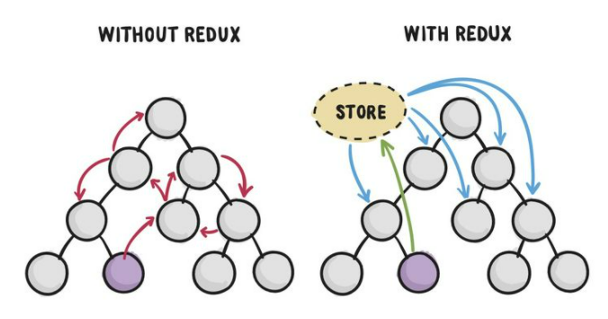
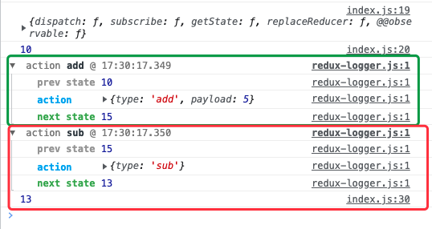
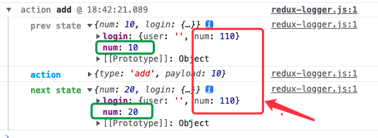
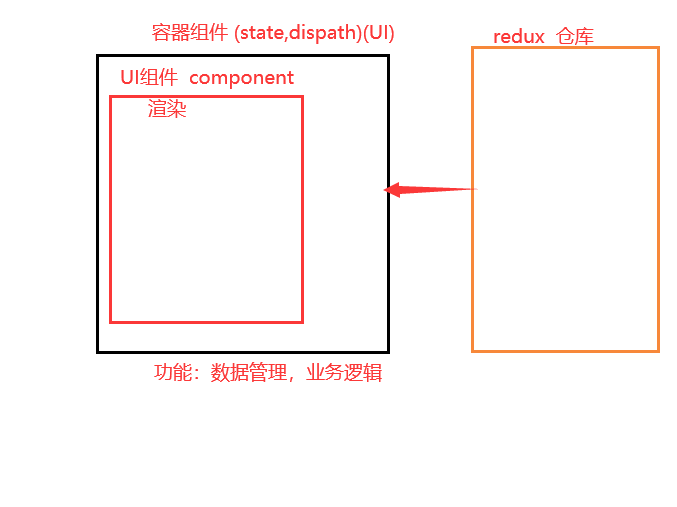

# React Redux

**主要内容**

* React数据传递
* Redux
* React-redux
* 其他

**学习目标**

 知识点| 要求 
 -| :- 
 React数据传递 | 掌握 
 Redux | 掌握 
 React-redux | 掌握 
 其他 | 掌握 


## 一、React数据传递

### 1.1 父传子

```jsx
//App.js
    render(){
        return (
            <div >
            {/* 父传子 */}
            <ChildA num={this.state.num} />
            <ChildB uname={this.state.uname} />
            </div>
        )
    }
//ChildA
    {this.props.num} 接收传递的数据
```


### 1.2 子传父

```jsx
//App.js
    {/* 子传父 */}
    <ChildB uname={this.state.uname}  toChild={this.gaibian.bind(this)}  />
//ChildB
    ch(){
        this.props.toChild()
    }

    render(){
        return (
            <div>
                ChildB { this.props.uname }

                <button onClick={this.ch.bind(this)}>修改uname的值</button>
            </div>
        )
    }
```


### 1.3 兄弟之间数据传递

需要把数据上传到共有的父级身上，然后再通过父级向下传，传到指定的子级上


### 1.4 深层数据传递

React.createContext()


### 1.5 Ref 


## 二、Redux

### 2.1 介绍

​	Redux 是 JavaScript 状态容器，提供可预测化的状态管理。Redux 由 Flux 演变而来，但受 Elm 的启发，避开了 Flux 的复杂性。redux能统一管理数据，只要redux中的数据发生改变了，所有使用redux中数据的地方都会改变。redux有自己的一套操作标准。

Redux就是React里面组件之间数据传递方式，数据在一个store仓库里面 可以任意的组件使用，数据是响应式的。


   网址：https://www.redux.org.cn/

   官网：https://redux.js.org/introduction/getting-started


#### redux 是什么?

1) redux 是一个独立专门用于做状态管理的 JS 库(不是 react 插件库) 

2) 它可以用在 react, angular, vue 等项目中, 但基本与 react 配合使用 

3) 作用: 集中式管理 react 应用中多个组件共享的状态 




使用场景

​    小项目一般不适用Redux进行数据传递  大型企业级项目多组件数据传递或者数据共享使用Redux 


redux流程图：

​	

store.getState()

action : 行为，动作,描述 是个对象   {type:'add',{payload:5}} {type:'sub',{payload:5}}

dispatch：触发action   store.dispatch( {type:'add',5})

Reducers：执行者  function  分支判断 action.type 执行相应的操作 

​			（初始值，action）（prevState,action）

​			返回新状态（不改变旧状态）  

（1）初始化数据  （2）处理数据 （3）	返回新状态  


#### 什么情况下需要使用 redux 

1) 某个组件的状态，需要共享 

2) 某个状态需要在任何地方都可以拿到 

3) 一个组件需要改变全局状态 

4) 一个组件需要改变另一个组件的状态


### 2.2 使用步骤

1. 安装：

   ```bash
   npm install --save redux
   ```

   

2. 创建一个仓库文件 redux文件 （store仓库）  引入到index.js（项目入口）

   ```js
   //引入redux
   import './redux/index'
   ```

   

3. 引入redux 

   ```js
   import { createStore } from 'redux';
   ```

   

4. 创建仓库

   ```js
    const store = createStore(reducer,中间件)  //reducer函数 操作仓库方法
   ```

   

5. 定义仓库数据和数据修改的action

   ```jsx
    function reducer(state = 0, action) { //action={type:'',payload:''}
   	  switch (action.type) {
   		 case 'add':
   			return state + action.payload;
   		 case 'reduce':
   			 return state - 1;
   		 default:
   			 return state;
   		}
   }
   
   // 4、使用store数据
   console.log(store);
   // 获取仓库数据
   console.log(store.getState());
   
   // 触发action  store.dispatch(action)
   store.dispatch({
       type:'add',
       payload:10
   })
   console.log('调用action执行-获取仓库的数据',store.getState());
   ```

   说明：

   ​        reducer定义数据和修改的方法 使store仓库的时候调用的就是action操作

   ​        state 仓库的数据 state='xx' /state={user:'',pwd:''} 返回值需要一个新的对象

   ​        action 仓库数据的操作的方法 一般是对象 action={type:'',payload:'参数'} 

   ​        switch 匹配仓库的操作方法 如果没有匹配的 执行default  什么都不做

   

6. 使用仓库数据

   直接使用：store.dispatch({type:'',payload:''})


### 三大原则

1. 单一数据源

​    	整个应用的 state 被储存在一棵 object tree 中，并且这个 object tree 只存在于唯一一个 store 中。

2. 使用纯函数来执行修改

​    	如何改变 state tree ，你需要编写 reducers。它接收先前的 state 和 action，并返回新的 state

3. State 是只读的

   	 唯一改变 state 的方法就是触发 action，action 是一个用于描述已发生事件的普通对象。

​    执行上面纯函数。


### 2.3 核心

#### 2.3.1 action 

1. 标识要执行行为的对象 

2. 包含 2 个方面的属性 

   a. type: 标识属性, 值为字符串, 唯一, 必要属性 

   b. xxx: 数据属性, 值类型任意, 可选属性 

3. 例子:

   ```js
   const action = { type: 'INCREMENT', data: 2 }
   ```

4. Action Creator(创建 Action 的工厂函数) 

   const increment = (number) => ({type: 'INCREMENT', data: number})


#### 2.3.2 reducer 

1. 根据老的 state 和 action, 产生新的 state 的纯函数 

2. 作用：（1）初始化状态；（2）加工处理状态

2. 样例

   ```js
   export default function counter(state = 0, action) { 
       switch (action.type) { 
           case 'INCREMENT': //加
               return state + action.data 
           case 'DECREMENT': //减
               return state - action.data 
           default: //如果是初始化
               return state 
       } }
   ```

   

3. 注意

   a. 返回一个新的状态 

   b. 不要修改原来的状态 


#### 2.3.3 store

1. 将 state,action 与 reducer 联系在一起的对象 

2. 如何得到此对象? 

   ```js
   import {createStore} from 'redux' 
   
   import reducer from './reducers' 
   
   const store = createStore(reducer) 
   ```

3.  此对象的功能? 

   getState(): 得到 state 

   dispatch(action): 分发 action, 触发 reducer 调用, 产生新的 state


### 中间插件 redux-logger

下载一些中间插件 增强一些功能 

下载：npm i --save redux-logger （功能：检测redux修改过程）

使用步骤

```js
import { applyMiddleware, createStore } from 'redux';

import logger from 'redux-logger'

const store = createStore(reducer,applyMiddleware(logger,xxx));
```




### 合并reducer 

1. 引入

   ```js
   import { combineReducers } from 'redux'
   ```

   

2. 导入reducer文件

3. 合并reducer 

   ```js
    //合并reducer
   const all = combineReducers({//对象 属性：属性值
   	 num,
   	 user:login
   })
   ```

4. 使用  

   ```js
   const store = createStore(all,applyMiddleware(logger));
   ```

5. 命名空间，分模块管理

   ```js
   switch(action.type){
   	 case 'login/add':
   		 state.num += action.payload;
         return state;
   
    }
   ```

   


#### 注意：

打印store.getState()  属性；但是方法没有

只对state属性进行合并，方法暴露在外面。如果每个reduce里都有同一名字的方法，就都会触发。



==》命名空间，分模块管理

```js
function loginReducer(state = { user: '', num: 100 }, action) {
    switch (action.type) {
        case 'login/adduser':
            state.user += action.payload;
            return { ...state }
        case 'login/add':
            state.num += action.payload;
            return { ...state }
        case 'login/change':
            state.user -= action.payload
            return { ...state }
        case 'login/deluser':
            state.user = '';
            return { ...state }
        default:
            return state
    }
}

export default loginReducer;
```


### 常量管理

```js
function reducer(state=10, action) {
    switch (action.type) {
        case ADD:
            state += action.payload;
            return state;
        case SUB:
            state -= 2;
            return state
        default:
            return state;
    }
}

store.dispatch({
    type:ADD,
    payload:10
})
```


## 三、React-redux

一个 react 插件库 , 专门用来简化 react 应用中使用 redux 

==作用：react项目与redux之间的连接工具==

#### React-Redux 将所有组件分成两大类 

##### (1) UI 组件 

a. 只负责 UI 的呈现，不带有任何业务逻辑 

b. 通过 props 接收数据(一般数据和函数) 

c. 不使用任何 Redux 的 API 

d. 一般保存在 components 文件夹下 

##### (2) 容器组件 

a. 负责管理数据和业务逻辑，不负责 UI 的呈现 

b. 使用 Redux 的 API 

c. 一般保存在 containers 文件夹下





#### 安装：

```bash
npm i react-redux  -S 
```


#### 步骤：

1. 创建store仓库 导出store 

2. 引入到首页index.js  注入到组件里面

   ```jsx
   import {Provider} from 'react-redux'
   // 导入仓库
   import store from './redux/index'
   
   ReactDOM.render(
     <Provider store={store}>
       <App />
     </Provider>,
     document.getElementById('root')
   );
   ```

   

3. 获取redux数据 

   connect：高阶组件

   第一个参数：读仓库里的数据

   第二个参数：操作仓库里数据

   ```jsx
   //导入react-redux提供高阶函数
   import {connect} from 'react-redux'
   
   //语法：connect(()=>state,()=>dispatch)(组件名字)
   export default connect((state)=>{//获取仓库的所有数据state 读取
       console.log('仓库的所有数据 state',state);
       return {
           num:state.num,
           user:state.login.user
       }
   },(dispatch)=>{//操作action方法  操作
       return {
           changeUer:(data)=>dispatch({type:'login/change',payload:data}) ,
           delete:()=>dispatch({type:'login/delete'}),
   
       }
   })(Login)
   
   import {connect} from 'react-redux'
   
   function Login(props) {
     return (
       <div>
           <h2>登录界面</h2>
           <p>num:{props.num}</p>
           <p>user:{props.user}</p>
           <p>
               <button onClick={()=>props.chagneUser('admin')}>登录，设置用户名</button>
           </p>
           <p>
               <button onClick={()=>props.delUser()}>退出登录，删除用户名</button>
           </p>
       </div>
     )
   }
   ```


#### 相关 API 

##### 1) Provider 

让所有组件都可以得到 state 数据 

 ```jsx
 //项目入口文件 ：引入redux仓库
// import './redux/index'

// 导入仓库
import store from './redux/index'

import {Provider} from 'react-redux'

<Provider store={store}> 
	<App /> 
</Provider>
 ```


##### 2) connect() 

用于包装 UI 组件生成容器组件 

```js
import { connect } from 'react-redux' 
    connect( 
		mapStateToprops, 
		mapDispatchToProps
	)(Counter)
```

##### 3) mapStateToprops() 

将外部的数据（即 state 对象）转换为 UI 组件的标签属性 

```js
const mapStateToprops = function (state) { 
    return { 
       	  value: state 
        } 
    } 
```


##### 4) mapDispatchToProps() 

将分发 action 的函数转换为 UI 组件的标签属性 

简洁语法可以直接指定为 actions 对象或包含多个 action 方法的对象


### 3.1 安装

```shell
npm install --save redux
npm install --save react-redux
npm install --save-dev redux-devtools
```


### 3.2 使用

**连接react**

1. 关联整个react项目 index.js

```jsx
import { Provider } from 'react-redux'
import { createStore } from 'redux'
import rootReducer from './reducers'
const store = createStore(rootReducer)

render(
    <Provider store={store}>
        <App />
    </Provider>,
    document.getElementById('root')
)
```

2. 某个组件关联store

```jsx
import { connect } from 'react-redux'
import { bindActionCreators } from 'redux'
<!-- 读的功能，获取数据 -->
const mapStateToProps = state => ({
        
})
<!-- 写入功能 -->
const mapDispatchToProps = dispatch => ({
        
})
export default connect(
  mapStateToProps,
  mapDispatchToProps
)(TodoList)
```

3. 页面中进行读写操作

  	不管是读还是写，都是通过 this.props

 


4. redux中数据改变了，但是页面不更新

  原因：state 是只读的,不能改变它，改变后页面也不会更新

  解决方法：生成一个新的state

```
1.使用 {...state}
2.let newobj ={}
  Object.assign(newobj,state)
```


## 四、其他

### 4.1 reducers合并

```jsx
allReducer.js
    import { combineReducers } from 'redux'
    
    import dian from './reducers/dian'
    import shui from './reducers/shui'
    const allReducers = combineReducers({
        dian,
        shui
    })
    export default allReducers;

app.js:
    import reducers from './componets/_redux/allReducer.js'
    let store = createStore(reducers);
```


### 4.2 异步action

1. 下载中间件 

```shell
npm i --save redux-thunk
```

2. 配置:

  在createStore是配置

```jsx
import thunk from 'redux-thunk'
import { createStore, applyMiddleware } from 'redux' 
const store = createStore(rootReducer,applyMiddleware(
thunk  // 允许我们 dispatch() 函数
)
```

3. 在action中异步请求数据 

```js
export function setChat(data) {
    return {
        type: "SETCHAT",
        data
    }
}

// 网络请求，获取数据，赋值给setChat
// redux-thunk
export const asyncSetChat = (url) => (dispatch, getState) => {
    fetch(url)
        .then(res => res.json())
        .then(data => {
            dispatch(setChat(data))
        })
        .catch(error => {
            console.log(error);
        })
}
```

组件中调用 asyncSetChat

```js
componentDidMount(){
this.props.chatActions.asyncSetChat("http://iwenwiki.com/api/blueberrypai/getIndexChating.php")
}
```


# 回顾：Redux

redux流程图：

​	

#### 三大核心：


