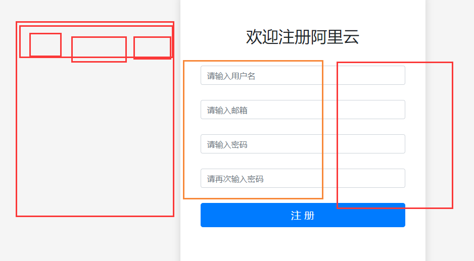

# 项目：阿里云登录注册_第一天

**主要内容**

* 项目搭建
* 登录界面
* 登录接口
* 存储用户信息

**学习目标**

 知识点| 要求 
 -| :- 
 项目搭建 | 掌握 
 登录界面 | 掌握 
 登录接口 | 掌握 
 存储用户信息 | 掌握 


## 一、项目搭建

创建项目：create-react-app react-aliyun

报错：


安装脚手架命令：

npm i create-react-app -g

再次创建项目：create-react-app react-aliyun


### 步骤：

1. 降版本

   ```bash
   npm i react@17 react-dom@17 -S
   
   降版本后，
   报错1解决：
   index.js里面'react-dom/client'改成'react-dom'
   // import ReactDOM from 'react-dom/client';
   import ReactDOM from 'react-dom';
   报错2解决：
   index.js里面把之前的脚手架配置拿过来替换，不然会报错
   // const root = ReactDOM.createRoot(document.getElementById('root'));
   // root.render(
   //   <React.StrictMode>
   //     <App />
   //   </React.StrictMode>
   // );   // 报错 替换成↓之前的脚手架版本文件↓ 就不报错了
   
   // ReactDOM.render(
   //     <App />,
   //   document.getElementById('root')
   // );
   ```

2. 装依赖

   ```bash
   npm i react-router-dom@5.3 axios  -S  #路由 和 axios
   （这里又报错了，尝试先降npm版本再装依赖，npm install npm@6.14.10 -g 这样就没问题了）
   
   npm i less less-loader@7 -S
   
   #redux
   npm i redux redux-logger react-redux  -S
   ```


### 项目初始化

1. 删除无用文件

2. 创建对应文件  components/ pages

3. css初始化文件  src/assets/css/base.css

4. 暴露webpack    关闭eslint 、关闭浏览器自启动、配置less  

   ```bash
   npm i less less-loader@7 -S 
   
   npm run eject
   
   关闭eslint：package.json
   "eslintConfig": {
       "extends": [
         "react-app",
         "react-app/jest"
       ],
       "rules": {
         "no-undef": "off",
         "no-restricted-globals": "off",
         "no-unused-vars": "off"
       }
   
   关闭浏览器自启动：/scripts/start.js
   // openBrowser(urls.localUrlForBrowser); // 131行 注释掉
   
   配置less：\config\webpack.config.js
   sass 72-76
   const sassRegex = /\.(scss|sass)$/;
   const sassModuleRegex = /\.module\.(scss|sass)$/;
   
   const lessRegex = /\.(less)$/;
   const lessModuleRegex = /\.module\.(less)$/;
   sass 507-548
   510-552-590
   {
                 test: sassRegex,
                 exclude: sassModuleRegex,
                 use: getStyleLoaders(
                   {
                     importLoaders: 3,
                     sourceMap: isEnvProduction
                       ? shouldUseSourceMap
                       : isEnvDevelopment,
                     modules: {
                       mode: 'icss',
                     },
                   },
                   'sass-loader'
                 ),
                 // Don't consider CSS imports dead code even if the
                 // containing package claims to have no side effects.
                 // Remove this when webpack adds a warning or an error for this.
                 // See https://github.com/webpack/webpack/issues/6571
                 sideEffects: true,
               },
               // Adds support for CSS Modules, but using SASS
               // using the extension .module.scss or .module.sass
               {
                 test: sassModuleRegex,
                 use: getStyleLoaders(
                   {
                     importLoaders: 3,
                     sourceMap: isEnvProduction
                       ? shouldUseSourceMap
                       : isEnvDevelopment,
                     modules: {
                       mode: 'local',
                       getLocalIdent: getCSSModuleLocalIdent,
                     },
                   },
                   'sass-loader'
                 ),
               },
   
   
   
               {
                 test: lessRegex,
                 exclude: lessModuleRegex,
                 use: getStyleLoaders(
                   {
                     importLoaders: 3,
                     sourceMap: isEnvProduction
                       ? shouldUseSourceMap
                       : isEnvDevelopment,
                     modules: {
                       mode: 'icss',
                     },
                   },
                   'less-loader'
                 ),
                 // Don't consider CSS imports dead code even if the
                 // containing package claims to have no side effects.
                 // Remove this when webpack adds a warning or an error for this.
                 // See https://github.com/webpack/webpack/issues/6571
                 sideEffects: true,
               },
               // Adds support for CSS Modules, but using SASS
               // using the extension .module.scss or .module.sass
               {
                 test: lessModuleRegex,
                 use: getStyleLoaders(
                   {
                     importLoaders: 3,
                     sourceMap: isEnvProduction
                       ? shouldUseSourceMap
                       : isEnvDevelopment,
                     modules: {
                       mode: 'local',
                       getLocalIdent: getCSSModuleLocalIdent,
                     },
                   },
                   'less-loader'
                 ),
               },
   ```
   
   

### 路由配置


### 页面布局（头部+注册）

关键点：

表单元素：受控组件


### 服务器搭建

前端 =》 后端（接受请求，数据库 ）JAVA、python、.net、php、nodejs =》前端

依赖： ==一定要在react-aliyun目录下下载！！！！！==

```bash
npm i express mysql jsonwebtoken -S

npm i validator lodash -S
```


### 网络请求，

接口请求函数封装  ：api/base.js   index.js

代理：

安装:  

npm  i http-proxy-middleware -S

src/setupProxy.js:

```js
const { createProxyMiddleware } = require('http-proxy-middleware');

module.exports = function (app) {
    app.use(
        '/foo',
        createProxyMiddleware({
            target: 'http://localhost:7788',
            changeOrigin: true,
            pathRewrite: {
                "^/foo": '',//路径重写
            }
        })
    );
};
```


前端： npm  i query-string -S

拼接post 请求参数：


### 注册、表单验证

React-classnames库：

https://www.cnblogs.com/suihang/p/10417755.html

npm i  classnames -S


validator地址：

https://www.jianshu.com/p/b86f675523f8

Github：

https://github.com/validatorjs/validator.js


https://www.lodashjs.com/


### 唯一性验证


### 1.1 项目安装依赖

```sh
npm install --save react-router-dom
npm install --save redux
npm install --save react-redux
npm install --save redux-devtools-extension
npm install --save axios
npm install --save lodash
npm install --save validator
npm install --save classnames
```


### 1.2 构建服务器

```sh
npm i -S express
npm i -S mysql
npm i -S jsonwebtoken

npm i express mysql jsonwebtoken -S
npm i validator lodash -S
```


validator地址：

https://www.jianshu.com/p/b86f675523f8

Github：

https://github.com/validatorjs/validator.js

React-classnames库：

https://www.cnblogs.com/suihang/p/10417755.html


### 1.3 路由配置



```js
import React, { Component } from 'react'
import { HashRouter as Router,Route,Switch } from "react-router-dom"
import App from "../pages/App"
import SignIn from "../pages/SignIn/SignInPage"
import SignUp from "../pages/SignUp/SignUpPage"

export default class AppRouter extends Component {
    render() {
        return (
            <Router>
                <HeaderNav />
                <FlashMessageList />
                <Switch>
                    <Route exact path="/" component={ App }></Route>
                    <Route path="/signin" component={ SignIn }></Route>
                    <Route path="/signup" component={ SignUp }></Route>
                </Switch>
            </Router>
        )
    }
}

```


## 二、登录界面

### 2.1 登录效果图


### 2.2 登录代码

```jsx
import React, { Component } from 'react'
import SignInForm from "./SignInForm"
import { connect } from "react-redux"
import { setUser } from "../../redux/actions/auth"

class SignInPage extends Component {
    /**
     * 栅格系统
     */
    render() {
        return (
            <div className="row">
                <div className="col-md-3"></div>
                <div className="col-md-6">
                    <SignInForm setUser={ this.props.setUser }/>
                </div>
                <div className="col-md-3"></div>
            </div>
        )
    }
}

const mapDispatchToProps = dispatch =>{
    return{
        setUser:(user) => dispatch(setUser(user)),
        addFlashMessage:(message) => dispatch(addFlashMessage(message)),
        delFlashMessage:(id) => dispatch(delFlashMessage(id))
    }
}

export default connect(null,mapDispatchToProps)(SignInPage)
```


表单模块

```jsx
import React, { Component } from 'react'
import api from "../../api"
import validator from "../../utils/validator"
import classnames from "classnames"
import { withRouter } from "react-router-dom"
import { REACT_LOCAL_LOGIN } from "../../utils/constants"

/**
 * classnames是React的一个资源库，主要用来处理css样式
 *     可以通过对象类型处理样式
 */
class SignInForm extends Component {

    constructor() {
        super();
        this.state = {
            username: "",
            password: "",
            errors:{}
        }
    }

    changeHandle = (e) => {
        this.setState({
            // ES6提供的动态key值
            [e.target.name]: e.target.value
        })
    }

    onSubmit = (e) => {
        e.preventDefault();
        /**
         * 先做数据存在与否的验证
         */
        let validatorLogin = validator({
            username: this.state.username,
            password: this.state.password
        })
        if (validatorLogin.isValid) {
            // 数据为空
            /**
             * setState是异步操作
             */
            this.setState({
                errors:validatorLogin.errors
            })
        } else {
            this.setState({
                errors:{}
            })
            api.login({
                username: this.state.username,
                password: this.state.password
            }).then(res => {
                if(res.data.status === 200){
                    // 提示框
                    this.props.addFlashMessage({
                        id:Math.random().toString().slice(2),
                        type:'success',
                        msg:"登陆成功，欢迎来到新大陆！！！"
                    })
                    // 写入到Redux中
                    this.props.setUser(res.data)
                    // 写入本地
                    localStorage.setItem(REACT_LOCAL_LOGIN,JSON.stringify(res.data));
                    // 编程式导航
                    this.props.history.replace('/')
                }else{
                    this.props.addFlashMessage({
                        id:Math.random().toString().slice(2),
                        type:'danger',
                        msg:res.data.msg
                    })
                }
            })
        }
    }

    render() {
        const { username, password,errors } = this.state;
        return (
            <div>
                <form onSubmit={this.onSubmit}>
                    <h1>WelCome in</h1>
                    <div className="form-group">
                        <label className="control-label">Username</label>
                        <input
                            value={username}
                            type="text"
                            className={ classnames('form-control',{ 'is-invalid' :errors.username }) }
                            name='username'
                            onChange={this.changeHandle}
                        />
                        {/* style接受的参数是一个对象类型:{ {} } */}
                        { errors.username ? <span style={{ color:'red',fontSize:'10px' }}>{ errors.username }</span> :"" }
                    </div>
                    <div className="form-group">
                        <label className="control-label">Password</label>
                        <input
                            value={password}
                            type="password"
                            name="password"
                            className={ classnames('form-control',{ 'is-invalid':errors.password }) }
                            onChange={this.changeHandle}
                        />
                        { errors.password ? <span style={{ color:'red',fontSize:'10px' }}>{ errors.password }</span> :"" }
                    </div>
                    <div className="form-group">
                        <button className="btn btn-primary btn-lg">登陆</button>
                    </div>
                </form>
            </div>
        )
    }
}


export default withRouter(SignInForm)
```


## 三、登录接口

### 3.1 后台接口

后数据库操作mysql.js

```js
const mysql = require("mysql");
const client = mysql.createConnection({
    host:"localhost",
    user:"root",
    password:"",
    database:"web1010"
})

/**
 * 执行数据库语句的方法
 *     query:执行数据库语句的方法
 *         参数1：数据库语句
 *         参数2：数据库语句参数
 *         参数3：数据库返回的结果callback(error,result)
 */

function clientFn(sql,arr,callback){
    client.query(sql,arr,(error,result) =>{
        if(error){
            console.log(error);
            return;
        }
        callback(result); // 回调函数
    })
}

module.exports = clientFn
```

入口文件index.js

```js
const express = require("express");
const app = express();
const router = require("./router");
const bodyParser = require("body-parser");
const cors = require("cors");


app.use(cors());  // 解决跨域
/**
 * post请求参数的处理方案
 */
app.use(bodyParser.urlencoded({
    extended:true
}))

app.use("/api",router);

app.listen(3300,() =>{
    console.log("服务器运行在3000端口上");
})
```

### 3.2 token流程


token ：令牌，标记是否登录成功

​	

### 3.3 登录接口

```js
router.post("/login",(req,res) =>{
    const username = req.body.username;
    const password = req.body.password;
    if(username && password){
        const sql = "select * from user where username=? and password=?"
        const arr = [username,password]
        clientFn(sql,arr,result =>{
            if(result.length > 0){
                /**
                 * 生成token
                 */
                const token = jwt.sign({
                    uid:result[0].id,
                    username:result[0].username
                },"jwtsomekeys") // jwtsomekeys：密钥，随便生成定义的一个字段
                res.send({
                    status:200,
                    token,
                    username:result[0].username
                })
            }else{
                res.send({
                    msg:"用户名密码错误",
                    status:401
                })
            }
        })
    }else{
        res.send({
            msg:'参数未获取',
            status:400
        })
    }
})
```

### 3.4 前后端交互

跨域配置文件:src/setupProxy.js

```js
const { createProxyMiddleware } = require('http-proxy-middleware');

module.exports = function (app) {
    app.use(
        '/api',
        createProxyMiddleware({
            target: 'http://localhost:3300',
            changeOrigin: true,
        })
    );
};
```

登录接口api

```js
import axios from "../utils/request"
import base from "./base"

const api = {
    /**
     * 登陆接口
     */
    login(params){
        return axios.post(base.baseUrl + base.login,params)
    },
}

export default api;
```

网络请求request.js

```js
import axios from "axios"
import store from "../redux/store"
import qs from "query-string" 
// nodejs提供的  query-string; cnpm install --save-dev query-string

/**
 * 处理失败的方法
 *     status:状态
 *     info:错误信息
 */
const errorHandle = (status,info) =>{
    switch(status){
        case 400:
            console.log("表示请求报文中存在语法错误");
            break;
        case 401:
            console.log("未经许可，需要通过HTTP认证");
            break;
        case 403:
            console.log("服务器拒绝该次访问（访问权限出现问题）");
            break;
        case 404:
            console.log("表示服务器上无法找到请求的资源");
            break;
        case 500:
            console.log("表示服务器在执行请求时发生了错误");
            break;
        case 503:
            console.log("表示服务器暂时处于超负载或正在进行停机维护");
            break;
        default:
            console.log(info);
            break;
    }
}


/**
 * 创建axios实例对象
 */

const instance = axios.create({
    // 全局配置
    // baseURL:"http://iwenwiki.com",
    timeout:5000
})

/**
 * 配置拦截器
 */
instance.interceptors.request.use(
    config =>{
        if(config.method === "post"){
            /**
             * { username:"iwen",password:123 }
             * username=iwen&password=123
             */
            config.data = qs.stringify(config.data)
        }
        // store.getState()：直接读取到redux中的数据，state对象
        if(store.getState().auth.user.token){
            // 设置请求头信息
            config.headers.authorization = store.getState().auth.user.token
        }
        return config;
    },
    error => Promise.reject(error)
);


instance.interceptors.response.use(
    // 完成了
    response => response.status === 200 ? Promise.resolve(response) : Promise.reject(response),
    // 未完成
    error =>{
        const { response } = error;
        errorHandle(response.status,response.info)
    }
);

export default instance
```


## 四、存储用户信息

### 4.1 Readux仓库

store

```js
import { createStore } from "redux"
import rootReducer from "../reducers"
import { composeWithDevTools } from "redux-devtools-extension"

const store = createStore(rootReducer,composeWithDevTools())

export default store;
```

reducers

```js
import { SETUSER } from "../constants"

const initState = {
    user: {}
}

const auth = (state = initState, action) => {
    switch (action.type) {
        case SETUSER:
            return {
                user: action.user
            }
        default:
            return state;
    }
}

export default auth
```

actions

```js
import { SETUSER } from "../constants"

export function setUser(user){
    return{
        type:SETUSER,
        user
    }
}
```

constants

```js
export const SETUSER = "SETUSER"
export const ADD_FLASH = "ADD_FLASH"
export const DEL_FALSH = "DEL_FALSH"
```


### 4.2 登录界面

constants

```js
export const REACT_LOCAL_LOGIN = "REACT_LOCAL_LOGIN"
```

SignInForm组件

```jsx
import React, { Component } from 'react'
import api from "../../api"
import validator from "../../utils/validator"
import classnames from "classnames"
import { withRouter } from "react-router-dom"
import { REACT_LOCAL_LOGIN } from "../../utils/constants"

/**
 * classnames是React的一个资源库，主要用来处理css样式
 *     可以通过对象类型处理样式
 */
class SignInForm extends Component {

    constructor() {
        super();
        this.state = {
            username: "",
            password: "",
            errors:{}
        }
    }

    changeHandle = (e) => {
        this.setState({
            // ES6提供的动态key值
            [e.target.name]: e.target.value
        })
    }

    onSubmit = (e) => {
        e.preventDefault();
        /**
         * 先做数据存在与否的验证
         */
        let validatorLogin = validator({
            username: this.state.username,
            password: this.state.password
        })
        if (validatorLogin.isValid) {
            // 数据为空
            /**
             * setState是异步操作
             */
            this.setState({
                errors:validatorLogin.errors
            })
        } else {
            this.setState({
                errors:{}
            })
            api.login({
                username: this.state.username,
                password: this.state.password
            }).then(res => {
                if(res.data.status === 200){
                    // 提示框
                    this.props.addFlashMessage({
                        id:Math.random().toString().slice(2),
                        type:'success',
                        msg:"登陆成功，欢迎来到新大陆！！！"
                    })
                    // 写入到Redux中
                    this.props.setUser(res.data)
                    // 写入本地
                    localStorage.setItem(REACT_LOCAL_LOGIN,JSON.stringify(res.data));
                    // 编程式导航
                    this.props.history.replace('/')
                }else{
                    this.props.addFlashMessage({
                        id:Math.random().toString().slice(2),
                        type:'danger',
                        msg:res.data.msg
                    })
                }
            })
        }
    }

    render() {
        const { username, password,errors } = this.state;
        return (
            <div>
                <form onSubmit={this.onSubmit}>
                    <h1>WelCome in</h1>
                    <div className="form-group">
                        <label className="control-label">Username</label>
                        <input
                            value={username}
                            type="text"
                            className={ classnames('form-control',{ 'is-invalid' :errors.username }) }
                            name='username'
                            onChange={this.changeHandle}
                        />
                        {/* style接受的参数是一个对象类型:{ {} } */}
                        { errors.username ? <span style={{ color:'red',fontSize:'10px' }}>{ errors.username }</span> :"" }
                    </div>
                    <div className="form-group">
                        <label className="control-label">Password</label>
                        <input
                            value={password}
                            type="password"
                            name="password"
                            className={ classnames('form-control',{ 'is-invalid':errors.password }) }
                            onChange={this.changeHandle}
                        />
                        { errors.password ? <span style={{ color:'red',fontSize:'10px' }}>{ errors.password }</span> :"" }
                    </div>
                    <div className="form-group">
                        <button className="btn btn-primary btn-lg">登陆</button>
                    </div>
                </form>
            </div>
        )
    }
}


export default withRouter(SignInForm)
```


### 4.3 持久化

index.js

```js
import React from 'react';
import ReactDOM from 'react-dom';
import AppRouter from "./router";
import store from "./redux/store";
import { Provider } from "react-redux"
import { REACT_LOCAL_LOGIN } from "./utils/constants"
import { SETUSER } from "./redux/constants"

if(localStorage.getItem(REACT_LOCAL_LOGIN)){
  /**
   * 本地数据存入到Redxu
   * 触发redux的actions方法是dispatch
   */
  store.dispatch({
    type:SETUSER,
    user:JSON.parse(localStorage.getItem(REACT_LOCAL_LOGIN))
  })
}

ReactDOM.render(
  <Provider store={ store }>
    <AppRouter />
  </Provider>,
  document.getElementById('root')
);

```


