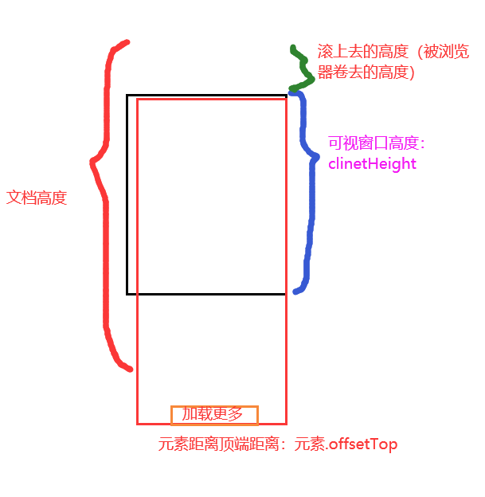

# 项目：livegoods房屋海选平台_第三天

**主要内容**

* 搜索框
* 搜索功能实现
* 再次搜索功能
* 滚动加载更多

**学习目标**

 知识点| 要求 
 -| :- 
 搜索框 | 掌握 
 搜索功能实现 | 掌握 
 再次搜索功能 | 掌握 
 滚动加载更多 | 掌握 


## 一、搜索框

### 1.1 搜索界面效果

​	


效果：输入内容，回车，跳转到搜索界面；继续搜索

步骤：

1. 新建搜索组件 Search==>路由组件，添加路由配置，传参数  /serach/:val  

   路由组件获取参数：{props.match.params.val}

2. 提取公共组件 CommonHeader（城市选择界面、搜索界面共用）

3. 搜索界面获取动态数据

4. 搜索界面文本框同步显示搜索内容


### 1.2 代码实现

搜索组件

```jsx
import React from 'react'
import CommonHeader from '../../components/CommonHeader/CommonHeader'
import MyInput from '../../components/MyInput/MyInput'

export default function Search(props) {
    console.log('props',props);
    return (
        <div>
            {/* 公共的顶部文件 */}
            <CommonHeader>
                <MyInput/>
            </CommonHeader>

            <p>获取输入的搜索字段：{props.match.params.keyword}</p>
        </div>
    )
}

```

输入框回车事件

```jsx
import React,{useState} from 'react'
// import { Input } from 'antd';
import {useHistory} from 'react-router-dom'
import './style.less'
export default function MyInput() {
    //声明变量
    const [val,setVal] = useState('')
    const history = useHistory();
    //获取表单输入的值
    function getInput(e){
        setVal(e.target.value)
    }
    //定义键盘事件
    function getSearch(e){
        if(e.keyCode ===13){
            //跳转页面
            history.push('/search/'+val)
        }
    }
    return (
        <div>
            <input type='text' 
                value={val} onChange={getInput} 
                onKeyUp={getSearch}
                className='myInput' placeholder='请输入内容'/>
            {/* <Input placeholder="请输入内容" className='input' /> */}
        </div>
    )
}

```


## 二、搜索功能实现

### 2.1 静态布局

​	

```jsx
import React from 'react'
import './style.less'
export default function List(props) {
    return (
        <div>
            {/* 静态布局 */}
        <div className='search-item'>
                
                <div className='info'>
                    <div className='address'>
                        <p>标题</p>
                        <p className='bottom'>楼层：谢谢谢谢</p>
                    </div>
                    <div className='right'>
                        <p className='type'>整租</p>
                        <p className='price bottom'>3000/月</p>
                    </div>
                </div>
            </div> 


        </div>
    )
}

```

样式

```less

.search-item{
    width: 100%;
    height: 3.45rem;
    position: relative;
    margin-bottom: 0.2rem;
    img{
        width: 100%;
        height: 100%;
    }
    .info{
        background: rgba(255,255,255,0.8);
        color: #000;
        position: absolute;
        bottom:0;
        right:0;
        left:0;
        display: flex;
        padding:0.1rem;
        font-size: 0.3rem;
        .bottom{
            padding-top: 0.06rem;
        }
        .address{
            flex: 3;
            padding-left: 0.5rem;
            // font-weight: bold;
        }
        .right{
            flex: 1;
            .type{
                color: #41868f;
                border:1px solid #41868f;
                width: 1.2rem;
                height: 0.48rem;
                line-height: 0.48rem;
                text-align: center;
                display: inline-block;
                border-radius: 0.06rem;
            }
            .price{
                color: #ff5555;
            }
        }
    }
}
```


### 2.2 后台接口

```js
//搜索房源接口
router.get('/search', (req, res) => {
    let city = req.query.city;
    let keyword = req.query.val;
    let page = req.query.page || 0; 
    res.send(Mock.mock({
        success: true,
        nextPage: +page + 1,
        'list|10': [{
            'img|1': [ 
                'http://iwenwiki.com/api/livable/search/1.jpg',
                'http://iwenwiki.com/api/livable/search/2.JPG',
                'http://iwenwiki.com/api/livable/search/3.jpg',
                'http://iwenwiki.com/api/livable/search/4.JPG',
                'http://iwenwiki.com/api/livable/search/5.jpg',
                'http://iwenwiki.com/api/livable/search/6.jpg',
            ],
            "id|+1": 200, 
            title: city + keyword + '- @cword(5,8)', //房源信息
            'zong|6-32': 1, 
            'cur|1-32': 1, 
            floor: function () { //楼层 层数/总高  
                if (this.zong >= this.cur) {
                    return this.cur + '/' + this.zong
                } else {
                    return this.zong + '/' + this.cur
                }
            },
            'huxing|1': ['一室一厅', '两室一厅', '三室两厅'], //户型
            'area|60-150.2': 1, //总面积
            'chuzu|1': ['整租', '合租'], //出租类型
            'price|2900-20000': 1, //租金
        }]
    }))
})
```


### 2.3 动态数据实现

```jsx
import React from 'react'
import './style.less'
export default function List(props) {
    return (
        <div>
            {
                props.list.map(ele => {
                    return <div key={ele.id} className='search-item'>
                        
                        <div className='info'>
                            <div className='address'>
                                <p>{ele.title}</p>
                                <p className='bottom'>楼层:{ele.floor} {ele.huxing} {ele.area}</p>
                            </div>
                            <div className='right'>
                                <p className='type'>{ele.chuzu}</p>
                                <p className='price bottom'>{ele.price}/月</p>
                            </div>
                        </div>
                    </div>

                })
            }
        </div>
    )
}
```


## 三、再次搜索功能

### 3.1 搜索数据不同步效果

​	


### 3.2 实现代码

搜索组件

```jsx
import React,{useState,useEffect} from 'react'
import CommonHeader from '../../components/CommonHeader/CommonHeader'
import MyInput from '../../components/MyInput/MyInput'
import List from './SearchList/List'
import { getSearch } from '../../api/index'
import { connect } from 'react-redux'
function Search(props) {
    //定义房源容器
    const [list,setList] = useState([])
    //生命周期
    useEffect(()=>{
        getSearch({
            city:props.city,
            val:props.match.params.keyword,
            page:0
        })
        .then(res=>{
            console.log('搜索房源数据列表',res.data);
            setList(res.data.list)
        })
    },[props.match.params.keyword])

    return (
        <div>
            {/* 公共的顶部文件 */}
            <CommonHeader>
                <MyInput kw={props.match.params.keyword} />
            </CommonHeader>

            <p>获取输入的搜索字段：{props.match.params.keyword}</p>

            {/* 获取列表数据 */}
            <List list={list}/>
        </div>
    )
}


export default  connect(state=>{
    return {
        city:state.citys
    }
})(Search)
```

输入框组件

```jsx
 //生命周期函数
    useEffect(()=>{
        if(props.kw){
            setVal(props.kw) 
        }
    },[props.kw])
```


## 四、滚动加载更多

分页功能：

1、点击，加载下一页数据

2、滚动到页面底部，请求下一页数据



clinetHeight+scrollTop>=元素.offsetTop


步骤：

1、创建一个共用加载更多组件  LoadMore.jsx

2、文档底部元素（加载更多按钮）到了浏览器低端，来触发事件

- ​	滚动事件   sroll
- clinetHeight+scrollTop>=元素.offsetTop


### 4.1 效果展示

​	


### 4.2 实现代码

加载更多组件

```jsx
import React, { useRef, useEffect } from 'react'

export default function LoadMore(props) {
    //定义ref
    const myref = useRef();
    //定义开关
    let flag = true;
    //生命周期
    useEffect(() => {
         //1.获取元素距离顶部的高度
        let offsetHeight = myref.current.offsetTop;
        //2.窗口的高度
        let height = document.documentElement.clientHeight;
        //3. 监听滚动下拉事件
        window.addEventListener('scroll', scrollFun)
        function scrollFun() {
            //4. 获取滚动的高度
            let scrollHeight = document.documentElement.scrollTop;
            //5. 判断当前是否加载更多数据
            if((offsetHeight<= height + scrollHeight) && flag ){
                flag= false;
                console.log('---------加载更多数据了----------');
                props.getData();
            }
        }
        return ()=>{
            window.removeEventListener('scroll',scrollFun)
        }

    })

    return (
        <div>
            <div ref={myref}>加载更多</div>
        </div>
    )
}

```

搜索组件

```jsx
import React,{useState,useEffect} from 'react'
import CommonHeader from '../../components/CommonHeader/CommonHeader'
import MyInput from '../../components/MyInput/MyInput'
import List from './SearchList/List'
import { getSearch } from '../../api/index'
import { connect } from 'react-redux'
//导入下载加载更多的组件
import LoadMore from '../../components/LoadMore/LoadMore'

function Search(props) {
    //定义房源容器
    let [list,setList] = useState([])
    //定义一个页码 
    let [page,setPage] = useState(0);

    //网络请求的方法
    function http(){
        getSearch({
            city:props.city,
            val:props.match.params.keyword,
            page
        })
        .then(res=>{
            console.log('搜索房源数据列表',res.data);
            //拼接获取的数据：老数据 + 新数据
            setList([...list,...res.data.list])
            //下一页的数据
            setPage(page + 1)
        })
    }
    //生命周期
    useEffect(()=>{
        //进行网络请求
        //清空数据
        list=[]
        page =0
        http();
    },[props.match.params.keyword])
    

    return (
        <div>
            {/* 公共的顶部文件 */}
            <CommonHeader>
                <MyInput kw={props.match.params.keyword} />
            </CommonHeader>

            <p>获取输入的搜索字段：{props.match.params.keyword}</p>

            {/* 获取列表数据 */}
            <List list={list}/>

            {/* 公共的下载加载更多组件 */}
            <LoadMore getData={http}/>

        </div>
    )
}


export default  connect(state=>{
    return {
        city:state.citys
    }
})(Search)
```

