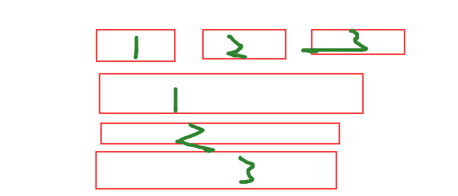

# 项目：livegoods房屋海选平台_第四天

**主要内容**

* 房源详情页
* 房源评论

**学习目标**

 知识点| 要求 
 -| :- 
 房源详情页 | 掌握 
 房源评论 | 掌握 


## 一、房源详情页

步骤：

1. 新建HouseDetail.jsx 路由组件，配置路由 ，动态路由传参
2. House组件添加路由链接（标签式导航；编程式导航），HouseDetail.jsx静态布局


### 1.1 效果图

​	


### 1.2 代码实现

首页列表跳转组件

```jsx
import React from 'react'
import styles from './style.module.less'
// import banner1 from '../../../assets/images/banner1.png'
import { Link,useHistory } from 'react-router-dom'
export default function HotHouse(props) {
    const history = useHistory();
    //跳转详情页面
    function goDetail(id){
        // console.log(id);
        history.push('/detail/'+id)   
    }
    return (
        <div>
            <h3 className={styles.title}>热门房源</h3>
            <ul className={styles.list}>
                {
                    props.list.map(ele => {
                        return <li key={ele.id} onClick={goDetail.bind(null,ele.id)}>
                                    
                                    <div className={styles.info}>
                                        <div className={styles.desc}>
                                            <p>{ele.address}</p>
                                            <p>{ele.huxing}-{ele.area}m</p>
                                        </div>
                                        <div className={styles.type}>
                                            <a href="##" className={styles.zu}>{ele.chuzu}</a>
                                            <p>{ele.price}/月</p>
                                        </div>
                                    </div>
                        </li>
                    })
                }

            </ul>
        </div>
    )
}

```

详情页组件

```jsx
import React from 'react'

export default function Detail(props) {
    return (
        <div>
            <h2>商品详情页</h2>
            <p>获取房源的详情信息标识id:{ props.match.params.id }</p>
            {/* 获取动态数据---商品详情 */}
            
        </div>
    )
}
```


### 1.3 详情页后台接口

```js

//接口5：房屋详情--信息接口
router.get('/houseInfo', (req, res) => {
    let id = req.query.id;
    res.send(Mock.mock({
        success: true,
        id,
        info: {
            title: '@cword(5,10)',
            'price|2900-10000': 1,
            'huxing|1': ['一室一厅', '两室一厅', '三室两厅'],
            'area|60-150.2': 1,
            'zong|6-32': 1,
            'cur|1-32': 1,
            floor: function () {
                if (this.zong >= this.cur) {
                    return this.cur + '/' + this.zong
                } else {
                    return this.zong + '/' + this.cur
                }
            },
            'chaoxiang|1': ['朝东', '朝西', '朝南', '朝北', '南北通透'],
            'zhuangxiu|1': ['精装', '简装', '毛坯'],
            'year|1985-2020': 1,
        },
        "banner|6": [{
            'imgUrl|1': [
                'http://iwenwiki.com/api/livable/details/1.jpg',
                'http://iwenwiki.com/api/livable/details/2.jpg',
                'http://iwenwiki.com/api/livable/details/3.jpg',
                'http://iwenwiki.com/api/livable/details/4.jpg',
                'http://iwenwiki.com/api/livable/details/5.jpg',
                'http://iwenwiki.com/api/livable/details/6.jpg',
                'http://iwenwiki.com/api/livable/details/7.jpg',
                'http://iwenwiki.com/api/livable/details/8.jpg',
                'http://iwenwiki.com/api/livable/details/9.jpg',
                'http://iwenwiki.com/api/livable/details/10.jpg',
                'http://iwenwiki.com/api/livable/details/11.jpg',
                'http://iwenwiki.com/api/livable/details/12.jpg',
                'http://iwenwiki.com/api/livable/details/13.jpg',
            ]
        }]
    }))
})

```

### 1.4 详情页组件

​	

代码演示

```jsx
import React, { useState, useEffect } from 'react'
import CommonHeader from '../../components/CommonHeader/CommonHeader'
import { getHouseInfo } from '../../api/index'
import MySwiper from '../../components/MySwiper/MySwiper'
import { Tabs } from 'antd';
import './detail.less'

const { TabPane } = Tabs;

export default function Detail(props) {
    //定义容器
    const [banner, setBanner] = useState([])
    const [info, setInfo] = useState({})

    //生命周期函数
    useEffect(() => {
        getHouseInfo({
            id: props.match.params.id
        })
            .then(res => {
                console.log('房源详情信息---', res.data);
                //存储数据信息 1. 轮播数据  2. 房源信息
                setBanner(res.data.banner)
                setInfo(res.data.info)
            })

    }, [])

    return (
        <div>
            {/* 1. 公共的顶部区域 */}
            <CommonHeader>详情页</CommonHeader>

            <p>获取房源的详情信息标识id:{props.match.params.id}</p>

            {/* 获取动态数据---商品详情 */}
            {/* 2. 轮播图 */}
            <MySwiper banner={banner} />

            {/* 3. 房源信息 1. antd库-选项卡   2. 自己写选项卡  3. 自己封装一个tabs组件 */}
            <Tabs id='mytabs' defaultActiveKey="1" centered>
                <TabPane tab="房源信息" key="1">
                    <div className='house-info'>
                        <div className='house-item'>
                            <p>{info.price}/月</p>
                            租金
                        </div>
                        <div className='house-item'>
                            <p>{info.huxing}</p>
                            户型
                        </div>
                        <div className='house-item'>
                            <p>{info.area}</p>
                            面积
                        </div>
                    </div>
                    <div className='house-xinxi'>
                        <p>标题：{info.title}</p>
                        <p>装修：{info.zhuangxiu}</p>
                        <p>楼层：{info.floor}</p>
                    </div>
                </TabPane>
                <TabPane tab="评论信息" key="2">
                    评论信息数据
                </TabPane>
            </Tabs>

            {/* 收藏和购买 */}
            <div className='house-bottom'>
                <div className='house-detail'>
                    <div>
                      收藏
                    </div>
                    <div className=''>购买</div>
                </div>
            </div>


        </div>
    )
}

```


## 二、房源评论


### 2.1 效果图

​	


### 2.2 评论信息接口

```js
//接口6： 房屋的评价信息
router.get('/comment',(req,res)=>{
    let id = req.query.id;
    let page = req.query.page;
    res.send(Mock.mock({
        id,
        success:true,
        nextPage : +page + 1,
        'list|5':[
            {
                id,
                tel:/1\d{10}/,//手机号
                'star|1-5':1,//星星的个数 1-5 高亮
                content:'@cword(20,50)'//评论的文字描述
            }
        ]
    }))
});

```


### 2.3 评论信息

```jsx
import React from 'react'
import './comment.less'
import { Rate } from 'antd';
import tellPhone from '../../../utils/phone'
export default function CommentInfo(props) {
    return (
        <div>
            {/* 评论数据list列表 */}
           {
               props.list.map((ele,index)=>{
                   return  <div className='comment-list' key={index}>
                        <p>电话：{tellPhone(ele.tel)}</p>
                        <div>星星：{ele.star} - <Rate disabled defaultValue={ele.star} /></div>
                        <p>评论内容：{ele.content}</p>
                    </div>
               })
           }
           
        </div>
    )
}

```


### 2.4 封装tabs组件

1、参考antd  选项卡结构---用法

```jsx
  <Tabs defaultActiveKey="1" onChange={callback}>
    <TabPane tab="Tab 1" key="1">
      Content of Tab Pane 1
    </TabPane>
    <TabPane tab="Tab 2" key="2">
      Content of Tab Pane 2
    </TabPane>
    <TabPane tab="Tab 3" key="3">
      Content of Tab Pane 3
    </TabPane>
  </Tabs>
```

2、自定义选项卡---用法

```jsx
<MyTabs  defaultActiveKey="1" onChange={callback}>
    <div tab="标题1" key="1">内容1</div>
    <div tab="标题2" key="2">内容2</div>
    {/*.。。。*/}
</MyTabs>
```

3、真实结构

```html
<div>
    <div class='nav'>
        <div>
            标题1
        </div>
        <div>
            标题2
        </div>
    </div>
    <div class='content'>
        <div>
            内容1
        </div>
        <div>
            内容2
        </div>
        
    </div>
    
</div>
```





```jsx
import React from 'react'
import './style.less'
export default function MyTabs(props) {
    console.log(props);
    //定义函数
    function changeKey(val){
        //修改props.defaultActiveKey 不能直接修改  通知父组件修改或者调用父组件修改的方法
        props.onChange(val)
    }
    return (
        <div>
            {/* 导航 */}
            <div className='tab-header'>
                {
                    props.children.map((ele,index)=>{
                        return <div className={props.defaultActiveKey == ele.key?'active':''} 
                                key={ele.props.tab}
                                // 给导航标签添加事件 点击谁谁高亮 ：修改props.defaultActiveKey=ele.key
                                onClick={changeKey.bind(null,ele.key)}
                                >{ele.props.tab}</div>
                    })
                }
            </div>
            {/* 内容 */}
            <div className='tab-content'>
                {
                    props.children.map((ele,index)=>{
                        return <div key={index} 
                        className={props.defaultActiveKey == ele.key?'show':''}>{ele.props.children}</div>
                    })
                }
            </div>
        </div>
    )
}

```


### 2.5 评论加载更多

```jsx
 {/* 加载更多 */}
 <LoadMore getData={getData}/>
```


