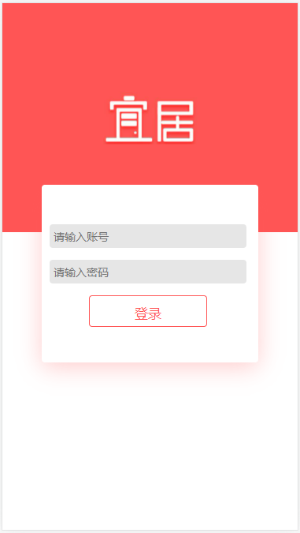

# 项目：livegoods房屋海选平台_第五天

**主要内容**

* 登录界面
* 收藏状态存储
* 购物车列表
* 购物车评论

**学习目标**

 知识点| 要求 
 -| :- 
 登录界面 | 掌握 
 收藏状态存储 | 掌握 
 购物车列表 | 掌握 
 购物车评论 | 掌握 

## 一、登录界面

### 1.1 效果图





步骤:

1. 新建路由组件 Login.jsx，布局，路由配置；路由导航
2. 点击登录，校验用户名和密码，发送后台（验证），校验成功：token、用户名；不成功：返给错误信息
3. 成功：
   1. 把用户信息存到Redux（token,用户名，islogin）
   2. 登录信息持久化到本地
   3. 跳转页面


### 1.2 代码演示

```jsx
import React, { useRef } from 'react'
import './style.less'
import logo from '../../assets/images/logo.jpg'
import {connect} from 'react-redux'
 function Login(props) {
    //创建ref 
    let myref = useRef()
    //登录按钮事件
    function login(){
        //思路：1. 点击按钮获取输入的账号 2. 校验账号和密码密码  3. 登录成功-把用户信息存储redux 
        console.log('输入的值：',myref.current.value);
        let uname = myref.current.value;
        //登录成功-把用户信息存储redux 
        props.changeUser(uname);
        //持久化
        localStorage.setItem('user',uname);
        //返回上一个界面
        props.history.goBack();
    }
    return (
        <div>
            <div className='login-bg'>
                
            </div>
            <div className='login-box'>
                <div>
                    {/* 受控组件:value={} onChange={}   非受控:获取dom元素 ref  */}
                    <input className='inp' type="text" ref={myref} placeholder='请输入账号' />
                </div>
                <div>
                    <input className='inp' type="text" placeholder='请输入密码' />
                </div>
                <button onClick={login}>登录</button>
            </div>

        </div>
    )
}

export default connect(null,dispatch=>{
    return {
        changeUser:(val)=>dispatch({type:'setUser',payload:val})
    }
})(Login)
```


## 二、收藏状态存储

### 2.1 效果图

​	


1. 点击收藏，去判断：用户是否登录：
   1. 如果登录了，==再去发请求，带着用户名，房屋id，去验证该房源有没有被收藏==
      1. true：已收藏
      2. false：收藏
   2. 如果没有登录：跳登录页


### 2.2 代码实现

```jsx

            {/* 收藏和购买 */}
            <div className='house-bottom'>
                <div className='house-detail'>
                    {/* 点击收藏按钮：判断当前是否登录 如果没有登录进入登录界面  */}
                    <div onClick={goCollection}>
                        {isCollection ? '已收藏' : '收藏'}
                    </div>
                    <div className=''>购买</div>
                </div>
            </div>
```


```jsx
 //收藏按钮事件---------------------------
    function goCollection() {
        //1.判断当前用户是否登录 用户信息=redux 
        console.log('当前用户名：', props.username);
        if (props.username) {
            console.log('登录过，进行收藏或者已收藏');
            //2. 继续判断当前在登录的情况下 当前的房源的收藏状态(获取本地的存储id)
            let collections = localStorage.getItem('collections');
            if (collections) {
                console.log('本地有存储的id数据');
                collections = JSON.parse(collections);
            } else {
                collections = []
            }
            console.log('存储的id数据', collections);
            //2.2 判断当前的存储的状态  isCollection
            if (isCollection) {//true 已收藏状态 点击的时候取消收藏 删除本地存储的收藏id  同时修改收藏状态
                console.log('取消收藏');
                //信息提示--- 
                let isShow = window.confirm('确定要取消收藏吗？');
                if (isShow) {
                    let index = collections.indexOf(params.id);
                    collections.splice(index, 1);
                    setCollection(false);
                }
            } else {//false  没有收藏 点击的时候把id存储到本地收藏数组里面 同时修改收藏状态
                collections.push(params.id)
                setCollection(true);
            }
            //2.3 重新存储最新的数据收藏数据id 
            localStorage.setItem('collections', JSON.stringify(collections));

        } else {
            console.log('用户没有登录过 请登录--跳转到登录界面');
            history.push('/login')
        }
    }
```


## 三、购物车列表


### 3.1 效果图

​	


步骤：

1. 新建路由组件  Cart.jsx 配置路由
2. 添加路由链接
3. 权限管理：验证是否登录过，否则，进登录页


### 3.2 代码演示

代码演示

```jsx
import React,{useState,useEffect} from 'react'
import CommonHeader from '../../components/CommonHeader/CommonHeader'
import {connect} from 'react-redux'
import ShopList from './ShopList/ShopList'
import {getShopcar} from '../../api/index'

function ShopCar(props) {
    let [list,setList] = useState([])
    //生命周期
    useEffect(()=>{
        getShopcar({
            user:props.username
        })
        .then(res=>{
            console.log(res);
            setList(res.list)
        })
    },[])
    return (
        <div>
            {/* 公共顶部 */}
            <CommonHeader>
                房源评论
            </CommonHeader>
            {/* 获取用户名称 和 所在城市 redux数据 */}
            <div className='shopcar-info'>
                <p>用户名：{props.username}</p>
                <p>所在城市：{props.city}</p>
            </div>

            {/* 购物车- 列表 评价信息 */}
            <ShopList list={list}/>

        </div>
    )
}

export default connect(state=>{
    return {
        city:state.city,
        username:state.user.username
    }
})(ShopCar)
```


列表组件

```jsx
import React,{useState} from 'react'
import ShopCommit from '../ShopCommit/ShopCommit'
import './shoplist.less'

export default function ShopList(props) {
    let [isShow,setIsshow] = useState(false);//隐藏评论区域
    let [current,setCurrent] = useState(1)

    function goCommit(id){
        console.log('-----------',id);
        setCurrent(id);
    }
    function changeIscommit(index){
        props.list[index].iscommit=true 
    }

    return (
        <>
            {
                props.list.map((ele,index)=>{//[{iscommit},{}]
                    return <div key={index} className='shoplist'>
                            <div className='shoplist-item' >
                                
                                <div className='shoplist-info'>
                                    <p>标题：{ele.title}</p>
                                    <p>户型：{ele.huxing}</p>
                                    <p>价格：{ele.price}/月</p>
                                </div>
                                <div className='ping'>
                                    {
                                        ele.iscommit?<div className='gray'>已评论</div>:<div onClick={goCommit.bind(null,ele.id)}>评论</div>
                                    }
                                </div>
                            </div>
                            <p>current:{current} ele.id:{ele.id}</p>
                        {
                            
                            current == ele.id ?<ShopCommit changeCurrent={goCommit}
                                changeIscommit={changeIscommit}
                                index={index}
                            />:''
                        }
                        
                    </div>
                })
            }
        </>
    )
}

```

样式

```less
.shoplist{
    margin-top: 0.2rem;
    border-bottom: 1px solid #eee;
    padding-bottom: 0.1rem;
}
.shoplist-item{
    display: flex;
  
    .shop-img{
        width: 3rem;
    }
    .shoplist-info{
        width: 3rem;
        margin-left: 0.2rem;
    }
    .ping{
        width: 1.3rem;
        display: flex;
        align-items: center;
        >div{
            color: #fff;
            width: 1.1rem;
            padding-top:0.1rem;
            padding-bottom:0.1rem;
            display: inline-block;
            text-align: center;
            background: #ff5555;
        }
        .gray{
            background: #999;
        }
        
    }
}
```


## 四、购物车评论

### 4.1 效果图

​	


### 4.2 代码演示

```jsx
import React,{useState} from 'react'
import { Rate,Input } from 'antd';
import './style.less'
const { TextArea } = Input;

export default function ShopCommit(props) {
    let [val,setVal] = useState('')
    let [num,setNum] = useState(0)
    //文本框输入的值
    function getTextArea(e){
        setVal(e.target.value);
    }
    //获取星星
    function getStar(val){
        setNum(val)
    }   
     //点击提交按钮事件-------------
    function goSubmit(){
        console.log('输入框值：',val);
        console.log('星星',num);
        if(val !=='' && num>0){
            props.changeCurrent(1);
            props.changeIscommit(props.index);

        }else{
            alert('输入信息或者星星评论')
        }

    }
    //取消
    function handleCancel(){
        props.changeCurrent(1);
    }
    return (
        <div>
            {/* 文本框 */}
           <div style={{padding:'0.2rem'}}>
                <TextArea rows={3} value={val} onChange={getTextArea} />
           </div>
            {/* 星星 */}
            <div>
                <Rate value={num} onChange={getStar} />
            </div>

            {/* 按钮 */}
            <div>
                <button onClick={goSubmit}>提交</button>
                <button onClick={handleCancel}>取消</button>
            </div>

        </div>
    )
}


```

样式

```less
.hide{
    display: none;
}
.show{
    display: block;
}
```

