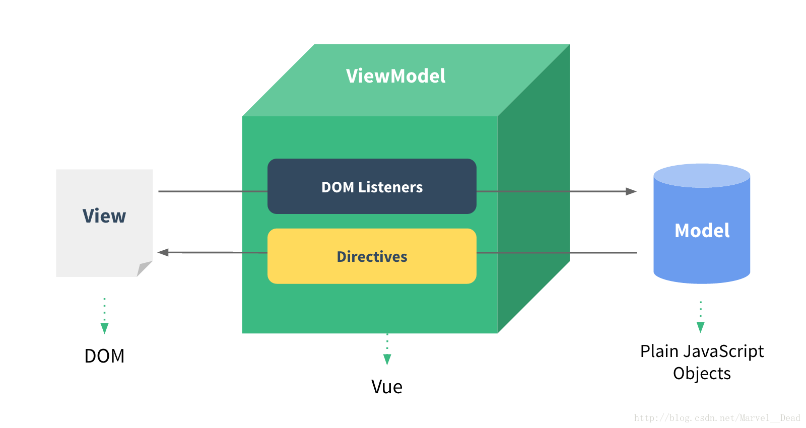
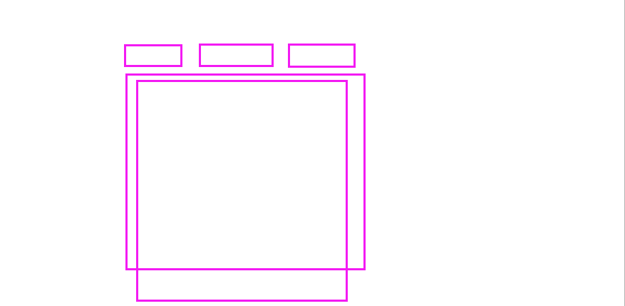
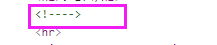
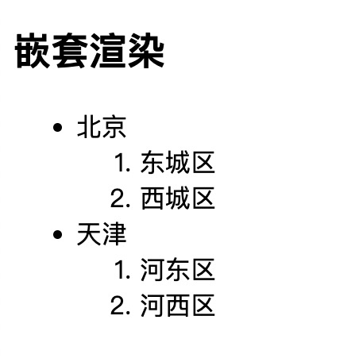
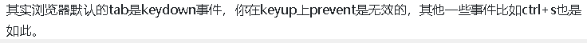
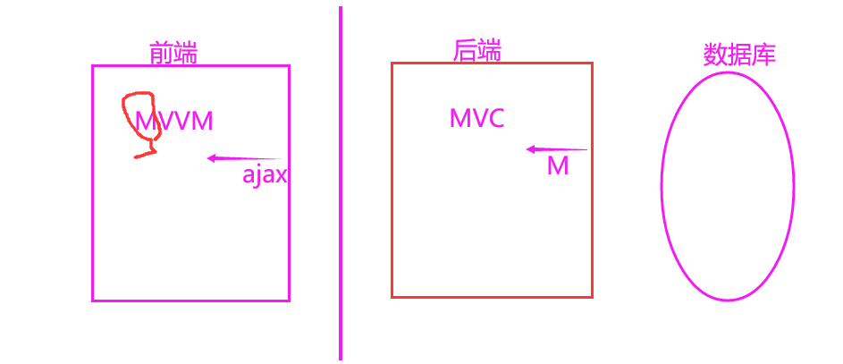

董蒙蒙  就业

要求：反馈


# Vue 指令第一天

**主要内容**

* 框架安装
* 项目创建
* 基础语法
* 事件绑定

**学习目标**

 知识点| 要求 
 -| :- 
 框架安装 | 掌握 
 项目创建 | 掌握 
 模板语法 | 掌握 
 事件绑定 | 掌握 

## 一、框架知识介绍

### 1、为什么要学习流行框架？

企业为了提高开发效率

开发人员：提高了开发效率

JS=>JQuery=>模板引擎=>框架时代（Angular(2+)、React、Vue）【好处：不用直接操作DOM，更多关注业务逻辑】

### 2、前端框架与库的区别？

库：JQuery

框架：Angular(2+)、React、Vue

- 功能层面

  JQuery库：操作DOM+网络请求 

  框架：功能更全，全方位

- 代码层面

  JQuery库：为了实现某个功能，去调用某个函数

  框架：帮助我们去运行编写好的代码（步骤：1，初始化框架本身  2，执行自己的代码  3，释放框架资源）

- 总结

  库：可以随时替换，小

  框架：大而且沉重，如果换框架，代码全废，需要重新架构；对项目侵入性特别大


### 3、MVC与MVVM

区别

 + MVC 是==后端分层开发（三层架构）==的概念，是由模型(model)层，视图(view)层和控制(controller)层构成的；

   View ：视图层，用来把数据以某种方式呈现给用户

   Model ：数据层，其实就是数据

   Controller ：控制层，接收并处理来自用户的请求，并将 Model 返回给用户

   在HTML5 还未火起来的那些年，MVC 作为Web 应用的最佳实践是OK 的，这是因为 Web 应用的View 层相对来说比较简单，前端所需要的数据在后端基本上都可以处理好，View 层主要是做一下展示，那时候提倡的是 Controller 来处理复杂的业务逻辑，所以View 层相对来说比较轻量，就是所谓的**瘦客户端思想**。

   

- MVVM是**==前端视图层==**的概念，它是一种基于前端开发的架构模式，主要关注于 视图层分离，也就是说：MVVM把前端的视图层，分为了 三部分 Model, View , VM ViewModel。其**核心是提供对View 和 ViewModel 的双向数据绑定，这使得ViewModel 的状态改变可以自动传递给 View，即所谓的数据双向绑定**。

- 响应式和非响应式 

  响应式：数据变了，界面跟着变

  非响应式：数据变了，界面不跟着变

 + 什么叫MVVM？

   

   MVVM是这样分割的：M、V、VM。

   M：model 表示数据模型层 , V：View 表示视图层 , VM：ViewModel 表示视图模型

   在MVVM架构中，是不允许数据和视图直接通信的，只能通过ViewModel来通信，而ViewModel就是定义了一个Observer观察者。ViewModel是连接View和Model的中间件。

   VM起到连接HTML和JSON数据的桥梁作用。ViewModel能够观察到数据的变化，并对视图对应的内容进行更新。如果JSON数据层改变，那么就通过VM在内存中维护的 虚拟 DOM 重新点对点刷新 View 界面，点对点起到提高效率作用；然后，如果View的某个地方有数据改变，比如用户在input标签里输入内容，有数据变动，那么就映射到Model里面，这就是VM的监听作用。


- 为什么要使用MVVM？

  低耦合：视图（View）可以独立于Model变化和修改，一个ViewModel可以绑定到不同的View上，当View变化的时候Model可以不变，当Model变化的时候，View也可以不变。（耦合度高的话，只要一个地方有问题，其他地方都有问题）

  可复用：可以把一些视图逻辑放到一个ViewModel里面，让很多View重用这段视图逻辑。

  独立开发：开发人员可以专注于业务逻辑和数据的开发（ViewModel），设计人员可以专注于页面设计。


　Vue.js 是一个提供了 MVVM 风格的双向数据绑定的 Javascript 库，专注于View 层。它的核心是 MVVM 中的 VM，也就是 ViewModel。 ViewModel负责连接 View 和 Model，保证视图和数据的一致性，这种轻量级的架构让前端开发更加高效、便捷。


## 一、Vue 框架
### 1.1  简介
#### 简介

Vue 是一个国产框架，之前所学的JQuery（库）、Bootstrap包括一些优秀的后端框架，基本都诞生于国外。像Vue这种优秀的国产框架少之又少，它的作者是国内大神—尤雨溪（国人的骄傲)。


官网

https://cn.vuejs.org/

https://cn.vuejs.org/v2/guide/


Vue (读音 /vjuː/，类似于 view) 是一套用于构建用户界面的**渐进式框架**。与其它大型框架不同的是，Vue 被设计为可以自底向上逐层应用。**Vue** **的核心库只关注视图层**，不仅易于上手，还便于与第三方库或既有项目整合。另一方面，当与现代化的工具链以及各种支持类库结合使用时，Vue 也完全能够为复杂的单页应用提供驱动。


**兼容性**：**Vue 不支持 IE8 及以下版本**，因为 Vue 使用了 IE8 无法模拟的 ECMAScript 5 特性。但它支持所有兼容 ECMAScript 5 的浏览器。

**开发者工具**:在使用 Vue 时，我们推荐在你的浏览器上安装 **Vue Devtools**。它允许你在一个更友好的界面中审查和调试 Vue 应用


**IE：它是一个用来下载其他浏览器的好工具**


#### 关于Vue的渐进式

- 说明

  渐进式：是由浅入深，由简单到复杂的方式来使用Vue.js。迭代

- 体现

  声明式渲染=》组件系统=》客户端路由=》集中式状态管理=》项目构建

  声明式渲染：Vue的最简单用法

  组件系统：开发通用的代码

  客户端路由：开发单页面应用，实现页面的局部更新，支持浏览器的历史回退功能。

  集中式状态管理：规模较大，用了比较多的业务数据，Vuex

  项目构建：如果是大型的商业项目，包括独立开发，测试，部署，上线。


#### 市场地位

Vue.js 是前端的**主流框架之一**，和Angular.js、React.js 一起，并成为前端三大主流框架！Vue.js 是目前最火的一个前端框架，React是最流行的一个前端框架。

Vue是一套用于构建用户界面的渐进式框架。Vue的核心库==**只关注视图层（MVC中的V这一层）**==。是一个单页面框架，是基于模块化组件化的开发模式。它不仅易于上手，还便于与第三方库或既有项目整合。（Vue有配套的第三方类库，可以整合起来做大型项目的开发）

- React 和 Vue 有许多相似之处，它们都有：

  - 使用 Virtual DOM（虚拟DOM：用JS描述DOM  数据变了，不是立马去更新界面，先来对比虚拟DOM）
  - 提供了响应式 (Reactive) 和组件化 (Composable) 的视图组件。
  - 将注意力集中保持在核心库，而将其他功能如路由和全局状态管理交给相关的库。

- Vue.js的优点：

  1. 体积小，压缩后只有33kb

  2. 更高的运行效率，基于虚拟dom原理。

     一种可以预先通过JavaScript进行各种计算，把最终的DOM操作计算出来并优化的技术，由于这个DOM操作属于预处理操作（diff），并没有真实的操作DOM，所以叫做虚拟DOM。

  3. 双向数据绑定原理。

     让开发者不用再去操作dom对象，把更多精力投入到业务逻辑上

  4. 生态丰富、学习成本低。

     市面上成熟、稳重的基于vue.js的UI框架、常用组件多。

     基于以上原因，Vue.js对初学者友好，容易上手。国内中小企业用的较多。


### 1.2 Vue基本使用

```html
<script src="https://cdn.jsdelivr.net/npm/vue@2.6.14/dist/vue.js"></script>
</head>
<body>
<div id="app">
  <p>{{ message }}</p>
</div>

<script>
new Vue({
  el: '#app',
  data: {
    message: 'Hello Vue.js!'
  }
})
</script>
</body>
</html>
```

​	

#### 总结步骤：

1. 引入vue.js
2. 在body中必须有一个挂载点
3. new Vue，挂载到挂载点上


### 1.3 创建项目

1. 安装脚手架

   npm install -g @vue/cli （安装脚手架）

   ```sh
   npm install -g @vue/cli
   # OR
   yarn global add @vue/cli
   ```

2.  创建项目

   vue create my-project
   
   项目名称最好是英文，不能包含驼峰命名法

​	演示：


babel：转码，把ES6=>ES5

eslint：语法校验

​	这个默认的设置非常适合快速创建一个新项目的原型，而手动设置则提供了更多的选项，它们是面向生产的项目更加需要的。

​	根据需要选择你想要的配置目录


## 二、Vue基础语法

### 2.1 模板语法

插值语法，“Mustache”语法，胡须

​		Vue.js 使用了基于 HTML 的模板语法，允许开发者声明式地将 DOM 绑定至底层 Vue 实例的数据。所有 Vue.js 的模板都是合法的 HTML，所以能被遵循规范的浏览器和 HTML 解析器解析。

​		在底层的实现上，Vue 将模板编译成虚拟 DOM 渲染函数。结合响应系统，Vue 能够智能地计算出最少需要重新渲染多少组件，并把 DOM 操作次数减到最少。

数据绑定最常见的形式就是使用“Mustache”语法 (双大括号) 的文本插值：

```html
<div id="app">
  {{ message }}
</div>
```

```js
var app = new Vue({
  el: '#app',
  data: {
    message: 'Hello Vue!'
  }
})
```

效果：

​	

####  JavaScript 表达式

迄今为止，在我们的模板中，我们一直都只绑定简单的 property 键值。但实际上，对于所有的数据绑定，Vue.js 都提供了完全的 JavaScript 表达式支持。

```vue
{{ number + 1 }}

{{ ok ? 'YES' : 'NO' }}

{{ message.split('').reverse().join('') }}

<div v-bind:id="'list-' + id"></div>
```

这些表达式会在所属 Vue 实例的数据作用域下作为 JavaScript 被解析。有个限制就是，每个绑定都只能包含**单个表达式**，所以下面的例子都**不会**生效。

```vue
<!-- 这是语句，不是表达式 -->
{{ var a = 1 }}

<!-- 流控制也不会生效，请使用三元表达式 -->
{{ if (ok) { return message } }}
```


### 2.2  Vue 指令

--》命令，‘v-xx’ 都叫指令，加在标签，加上就会有特定的功能。


​	指令：vue中定义好的一些以"v-"开头+具体的名称的属性，这些属性都有特定的功能。

​    指令用法：

```html
<div v-xx:prevent.a='表达式'></div>
<div v-xx></div>  
<div v-xx='表达式'></div>
<div v-xx:yy> </div>
```

​     注意：指令等号后是js执行环境，里面要写js表达式

​    指令分：自定义指令和内置指令（Vue自带）

​      	内置指令：不需要引入，直接调用即可，每个内置指令都有自己的固定用法

​      	自定义指令：就是用户自己定义的。扩展功能

##### 2.2.1 v-html

双大括号会将数据解释为普通文本，而非 HTML 代码。为了输出真正的 HTML

```html
<p>Using mustaches: {{ rawHtml }}</p>
<p>Using v-html directive: <span v-html="rawHtml"></span></p>
```

##### 2.2.2 v-if  条件渲染

原生 js : if  判断

```js
if(true){
    //....
}else if(){
    
}else if(){
    
}else{
    
}
```


`v-if` 指令用于条件性地渲染一块内容。这块内容只会在指令的表达式返回 truthy 值的时候被渲染

```html
<h1 v-if="awesome">Vue is awesome!</h1>
```

也可以用 `v-else` 添加一个“else 块”：

```html
<h1 v-if="awesome">Vue is awesome!</h1>
<h1 v-else>Oh no </h1>
```

**在template上使用**

因为 `v-if` 是一个指令，所以必须将它添加到一个元素上。但是如果想切换多个元素呢？此时可以把一个 `<template>` 元素当做不可见的包裹元素，并在上面使用 `v-if`。最终的渲染结果将不包含 `<template>` 元素。

```html
<template v-if="ok">
  <h1>Title</h1>
  <p>Paragraph 1</p>
  <p>Paragraph 2</p>
</template>
```

**v-else**

你可以使用 `v-else` 指令来表示 `v-if` 的“else 块”：

```html
<div v-if="Math.random() > 0.5">
  Now you see me
</div>
<div v-else>
  Now you don't
</div>
```

`v-else` 元素必须紧跟在带 `v-if` 或者 `v-else-if` 的元素的后面，否则它将不会被识别。

`v-else-if`，顾名思义，充当 `v-if` 的“else-if 块”，可以连续使用：

```html
<div v-if="type === 'A'">
  A
</div>
<div v-else-if="type === 'B'">
  B
</div>
<div v-else-if="type === 'C'">
  C
</div>
<div v-else>
  Not A/B/C
</div>
```


##### 2.2.3 v-show

另一个用于根据条件展示元素的选项是 `v-show` 指令。用法大致一样：

```html
<h1 v-show="ok">Hello!</h1>
```

不同的是带有 `v-show` 的元素始终会被渲染并保留在 DOM 中。`v-show` 只是简单地切换元素的 CSS property `display`


**v-if与v-show比较**

`v-if` 是“真正”的条件渲染，因为它会确保在切换过程中条件块内的事件监听器和子组件适当地被销毁和重建。

`v-if` 也是**惰性的**：如果在初始渲染时条件为假，则什么也不做——直到条件第一次变为真时，才会开始渲染条件块。

相比之下，`v-show` 就简单得多——不管初始条件是什么，元素总是会被渲染，并且只是简单地基于 CSS 进行切换。

一般来说，`v-if` 有更高的切换开销，而 `v-show` 有更高的初始渲染开销。因此，如果需要非常频繁地切换，则使用 `v-show` 较好；如果在运行时条件很少改变，则使用 `v-if` 较好

CSS 控制  display:none   比 v-if 添加删除，效率高




总结：

v-if 功能：添加、删除元素



v-show : 控制元素的display属性是否none

应用场景：切换开销比较高就用 v-show


##### 2.2.4 v-for 列表渲染

原生JS  遍历数组  for 

我们可以用 `v-for` 指令基于一个数组来渲染一个列表。`v-for` 指令需要使用 `item in items` 形式的特殊语法，其中 `items` 是源数据数组，而 `item` 则是被迭代的数组元素的**别名**。

```html
<ul id="example-1">
  <li v-for="item in items" :key="item.message">
    {{ item.message }}
  </li>
</ul>

```

```js
var example1 = new Vue({
  el: '#example-1',
  data: {
    items: [
      { message: 'Foo' },
      { message: 'Bar' }
    ]
  }
})
```

效果：

​	

演示：


​		


#### 作业：嵌套列表渲染

===遇到数组就 v-for==



```json
[
    {
     "id":1,
     "city":'北京' ,
     "list":["东城区","西城区"]  
    }, {
     "id":2,
     "city":'天津' ,
     "list":["河东区","河西区"]  
    },
    {
     "id":3,
     "city":'河北' ,
     "list":["石家庄","衡水"]  
    }
]
```


## 三、事件处理

js：


#### 3.1 监听事件

可以用 `v-on` 指令监听 DOM 事件，并在触发时运行一些 JavaScript 代码。

示例：

```html
<div id="example-1">
  <button v-on:click="counter += 1">Add 1</button>
  <p>The button above has been clicked {{ counter }} times.</p>
</div>
```

```js
var example1 = new Vue({ 
    el: '#example-1',
    data: {  
        counter: 0 
    } 
})
```

​	

#### 3.2 事件处理方法

然而许多事件处理逻辑会更为复杂，所以直接把 JavaScript 代码写在 `v-on` 指令中是不可行的。因此 `v-on` 还可以接收一个需要调用的方法名称

```html
<div id="example-2">  
    <!-- `greet` 是在下面定义的方法名 -->  
    <button v-on:click="greet">Greet</button>
</div>
```

```js
var example2 = new Vue({
  el: '#example-2',
  data: {
    name: 'Vue.js'
  },
  // 在 `methods` 对象中定义方法
  methods: {
    greet: function (event) {
      // `this` 在方法里指向当前 Vue 实例
      alert('Hello ' + this.name + '!')
      // `event` 是原生 DOM 事件
      if (event) {
        alert(event.target.tagName)
      }
    }
  }
})

```

#### 3.3 事件传递参数

```html
<div id="example-3">
  <button v-on:click="say('hi')">Say hi</button>
  <button v-on:click="say('what')">Say what</button>
</div>
```

```js
new Vue({
  el: '#example-3',
  methods: {
    say: function (message) {
      alert(message)
    }
  }
})
```


#### 总结：

事件相关：1、this 指向   2、传参  3、事件对象

1、this 指向： 指向当前实例

2、传参：  ` v-on:click="say('Hi')"`

3、事件对象：

1.  不带参数:接受到的第一个参数就是事件对象 -
2.  带参数：又要用事件对象时，必须写成$event！！！！！


#### 3.4 事件修饰符


在事件处理程序中调用 `event.preventDefault()` 或 `event.stopPropagation()` 是非常常见的需求。尽管我们可以在方法中轻松实现这点，但更好的方式是：方法只有纯粹的数据逻辑，而不是去处理 DOM 事件细节。

为了解决这个问题，Vue.js 为 `v-on` 提供了**事件修饰符**。之前提过，修饰符是由点开头的指令后缀来表示的。

##### 3.4.1 事件修饰符

- `.stop`
- `.prevent`
- `.capture`
- `.self`
- `.once`
- .passive

```html
<!-- 阻止单击事件继续传播 -->
<a v-on:click.stop="doThis"></a>

<!-- 提交事件不再重载页面 -->
<form v-on:submit.prevent="onSubmit"></form>

<!-- 修饰符可以串联 -->
<a v-on:click.stop.prevent="doThat"></a>

<!-- 只有修饰符 -->
<form v-on:submit.prevent></form>

<!-- 添加事件监听器时使用事件捕获模式 -->
<!-- 即内部元素触发的事件先在此处理，然后才交由内部元素进行处理 -->
<div v-on:click.capture="doThis">...</div>

<!-- 只当在 event.target 是当前元素自身时触发处理函数 -->
<!-- 即事件不是从内部元素触发的 -->
<div v-on:click.self="doThat">...</div>
```

##### 3.4.2 按键修饰符

在监听键盘事件时，我们经常需要检查详细的按键。Vue 允许为 `v-on` 在监听键盘事件时添加按键修饰符：

.enter
.tab  



```html
<!-- 特殊 -->
<input type="text" @keydown.tab="submit">
```


.delete (捕获“删除”和“退格”键)
.esc
.space
.up
.down
.left
.right

```html
<input v-on:keyup.enter="submit">
```

##### 3.4.3 系统修饰键

可以用如下修饰符来实现仅在按下相应按键时才触发鼠标或键盘事件的监听器。

- `.ctrl`
- `.alt`
- `.shift`
- `.meta`

```html
<!-- Alt + C -->
<input v-on:keyup.alt.67="clear">

<!-- Ctrl + Click -->
<div v-on:click.ctrl="doSomething">Do something</div>
```


# 回顾：


### 1、MVC MVVM

#### MVVM：


what：是前端视图层的概念。前端开发的架构模式。

M：model  数据层

V:  view 视图层

VM：viewmodel 视图模型

低耦合、可复用、

双向绑定

#### MVC：

what：后台分层开发（三层架构）的概念。

M ：model   数据层，

V: view 视图层

C：控制层，接收用户请求，把数据返给用户





#### Vue：

渐进式框架

声明式渲染=》组件系统=》客户端路由=》集中式管理=》项目构建

==速度快，效率高：==

体现：==虚拟DOM== 真实DOM的映射

先做虚拟DOM的对比。 diff 算法  原则：最小量更新

==双向数据绑定：==

体现：开发者 你不需要直接操作DOM，只需要关注业务逻辑


插值语法：{{}}

指令：

v-  标签   特定功能

v-if   在页面中添加、删除元素

```vue
<div v-if='flag'>
    11
</div>
<!---->
```


v-show  : 通过控制CSS控制显示、隐藏 display:none 

应用：切换开销比较大， v-show

首页  一般用v-if


列表渲染  v-for

arr:[]

[{},{},{}]

==key: 唯一性标识==

原则：不到迫不得已不用index [2,3,2,5,5,8]

```vue
<ul>
    <li v-for='item in 10' :key='index'> </li>
</ul>
```


