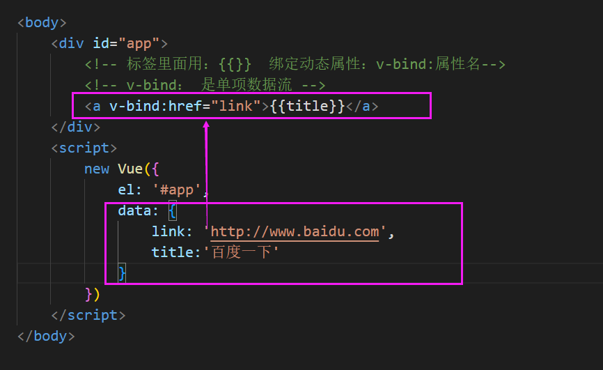
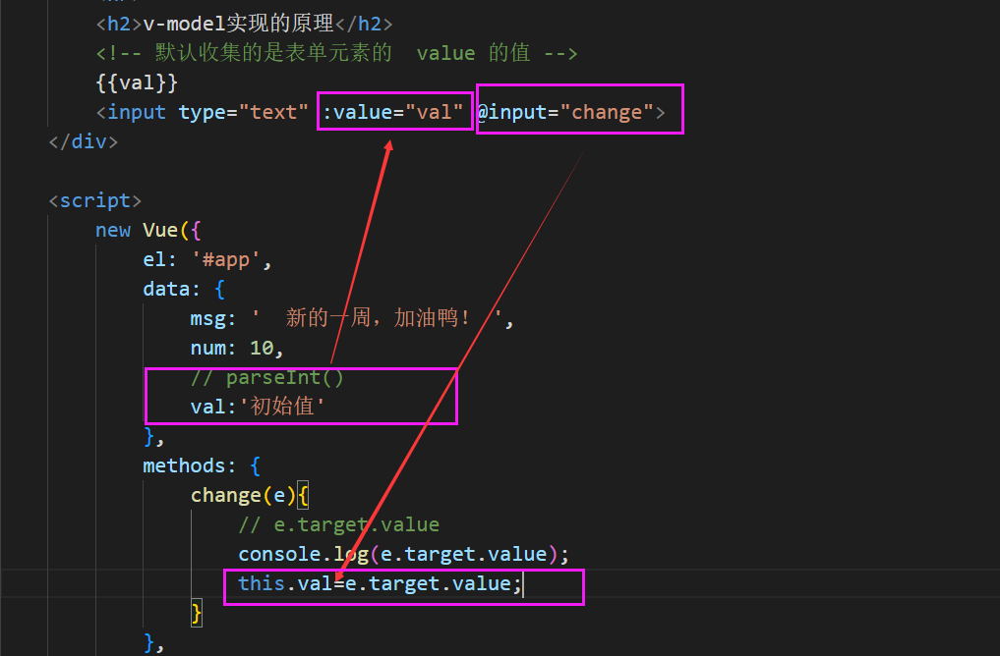

# Vue 指令第二天

**主要内容**

* class与style绑定
* 表单输入绑定
* Object.defineProperty
* 计算属性和侦听器

**学习目标**

 知识点| 要求 
 -| :- 
 v-bind指令            | 掌握 
 class与style绑定      | 掌握 
 表单输入绑定          | 掌握 
 Object.defineProperty | 掌握 
 计算属性和侦听器      | 掌握 


## 一、v-bind 

```vue
<div id='' class='' >
    {{msg}}
</div>

```


### 1、绑定属性

- 说明

  有些属性动态来绑定。比如：动态绑定a元素的href属性；动态绑定img元素的src属性。

  v-bind 可以给任何属性赋值，是==**从vue到页面**的**单向数据流**。==

  
  
  ```html
  <a href='link' ></a>
  
  
  <div class='box' id='' style=''>
      {{msg}}
  </div>
  ```
  
  


### 2、class与style绑定
操作元素的 class 列表和内联样式是数据绑定的一个常见需求。因为它们都是属性，所以我们可以用 v-bind 处理它们：只需要通过表达式计算出字符串结果即可。不过，字符串拼接麻烦且易错。因此，在将 v-bind 用于 class 和 style 时，Vue.js 做了专门的增强。表达式结果的类型除了字符串之外，还可以是对象或数组。

#### 2.1 绑定 HTML Class
1. 动态绑定class类名 

```html
 <div v-bind:class='box1'></div>
```

  动态绑定class类名有两种语法

  **一个是对象语法**：

:class='{key:value}'

```html
 <div v-bind:class='{box:true,box2:3>2}'></div>
```

​      key代表的就是 类名

​      value控制key是否要被添加，如果返回true则添加，否则不添加

  **一个是数组语法**：

​    :class='["box3",{"box4":1>2}]'

```html
<div v-bind:class="[activeClass, errorClass]"></div>
```

```js
data: {
  activeClass: 'active',
  errorClass: 'text-danger'
}
```

渲染为：

```html
<div class="active text-danger"></div>
```

如果你也想根据条件切换列表中的 class，可以用三元表达式：

```html
<div v-bind:class="[isActive ? activeClass : '', errorClass]"></div>
```

这样写将始终添加 `errorClass`，但是只有在 `isActive` 是 truthy[[1\]](https://cn.vuejs.org/v2/guide/class-and-style.html#footnote-1) 时才添加 `activeClass`。

不过，当有多个条件 class 时这样写有些繁琐。所以在数组语法中也可以使用对象语法：

```html
<div v-bind:class="[{ active: isActive }, errorClass]"></div>
```


#### 注意：

==在vue 当中 静态class和动态绑定class可以同时存在==

```vue
<!-- 注意：在vue 当中 静态class和动态绑定class可以同时存在 -->
<div class="" v-bind:class="{box:flag,size:3>2}">对象方式</div>
```


#### 2.2 绑定style 

1. **对象语法**

   `v-bind:style` 的对象语法十分直观——看着非常像 CSS，但其实是一个 JavaScript 对象。CSS property 名可以用驼峰式 (camelCase) 或短横线分隔 (kebab-case，记得用引号括起来) 来命名：

```html
<div v-bind:style="{ color: activeColor, fontSize: fontSize + 'px' }"></div>
```

```js
data: {
  activeColor: 'red',
  fontSize: 30
}
```

2. **数组语法**

   `v-bind:style` 的数组语法==可以将多个样式对象==应用到同一个元素上：

   ```html
   <div v-bind:style="[baseStyles, overridingStyles]"></div>
   ```


## 二、表单输入绑定

### 2.1 基础语法

`v-model`  ：可以实现表单元素和Model层中的数据的双向绑定，==特别注意：只能应用在表单类元素当中！==

​		你可以用 `v-model` 指令在表单 `<input>`、`<textarea>` 及 `<select>` 元素上创建双向数据绑定。它会根据控件类型自动选取正确的方法来更新元素。尽管有些神奇，但 **`v-model` 本质上不过是语法糖**。它负责监听用户的输入事件以更新数据，并对一些极端场景进行一些特殊处理。

`v-model` 在内部为不同的输入元素使用不同的 property 并抛出不同的事件：

- text 和 textarea 元素使用 `value` property 和 `input` 事件；
- checkbox 和 radio 使用 `checked` property 和 `change` 事件；
- select 字段将 `value` 作为 prop 并将 `change` 作为事件。

你可以用 v-model 指令在表单控件元素上创建双向数据绑定

​	

v-model 默认收集的是表单元素中 value 的值


**文本**：

```html
<input v-model="message" placeholder="edit me">
<p>Message is: {{ message }}</p>
```

**多行文本**：

```html
<span>Multiline message is:</span>
<p style="white-space: pre-line;">{{ message }}</p>
<br>
<textarea v-model="message" placeholder="add multiple lines"></textarea>
```

**复选框**：

```html
<input type="checkbox" id="checkbox" v-model="checked">
<label for="checkbox">{{ checked }}</label>
```

多个复选框，绑定到同一个数组：

```html
<input type="checkbox" id="jack" value="Jack" v-model="checkedNames">
<label for="jack">Jack</label>
<input type="checkbox" id="john" value="John" v-model="checkedNames">
<label for="john">John</label>
<input type="checkbox" id="mike" value="Mike" v-model="checkedNames">
<label for="mike">Mike</label>
<br>
<span>Checked names: {{ checkedNames }}</span>
```

```js
new Vue({
  el: '...',
  data: {
    checkedNames: []
  }
})
```

**单选按钮**：

```html
<div id="example-4">
  <input type="radio" id="one" value="One" v-model="picked">
  <label for="one">One</label>
  <br>
  <input type="radio" id="two" value="Two" v-model="picked">
  <label for="two">Two</label>
  <br>
  <span>Picked: {{ picked }}</span>
</div>
```


### 2.2  修饰符


.**lazy**

在默认情况下，`v-model` 在每次 `input` 事件触发后将输入框的值与数据进行同步 (除了[上述](https://cn.vuejs.org/v2/guide/forms.html#vmodel-ime-tip)输入法组合文字时)。你可以添加 `lazy` 修饰符，从而转为在 `change` 事件_之后_进行同步：

```html
<!-- 在“change”时而非“input”时更新 -->
<input v-model.lazy="msg">
```


.**number**

如果想自动将用户的输入值转为数值类型，可以给 `v-model` 添加 `number` 修饰符：

```html
<input v-model.number="age" type="number">
```

这通常很有用，因为即使在 `type="number"` 时，HTML 输入元素的值也总会返回字符串。如果这个值无法被 `parseFloat()` 解析，则会返回原始的值。


.**trim**

如果要自动过滤用户输入的首尾空白字符，可以给 `v-model` 添加 `trim` 修饰符：

```html
<input v-model.trim="msg">
```


### 2.3 v-model实现的原理

V-model只不过是一个语法糖而已,真正的实现靠的还是

==原理：==
      1、通过v-bind，动态绑定value数据
      2、监听input事件，把变化后的值赋值给变量

v-model 是什么。语法糖 :value + @input。还要分为两种情况

```html
<input v-model="val">
<!-- 基本等价于，因为内部还有一些其他的处理 -->
$event是事件对象，$event.target.value表示input框中的输入值
<input :value="val" @input="val = $event.target.value">
```




### 2.4 ref 来获取表单中的数据

- 说明

  给DOM起名字，相当于 id 标记，通过：this.$refs.名字 获取给Dom元素

- 语法

  ```html
  <input type='text' ref='userInfo' />  <!--相当于给input框取个名字，相当于id-->
  
  this.$refs.userInfo.value
  this.$refs.changeColor.style.color='red'
  ```

- 应用

  获取Dom节点


## 三、Object.defineProperty

https://developer.mozilla.org/zh-CN/docs/Web/JavaScript/Reference/Global_Objects/Object/defineProperty

为对象添加或者修改属性，属性为响应式的。  劫持

话术：

Vue的双向绑定是由 ==数据劫持==结合==订阅发布模式==实现的。那么，什么是数据劫持呢？Vue 实现数据劫持 就是靠的Object.defineProperty() 来实现劫持。由这个方法定义的对象属性，都有一个getter,setter，当你试图访问某个属性时，就会走getter()，给这个属性设置值时，就走setter方法。

```js
let obj = {
      firstName:'wang',
      lastName:'damao'
    }


    // obj.fullName = 'wang-damao'
    // console.log(obj)

    // obj.firstName = 'li'
    // console.log(obj)

    // obj.fullName = "li-ergou"
    // console.log(obj)

    Object.defineProperty(obj,'fullName',{
       //getter
      get(){
        //当访问对象的fullName属性的时候
        return this.firstName + '-' + this.lastName
      },
       // setter
      set(val){  
        //当设置对象的fullName属性的时候
        let arr = val.split('-')
        this.firstName = arr[0]
        this.lastName = arr[1]
      }
    })


    console.log(obj.fullName)  //wang-damao
    obj.fullName = 'li-ergou'
    console.log(obj)
```

### 模拟数据代理

```js
//模拟数据代理   
    let vm = {}
    let data = {msg:'哈哈哈哈'}
    let obj={
        a:10,
        b:{
            c:{
                d:{
                    
                }
            }
        }
    }


    Object.defineProperty(vm,'msg',{
      get(){
        return data.msg
      },
      set(val){
        data.msg = val
      }
    })

    console.log(vm.msg)

    vm.msg = '呵呵呵'
    console.log(vm.msg)

    console.log(data)
```


## 四、计算属性和侦听器

### 4.1 计算属性

模板内的表达式非常便利，但是设计它们的初衷是用于简单运算的。在模板中放入太多的逻辑会让模板过重且难以维护。例如：

```html
<div id="example">
  {{ message.split('').reverse().join('') }}
</div>
```

在这个地方，模板不再是简单的声明式逻辑。你必须看一段时间才能意识到，这里是想要显示变量 `message` 的翻转字符串。当你想要在模板中的多处包含此翻转字符串时，就会更加难以处理。

所以，对于任何复杂逻辑，你都应当使用**计算属性**。

**例子**

```html
<div id="example">
  <p>Original message: "{{ message }}"</p>
  <p>Computed reversed message: "{{ reversedMessage }}"</p>
</div>
```

```js

var vm = new Vue({
  el: '#example',
  data: {
    message: 'Hello'
  },
  computed: {
    // 计算属性的 getter
    reversedMessage: function () {
      // `this` 指向 vm 实例
      return this.message.split('').reverse().join('')
    }
  }
})
```

结果：

Original message: "Hello"

Computed reversed message: "olleH"


**计算属性对比方法**

你可能已经注意到我们可以通过在表达式中调用方法来达到同样的效果：

```js
<p>Reversed message: "{{ reversedMessage() }}"</p>
// 在组件中
methods: {
  reversedMessage: function () {
    return this.message.split('').reverse().join('')
  }
}
```

我们可以将同一函数定义为一个方法而不是一个计算属性。两种方式的最终结果确实是完全相同的。然而，不同的是**计算属性是基于它们的响应式依赖进行缓存的**。只在相关响应式依赖发生改变时它们才会重新求值。这就意味着只要 `message` 还没有发生改变，多次访问 `reversedMessage` 计算属性会立即返回之前的计算结果，而不必再次执行函数。

这也同样意味着下面的计算属性将不再更新，因为 `Date.now()` 不是响应式依赖：

```js
computed: {
  now: function () {
    return Date.now()
  }
}
```

相比之下，每当触发重新渲染时，调用方法将**总会**再次执行函数。

我们为什么需要缓存？假设我们有一个性能开销比较大的计算属性 **A**，它需要遍历一个巨大的数组并做大量的计算。然后我们可能有其他的计算属性依赖于 **A**。如果没有缓存，我们将不可避免的多次执行 **A** 的 getter！如果你不希望有缓存，请用方法来替代


### 总结：

方法和计算属性的区别：

计算属性：

​        由计算得来的属性。当你需要一个属性，不需要在data中提前声明，而是由其他现有属性计算得到。

​        特点：是基于它的依赖而进行缓存。依赖变了，计算属性就重新计算;依赖不变，计算属性就不变。

​        应用：做大量计算的时候；如 购物车计算总价：数量*单价+数量*单价+数量*单价....

方法：

​        方法不存在缓存。调用几次方法，就执行几次方法，每次调用都执行

```js
new Vue({
    el: '#app',
    data: {
        firstname: '迪丽',
        lastname: '热巴'
    },
    methods: {
        getFullName() {
            console.log('方法调用啦......');
            return this.firstname + '-' + this.lastname;
        }
    },
    computed: {
        // 计算属性，是基于它的依赖而变化的。
        // 完整写法：
        fullname: {
            // getter函数的返回值，就是计算属性的值
            get() {
                console.log('计算属性调用了.....');
                return this.firstname + '-' + this.lastname;
            },
            // 设置值时
            set(val) {

            }
        },
        // 如果计算属性中只有getter方法，可以简写
        fullname2() {
            return this.firstname + '-' + this.lastname;
        }
    },
})
```


### 4.2 侦听器（监听器）

虽然计算属性在大多数情况下更合适，但有时也需要一个自定义的侦听器。这就是为什么 Vue 通过 `watch` 选项提供了一个更通用的方法，来响应数据的变化。当需要==在数据变化时执行异步或开销较大的操作时，这个方式是最有用的==。

例如：

```html
<div id="watch-example">
  <p>
    Ask a yes/no question:
    <input v-model="question">
  </p>
  <p>{{ answer }}</p>
</div>
```

**例子**：


```html
<body>
  <div id="app">
    <input type="text" v-model="message">
    <h2>状态：{{ state }}</h2>
  </div>
</body>

```

```js
let vm = new Vue({
  el: '#app',
  data: {
    message: 'Hello',
    state: '【未修改】'
  },
  
  watch: {//监听属性

    // 绑定监听数据
    message: function (e){
      // 当数据修改时做出响应(处理函数)
      this.state = '【已修改😀】'
      // ...
    }
  }
})

```

### 4.3 computed和watch区别

**相同**：computed和watch都是观察页面的数据变化的。

**不同**：

**computed**：是计算属性，依赖其它属性值

	1. 支持缓存，只有依赖数据发生改变，才会重新进行计算
	2.  不支持异步，当computed内有异步操作时无效，无法监听数据的变化

**watch**：没有缓存性，更多的是「观察」的作用，类似于某些数据的监听回调，每当监听的数据变化时都会执行回调进行后续操作；

1. 不支持缓存，数据变，直接会触发相应的操作；
2. watch支持异步
3. 监听的函数接收两个参数，第一个参数是最新的值；第二个参数是输入之前的值

```vue
<template>
  <div>
    <h2>侦听器</h2>
    <p>姓：<input type="text" v-model="firstname" /></p>
    <p>名:<input type="text" v-model="lastname" /></p>
    <p>侦听器 fullname:{{ fullname }}</p>
    <p>计算属性 fullname2：{{ fullname2 }}</p>
  </div>
</template>

<script>
export default {
  data() {
    return {
      firstname: "易烊",
      lastname: "千玺",
      fullname: "",
    };
  },
  computed: {
    //   简写
    fullname2() {
      console.log("计算属性调用了==========");
      let a = "1";
      //   计算属性不可以用异步!!!!
      //   setTimeout(() => {
      //     a = this.firstname + "-" + this.lastname;
      //   }, 2000);

      return this.firstname + "-" + this.lastname;
    },
  },
  //   侦听已有属性的变化，当侦听到变化之后，执行相应的函数。
  watch: {
    //   简写方式：一上来不侦听，只有变化之后，才侦听
    // firstname(newVal) {
    //   console.log("firstname变化了.....", newVal);
    //   this.fullname = newVal + "-" + this.lastname;
    // },
    // 完整写法
    firstname: {
      handler(newVal, oldVal) {
        // 侦听器里可以用异步
        setTimeout(() => {
          this.fullname = newVal + "-" + this.lastname;
        }, 2000);
      },
      immediate: true, //无论有没有侦听到变化，都执行一次上面的回调
    },
    lastname(newVal) {
      console.log("lastname变化了.....", newVal);
      this.fullname = this.firstname + "-" + newVal;
    },
  },
};

</script>
```


### 总结：

计算属性和侦听器区别：

计算属性：

​        由计算得来的属性。当你需要一个属性，不需要在data中提前声明，而是由其他现有属性计算得到。

​        特点：是基于它的依赖而进行缓存。依赖变了，计算属性就重新计算;依赖不变，计算属性就不变。

​        应用：做大量计算的时候；如 购物车计算总价：数量*单价+数量*单价+数量*单价....

​        不支持异步！！！


​      方法：

​        方法不存在缓存。调用几次方法，就执行几次方法，每次调用都执行


​      侦听器：

​        侦听已有的属性的变化，当侦听到属性变化后，执行相应逻辑

​        特点：属性需要在data里提前声明


​        完整写法：immediate:true //无论有没有侦听到属性的变化，都执行一次上面的逻辑


​        侦听器支持异步！！！


# 前情回顾：

### 1、事件 v-on:事件名

```vue
<div v-on:click='num+=1'>
    
</div>
```

语法糖（简写）：

```html
<div @click='change（123,$event）'>
    
</div>


data(){

},
methods:{
	change(msg,$event){
		// this 实例
		console.log(this)
	}
}
```


事件对象：

不传参：接受到的第一个参数就是事件对象

传参：事件对象：$event！！


#### 事件修饰符：

@click.stop='change' 阻止冒泡

@.click.prevent='chagne'


## 2、绑定属性

指令：  v-bind

属性：class style  src   href

```vue
<div v-bind>
    {{msg}}
</div>

```

语法糖：   `:src`

:class

```vue
<!--对象方式:类样式能否生效，取决于后面的判断条件是否为true-->
<div :class="{box:true,box1:3>=2,box2:flag}">
    
</div>

<!--数组写法:多个对象-->
<div :class="[boxObj，{box2:true}]">
    
</div>


data:{
	boxObj:'.box'
}

```

```style
.box{
 	color:red
}
```


### 3、表单

v-model 

双向绑定

```vue
<input  v-model='msg'/>


data:{
	msg:'123'
}
```

==v-model 默认收集的表单元素中的  value的值==


