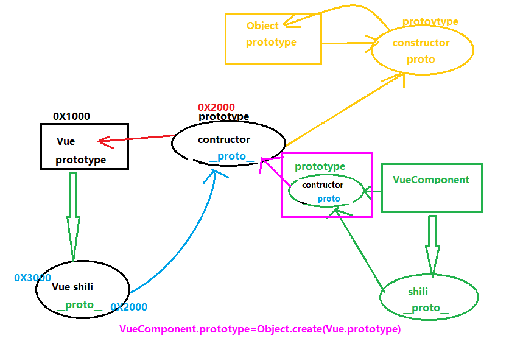

# Vue 组件基础

**主要内容**

* 组件创建
* 插槽
* 动态组件、异步组件
* 处理边界情况
* vue实例

**学习目标**

 知识点| 要求 
 -| :- 
 组件创建 | 掌握 
 插槽 | 掌握 
 动态组件、异步组件 | 掌握 
 处理边界情况 | 掌握 
 vue实例 | 掌握 


## 1、前情回顾

#### 1、Object.defineproperty

作用：为对象添加或修改现有属性，使之成为响应式（数据变了，界面跟着变）

```js
Object.defineproperty(obj,'a',{
    //vlaue:10,
    writable:true,
    enumable:true,
    configable:true,
    //getter 劫持 拦截 依赖收集[,,,,,,,,]
    get(){
        
        return 10
    },
    //设置  发布==>遍历通知
    set(val){
        this.a=val;
    }
})

console.log(obj.a)  //10
obj.a++;
console.log(obj.a) //10
```

#### 数据代理

```js
const vm=new Vue({
    data:{
        msg:'123'
    },
    methods:{
        test(){
            console.log(this) //Vue实例  this。msg  test()
        }
    }
})
vm.msg=456

Object.defineproperty(vm,'msg',{
    get(){
        return data.msg
    },
    set(val){
        data.msg=val
    }
})
```


### 2、计算属性

计算属性：由计算而来的属性。不能异步

特点：依赖，缓存

应用

```js

{{fullname}}  ----{{fullname2}}

data:{
    
},
computed:{
    fullname:{
        get(){
            reutrn 10
        },
        set(){
            
        }
    },
        //简写
    fullname2(){
        reutrn 10
    }
}
```


侦听器：侦听已有属性。异步

```js
data:{
    firtname:''
},
watch:{
    //简写
    firtname(newVal,oldVal){
        //异步
    }，
    //完整
    firtname:{
        handler(newVal,oldVal){
          //异步  定时器、网络请求
           
        }，
        immediate:true
    }
}
```


## 2、前情回顾：

### 一、组件

1）分为：全局组件和局部组件

2）创建组件的方式

##### 全局： 

特点：任何地方

步骤：

```js
//ComA  => <com-a />   <ComA/>
Vue.component("com-a",{
    data:(){
    	return{
    		msg:123
		}
	},
    methods:{
              
     },
    computed:{
        
    }
})

//使用
<com-a/>
```


##### 局部组件：webpack 入口

特点：

步骤：

1. 定义组件

```vue
<template>
	<div>
       <p>
           
    	</p> 
        <span></span>
    </div>
</template>

<script>
    
	export default{
        components:{
            
        }
    }

</script>

<style lang='less' scoped>
    h2{
        
    }
</style>
```

2. 引入

   ```js
   import xx from ''
   ```

   

3. 注册

   

4. 使用


### ==二、组件传值==

#### 1、props

最基本最简单的一种传值方式。

适用于：父向子传值

##### 语法：

父组件：

```vue
<Son :msg='msg'/>
```

子组件：

```js
props:['msg']
```

分为：非函数数据和函数数据

- 非函数数据(普通数据)

  

- 函数数据：父向子传的是方法 ==本质：子向父传值==

  方法定义在父组件；方法调用在子组件

  

##### 不足之处：

只适合父向子传值，对于关系比较远（非父子）不太合适

兄弟：子向父，父向子


#### 2、自定义事件

由来：props 父向子，传来的数据，子组件不能修改，非要修改。通知父组件，父组件自己修改。

步骤：

1. 子组件  this.$emit('自定义事件名','msg')触发
2. 父组件 v-on 监听子组件事件  v-on:change='change2'

缺点：

只适合父子


### 1.3 创建项目

1. 安装脚手架

   npm install -g @vue/cli （安装脚手架）

   ```sh
   npm install -g @vue/cli
   # OR  npm i yarn -g
   yarn global add @vue/cli
   ```

2. 创建项目

   vue create my-project

   项目名称最好是英文，不能包含驼峰命名法

​	演示：

preset :预设（提前设置）


babel：转码，把ES6=>ES5

eslint：语法校验

​	这个默认的设置非常适合快速创建一个新项目的原型，而手动设置则提供了更多的选项，它们是面向生产的项目更加需要的。

​	根据需要选择你想要的配置目录


npm run serve：开发

npm run build ：上线


## 一、组件创建

### 1. 简介

通常一个应用会以一棵嵌套的组件树的形式来组织：

例如，你可能会有页头、侧边栏、内容区等组件，每个组件又包含了其它的像导航链接、博文之类的组件。


为了能在模板中使用，这些组件必须先注册以便 Vue 能够识别。这里有两种组件的注册类型：**全局注册**和**局部注册**.

#### 1.1 全局组件

在注册一个组件的时候，我们始终需要给它一个名字。比如在全局注册的时候我们已经看到了：

```
Vue.component('my-component-name', { /* ... */ })
```

该组件名就是 `Vue.component` 的第一个参数。

你给予组件的名字可能依赖于你打算拿它来做什么。当直接在 DOM 中使用一个组件 (而不是在字符串模板或[单文件组件](https://cn.vuejs.org/v2/guide/single-file-components.html)) 的时候，我们强烈推荐遵循 [W3C 规范](https://html.spec.whatwg.org/multipage/custom-elements.html#valid-custom-element-name)中的自定义组件名 (字母全小写且必须包含一个连字符)。这会帮助你避免和当前以及未来的 HTML 元素相冲突。

你可以在[风格指南](https://cn.vuejs.org/v2/style-guide/#基础组件名-强烈推荐)中查阅到关于组件名的其它建议。

**组件名大小写**

定义组件名的方式有两种：

**使用 kebab-case**

```js
Vue.component('my-component-name', { /* 内容配置 */ })
```

当使用 kebab-case (短横线分隔命名) 定义一个组件时，你也必须在引用这个自定义元素时使用 kebab-case，例如 `<my-component-name />`。

**使用 PascalCase**

```js
Vue.component('MyComponentName', { /* 内容配置 */ })
```

当使用 PascalCase (首字母大写命名) 定义一个组件时，你在引用这个自定义元素时==两种命名法都可以使用==。也就是说 `<my-component-name>` 和 `<MyComponentName/>` 都是可接受的。注意，尽管如此，直接在 DOM (即非字符串的模板) 中使用时只有 kebab-case 是有效的。

到目前为止，我们只用过 `Vue.component` 来创建组件：

```js
Vue.component('my-component-name', {
  // ... 选项 ...
})
```

这些组件是**全局注册的**。也就是说它们在注册之后可以用在任何新创建的 Vue 根实例 (`new Vue`) 的模板中。比如：

```html
Vue.component('component-a', { /* ... */ })
Vue.component('component-b', { /* ... */ })
Vue.component('component-c', { /* ... */ })

new Vue({ el: '#app' })
<div id="app">
  <component-a></component-a>
  <component-b></component-b>
  <component-c></component-c>
</div>
```

在所有子组件中也是如此，也就是说这三个组件*在各自内部*也都可以相互使用


#### ==步骤：==

##### 1、main.js 定义 :

```js
// 注册全局组件
// Vue.component('组件名称',{内容配置})
Vue.component('component-a', {
 	//视图 template :template作为属性使用 必须vue.js （完整版的vue.js）  默认引入-运行时-vue.runtime.js 
    template:'<div> <h2>我是一个全局组件</h2> <p>{{ msg }}</p></div>',
    //数据
    data(){
      return {
        msg:'hello vue全局组件'
      }
    },
})

new Vue({
 render: h => h(App)
}).$mount('#app')
```

##### 2、任何组件中使用：

```vue
<component-a></component-a>
```


##### 报错：


#### vue 不同构建版本

https://cn.vuejs.org/v2/guide/installation.html

1. vue.js 完整版 --编译器+ 运行时 

2. vue.runtime.js  运行时 

   方法1：手动修改引入

   ```js
   import Vue from 'vue'//运行时：vue.runtime.js 
   import Vue from 'vue/dist/vue' //完整版
   ```

   方法2：还可以自己去修改配置文件：

   

   

   


#### 1.2 局部注册

全局注册往往是不够理想的。比如，如果你使用一个像 webpack 这样的构建系统，全局注册所有的组件意味着即便你已经不再使用一个组件了，它仍然会被包含在你最终的构建结果中。这造成了用户下载的 JavaScript 的无谓的增加。

在这些情况下，可以通过一个普通的 JavaScript 对象来定义局部组件：

```js
var ComponentA = { /* ... */ }
var ComponentB = { /* ... */ }
var ComponentC = { /* ... */ }
```

然后在 `components` 选项中定义你想要使用的组件：

```js
new Vue({
  el: '#app',
  components: {
    'component-a': ComponentA,
    'component-b': ComponentB
  }
})
```

对于 `components` 对象中的每个 property 来说，其 property 名就是自定义元素的名字，其 property 值就是这个组件的选项对象。

注意**局部注册的组件在其子组件中\*不可用\***。例如，如果你希望 `ComponentA` 在 `ComponentB` 中可用，则你需要这样写：

```js
var ComponentA = { /* ... */ }

var ComponentB = {
  components: {
    'component-a': ComponentA
  },
  // ...
}
```

或者如果你通过 Babel 和 webpack 使用 ES2015 模块，那么代码看起来更像：

```js
import ComponentA from './ComponentA.vue'

export default {
  components: {
    ComponentA
  },
  // ...
}
```


#### ==局部组件步骤：==

四部曲：定义、引入、注册、使用

#####  1、定义局部组件 comB.js:

```js
let comB = {
  template: '<h2>comB</h2>'
}

export default comB
```


##### 2、App.vue 哪里需要哪里引入：

```js
import comB from "@/components/comB.js";
```

##### 3、注册：

```js
export default {
  name: "App",
  //注册组件
  components: {
    comB:comB
  },
};
```

##### 4、使用：

```vue
<comB/>
#或者
<comB></comB>
```


## 二、组件传值

### 2.1 prop

最基本、最简单的组件通信方式。

适用场合：适用于父子之间

父可以给子传递==非函数数据==和==函数数据==


#### 2.1.1 传递普通数据（非函数数据）

**语法**：

调用子组件时通过属性形式定义传递的数据

` <Son title='标题' />`

在子级组件中,通过props属性接收,不写接收是接收不到的

```js
export default{
	props:['title']
 }
```

​    在子级组件中使用props数据：直接当变量使用 title

**1.** **静态props，动态的props**

​    静态props  `<Son title='标签'>`

​    动态的props ` <Son :title='mytitle'/>`

**2.** **props类型**

​    props:{ title:String }


#### 2.1.2 父向子传递函数数据

父可以给子传递==函数数据==和==非函数数据==
		1、传递非函数数据，本质就是父亲给儿子传数据
		2、传递函数数据，本质是父亲想要儿子的数据，通过函数调用传参的方式把数据传递给父亲	

```vue
<!-- 2、给子组件传递 函数数据 (本质：子=》父传值-->
<Son2 ref="son2" :run="run1" :say="say1"></Son2>
```


```js
run1() {
    alert("我是父组件的方法。");
},
    // 接收子组件传递来的参数
    say1(msg) {
        alert(msg);
    },

```

#### 子组件：

```vue
<button @click="say('我是大头儿子--Son2')">触发父组件传来的方法 say，并传值给父组件</button>
```


#### 总结：

不足（不是父子就很麻烦） 兄弟关系，就必须先把一个数据给了父亲，然后通过父亲再给另一个

最基础的通信，用的也是比较多的，所以必须搞定


###### 2.2 Prop校验

我们可以为组件的 prop 指定验证要求，例如你知道的这些类型。如果有一个需求没有被满足，则 Vue 会在浏览器控制台中警告你。这在开发一个会被别人用到的组件时尤其有帮助

```js
Vue.component('my-component', {
  props: {
    // 基础的类型检查 (`null` 和 `undefined` 会通过任何类型验证)
    propA: Number,
    // 多个可能的类型
    propB: [String, Number],
    // 必填的字符串
    propC: {
      type: String,
      required: true
    },
    // 带有默认值的数字
    propD: {
      type: Number,
      default: 100
    },
    // 带有默认值的对象
    propE: {
      type: Object,
      // 对象或数组默认值必须从一个工厂函数获取
      default: function () {
        return { message: 'hello' }
      }
    },
    // 自定义验证函数
    propF: {
      validator: function (value) {
        // 这个值必须匹配下列字符串中的一个
        return ['success', 'warning', 'danger'].indexOf(value) !== -1
      }
    }
  }
})
```

**类型校验**

当 prop 验证失败的时候，(开发环境构建版本的) Vue 将会产生一个控制台的警告。

`type` 可以是下列原生构造函数中的一个：

- `String`
- `Number`
- `Boolean`
- `Array`
- `Object`
- `Date`
- `Function`
- `Symbol`

额外的，`type` 还可以是一个自定义的构造函数，并且通过 `instanceof` 来进行检查确认。


### 2.3 自定义事件

**由来：**父组件通过props传递给子组件的数据，子组件不能修改。但是可以通过自定义事件，由子组件通知父组件，让父组件自行修改。


不同于组件和 prop，事件名不存在任何自动化的大小写转换。而是触发的事件名需要完全匹配监听这个事件所用的名称。举个例子，如果触发一个 camelCase 名字的事件：

```js
this.$emit('myEvent')
```

则监听这个名字的 kebab-case 版本是不会有任何效果的：

```html
<!-- 没有效果 -->
<my-component v-on:my-event="doSomething"></my-component>
```


#### 步骤：

1. 子组件中，通过this.$emit('自定义事件名'，'传参数') 触发
2. 父组件中，通过v-on 来监听子组件事件

语法 ：

1. 子组件定义事件 
   this.$emit('getData',this.msg)

 2. 父组件-调用子组件上面接受自定义事件
    <子组件 @自定义事件名='函数名'/>

    methods:{
        函数名(val){
            this.xx = val;
        }
    }


==不足之处：只能应用在父子之间==


#### 实现：

##### 子组件触发：


##### 父组件：


## 三、处理边界

### 3.1  访问根实例

放在根组件的数据，能实现组件共享，全局的，因为所有的组件实例都可以访问这个实例

访问根实例 $root 

1. main.js：

   

   ```js
   // Vue 根实例
   new Vue({
     //根组件的数据，能实现组件共享，全局的，因为所有的组件实例都可以访问这个实例
     data: {
       user: 'zs'
     },
     computed: {
       bar: function () { /* ... */ }
     },
     methods: {
       baz: function () { /* ... */ }
     }
   })
   ```

   

2. 其他组件 js：

   ```js
   this.$root.xx
   ```

   模板当中：

   ```html
   {{ $root.xx }}
   ```


所有的子组件都可以将这个实例作为一个全局 store 来访问或使用。

```js
// 获取根组件的数据
this.$root.user

// 写入根组件的数据
this.$root.user = 'ls'

// 访问根组件的计算属性
this.$root.bar

// 调用根组件的方法
this.$root.baz()
```

对于 demo 或非常小型的有少量组件的应用来说这是很方便的。不过这个模式扩展到中大型应用来说就不然了。因此在绝大多数情况下，我们强烈推荐使用 [Vuex](https://github.com/vuejs/vuex) 来管理应用的状态。

#### 注意：

不建议把大量数据放到跟组件上。


### 3.2 访问父级组件实例 $parent 

打印this 先看自身：$vnode虚拟dom指向的是 第三层


#### 访问：

1. this.$parent.xxx  
2. {{ $parent.xx  }}

#### 子组件：

```js
<h2>son组件</h2>
<button @click="getParent">获取父组件实例</button>	

getParent(){
    //this 先看自身：$vnode虚拟dom指向的是 第三层
    console.log(this);
    // 在看$parent，拿到父组件实例
    console.log('获取父组件实例',this.$parent);
    console.log(this.$parent.info);//获取父组件属性
    this.$parent.demo(); //调用父组件方法
    this.$parent.info='修改父组件数据'; //修改父组件数据
}
```


- 注意

  1. 尽管在Vue中，允许通过 `$parent`访问父组件，但在真实开发中尽量不要这样做。
  2. ==子组件应该尽量避免直接访问父组件的数据，因为这样耦合度太高了。==

- 原因

  如果我们将子组件放在另外一个组件内，很可能该父组件没有对应的属性，往往会引起问题。此外，更不好做的是通过$parent直接修改父组件的状态，那么父组件中的状态将变得飘忽不定，很不利于我的调试和维护。

  

- 缺点：对于子组件而言，父组件定义的状态不确定


### 3.3 获取子组件实例

- this.$children是一个数组类型，它包含所有子组件对象。

#### 父组件：

```js
getSon() {
    console.log(this);
    // this.$children 是个数组
    console.log(this.$children[0].son);
},
```

- `$children` 的缺陷：

  通过 `$children` 访问子组件时，是一个数组类型，访问其中的子组件必须通过索引值。但是当子组件过多，我们需要拿到其中一个时，往往不能确定它的索引值，甚至还可能会发生变化。因此，我们想明确获取其中一个特定的组件，这个时候就可以使用$refs。

- 缺点：子组件的索引值不确定


### 3.4 访问子组件实例或子元素--$ref  -操作DOM元素

前面讲双向数据绑定时，讲过用 "ref 来获取表单中数据"，ref 获取的其实就是Dom元素，而组件其实也就是自定义标签元素，同样可以用 ref 获取。

1. 获取DOM元素：

   ```vue
   <div ref='xx'></div>
   ```

   this.$refs.xx 获取div-dom元素

2. 获取子组件实例

   ```vue
   <Son ref='xx'/>
   ```

   this.$refs.xx 

   ```vue
   <h3>测试ref属性</h3>
   <div ref="element">获取DOM元素</div>
   <div ref="ele">我是ele元素</div>
   <button @click="getDiv">获取div</button>
   <hr />
   <Son ref="child" />
   
   ```

   获取：

   ```js
   getDiv() {
       console.log(this);
       console.log(this.$refs.ele);
       this.$refs.ele.style.color = "red";
       //获取子组件实例
       console.log("子组件实例", this.$refs.child);
   },
   ```

   


### 3.5 原型链

```js
function Person(){

}
// 方法或属性
Person.prototype.eat=function(){}
Person.prototype.type='人类';
const p=new Person()

```


Vue.prototype.$user='admin'

```js
//挂载一个数据--挂载到原型链上
Vue.prototype.$user='admin'
```

访问：

```js
handle() {
    console.log(this);
    console.log("根组件的数据", this.$root.user);
    console.log("原型上的数据", this.$user);
},
```





## 四、插槽

### 4.1 插槽介绍

**说明：**Vue 实现了一套内容分发的 API，子组件在定义时不知道具体要显示什么，只是留出来显示的位置，在组件调用时写具体内容，能展现在预留的位置上。

简而言之：子组件在定义时，不确定显示什么，只是预留好空间，具体显示什么由调用它的父组件决定。

**定义：**使用 <slot> 标签预留位置

**调用组件时**，写具体的要呈现的内容，要显示在<slot>标签中


### 4.2 插槽类型

#### 4.2.1 匿名插槽

子组件定义时，预留好插槽：

```html
<slot name='default'></slot> 
<!--或者-->
<slot></slot>
```

   调用时不需要写具体的标识，都可以显示在匿名插槽中

  ```vue
  import 组件 from './xxx'
  
  <子组件>
    <h3>我是插槽数据</h3>    
  </子组件>
  ```


#### 4.2.2 具名插槽

有时我们需要多个插槽。例如对于一个带有如下模板的 `<header>` 组件：

```html
<div class="header">
  <div>
    <!-- 我们希望把 左侧内容放这里 -->
  </div>
  <div>
    <!-- 我们希望把 中间内容放这里 -->
  </div>
  <div>
    <!-- 我们希望把 右侧内容放这里 -->
  </div>
</div>
```

对于这样的情况，`<slot>` 元素有一个特殊的 attribute：`name`。这个 attribute 可以用来定义额外的插槽：

```html
<div class="header">
  <!--左侧内容插槽 -->
  <slot name="left"></slot>

  <!--默认插槽 -->
  <slot></slot>
  
  <!--右侧侧内容插槽 -->
  <slot name="right"></slot>

</div>
```

一个不带 `name` 的 `<slot>` 出口会带有隐含的名字“default”。

在向具名插槽提供内容的时候，我们可以在一个 `<template>` 元素上使用 `v-slot` 指令，并以 `v-slot` 的参数的形式提供其名称：

```html
<Header>
    <!-- <template v-slot:left> -->
    <!-- 具名插槽缩写 -->
    <template #left>
        <span>列表左侧</span>
    </template>
    
    <span>列表标题</span>
    
    <template v-slot:right="obj">
        <span>列表右侧</span>
    </template>
</Header>
```

现在 `<template>` 元素中的所有内容都将会被传入相应的插槽。任何没有被包裹在带有 `v-slot` 的 `<template>` 中的内容都会被视为默认插槽的内容。

然而，如果你希望更明确一些，仍然可以在一个 `<template>` 中包裹默认插槽的内容：

```html
<Header>
    <!-- <template v-slot:left> -->
    <!-- 具名插槽缩写 -->
    <template #left>
        <span>列表左侧</span>
    </template>
    
    <span v-slot:default>列表标题</span>
    
    <template v-slot:right="obj">
        <span>列表右侧</span>
    </template>
</Header>
```


==普通插槽：父向子传值==


#### 4.2.3 作用域插槽

==作用域插槽 【子向父传值方式】==

1. 作用: 让插槽内容能够访问子组件中才有的数据 (插槽提供数据，让别人使用)

2. 语法：子组件

   ```html
   <slot name="footer" :msg="msg" :num='num'></slot>
   ```

   

 3. 父组件 使用插槽：

    ```html
    <template v-slot:footer='data'>
       底部区域
        <p>使用slot数据:{{ obj }}</p>
        <p>{{ obj.msg }}</p>
    </template>
    ```

    

    注意：==data一个对象 data={ msg:'',num:'',...}==


有时让插槽内容能够访问子组件中才有的数据是很有用的。例如，设想一个带有如下模板的 `<current-user>` 组件：

```html
<span>
  <slot>{{ user.lastName }}</slot>
</span>
```

我们可能想换掉备用内容，用名而非姓来显示。如下：

```html
<current-user>
  {{ user.firstName }}
</current-user>
```

然而上述代码不会正常工作，因为只有 `<current-user>` 组件可以访问到 `user`，而我们提供的内容是在父级渲染的。

为了让 `user` 在父级的插槽内容中可用，我们可以将 `user` 作为 `<slot>` 元素的一个 attribute 绑定上去：

```html
<span>
  <slot v-bind:user="user">
    {{ user.lastName }}
  </slot>
</span>
```

绑定在 `<slot>` 元素上的 attribute 被称为**插槽 prop**。现在在父级作用域中，我们可以使用带值的 `v-slot` 来定义我们提供的插槽 prop 的名字：

```html
<current-user>
  <template v-slot:default="slotProps">
    {{ slotProps.user.firstName }}
  </template>
</current-user>
```

在这个例子中，我们选择将包含所有插槽 prop 的对象命名为 `slotProps`，但你也可以使用任意你喜欢的名字。


#### 4.2.4 具名插槽缩写

跟 v-on 和 v-bind 一样，v-slot 也有缩写，即把参数之前的所有内容 (v-slot:) 替换为字符 #。

例如 **v-slot:header 可以被重写为 #header**


#### 4.2.5 后备内容

有时为一个插槽设置具体的后备 (也就是默认的) 内容是很有用的，它只会在**没有提供内容的时候被渲染**。

默认值

```html
<slot name='header'>默认值</slot>
```

使用的时候：

```html
<template #header></template>
<template #footer></template>
```


#### 4.2.6 动态插槽

也可以用在 `v-slot` 上，来定义动态的插槽名：

```html
<Header>
  <template v-slot:[dynamicSlotName]>
    ...
  </template>
</Header>
```

##### 语法:

父组件：

```html
<!-- 动态插槽 -->
<Header>
	<template v-slot:[str]>新闻左侧，还是右侧，我也不确定-{{varName}}</template> 
</Header>
```

```js
data(){
    return {
        str:'right'
    }
}
```


### 总结：组件通信方式


## 五、Vue生命周期

组件的生命周期：Vue 组件从创建到销毁的过程。

生命周期钩子（生命周期函数）：在特定时间点上触发的函数，不需要你手动调用，当组件加载到一定的阶段，会自动触发。

### 5. 1 简介

每个 Vue 实例在被创建时都要经过一系列的初始化过程——例如，需要设置数据监听、编译模板、将实例挂载到 DOM 并在数据变化时更新 DOM 等。同时在这个过程中也会运行一些叫做**生命周期钩子**的函数，这给了用户在不同阶段添加自己的代码的机会。


### 5.2 生命周期图

下图展示了实例的生命周期。你不需要立马弄明白所有的东西，不过随着你的不断学习和使用，它的参考价值会越来越高。


生命周期

1. 初始化阶段：beforeCreate（初始化之前）、created（初始化之后）

   在beforeCreate 和created之间做数据代理和数据劫持。给data里的所有属性添加getter和setter方法。

   beforeCreate：打印data里的数据，打印不到；vm已经创建，只是数据还没代理。

   created：初始化完成。可以访问数据。

   ```js
   beforeCreate() {
       //初始化之前最大的特点是数据还没代理好，打印不到
       console.log(this,this.isShow)
   },
   
       created() {
           //初始化之后数据就能被访问了；最早发送网络请求
           console.log(this.isShow)
       },
   ```

   

2. 挂载阶段：beforeMount和mounted 把虚拟Dom变成真实Dom

   beforeMount：

   mounted：

   ```js
   beforeMount() {
       console.log(this.$refs.pp) //undefined，还没挂载
   },
   
       mounted() {
           //这个钩子用的是最多的
           //一般用于发情ajax请求获取数据
           //还用于开启定时器
           //添加一些事件
           console.log(this.$refs.pp) //挂载上了
   
           this.timer = setInterval(() => {
               this.isShow = !this.isShow
           },2000)
       },
   ```

   ==注意：前两个阶段完成 代表初始化展示页面就完成了==

3. 更新阶段：beforeUpdate和updated ==页面的数据更新之前，而不是vm上的数据。==

   beforeUpdate：vm上的数据已经更改，而页面的数据更新之前。

   updated：页面的数据更新之后，

   ```html
   <p ref="pp" v-show="isShow">{{isShow?'晴天':'阴天'}}</p>
   ```

   

   ```js
   mounted() {
       //这个钩子用的是最多的
       //一般用于发情ajax请求获取数据
       //还用于开启定时器
       //添加一些事件
       console.log(this.$refs.pp) //挂载上了
   
       this.timer = setInterval(() => {
           this.isShow = !this.isShow
       },2000)
   }
   
   //页面数据更新前和页面数据更新 不是vm的数据
   beforeUpdate() {
       //页面更新前  vm的数据已经做了更新了，但是此时页面的数据还没有更新过来
       console.log(this.isShow,this.$refs.pp.innerHTML)
   },
   
       updated() {
           //页面更新后  vm的数据已经做了更新了，页面的数据也更新过来了
           console.log(this.isShow,this.$refs.pp.innerHTML)
       },
   ```

   

4. 销毁阶段

   ​    beforeDestroy：收尾阶段，解绑事件，清除定时器

```js
methods: {
      destory(){
        //   手动调用销毁
          this.$destroy();
      }
  },
```


## 六、 vue实例

### MVVM模式

Mvvm的全称为：Model、View、ViewModel，
m表示数据模型层 , v表示视图层 , vm表示视图模型控制层

MVVM 是Model-View-ViewModel 的缩写，它是一种基于前端开发的架构模式，其**核心是提供对View 和 ViewModel 的双向数据绑定，这使得ViewModel 的状态改变可以自动传递给 View，即所谓的数据双向绑定**。

　　Vue.js 是一个提供了 MVVM 风格的双向数据绑定的 Javascript 库，专注于View 层。它的核心是 MVVM 中的 VM，也就是 ViewModel。 ViewModel负责连接 View 和 Model，保证视图和数据的一致性，这种轻量级的架构让前端开发更加高效、便捷。


在MVVM架构中，是不允许数据和视图直接通信的，只能通过ViewModel来通信，而ViewModel就是定义了一个Observer观察者。ViewModel是连接View和Model的中间件。

 

ViewModel能够观察到数据的变化，并对视图对应的内容进行更新。


### 5.3 为什么采用MVVM

​	**为什么会出现 MVVM 呢？**

　　MVC 即 Model-View-Controller 的缩写，就是 模型—视图—控制器，也就是说一个标准的Web 应用程式是由这三部分组成的：

　　View ：用来把数据以某种方式呈现给用户

　　Model ：其实就是数据

　　Controller ：接收并处理来自用户的请求，并将 Model 返回给用户

　　在HTML5 还未火起来的那些年，MVC 作为Web 应用的最佳实践是OK 的，这是因为 Web 应用的View 层相对来说比较简单，前端所需要的数据在后端基本上都可以处理好，View 层主要是做一下展示，那时候提倡的是 Controller 来处理复杂的业务逻辑，所以View 层相对来说比较轻量，就是所谓的**瘦客户端思想**。

　　**为什么前端要工程化，要是使用MVC？** 

　　相对 HTML4，HTML5 最大的亮点是**它为移动设备提供了一些非常有用的功能**，使得 HTML5 具备了开发App的能力， HTML5开发App 最大的好处就是**跨平台、快速迭代和上线，节省人力成本和提高效率**，因此很多企业开始对传统的App进行改造，逐渐用H5代替Native，到2015年的时候，市面上大多数App 或多或少嵌入都了H5 的页面。既然要用H5 来构建 App， 那View 层所做的事，就不仅仅是简单的数据展示了，它不仅要管理复杂的数据状态，还要处理移动设备上各种操作行为等等。因此，前端也需要工程化，也需要一个类似于MVC 的框架来管理这些复杂的逻辑，使开发更加高效。 但这里的 MVC 又稍微发了点变化：

　　View ：UI布局，展示数据

　　Model ：管理数据

　　Controller ：响应用户操作，并将 Model 更新到 View 上

　　这种 MVC 架构模式对于简单的应用来看是OK 的，也符合软件架构的分层思想。 但实际上，随着H5 的不断发展，人们更希望使用H5 开发的应用能和Native 媲美，或者接近于原生App 的体验效果，于是前端应用的复杂程度已不同往日，今非昔比。这时前端开发就暴露出了三个痛点问题：

　　1、 开发者在代码中大量调用相同的 DOM API，处理繁琐 ，操作冗余，使得代码难以维护。

　　2、大量的DOM 操作使页面渲染性能降低，加载速度变慢，影响用户体验。

　　3、 当 Model 频繁发生变化，开发者需要主动更新到View ；当用户的操作导致 Model 发生变化，开发者同样需要将变化的数据同步到Model 中，这样的工作不仅繁琐，而且很难维护复杂多变的数据状态。

　　其实，早期jquery 的出现就是为了前端能更简洁的操作DOM 而设计的，但它只解决了第一个问题，另外两个问题始终伴随着前端一直存在。

　　**MVVM 的出现，完美解决了以上三个问题。**

　　MVVM 由 Model、View、ViewModel 三部分构成，Model 层代表数据模型，也可以在Model中定义数据修改和操作的业务逻辑；View 代表UI 组件，它负责将数据模型转化成UI 展现出来，ViewModel 是一个同步View 和 Model的对象。

　　**在MVVM架构下，View 和 Model 之间并没有直接的联系，而是通过ViewModel进行交互，Model 和 ViewModel 之间的交互是双向的， 因此View 数据的变化会同步到Model中，而Model 数据的变化也会立即反应到View 上**。

　　ViewModel 通过双向数据绑定把 View 层和 Model 层连接了起来，而View 和 Model 之间的同步工作完全是自动的，无需人为干涉，因此开发者只需关注业务逻辑，不需要手动操作DOM， 不需要关注数据状态的同步问题，复杂的数据状态维护完全由 MVVM 来统一管理。


### 5.4 Vue模式

**Vue.js 的细节**

　　Vue.js 可以说是MVVM 架构的最佳实践，专注于 MVVM 中的 ViewModel，不仅做到了数据双向绑定，而且也是一款相对来比较轻量级的JS 库，API 简洁，很容易上手。Vue的基础知识网上有现成的教程，此处不再赘述， 下面简单了解一下 Vue.js 关于双向绑定的一些实现细节：

　　Vue.js 是**采用 Object.defineProperty 的 getter 和 setter，并结合观察者模式来实现数据绑定的**。**当把一个普通 Javascript 对象传给 Vue 实例来作为它的 data 选项时，Vue 将==遍历==它的属性，用 Object.defineProperty 将它们转为 getter/setter。用户看不到 getter/setter，但是在内部它们让 Vue 追踪依赖，在属性被访问和修改时通知变化。**


```js
data:{
    obj:{
        name:'zd'
        a:{
            b:{
                c:{
                    
                }
            }
        }
    }，
    obj2:{
        
    }
}

Object.defineProperty (a,'b',{
    
})
```

==递归遍历==


```js
class Observer{
    
    //遍历所有属性
    walk(){
        
    }
}
```

