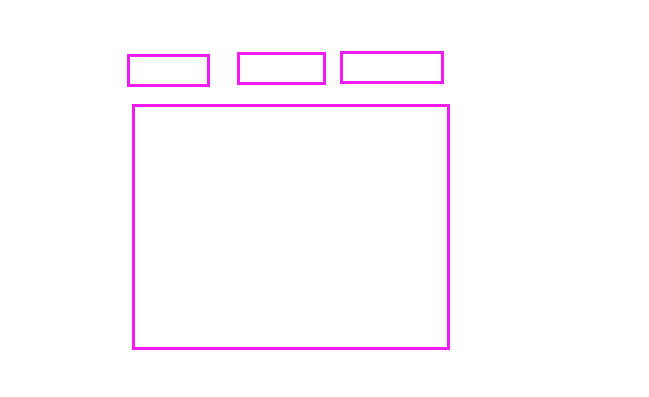

# Vue 组件进阶

**主要内容**

* 动态组件、异步组件
* 过渡动画
* provide/inject
* 自定义指令
* 过滤器

**学习目标**

 知识点| 要求 
 -| :- 
 Vue生命周期 | 掌握 
 provide/inject | 掌握 
 自定义指令 | 掌握 
 过滤器 | 掌握 


## ==前情回顾==

### 组件通信（传值）

#### 1、props

最简单、最基本的传值方式

适用于：父子之间

我们可以分为 ：非函数和函数数据

非函数：父向子传值

传函数数据：本质就是子向父传值

语法：`<Son  :msg='msg2'/》`  子：`props:['msg']`

不足：只适合父子，非父子不方便


#### 2、自定义事件

由来：因为父向子传递数据，子组件不能修改，非要修改，自己去触发一个事件，通知让父组件去修改。

步骤：

1. 子组件 `this.$emit('自定义事件名'，'参数')` 触发
2. 父组件 `v-on:自定义事件名` 监听  @change='fatherChange'

不足：只适合父子

#### 3、$root、$parent、$children、$refs

##### $root：根组件

全局，任何组件都能访问

不建议：大量用

##### $parent：获取父组件实例   

$parent.属性    $parent.方法()

缺点：父组件定义的状态不确定   msg

##### $children：获取子组件实例    [] 下标

缺点：子组件索引不确定

##### $refs: 唯一，获取DOM元素、组件

this.$refs.myRef


#### 4、插槽

子组件在定义时，并不确定要显示什么内容，由父组件来决定显示什么。

子组件：预留好插槽   slot

普通插槽：父向子

作用域插槽：子向父


#### 5、原型链

```js
Vue.prototype.$user='123'

this.$user
```

组件:

this :VueComponent

```js
VueComponent.protype=Object.create(Vue.prototype)
```


### 生命周期

Vue 组件从创建到销毁的过程

钩子函数：在特定时间点上触发的函数，自动调用

五个大阶段：初始化阶段、模板编译阶段、挂载阶段、更新阶段、销毁阶段

钩子函数：

beforeCreate：实例化之前，数据和方法还没有代理，vm，

​				特点：访问不到数据和方法；可以访问this     this.$el

created: 实例化之后。已经代理完成

​			特点：可以访问数据和方法；最早发送网络请求      this.$el   

beforeMount：挂载之前   将模板挂载到虚拟DOM时     注意：页面中是没数据   this.$el 还没有

mounted：挂载完成   可以操作DOM，this.$el 也有了    开定时器、绑定事件

beforeUpdate: 数据更新之后，界面更新之前

updated： 数据更新之后，界面也更新之后

beforeDestroy ：销毁之前，收尾工作   清除定时器、解绑事件、注册表单填了一半儿，用户关闭当前页面，给用户友好提醒

Destroyed：销毁之后


## 一、高级组件
### 1.1 动态组件

作用：让组件显示和隐藏   v-if

特点：
通过组件销毁 和重建过程实现组件切换 

语法：

```html
<component :is='加载的组件名称'></component>
```



#### 案例：选项卡功能：

```vue
<div>
    <div class="tabs">
        <div class="tab-item" @click="changeTab('Home')">Home 链接</div>
        <div class="tab-item" @click="changeTab('Personal')">Personal链接</div>
    </div>
    <!-- <Home/> -->
    <!-- 动态组件 -->
    <component :is="comName"></component>
</div>
```


```JS
import Home from "./Home.vue";
import Personal from "./Personal.vue";

export default {
  data() {
    return {
      comName: "Personal",
    };
  },
  components: {
    Home,
    Personal,
  },
  methods: {
    changeTab(name) {
      this.comName = name;
    },
  },
};
```


### 1.2  缓存组件

上面的动态组件，每次切换 mounted 执行一次，说明每次切换渲染一次。当组件比较多，内容比较多的话，耗性能。   v-show

```html
<!-- 动态组件 -->
<keep-alive :exclude='["Personal"]'>
    <component :is='comName'></component>
</keep-alive>
```

但是，如果有些请求，需要在mounted里发，就不可以了，如何解决？

以后，就可以在activated里发请求：

```js
mounted() {
    console.log('Home mounted')
},
    activated() {
        // 当使用keep-alive的时候可以利用activated代替mounted发送请求
        console.log('Home activated')
    },
        //失活
        deactivated() {
            // 当使用keep-alive的时候可以利用 deactivated 代替 destoyed 收尾工作，比如： 关闭定时器，清除缓存数据等
            console.log('Home deactivated')
        }
```


https://cn.vuejs.org/v2/guide/components-dynamic-async.html#%E5%9C%A8%E5%8A%A8%E6%80%81%E7%BB%84%E4%BB%B6%E4%B8%8A%E4%BD%BF%E7%94%A8-keep-alive

 

### 1.3 异步组件

在大型应用中，我们可能需要将应用分割成小一些的代码块，并且只在需要的时候才从服务器加载一个模块。Vue 只有在这个组件需要被渲染的时候才会触发该工厂函数，且会把结果缓存起来供未来重渲染。

对于页面一上来不需要加载的组件，可以写成异步组件

```js
Personal:()=>import('./Personal.vue'), //异步导入组件
//或者
const Personal=()=>import('./Personal.vue')
```


## 第11个钩子函数：errorCaptured

在捕获一个==来自后代组件的错误时==被调用。此钩子会收到三个参数：错误对象、发生错误的组件实例以及一个包含错误来源信息的字符串。此钩子可以返回 `false` 以阻止该错误继续向上传播。

子组件：

```js
 mounted() {
     //打印一个没有定义的变量
      console.log(a);
  },
```

父组件：ErrorParent.vue

```js
errorCaptured: (err, vm, info) => {
    //错误对象、发生错误的组件实例以及一个包含错误来源信息的字符串
    console.log(err, vm, info);
    return false
  },
```

全局捕获:

```js
// 当前整个应用的全局捕获
Vue.config.errorHandler = function (err, vm, info) {
  console.log(err, vm, info);
  console.log('全局错误捕获')
}
```


## 二、过渡与动画

### 过渡

Vue把元素的过渡分为两个阶段：进入阶段和离开阶段

能对什么过渡：对连续的过程可以加过渡。比如：颜色变化，宽高的变化

进入过程：元素从无到有

离开过程：元素从有到无


语法：

```html
<button @click="isShow = !isShow">点击切换</button>
<transition name="slide">
    <div class="box" v-show="isShow"></div>
</transition>
```


#### 总结：

1. 理解进入和离开，一共6个类
2. 哪个元素在变化，就给哪个元素使用transition标签（vue给我们定义的一个子组件标签）
3. 组件标签使用时候，name值决定了类名的前缀
4. 变化的元素添加过渡，就是给对应的类名添加样式


### 动画：参考官网

https://cn.vuejs.org/v2/guide/transitions.html#ad


### 自定义过渡类名与三方库结合

官网：http://www.animate.net.cn/

https://github.com/animate-css/animate.css


1. 写法1：animate.css@3.5.1

   1. 引入在线的cdn的库  或者是下载到本地 引入本地静态css文件 
      引入在style
      @import url("https://cdn.jsdelivr.net/npm/animate.css@3.5.1"); 

   2. 安装：

      （1）安装
      
      ```bash
      npm i animate.css@3.x -S 
      ```
      
      （2）main.js 引入样式
      
      ```js
      import 'animate.css'
      ```
      
      （3）使用
      
      ```vue
      <div class="box animated fadeOut"></div>
      ```
      
      

2. 写法2：animate.css@4.x

   1. 引入在线的cdn的库  或者是下载到本地 引入本地静态css文件 

   2. 安装：npm i animate.css -S 

   3. 引入：import 'animate.css';

      ```html
      <h1 class="animate__animated animate__bounce">An animated element</h1>
      ```

      


### 2.1 介绍

Vue 在插入、更新或者移除 DOM 时，提供多种不同方式的应用过渡效果。包括以下工具：

- 在 CSS 过渡和动画中自动应用 class
- 可以配合使用第三方 CSS 动画库，如 Animate.css
- 在过渡钩子函数中使用 JavaScript 直接操作 DOM
- 可以配合使用第三方 JavaScript 动画库，如 Velocity.js


Vue 提供了 `transition` 的封装组件，在下列情形中，可以给任何元素和组件添加进入/离开过渡

- 条件渲染 (使用 `v-if`)
- 条件展示 (使用 `v-show`)
- 动态组件
- 组件根节点

这里是一个典型的例子：

```html
<div id="demo">
  <button v-on:click="show = !show">
    Toggle
  </button>
  <transition name="fade">
    <p v-if="show">hello</p>
  </transition>
</div>
new Vue({
  el: '#demo',
  data: {
    show: true
  }
})
.fade-enter-active, .fade-leave-active {
  transition: opacity .5s;
}
.fade-enter, .fade-leave-to /* .fade-leave-active below version 2.1.8 */ {
  opacity: 0;
}
```

​	

当插入或删除包含在 `transition` 组件中的元素时，Vue 将会做以下处理：

1. 自动嗅探目标元素是否应用了 CSS 过渡或动画，如果是，在恰当的时机添加/删除 CSS 类名。
2. 如果过渡组件提供了，这些钩子函数将在恰当的时机被调用。
3. 如果没有找到 JavaScript 钩子并且也没有检测到 CSS 过渡/动画，DOM 操作 (插入/删除) 在下一帧中立即执行。(注意：此指浏览器逐帧动画机制，和 Vue 的 `nextTick` 概念不同)


### 2.2 过渡类名

在进入/离开的过渡中，会有 6 个 class 切换。

1. `v-enter`：定义进入过渡的开始状态。在元素被插入之前生效，在元素被插入之后的下一帧移除。

2. `v-enter-active`：定义进入过渡生效时的状态。在整个进入过渡的阶段中应用，在元素被插入之前生效，在过渡/动画完成之后移除。这个类可以被用来定义进入过渡的过程时间，延迟和曲线函数。

3. `v-enter-to`：**2.1.8 版及以上**定义进入过渡的结束状态。在元素被插入之后下一帧生效 (与此同时 `v-enter` 被移除)，在过渡/动画完成之后移除。

4. `v-leave`：定义离开过渡的开始状态。在离开过渡被触发时立刻生效，下一帧被移除。

5. `v-leave-active`：定义离开过渡生效时的状态。在整个离开过渡的阶段中应用，在离开过渡被触发时立刻生效，在过渡/动画完成之后移除。这个类可以被用来定义离开过渡的过程时间，延迟和曲线函数。

6. `v-leave-to`：**2.1.8 版及以上**定义离开过渡的结束状态。在离开过渡被触发之后下一帧生效 (与此同时 `v-leave` 被删除)，在过渡/动画完成之后移除。

   


对于这些在过渡中切换的类名来说，如果你使用一个没有名字的 `<transition>`，则 `v-` 是这些类名的默认前缀。如果你使用了 `<transition name="my-transition">`，那么 `v-enter` 会替换为 `my-transition-enter`。

`v-enter-active` 和 `v-leave-active` 可以控制进入/离开过渡的不同的缓和曲线，在下面章节会有个示例说明。


#### 2.2.1 css过渡

常用的过渡都是使用 CSS 过渡。

下面是一个简单例子：

```html
<div id="example-1">
  <button @click="show = !show">
    Toggle render
  </button>
  <transition name="slide-fade">
    <p v-if="show">hello</p>
  </transition>
</div>

```

```css
new Vue({
  el: '#example-1',
  data: {
    show: true
  }
})
/* 可以设置不同的进入和离开动画 */
/* 设置持续时间和动画函数 */
.slide-fade-enter-active {
  transition: all .3s ease;
}
.slide-fade-leave-active {
  transition: all .8s cubic-bezier(1.0, 0.5, 0.8, 1.0);
}
.slide-fade-enter, .slide-fade-leave-to
/* .slide-fade-leave-active for below version 2.1.8 */ {
  transform: translateX(10px);
  opacity: 0;
}
```

​	


#### 2.2.2 css动画

CSS 动画用法同 CSS 过渡，区别是在动画中 `v-enter` 类名在节点插入 DOM 后不会立即删除，而是在 `animationend` 事件触发时删除。

示例：(省略了兼容性前缀)

```html
<div id="example-2">
  <button @click="show = !show">Toggle show</button>
  <transition name="bounce">
    <p v-if="show">Lorem ipsum dolor sit amet, consectetur adipiscing elit. Mauris facilisis enim libero, at lacinia diam fermentum id. Pellentesque habitant morbi tristique senectus et netus.</p>
  </transition>
</div>
```


```js
new Vue({
  el: '#example-2',
  data: {
    show: true
  }
})
```

```css
.bounce-enter-active {
  animation: bounce-in .5s;
}
.bounce-leave-active {
  animation: bounce-in .5s reverse;
}
@keyframes bounce-in {
  0% {
    transform: scale(0);
  }
  50% {
    transform: scale(1.5);
  }
  100% {
    transform: scale(1);
  }
}
```

​	

### 2.3 自定义过渡的类名

我们可以通过以下 attribute 来自定义过渡类名：

- `enter-class`
- `enter-active-class`
- `enter-to-class` (2.1.8+)
- `leave-class`
- `leave-active-class`
- `leave-to-class` (2.1.8+)

他们的优先级高于普通的类名，这对于 Vue 的过渡系统和其他第三方 CSS 动画库，如 [Animate.css](https://daneden.github.io/animate.css/) 结合使用十分有用。

示例：

```html
<link href="https://cdn.jsdelivr.net/npm/animate.css@3.5.1" rel="stylesheet" type="text/css">

<div id="example-3">
  <button @click="show = !show">
    Toggle render
  </button>
  <transition
    name="custom-classes-transition"
    enter-active-class="animated tada"
    leave-active-class="animated bounceOutRight"
  >
    <p v-if="show">hello</p>
  </transition>
</div>
```

```js
new Vue({
  el: '#example-3',
  data: {
    show: true
  }
})
```

### 2.4 初始渲染的过渡

可以通过 `appear` attribute 设置节点在初始渲染的过渡

```html
<transition appear>
  <!-- ... -->
</transition>
```


### 2.5 多个元素过渡动画

我们之后讨论多个组件的过渡，对于原生标签可以使用 `v-if`/`v-else`。最常见的多标签过渡是一个列表和描述这个列表为空消息的元素：

```html
<transition>
  <table v-if="items.length > 0">
    <!-- ... -->
  </table>
  <p v-else>Sorry, no items found.</p>
</transition>
```

可以这样使用，但是有一点需要注意：

当有**相同标签名**的元素切换时，需要通过 `key` attribute 设置唯一的值来标记以让 Vue 区分它们，否则 Vue 为了效率只会替换相同标签内部的内容。即使在技术上没有必要，**给在 `<transition>` 组件中的多个元素设置 key 是一个更好的实践。**

示例：

```html
<transition>
  <button v-if="isEditing" key="save">
    Save
  </button>
  <button v-else key="edit">
    Edit
  </button>
</transition>
```

在一些场景中，也可以通过给同一个元素的 `key` attribute 设置不同的状态来代替 `v-if` 和 `v-else`，上面的例子可以重写为：

```html
<transition>
  <button v-bind:key="isEditing">
    {{ isEditing ? 'Save' : 'Edit' }}
  </button>
</transition>
```

使用多个 `v-if` 的多个元素的过渡可以重写为绑定了动态 property 的单个元素过渡。例如：

```html
<transition>
  <button v-if="docState === 'saved'" key="saved">
    Edit
  </button>
  <button v-if="docState === 'edited'" key="edited">
    Save
  </button>
  <button v-if="docState === 'editing'" key="editing">
    Cancel
  </button>
</transition>
```

可以重写为：

```html
<transition>
  <button v-bind:key="docState">
    {{ buttonMessage }}
  </button>
</transition>
```

### 2.6 过渡模式

同时生效的进入和离开的过渡不能满足所有要求，所以 Vue 提供了**过渡模式**

- `in-out`：新元素先进行过渡，完成之后当前元素过渡离开。
- `out-in`：当前元素先进行过渡，完成之后新元素过渡进入。

用 `out-in` 重写之前的开关按钮过渡：

```html
<transition name="fade" mode="out-in">
  <!-- ... the buttons ... -->
</transition>
```


## 三、provide/inject

### 3.1 介绍

​	 常用的父子组件通信方式都是父组件绑定要传递给子组件的数据，子组件通过props属性接收，一旦组件层级变多时，采用这种方式一级一级传递值非常麻烦，而且代码可读性不高，不便后期维护。

  vue提供了provide和inject帮助我们解决**多层次嵌套嵌套通信问题**。在provide中指定要传递给子孙组件的数据，子孙组件通过inject注入祖父组件传递过来的数据。


https://cn.vuejs.org/v2/api/#provide-inject

1. 说明：   

   vue组件之间的数据传递  ==深层数据传递== 顶级向子代传递数据
   例如：
       父传递子组件 prop  父组件->孙子   父组件->曾孙子 可以用prop是实现

2. 语法
       提供数据：provide：Object 或者 () => Object
        接受数据：inject：Array<string> 或者 { [key: string]: string | Symbol | Object }

   ​	常用的是：provide是函数形式，inject是数组形式

3. 基础使用

   1. 父组件：静态数据，provide写成对象形式，不可以访问data里数据

      ```js
      data(){
      
      },
      //provide传递数据
      //写法1：对象写法  
       provide:{
           info:'我是-provide传递数据'
       },
      ```

      

   2. 后代组件：

      ```js
      inject:['msg']
      //接受数据--顶层
      //写法1：数组--推荐
      inject:['info','msg'],
      ```

      

4. 常用写法

   1. 父组件：动态数据，provide写成函数形式，可以访问data里数据

      ```js
      data(){
      
      },
      //写法2：函数形式 返回对象
      provide(){
          //加工处理数据--- 
          return {
              info:'我是-provide传递数据---'+this.count,
              msg:this.msg
          }
      },
      ```

      

   2. 后代组件：推荐使用数组形式

      ```js
      inject:['msg']
      //接受数据--顶层
      //写法1：数组--推荐
       inject:['info','msg'],
      ```

      写法2：对象形式，可以重新命名

      ```js
      //写法2:对象
      inject:{
          aa:{
              from: 'info',//来源--真实的字段名称 
              default: '默认值'  //设置默认值 
          },
          bb:'msg',
      }
      ```

      

5. 提示：==provide 和 inject 绑定并不是可响应的。这是刻意为之的==

我们可以把依赖注入看做是大范围的 props

对于祖先不知道数据将提供给谁

对于子孙不知道数据从哪里来


### 3.2 语法

**说明：类型：**

​      **provide**：Object | () => Object

​      **inject：**Array<string> | { [key: string]: string | Symbol | Object }

**详细：**

 provide 和 inject 主要在***\*开发高阶插件/组件库\****时使用。并不推荐用于普通应用程序代码中。 这对选项需要一起使用，以允许一个祖先组件向其所有子孙后代注入一个依赖，不论组件层次有多深，并在其上下游关系成立的时间里始终生效。

 **语法说明：**

 provide 选项应该是一个对象或返回一个对象的函数。该对象包含可注入其子孙的 property

 **inject 选项应该是**：

一个字符串数组，或一个对象，对象的 key 是本地的绑定名，value 是：

在可用的注入内容中搜索用的 key (字符串或 Symbol)，或 一个对象，该对象的：

 from property 是在可用的注入内容中搜索用的 key (字符串或 Symbol)

 default property 是降级情况下使用的 value


## 四、自定义指令

### 4.1 介绍

指令：v-

例子：

```js
yuansu.focus();
this.$refs.MyInput.foucs()

v-focus
```


除了核心功能默认内置的指令 (`v-model` 和 `v-show`)，Vue 也允许注册自定义指令。注意，在 Vue2.0 中，代码复用和抽象的主要形式是组件。然而，有的情况下，你仍然需要对普通 DOM 元素进行底层操作，这时候就会用到自定义指令。

​	

举个聚焦输入框的例子，如下：

当页面加载时，该元素将获得焦点 (注意：`autofocus` 在移动版 Safari 上不工作)。事实上，只要你在打开这个页面后还没点击过任何内容，这个输入框就应当还是处于聚焦状态。现在让我们用指令来实现这个功能：

```vue
<input v-focus />
```


```js
// 注册一个全局自定义指令 `v-focus`
Vue.directive('focus', {
  // 当被绑定的元素插入到 DOM 中时……
  inserted: function (el) {
    // 聚焦元素
    el.focus()
  }
})
```

如果想注册局部指令，组件中也接受一个 `directives` 的选项：

```js
directives: {
  focus: {
    // 指令的定义
    inserted: function (el) {
      el.focus()
    }
  }
}
```

然后你可以在模板中任何元素上使用新的 `v-focus` property，如下：

```html
<input v-focus>
```


### 4.2 钩子函数

一个指令定义对象可以提供如下几个钩子函数 (均为可选)：

- `bind`：只调用一次，指令第一次绑定到元素时调用。在这里可以进行一次性的初始化设置。
- `inserted`：被绑定元素插入父节点时调用 (仅保证父节点存在，但不一定已被插入文档中)。
- `update`：所在组件的 VNode 更新时调用，**但是可能发生在其子 VNode 更新之前**。指令的值可能发生了改变，也可能没有。但是你可以通过比较更新前后的值来忽略不必要的模板更新 (详细的钩子函数参数见下)。

- `componentUpdated`：指令所在组件的 VNode **及其子 VNode** 全部更新后调用。
- `unbind`：只调用一次，指令与元素解绑时调用。

接下来我们来看一下钩子函数的参数 (即 `el`、`binding`、`vnode` 和 `oldVnode`)。


### 4.3 钩子函数的参数

指令钩子函数会被传入以下参数：

- `el`：指令所绑定的元素，可以用来直接操作 DOM。

- ```
  binding
  ```

  ：一个对象，包含以下 property：

  - `name`：指令名，不包括 `v-` 前缀。
  - `value`：指令的绑定值，例如：`v-my-directive="1 + 1"` 中，绑定值为 `2`。
  - `oldValue`：指令绑定的前一个值，仅在 `update` 和 `componentUpdated` 钩子中可用。无论值是否改变都可用。
  - `expression`：字符串形式的指令表达式。例如 `v-my-directive="1 + 1"` 中，表达式为 `"1 + 1"`。
  - `arg`：传给指令的参数，可选。例如 `v-my-directive:foo` 中，参数为 `"foo"`。
  - `modifiers`：一个包含修饰符的对象。例如：`v-my-directive.foo.bar` 中，修饰符对象为 `{ foo: true, bar: true }`。

- `vnode`：Vue 编译生成的虚拟节点。移步 [VNode API](https://cn.vuejs.org/v2/api/#VNode-接口) 来了解更多详情。

- `oldVnode`：上一个虚拟节点，仅在 `update` 和 `componentUpdated` 钩子中可用。

这是一个使用了这些 property 的自定义钩子样例：

```html
<div id="hook-arguments-example" v-demo:foo.a.b="message"></div>
```

```js
Vue.directive('demo', {
  bind: function (el, binding, vnode) {
    var s = JSON.stringify
    el.innerHTML =
      'name: '       + s(binding.name) + '<br>' +
      'value: '      + s(binding.value) + '<br>' +
      'expression: ' + s(binding.expression) + '<br>' +
      'argument: '   + s(binding.arg) + '<br>' +
      'modifiers: '  + s(binding.modifiers) + '<br>' +
      'vnode keys: ' + Object.keys(vnode).join(', ')
  }
})

new Vue({
  el: '#hook-arguments-example',
  data: {
    message: 'hello!'
  }
})
```


## 五、 过滤器

### 5.1 介绍

Vue.js 允许你自定义过滤器，可被用于一些常见的文本格式化。过滤器可以用在两个地方：**双花括号插值和 `v-bind` 表达式** (后者从 2.1.0+ 开始支持)。

​	

过滤器应该被添加在 JavaScript 表达式的尾部，由“管道”符号指示：

```html
<!-- 在双花括号中 -->
{{ message | capitalize }}

<!-- 在 `v-bind` 中 -->
<div v-bind:id="rawId | formatId"></div>
```

你可以在一个组件的选项中


### 5.2 定义本地的过滤器：

```js
filters: {
  capitalize: function (value) {
    if (!value) return ''
    value = value.toString()
    return value.charAt(0).toUpperCase() + value.slice(1)
  }
}
```


### 5.3 全局定义过滤器

创建 Vue 实例之前全局定义过滤器：

```js
Vue.filter('capitalize', function (value) {
  if (!value) return ''
  value = value.toString()
  return value.charAt(0).toUpperCase() + value.slice(1)
})

new Vue({
  // ...
})
```

当全局过滤器和局部过滤器重名时，会采用局部过滤器。

过滤器函数总接收表达式的值 (之前的操作链的结果) 作为第一个参数。在上述例子中，`capitalize` 过滤器函数将会收到 `message` 的值作为第一个参数。

过滤器可以串联：

```html
{{ message | filterA | filterB }}
```

在这个例子中，`filterA` 被定义为接收单个参数的过滤器函数，表达式 `message` 的值将作为参数传入到函数中。然后继续调用同样被定义为接收单个参数的过滤器函数 `filterB`，将 `filterA` 的结果传递到 `filterB` 中。

过滤器是 JavaScript 函数，因此可以接收参数：

```html
{{ message | filterA('arg1', arg2) }}
```

这里，`filterA` 被定义为接收三个参数的过滤器函数。其中 `message` 的值作为第一个参数，普通字符串 `'arg1'` 作为第二个参数，表达式 `arg2` 的值作为第三个参数。


## 六、Moment.js

http://momentjs.cn/


JavaScript 日期处理类库

安装：

```bash
npm install moment --save   # npm  -S
```

引入：

```js
import moment from 'moment'
```

使用：

##### 日期格式化

```js
moment().format('MMMM Do YYYY, h:mm:ss a'); // 五月 4日 2022, 2:33:59 下午
moment().format('dddd');                    // 星期三
moment().format("MMM Do YY");               // 5月 4日 22
moment().format('YYYY [escaped] YYYY');     // 2022 escaped 2022
moment().format();                          // 2022-05-04T14:33:59+08:00
```

##### 相对时间

```js
moment("20111031", "YYYYMMDD").fromNow(); // 11 年前
moment("20120620", "YYYYMMDD").fromNow(); // 10 年前
moment().startOf('day').fromNow();        // 15 小时前
moment().endOf('day').fromNow();          // 9 小时内
moment().startOf('hour').fromNow();       // 34 分钟前
```

##### 日历时间

```js
moment().subtract(10, 'days').calendar(); // 2022/04/24
moment().subtract(6, 'days').calendar();  // 上星期四14:33
moment().subtract(3, 'days').calendar();  // 上星期日14:33
moment().subtract(1, 'days').calendar();  // 昨天14:33
moment().calendar();                      // 今天14:33
moment().add(1, 'days').calendar();       // 明天14:33
moment().add(3, 'days').calendar();       // 下星期六14:33
moment().add(10, 'days').calendar();      // 2022/05/14
```

##### 多语言支持

```js
moment.locale('zh-cn').format();         // zh-cn
```


