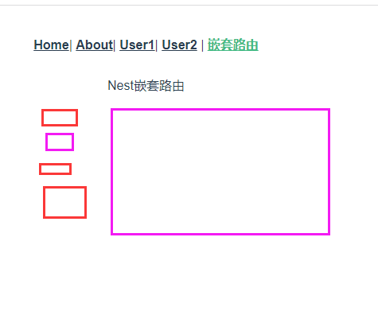

# Vue 路由

**主要内容**

* 路由基础安装
* 路由配置
* 动态路由匹配
* 嵌套路由
* 编程式导航
* 命名路由、重定向和别名
* 路由组件传参

**学习目标**

 知识点| 要求 
 -| :- 
 路由配置 | 掌握 
 动态路由匹配 | 掌握 
 嵌套路由 | 掌握 
 编程式导航 | 掌握 
 命名路由、重定向和别名 | 掌握 
 路由组件传参 | 掌握 


## ==组件进阶回顾==


### 1、高级组件

动态组件:What ?  Why?  How?  动态加载的组件

v-if 添加、删除

```vue
<component :is='comName'/>

data:{
	comName:'Home'
}
```


缓存组件：用途优化

```vue
<keep-alive>
	<component />
</keep-alive>
```

mounted() 此之前的，都不会再走 、BeforeDestroy  Destroyed

替代的生命周期：激活、失活

```js
activated(){
    
},
deActivated(){
    
}
```


异步组件: 用于性能优化

```js
import Home from './Home'

const  Home=()=>import('./Home')

components:{
    Home:()=>import('./Home')
}
```


### 2、错误捕获

不能解决错误，只是让错误不以红色展示。 黑色

父组件捕获子组件

```js
errorCaptured(err，vm,info){


}

Vue.config.errorHandler=func。。。。
```


### 3、Provide/Inject

props：繁琐。

深层传递，只要保证组件有嵌套关系

provide：提供数据  对象或方法

inject：使用数据    数组或对象

```js
data(){
    return{
        
    }
},
provide:{
    msg:'sdsfsf'
}，
provide:function(){
    
}
```


特点：不是响应式的

为什么：祖先提供的数据不知道谁会接受

子孙接受的数据不知道谁提供


### 4、自定义指令

```html
<div v-XX="{color:''}"></div>
```


```js

//全局指令
Vue.directive('',{
    //当前元素插入到DOM中时，被触发
	inserted:function(el,binding){
        
    }
})

data(){
    return{
        
    }
},
directives:{
    xx:{
       inserted:function(el){
        
    	} 
    },
    yy:{
	
    }
},
filers:{
    
}
```

### 5、过滤器

```vue
{{msg|upper}}
```


```js
Vue.filter("upper",function(val){

	return val+'000'
})
```


## 一、路由基础安装


#### 非路由组件和路由组件

组件：HTML、JS、CSS 结合    功能      定义、注册、使用

非路由组件：静静在页面中存在，不需要点击，不用跳转

components/

注册：需要在另外一个组件里注册  import Header from './Header'  compoents{ Header}


路由组件：通过点击跳转，切换的组件

注册：在路由中注册

views/    pages/


### 1. 1 简介

​	

Vue Router 是 [Vue.js (opens new window)](http://cn.vuejs.org/)官方的路由管理器。它和 Vue.js 的核心深度集成，让构建单页面应用变得易如反掌。包含的功能有：

- 嵌套的路由/视图表
- 模块化的、基于组件的路由配置
- 路由参数、查询、通配符
- 基于 Vue.js 过渡系统的视图过渡效果
- 细粒度的导航控制
- 带有自动激活的 CSS class 的链接
- HTML5 历史模式或 hash 模式，在 IE9 中自动降级
- 自定义的滚动条行为


步骤：

1. 安装路由

   npm i vue-router@3.5 -S

2. 引入路由插件   ==main.js==:

   ```js
   // 引入路由插件
   import VueRouter  from 'vue-router'
   
   // 安装路由  install（）
   Vue.use(VueRouter)
   ```

3. 定义(views)并且引入路由组件 ：    ==main.js==:

   ```js
   //引入路由组件
   import Home from './views/Home.vue'
   import News from  './views/News.vue'
   ```

4. 定义路由表（配置规则）

   ```js
   // 4、定义路由规则
   const routes = [{
     path: '/home', //path： 路径  /+地址
     component: Home
   }, {
     path: '/news',
     component: News
   }]
   ```

5. 创建VueRouter实例

   ```js
   const router = new VueRouter({
     routes: routes
   })
   
   ```

6. 挂载路由

   ```js
   new Vue({
     render: h => h(App),
     router
   }).$mount('#app')
   ```

7. 定义路由出口（舞台） App.vue

   ```html
   <router-view></router-view>
   ```

8. 路由导航  App.vue

   ```html
   <!-- 路由导航 -->
       <router-link to="/home">首页</router-link>
        <router-link to="/news">新闻</router-link>
       
      <!-- 路由出口 -->
      <router-view />
   ```

   

#### 脚手架安装

安装时选择vue-router

vue create vue-router-project


ESlint 不要


W


### 1.2 安装

方式1：npm安装

​	

方式2：vue-cli安装

​	

​	      

​	      


## 二、路由配置

### 2.1 JavaScript

​	


### 2.2 HTML

​	

## 三、动态路由匹配


### 3.1 介绍

​	我们经常需要把某种模式匹配到的所有路由，全都映射到同个组件。例如，我们有一个 `User` 组件，对于所有 ID 各不相同的用户，都要使用这个组件来渲染。那么，我们可以在 `vue-router` 的路由路径中使用“动态路径参数”(dynamic segment) 来达到这个效果：

```js
const User = {
  template: '<div>User</div>'
}
const routes=[
    // 动态路径参数 以冒号开头
    { path: '/user/:id', component: User }
  ],
      
const router = new VueRouter({
  routes: [
    // 动态路径参数 以冒号开头
    { path: '/user/:id', component: User }
  ]
})
```

现在呢，像 `/user/foo` 和 `/user/bar` 都将映射到相同的路由。

一个“路径参数”使用冒号 `:` 标记。当匹配到一个路由时，参数值会被设置到 `this.$route.params`，可以在每个组件内使用。于是，我们可以更新 `User` 的模板，输出当前用户的 ID：

```js
const User = {
  template: '<div>User {{ $route.params.id }}</div>'
}
```


### 3.2 路径参数

你可以在一个路由中设置多段“路径参数”，对应的值都会设置到 `$route.params` 中。例如：


除了 `$route.params` 外，`$route` 对象还提供了其它有用的信息，例如，`$route.query` (如果 URL 中有查询参数)、`$route.hash` 等等。


## 四、嵌套路由




### 4.1 介绍

实际生活中的应用界面，通常由多层嵌套的组件组合而成。同样地，URL 中各段动态路径也按某种结构对应嵌套的各层组件

​	

例如：

​	

借助 `vue-router`，使用嵌套路由配置，就可以很简单地表达这种关系

### 4.2 嵌套语法

要在嵌套的出口中渲染组件，需要在 `VueRouter` 的参数中使用 `children` 配置：

```js
const router = new VueRouter({
  routes: [
    {
      path: '/user/:id',
      component: User,
      children: [
        {
          // 当 /user/:id/profile 匹配成功，
          // UserProfile 会被渲染在 User 的 <router-view> 中
          path: 'profile',
          component: UserProfile
        },
        {
          // 当 /user/:id/posts 匹配成功
          // UserPosts 会被渲染在 User 的 <router-view> 中
          path: 'posts',
          component: UserPosts
        }
      ]
    }
  ]
})
```

要注意，以 `/` 开头的嵌套路径会被当作根路径。 这让你充分的使用嵌套组件而无须设置嵌套的路径。

你会发现，`children` 配置就是像 `routes` 配置一样的路由配置数组，所以呢，你可以嵌套多层路由。

此时，基于上面的配置，当你访问 `/user/foo` 时，`User` 的出口是不会渲染任何东西，这是因为没有匹配到合适的子路由。如果你想要渲染点什么，可以提供一个 空的 子路由：

```js
const router = new VueRouter({
  routes: [
    {
      path: '/user/:id',
      component: User,
      children: [
        // 当 /user/:id 匹配成功，
        // UserHome 会被渲染在 User 的 <router-view> 中
        { path: '', component: UserHome }

        // ...其他子路由
      ]
    }
  ]
})
```


## 五、编程式导航

### 5.1 介绍

声明式导航：<router-link>

编程式导航：JS控制跳转

除了使用 `<router-link>` 创建 a 标签来定义导航链接，我们还可以借助 router 的实例方法，通过编写代码来实现。

```js
router.push(location, onComplete?, onAbort?)
```

**注意：在 Vue 实例内部，你可以通过 `$router` 访问路由实例。因此你可以调用 `this.$router.push`。**

想要导航到不同的 URL，则使用 `router.push` 方法。这个方法会向 history 栈添加一个新的记录，所以，当用户点击浏览器后退按钮时，则回到之前的 URL。

当你点击 `<router-link>` 时，这个方法会在内部调用，所以说，点击 `<router-link :to="...">` 等同于调用 `router.push(...)`。

| 声明式                    | 编程式             |
| ------------------------- | ------------------ |
| `<router-link :to="...">` | `router.push(...)` |

该方法的参数可以是一个字符串路径，或者一个描述地址的对象。例如：

```js
// 字符串
router.push('home')

// 对象
router.push({ path: 'home' })

// params方式： 命名的路由 给路由规则加个名字    /user/123/zhangsan
router.push({ name: 'user', params: { userId: '123' }})

// 带查询参数，变成 /register?plan=private&ws=apple
router.push({ path: 'register', query: { plan: 'private', }})
```


### 带参数

```js
//编程式导航带参数
    goUser() {
      //命名的路由跳转，传参  name只能和params搭配使用；path不能和params一起使用
      this.$router.push({
        name:'User',
        params:{
          uname:'admin',
          id:3344
        }
      })

      //path路径跳转 path传参要拼接
      this.$router.push({
        path: "/user/admin/4455",
      });
    },
```


**注意：如果提供了 `path`，`params` 会被忽略，上述例子中的 `query` 并不属于这种情况。取而代之的是下面例子的做法，你需要提供路由的 `name` 或手写完整的带有参数的 `path`：**

```js
const userId = '123'
router.push({ name: 'user', params: { userId }}) // -> /user/123
router.push({ path: `/user/${userId}` }) // -> /user/123
// 这里的 params 不生效
router.push({ path: '/user', params: { userId }}) // -> /user
```

同样的规则也适用于 `router-link` 组件的 `to` 属性。


在 2.2.0+，可选的在 `router.push` 或 `router.replace` 中提供 `onComplete` 和 `onAbort` 回调作为第二个和第三个参数。这些回调将会在导航成功完成 (在所有的异步钩子被解析之后) 或终止 (导航到相同的路由、或在当前导航完成之前导航到另一个不同的路由) 的时候进行相应的调用。在 3.1.0+，可以省略第二个和第三个参数，此时如果支持 Promise，`router.push` 或 `router.replace` 将返回一个 Promise。


**注意**： 如果目的地和当前路由相同，只有参数发生了改变 (比如从一个用户资料到另一个 `/users/1` -> `/users/2`)，你需要使用 [`beforeRouteUpdate`](https://router.vuejs.org/zh/guide/essentials/dynamic-matching.html#响应路由参数的变化) 来响应这个变化 (比如抓取用户信息)。


### 5.2 跳转路由 replace

```js
router.replace(location, onComplete?, onAbort?)
```

跟 `router.push` 很像，唯一的不同就是，它不会向 history 添加新记录，而是跟它的方法名一样 —— 替换掉当前的 history 记录。

| 声明式                            | 编程式                |
| --------------------------------- | --------------------- |
| `<router-link :to="..." replace>` | `router.replace(...)` |


==特点：关闭当前路由界面，打开新的路由界面，并且没有历史记录==


### 5.3 返回  go

这个方法的参数是一个整数，意思是在 history 记录中向前或者后退多少步，类似 `window.history.go(n)`。

例子

​	


## 六、命名路由、重定向和别名

### 6.1 命名路由

有时候，通过一个名称来标识一个路由显得更方便一些，特别是在链接一个路由，或者是执行一些跳转的时候。你可以在创建 Router 实例的时候，在 `routes` 配置中给某个路由设置名称。

```js
const router = new VueRouter({
  routes: [
    {
      path: '/user/:userId',
      name: 'user',
      component: User
    }
  ]
})
```

要链接到一个命名路由，可以给 `router-link` 的 `to` 属性传一个对象：

```html
<router-link :to="{ name: 'user', params: { userId: 123 }}">User</router-link>
```

这跟代码调用 `router.push()` 是一回事：

```js
router.push({ name: 'user', params: { userId: 123 } })
```

这两种方式都会把路由导航到 `/user/123` 路径。


### 6.2 重定向

重定向也是通过 `routes` 配置来完成，下面例子是从 `/a` 重定向到 `/b`：

```js
const router = new VueRouter({
  routes: [
    { path: '/a', redirect: '/b' }
  ]
})
```

重定向的目标也可以是一个命名的路由：

```js
const router = new VueRouter({
  routes: [
    { path: '/a', redirect: { name: 'foo' }}
  ]
})
```

甚至是一个方法，动态返回重定向目标：

```js
const router = new VueRouter({
  routes: [
    { path: '/a', redirect: to => {
      // 方法接收 目标路由 作为参数
      // return 重定向的 字符串路径/路径对象
    }}
  ]
})
```

注意[导航守卫](https://router.vuejs.org/zh/guide/advanced/navigation-guards.html)并没有应用在跳转路由上，而仅仅应用在其目标上。在下面这个例子中，为 `/a` 路由添加一个 `beforeEnter` 守卫并不会有任何效果。


### 6.3 别名

表单：添加、修改 共有组件 /add  /update


“重定向”的意思是，当用户访问 `/a`时，URL 将会被替换成 `/b`，然后匹配路由为 `/b`，那么“别名”又是什么呢？

**`/a` 的别名是 `/b`，意味着，当用户访问 `/b` 时，URL 会保持为 `/b`，但是路由匹配则为 `/a`，就像用户访问 `/a` 一样。**


'/add'   '/modify'

上面对应的路由配置为：

```js
const router = new VueRouter({
  routes: [
    { path: '/a', component: A, alias: '/b' }
  ]
})
```

“别名”的功能让你可以自由地将 UI 结构映射到任意的 URL，而不是受限于配置的嵌套路由结构。

==用途：多个功能共享一个组件。给用户感觉，跳转到新界面了，但其实，还是同一个组件==

表单：添加、修改 共有组件   /add  /update  


## 七 、路由组件传参

### 7.1 介绍

==耦合度越低越好==

在组件中使用 `$route` 会使之与其对应路由形成高度耦合，从而使组件只能在某些特定的 URL 上使用，限制了其灵活性。

使用 `props` 将组件和路由解耦：

### 7.2  取代与 `$route` 的耦合

```js
const User = {
  template: '<div>User {{ $route.params.id }}</div>'
}
const router = new VueRouter({
  routes: [{ path: '/user/:id', component: User }]
})
```

### 7.3 通过 `props` 解耦

```js
//第二步：组件里
const User = {
  props: ['id'],
  template: '<div>User {{ id }}</div>'
}
//第一步：
const routes = [{ path: '/user/:id', component: User, props: true }]
```

这样你便可以在任何地方使用该组件，使得该组件更易于重用和测试。

### 7.4 布尔模式

如果 `props` 被设置为 `true`，`route.params` 将会被设置为组件属性。


https://v3.router.vuejs.org/zh/guide/essentials/passing-props.html#%E5%87%BD%E6%95%B0%E6%A8%A1%E5%BC%8F


## 八、HTML5 History 模式

1. 说明:
   vue-router 默认 hash 模式 —— 使用 URL 的 hash 来模拟一个完整的 URL，于是当 URL 改变时，页面不会重新加载。
    如果不想要很丑的 hash，我们可以用路由的 history 模式，这种模式充分利用 history.pushState API 来完成 URL 跳转而无须重新加载页面

2. 路由模式

   1. 默认 hash 模式   http://yoursite.com/#/user/id 有#
   2. history 模式     http://yoursite.com/user/id 没有
      注意：
        ==使用这个history 模式 在发布项目到线上的时候，需要后台的支持。==

3. 语法配置

   ```js
   const router = new VueRouter({
       mode: 'history',
       routes: [...]
   })
   ```


## 九、导航高亮

1. Router-link默认携带class：router-link-active和router-link-exact-active

2. 不想使用默认类名，可以进行修改 

   1. 单独修改某一个路由的高亮类名

      ```html
      <router-link activeClass='active' exactActiveClass='aa'></router-link>
      ```

      

   2. 全局修改
          全局配置来修改：linkActiveClass和linkExactActiveClass

        优先级：单个>全局的

```js
const router = new VueRouter({
  //路由模式
  // mode:'hash/history',
  routes,
  //设置高亮的class名字
  linkActiveClass:'aa',
  linkExactActiveClass:'bb'
})
```


## ==路由基础回顾==

#### 步骤：

1. 安装

   npm  i vue-router@3.5 -S

2. 引入 main.js 安装

   ```js
   import  VueRouter from 'vue-router'
   //安装插件的机制 install()
   Vue.use(VueRouter)
   
   ```

3. 定义路由组件(views pages)，并引入router.js

   

4. 定义路由表，路由规则

   ```js
   const routes=[
       {
           path:'/home',
           component:
       },{
           
       }
   ]
   ```

   

5. 创建VueRouter实例

   ```js
   const router=new VueRouter({
   	routes:routes,
   })
   ```

   

6. 挂载

   ```js
   new Vue({
       router:router
   })
   ```

   

7. 定义路由出口(舞台)

   ```vue
   <router-view/>
   ```

   

8. 定义路由导航  ==》a 

   ```vue
   <router-link to='/home'/>
   ```


### 2、动态路由

定义：

```js
{
    path:'/user/:id/:name'
    component:User
}
```

参数：'/user/asd/123'

接受参数：

```js
this.$route.prams.id
```


### 3、嵌套路由

```js
[{
    path:'/nest',
    component:Nest,
    //重定向
    redirect:'/nest/nest1'
    children:[
        {
            path:'nest1',
            component:Nest1,
    		children:[
    
  			  ]
        }
    ]
}]
```


### 4、编程式导航

```js
this.$router.push('/about')
//对象
this.$router.push({
    path:'/about'
})
//命名路由
this.$router.push({
    name:'about',
})
```

带参数：

```js
//字符串拼接
this.$router.push('/user/123')

//命名路由
this.$router.push({
    name:'about',
    params:{
        id:'123'
    }
})
```


https://www.jianshu.com/p/a6d9cf64e954/


