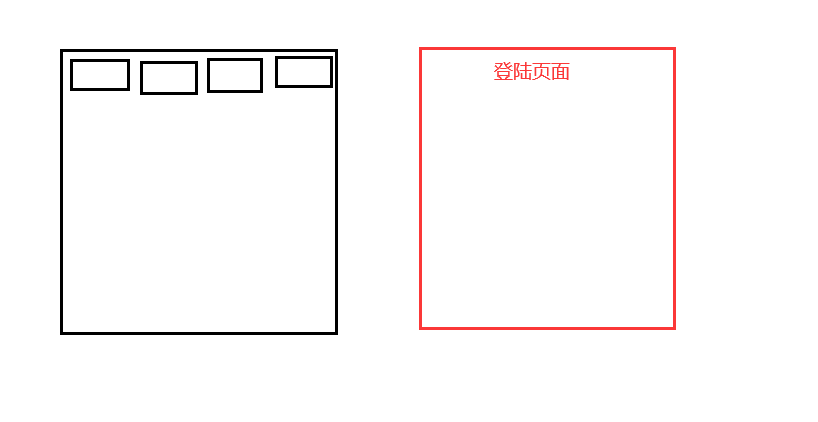
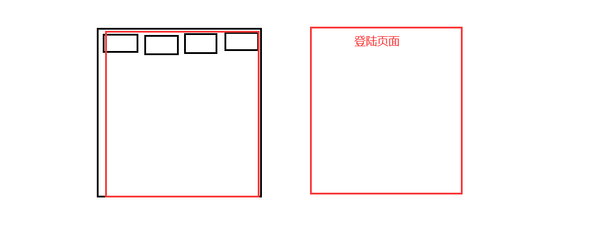
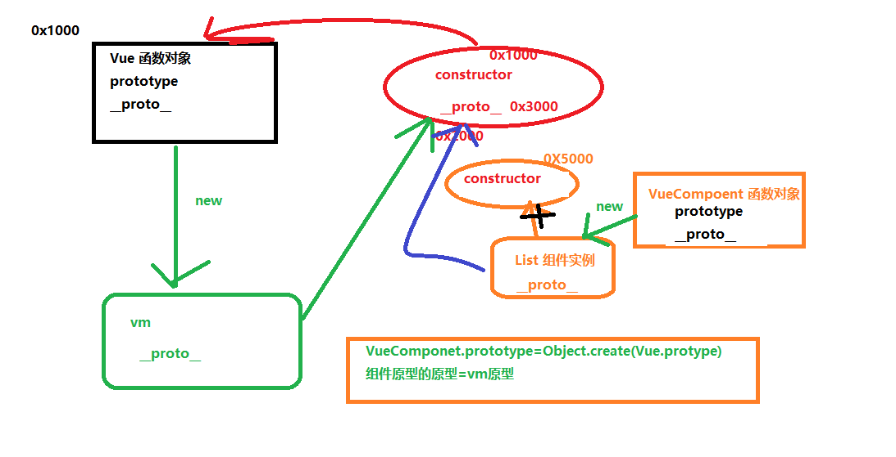
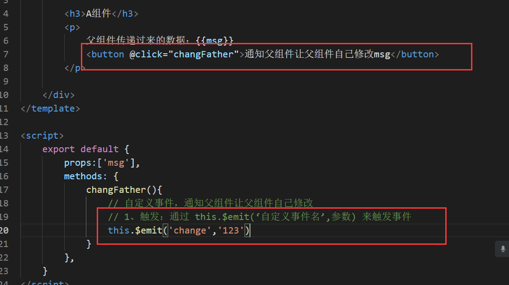
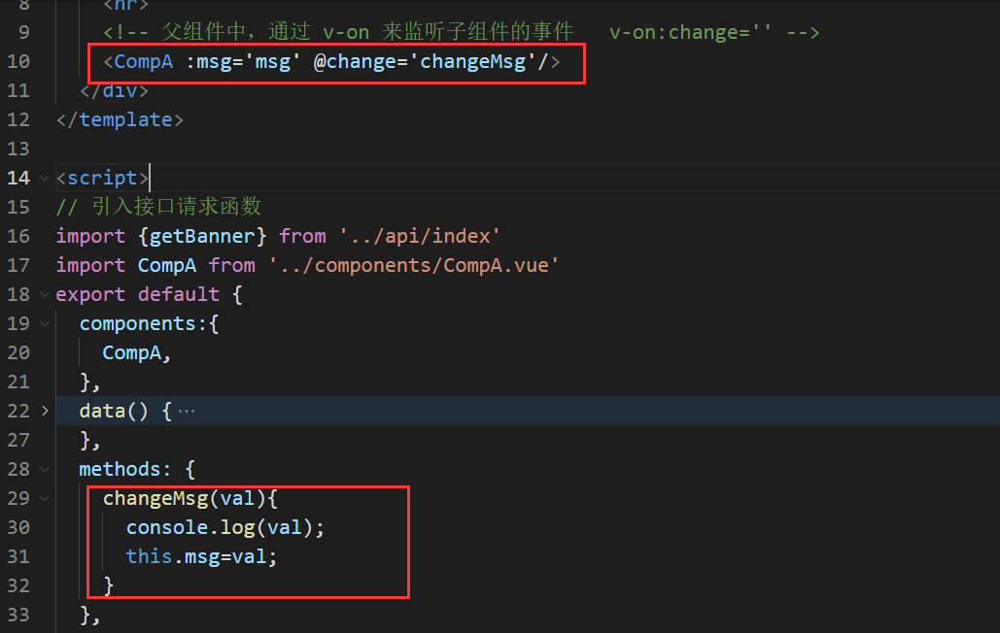
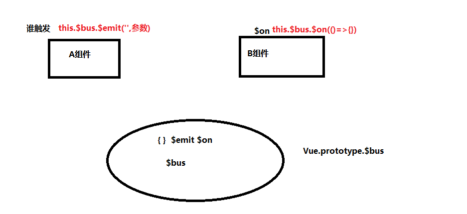
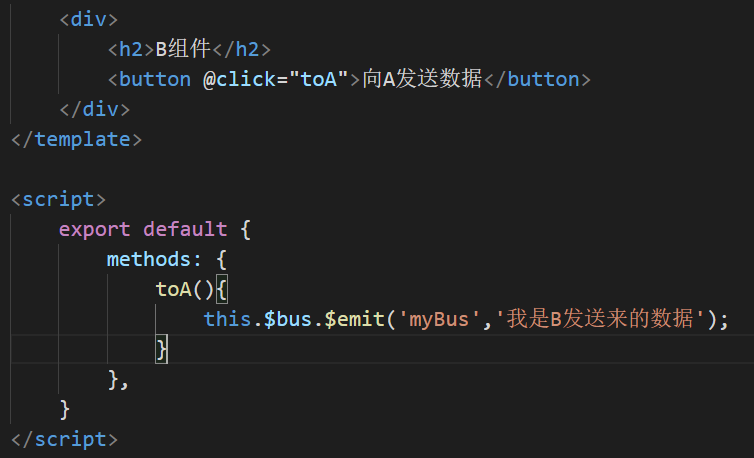
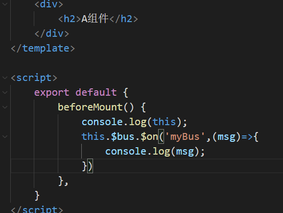
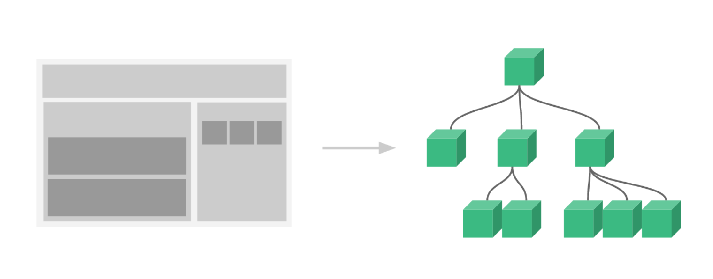

# Vue 网络请求Axios

**主要内容**

* 路由导航守卫
* 路由元信息
* 网络请求axios
* 封装axios

**学习目标**

 知识点| 要求 
 -| :- 
 路由导航守卫 | 掌握 
 路由元信息 | 掌握 
 网络请求axios | 掌握 
 封装axios | 掌握 


## 一、路由导航守卫
### 1. 1 简介

​	正如其名，`vue-router` 提供的导航守卫主要用来通过跳转或取消的方式守卫导航。有多种机会植入路由导航过程中：全局的, 单个路由独享的, 或者组件级的。

​	记住**参数或查询的改变并不会触发进入/离开的导航守卫**。你可以通过[观察 `$route` 对象](https://router.vuejs.org/zh/guide/essentials/dynamic-matching.html#响应路由参数的变化)来应对这些变化，或使用 `beforeRouteUpdate` 的组件内守卫。

​	

==原则：要么别写，写了必须要有方向  next()==

### 1.2 ==全局前置守卫（全局前置钩子）==

​	你可以使用 `router.beforeEach` 注册一个全局前置守卫：

​	==注意：只要发生路由跳转，都会被拦截，都会走全局前置守卫==

​	router.beforeEach 注册一个全局前置守卫

```js
const router = new VueRouter({ ... })
//注册一个全局前置守卫
router.beforeEach((to, from, next) => {
  // ...
})
```

当一个导航触发时，全局前置守卫按照创建顺序调用。守卫是异步解析执行，此时导航在所有守卫 resolve 完之前一直处于 **等待中**。

每个守卫方法接收三个参数：

- **`to: Route`**: 即将要进入的目标 [路由对象](https://router.vuejs.org/zh/api/#路由对象)
- **`from: Route`**: 当前导航正要离开的路由
- **`next: Function`**: 一定要调用该方法来 **resolve** 这个钩子。执行效果依赖 `next` 方法的调用参数。
  - **`next()`**: 进行管道中的下一个钩子。如果全部钩子执行完了，则导航的状态就是 **confirmed** (确认的)。
  - **`next(false)`**: 中断当前的导航。如果浏览器的 URL 改变了 (可能是用户手动或者浏览器后退按钮)，那么 URL 地址会重置到 `from` 路由对应的地址。
  - **`next('/')` 或者 `next({ path: '/' })`**: 跳转到一个不同的地址。当前的导航被中断，然后进行一个新的导航。你可以向 `next` 传递任意位置对象，且允许设置诸如 `replace: true`、`name: 'home'` 之类的选项以及任何用在 [`router-link` 的 `to` prop](https://router.vuejs.org/zh/api/#to) 或 [`router.push`](https://router.vuejs.org/zh/api/#router-push) 中的选项。
  - **`next(error)`**: (2.4.0+) 如果传入 `next` 的参数是一个 `Error` 实例，则导航会被终止且该错误会被传递给 [`router.onError()`](https://router.vuejs.org/zh/api/#router-onerror) 注册过的回调。

​	**确保 `next` 函数在任何给定的导航守卫中都被严格调用一次。它可以出现多于一次，但是只能在所有的逻辑路径都不重叠的情况下，否则钩子永远都不会被解析或报错**。

​	

### 1.3 全局解析守卫（了解）

​	在 2.5.0+ 你可以用 `router.beforeResolve` 注册一个全局守卫。这和 `router.beforeEach` 类似，区别是在导航被确认之前，**同时在所有组件内守卫和异步路由组件被解析之后**，解析守卫就被调用。


### 1.4 全局后置钩子

你也可以注册全局后置钩子，然而和守卫不同的是，这些钩子不会接受 `next` 函数也不会改变导航本身：

```js
router.afterEach((to, from) => {
  // ...
})
```

### 1.5 路由独享的守卫（1个）

### ==beforeEnter==

你可以在路由配置上直接定义 `beforeEnter` 守卫：

```js
const router = new VueRouter({
  routes: [
    {
      path: '/about',
      component: About,
      //路由独享守卫--
      beforeEnter: (to, from, next) => {
        console.log('路由独享守卫---beforeEnter');
        next()
      }
    }
  ]
})
```

这些守卫与全局前置守卫的方法参数是一样的。

### 1.6 组件内的守卫（3个）

### ==beforeRouteEnter==

### ==beforeRouteUpdate==


最后，你可以在路由组件内直接定义以下路由导航守卫：

- `beforeRouteEnter` 读不到this
- `beforeRouteUpdate` (2.2 新增)
- `beforeRouteLeave`

```js
const Foo = {
  template: `...`,
  beforeRouteEnter(to, from, next) {
    // 在渲染该组件的对应路由被 confirm 前调用
    // 不！能！获取组件实例 `this`
    // 因为当守卫执行前，组件实例还没被创建
  },
  beforeRouteUpdate(to, from, next) {
    // 在当前路由改变，但是该组件被复用时调用
    // 举例来说，对于一个带有动态参数的路径 /foo/:id，在 /foo/1 和 /foo/2 之间跳转的时候，
    // 由于会渲染同样的 Foo 组件，因此组件实例会被复用。而这个钩子就会在这个情况下被调用。
    // 可以访问组件实例 `this`
  },
  beforeRouteLeave(to, from, next) {
    // 导航离开该组件的对应路由时调用
    // 可以访问组件实例 `this`
  }
}
```

`beforeRouteEnter` 守卫 **不能** 访问 `this`，因为守卫在导航确认前被调用，因此即将登场的新组件还没被创建。

不过，你可以通过传一个回调给 `next`来访问组件实例。在导航被确认的时候执行回调，并且把组件实例作为回调方法的参数。

```js
beforeRouteEnter (to, from, next) {
  next(vm => {
    // 通过 `vm` 访问组件实例
  })
}
```

注意 `beforeRouteEnter` 是支持给 `next` 传递回调的唯一守卫。对于 `beforeRouteUpdate` 和 `beforeRouteLeave` 来说，`this` 已经可用了，所以**不支持**传递回调，因为没有必要了。

```js
beforeRouteUpdate (to, from, next) {
  // just use `this`
  this.name = to.params.name
  next()
}
```

这个离开守卫通常用来禁止用户在还未保存修改前突然离开。该导航可以通过 `next(false)` 来取消。

```js
beforeRouteLeave (to, from, next) {
  const answer = window.confirm('Do you really want to leave? you have unsaved changes!')
  if (answer) {
    next()
  } else {
    next(false)
  }
}
```


注意：守卫钩子可以不写，写了必须要调用next。


### 1.7 完整的导航解析流程

1. 导航被触发。

2. 在失活的组件里调用 `beforeRouteLeave` 守卫。

3. 调用全局的 `beforeEach` 守卫。

4. 在重用的组件里调用 `beforeRouteUpdate` 守卫 (2.2+)。

5. 在路由配置里调用 `beforeEnter`。

6. 解析异步路由组件。

7. 在被激活的组件里调用 `beforeRouteEnter`。

8. 调用全局的 `beforeResolve` 守卫 (2.5+)。

9. 导航被确认。

10. 调用全局的 `afterEach` 钩子。

11. 触发 DOM 更新。

12. 调用 `beforeRouteEnter` 守卫中传给 `next` 的回调函数，创建好的组件实例会作为回调函数的参数传入。

    

## 二、路由元信息

### 2.1 介绍

定义路由的时候可以配置 `meta` 字段：

​	标记

那么如何访问这个 `meta` 字段呢？

​	首先，我们称呼 `routes` 配置中的每个路由对象为 **路由记录**。路由记录可以是嵌套的，因此，当一个路由匹配成功后，他可能匹配多个路由记录

例如，根据上面的路由配置，`/foo/bar` 这个 URL 将会匹配父路由记录以及子路由记录。

​	一个路由匹配到的所有路由记录会暴露为 `$route` 对象 (还有在导航守卫中的路由对象) 的 `$route.matched` 数组。因此，我们需要遍历 `$route.matched` 来检查路由记录中的 `meta` 字段。


语法：

```js
const router = new VueRouter({
 routes: [
     {
         path: '/foo',
         component: Foo,
    //meta字段：做一个登录说明 isLogin:true说明需要登录  false不需要登录
         meta: { isLogin: true }
     }
     ]
 })
```

全局前置守卫里拦截判断：

```js
//全局前置守卫 ---前置 -- 
router.beforeEach((to,from,next)=>{
    //1. 判断进入的当前的路由界面是否需要登录 
    if(to.meta.isLogin){//true 
   //2. 需要登录-- 判断是否已经登录了 --如果登录过了进入 没有登录过-进入登录界面
      //假设登录的记录状态 user变量
      const user='';//用户名 
      if(user){
        next()
      }else{
        next('/login');  //跳转1到登录页面
      }

    }else{
      //不需要登录
      next();
    }
})
```








## 三、网络请求axios

### 3.1 介绍

Axios 是一个基于 promise 的 HTTP 库，可以用在浏览器和 node.js 中

特点：

- 从浏览器中创建 [XMLHttpRequests](https://developer.mozilla.org/en-US/docs/Web/API/XMLHttpRequest)
- 从 node.js 创建 [http](http://nodejs.org/api/http.html) 请求
- 支持 [Promise](https://developer.mozilla.org/en-US/docs/Web/JavaScript/Reference/Global_Objects/Promise) API
- 拦截请求和响应
- 转换请求数据和响应数据
- 取消请求
- 自动转换 JSON 数据
- 客户端支持防御 [XSRF](http://en.wikipedia.org/wiki/Cross-site_request_forgery)


#### 文档：

https://github.com/axios/axios

https://www.kancloud.cn/yunye/axios/234845


### 3.2 网络交互

​	

​	

### 3.3 axios请求

1. 安装

   ```js
   npm install axios -S
   ```

2. 常见请求方式

   1. 执行 `GET` 请求

      ```js
      // 为给定 ID 的 user 创建请求
      axios.get('/user?ID=12345')
        .then(function (response) {
          console.log(response);
        })
        .catch(function (error) {
          console.log(error);
        });
      
      // 可选地，上面的请求可以这样做
      axios.get('/user', {
          params: {
            ID: 12345
          }
        })
        .then(function (response) {
          console.log(response);
        })
        .catch(function (error) {
          console.log(error);
        });
      ```

      

     2. 执行 `POST` 请求

        ```js
        axios.post('/user', {
            firstName: 'Fred',
            lastName: 'Flintstone'
          })
          .then(function (response) {
            console.log(response);
          })
          .catch(function (error) {
            console.log(error);
          });
        ```

        执行多个并发请求

        ```js
        function getUserAccount() {
          return axios.get('/user/12345');
        }
        
        function getUserPermissions() {
          return axios.get('/user/12345/permissions');
        }
        
        axios.all([getUserAccount(), getUserPermissions()])
          .then(axios.spread(function (acct, perms) {
            // 两个请求现在都执行完成
          }));
        ```

3. 拦截器

   在请求或响应被 `then` 或 `catch` 处理前拦截它们。

   ```js
   // 添加请求拦截器
   axios.interceptors.request.use(function (config) {
       // 在发送请求之前做些什么
       return config;
     }, function (error) {
       // 对请求错误做些什么
       return Promise.reject(error);
     });
   
   // 添加响应拦截器
   axios.interceptors.response.use(function (response) {
       // 对响应数据做点什么
       return response;
     }, function (error) {
       // 对响应错误做点什么
       return Promise.reject(error);
     });
   ```


#### 组件内发请求

1、安装

npm  i axios -S

2、import axios from ''

3\

```js
mounted() {
    // 第一种方式：组件内引入，直接使用
    axios
      .get("http://iwenwiki.com/api/blueberrypai/getIndexBanner.php")
      .then(res => {
        console.log(res.data);
        // 赋值
        this.list = res.data.banner;
      })
      .catch(err => {
        console.log(err);
      });
  }
```


#### 挂载原型上

##### main.js:

```js
// 引入axios
import axios from 'axios'

// 挂载原型对象上
Vue.prototype.$axios=axios;

```

任何组件里：

```js
mounted() {
    console.log(this);
    this.$axios
      .get("")
      .then(res => {
        console.log(res.data);
      })
      .catch(err => {
        console.log(err);
      });
  }
```


### 3.4 案例

在vue项目中，首页界面实现网络请求获取动态数据、实现蓝莓派轮播接口

不跨越：http://iwenwiki.com/api/blueberrypai/getIndexBanner.php    cors

跨域：http://iwenwiki.com:3002/api/banner

webpack  devServe

协议、域名、端口号


两种：

一种：前端设置代理

另一种：后端允许  cors


设置代理：vue.config.js

```js
//手动创建  vue.config.js
module.exports = {
  //  写自己想要配置的东西去覆盖系统自带的
  // 关闭ESLint的规则
  lintOnSave: false,
  devServer: {
    proxy: {
      '/api': {
        target: 'http://iwenwiki.com:3002',
        ws: true,  //websocket 
        changeOrigin: true,  //是否允许跨域
        pathRewrite: {
          '^/api': ''
        }
      },

    }
  }
}

```


​	





## 四、封装axios

### 4.1 介绍

网络请求在组件中灵活复用、封装axios请求

实例  

utils

### 4.2 完整封装


#### 进度条：nprogress  

安装：

```js
npm  i  nprogress -S
```

使用：

```js
import Nprogress from 'nprogress' //进度条
import 'nprogress/nprogress.css' //进度条样式

// 显示进度条
Nprogress.start();


// 隐藏进度条
Nprogress.done();
```


#### 统一处理POST 请求参数： query-string

```js
npm i query-string -S
```

使用：

```js
import qs from 'query-string'

//处理post请求发送的参数格式
if(config.method==='post'){
    config.data = qs.stringify(config.data)//{} 转 xx=xx&xx=xx 
}
```


```js
/**
 * 封装的axios
 */
import axios from 'axios'
import qs from 'query-string'

/**
 * 错误函数 解析常用的http状态码
 * 2xx：成功
 * 3xx: 重定向
 * 4xx: 资源不存在
 * 5xx：服务器错误
 * 
 */
const  ErrorHandle=(status, info) => {
    switch (status) {
        case 400:
            console.log('400-表示请求报文中存在语法错');
            break;
        case 401:
            console.log('401-未经许可，需要通过HTTP认证');
            break;
        case 403:
            console.log('403-服务器拒绝该次访问（访问权限出现问题）');
            break;
        case 404:
            console.log('404-表示服务器上无法找到请求的资源');
            break;
        case 500:
            console.log('500-表示服务器在执行请求时发生了错误，也有可能是web应用存在的bug或某些临时的错误时；');
            break;
        case 503:
            console.log('503-表示服务器暂时处于超负载或正在进行停机维护，无法处理请求');
            break;
        default:
            console.log(info);
            break;
    }
}

//自定义新建一个 axios 实例
const install = axios.create({
    // baseURL:'http://iwenwiki.com',//网络请求的基础路径 
    baseURL:process.env.VUE_APP_BASE_URL,//网络请求的基础路径 
    timeout: 5000,//请求等待时间 时间到了后台没有返回数据 请求中段
})


//拦截器 
// 添加请求拦截器
install.interceptors.request.use(function (config) {
    console.log('添加请求拦截器',config);
    //处理post请求发送的参数格式
    if(config.method==='post'){
        config.data = qs.stringify(config.data)//{} 转 xx=xx&xx=xx 
    }
    //配置请求token 
    let token= localStorage.getItem('token')
    if(token){
        config.headers.Authorization=token;
    }else{
        return config;
    }
    // console.log('添加请求拦截器--config',config);
    // 在发送请求之前做些什么
    return config;
  }, function (error) {
    // 对请求错误做些什么
    return Promise.reject(error);
  });

// 添加响应拦截器
install.interceptors.response.use(
    res=>{
        return  res.data
    },
    error=>{
        console.log('响应拦截器错误',error);
        
         if (error && error.response) {
            switch (error.response.status) {
                case 400:
                    error.message = '400-表示请求报文中存在语法错';
                    break;
                case 401:
                    error.message = '401-未经许可，需要通过HTTP认证';
                    break;
                case 403:
                    error.message = '403-服务器拒绝该次访问（访问权限出现问题）';
                    break;
                case 500:
                    error.message = '500-表示服务器在执行请求时发生了错误，也有可能是web应用存在的bug或某些临时的错误时；';
                    break;
                default:
                    error.message = `连接服务器${error.response.status}`;
            }
        } else {
            error.message = '连接服务器失败';
        }


        return Promise.reject(error)
        
        
         
        
        // let { response } = error;
        // 对响应错误做点什么
       // ErrorHandle(response.status,response.info)
       // return   Promise.reject(error)
  });

export default  install;

```


### 回顾：vue自定义事件

由来：父组件通过props传递给子组件的数据，子组件不能之间修改。想要修改？

可以通过自定义事件，==通知==父组件去修改。

步骤：

1. 在子组件中，通过 this.$emit(‘自定义事件名’,参数) 来触发事件
2. 父组件中，通过 v-on 来监听子组件的事件   v-on:changeFather=''







弊端：必须是父子

如果不是父子，是兄弟或者是其他隔着层级比较多的话，就不适合


### 4.3 全局事件总线

基于vue自定义事件。  $emit  , $on 

给Vue的原型对象上添加属性 {}，属性的值是Vue实例：

==适用场景：任何场景==

==缺点：管理不集中==

必须要满足的条件：

1，所有的组件对象都能找到它   ==>Vue

2，在它身上可以使用`$emit` 和 `$on`   ==>{}    object



全局事件总线本质就是一个对象，在vue当中，选择vm作为全局事件总线

```js
new Vue({
  beforeCreate(){
    Vue.prototype.$bus=this; //配置事件总线，即把vm挂载到Vue的原型上，让所有组件都能找到它，并且能看到它上面的 $emit 和 $on
  },
  render: h => h(App)
}).$mount('#app')
```










# ==路由进阶回顾==

### 1、导航守卫

概念、作用、有哪几个、常用的分别做什么   钩子（）

全局（3个）、组件内（3个）、路由独享（1个）

==原则：要么不写，写了必须要放行==

1. 全局前置守卫  ---    meta

   ```js
   router.beforeEach((to,from,next)=>{
   	if(to.meta.isLogin){  //true  需要登录
   		//用户是否已经登录
           let  token='';
           if(user){
   			next();      
           }else{
               next('/login')
           }
           
           
       }else{//不需要登录
           next()
       }
       
   })
   ```

2. 全局解析守卫  ---router.beforeResolve()

3. 全局后置钩子  ----router.afterEach()

4. 路由独享   ----beforeEnter()

   ```
   {
       path:'/about',
       component:About,
       meta:{    //进入当前组件，需要登录
           isLogin:true
       },
       beforeEnter：(to,from,next)=>{
       	
       	next()
       }
   }

5. 组件内

   - beforeRouteEnter   特点：读不到this

     ```js
     data(){
     	retun{
             
         }
     },
     beforeRouteEnter(to,from,next){
         
         //能拿到this的时候，立马执行下面的逻辑
         next((vm)=>{
             vm.msg='456'
         })
     },
      
     ```

     

   - beforeRouteUpdate 

     组件复用时，组件切换，生命周期不走的（mounted）====>用处：动态路由

     ```js
     beforeRouteUpdate(to，from,next){
     	if(to.$route.path!==from。。。。){
             
             next()
             
         }
     	
     }
     ```

     

   - beforeRouteLeave  

     


路由规则

```js
{
    path:'/about',
    component:About,
    meta:{    //进入当前组件，需要登录
        isLogin:true
    }
}
```


### 2、Axios

1、安装

```bash
npm  i axios -S
```

2、使用方式

#### 第一种方式：组件内使用

1. 引入

   ```js
   import axios from  'axios'
   ```

2. 使用

```js
axios.get("").then(res=>{
    
}).
```


#### 第二种方式：挂载原型对象

1、mian.js 引入

```js
import axios from  'axios'
```

2、挂载

```js
Vue.prototype.$axios=axios
```

3、组件用

```js
this.$axios.get('').then(res=>{
    res.data
}).catch(err=>{
    
})
```


