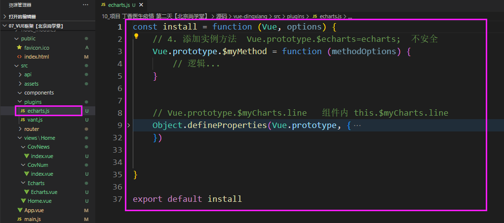

# 项目 丁香医生疫情_第二天

**主要内容**

* Echarts使用
* 国内疫情
* 世界疫情
* 进入城市地图
* 封装tabs组件

**学习目标**

 知识点| 要求 
 -| :- 
 Echarts使用 | 掌握 
 国内疫情 | 掌握 
 世界疫情 | 掌握 
 进入城市地图 | 掌握 
 封装tabs组件 | 掌握 


## 一、Echarts使用

 https://echarts.apache.org/zh/index.html

地图  4.x

折线图、饼状图  5.x


### 1.1 Echarts安装

1. ​	安装echarts: 

   npm i echarts@4.x -S 

2. 引入

   ```js
   // 2、引入
   import echarts from "echarts";
   ```

3. 使用

   


### 1.2 使用方式

  	1. 方式1：组件内部使用单独使用

```js
 // 基于准备好的dom，初始化echarts实例
 import echarts from "echarts";
   var myChart = echarts.init(document.getElementById("main"));
       // 指定图表的配置项和数据
       var option = {
         title: {
           text: "ECharts 入门示例",
         },
         tooltip: {},
         legend: {
           data: ["销量"],
         },
         xAxis: {
           data: ["衬衫", "羊毛衫", "雪纺衫", "裤子", "高跟鞋", "袜子"],
         },
         yAxis: {},
         series: [
           {
             name: "销量",
             type: "line",
             data: [5, 20, 36, 10, 10, 20],
           },
         ],
       };
       // 使用刚指定的配置项和数据显示图表。
       myChart.setOption(option);
     },
```

缺点：

==每个组件使用，都得import 引入echarts==

 2. 方式2 ：挂载原型对象上

    ```js
    // 2、引入
    import echarts from "echarts";
    Vue.prototype.$echarts=echarts;
    ```

​		组件内使用：this

```js
 // 基于准备好的dom，初始化echarts实例
      var myChart = this.$echarts.init(document.getElementById("main"));
```


### ==方式3：开发成vue插件 echarts==

VueRouter

Vue.use(VueRouter)

Vue.use(echarts)

https://cn.vuejs.org/v2/guide/plugins.html


#### 1、plugins/echarts.js:




#### 2、main.js:

```js
// 引入自己写的插件
import Echarts from './plugins/echarts'
// 安装插件 install
Vue.use(Echarts)
```


```js
// 给对象添加属性或修改现有属性，使之变成响应式
    let obj = {}
    let temp=123
    Object.defineProperty(obj, 'fullname', {
        get() {
            return temp
        },
        set(val) {
            // 修改值
        }
    })
   

    console.log(obj.fullname);  //123

    obj.fullname=456;

    console.log(obj.fullname);  //456


Object.defineProperties(obj, {
        'props1': {
            get() {

            },
            set() {

            }
        },
        'props2': {
            get() {

            },
            set() {

            }
        },
    })
```


```js
import echarts from 'echarts'
import country from '../utils/country'
import '../utils/map'
const install = function (Vue, options) {
    // 添加实例方法 
    Object.defineProperties(Vue.prototype, {
        $myChart: {
            get() {
                return {
                    //1. 绘制一个折线图
                    line(id) {
                        4
                        var myChart = echarts.init(document.getElementById(id));
                        // 指定图表的配置项和数据
                        var option = {
                            title: {
                                text: "ECharts 入门示例",
                            },
                            tooltip: {},
                            legend: {
                                data: ["销量"],
                            },
                            xAxis: {
                                data: ["衬衫", "羊毛衫", "雪纺衫", "裤子", "高跟鞋", "袜子"],
                            },
                            yAxis: {},
                            series: [
                                {
                                    name: "销量",
                                    type: "line",
                                    data: [5, 20, 36, 10, 10, 20],
                                },
                            ],
                        };
                        // 使用刚指定的配置项和数据显示图表。
                        myChart.setOption(option);
                    },
            }
        }
    })

}

export default install
```

mian.js

```js
//使用开发分插件 
import echarts from './plugins/echarts'
Vue.use(echarts)
```


## 二、国内疫情

### 2.1 效果图

​	

### 2.2 国内疫情

```vue
 <template>
  <div>
    <div class="title">国内疫情地图</div>
    <!-- 地图容器 -->
        <div id="nowMain" style="width: 7.5rem; height: 7rem"></div>
  </div>
</template>

<script>
import api from "../../../api/index";
export default {
  data() {
    return {
      active: 0,
      arr: [],
    };
  },
  //3. echarts实例-创建地图
  mounted() {
    //获取疫情数据-----------------------------------------------
    api.getChinaData().then((res) => {
      console.log("-------", res.data);
      //获取省份数据
      let citys = res.data.retdata;
      let arr = []; //累计
      let nowArr = []; //现存
      for (let i = 0; i < citys.length; i++) {
        let obj = {};
        obj.name = citys[i].xArea;
        obj.value = citys[i].confirm; //累计确诊人数   curConfirm现在确诊人数
        let now = {};
        now.name = citys[i].xArea;
        now.value = citys[i].curConfirm;
        arr.push(obj);
        nowArr.push(now);
      }
      this.arr = arr;
      console.log("城市的数据", arr);
        this.$myChart.chinaMap("main", arr);
    });
  },

};
</script>

<style lang='less' scoped>
.title {
  margin: 0.2rem;
  padding-top: 0.2rem;
    border-top: 1px solid #eee;
}
.title::before {
    content: "";
    border-left: 0.1rem solid rgb(9, 60, 202);
    font-size: 0.26rem;
    margin-right: 0.1rem;
  }
#main,#nowMain{
  background: #f5f5f5;
}
</style>
```

### 2.3 国内地图

```js

//导入echarts 
import echarts from 'echarts'
//导入映射的翻译-世界国家名称
import country from '../utils/country'
//导入城市的js 
import '../utils/map'

const install = function (Vue, options) {
    // 添加实例方法 
    // Vue.prototype.demo=function(){}  //obj.name    
    //Vue.prototype.$myChart={demo(),fun(),...}
    Object.defineProperties(Vue.prototype, {
        $myChart: {
            get() {
                return {
                    //1. 绘制一个折线图
                    line(id) {
                        4
                        var myChart = echarts.init(document.getElementById(id));
                        // 指定图表的配置项和数据
                        var option = {
                            title: {
                                text: "ECharts 入门示例",
                            },
                            tooltip: {},
                            legend: {
                                data: ["销量"],
                            },
                            xAxis: {
                                data: ["衬衫", "羊毛衫", "雪纺衫", "裤子", "高跟鞋", "袜子"],
                            },
                            yAxis: {},
                            series: [
                                {
                                    name: "销量",
                                    type: "line",
                                    data: [5, 20, 36, 10, 10, 20],
                                },
                            ],
                        };
                        // 使用刚指定的配置项和数据显示图表。
                        myChart.setOption(option);
                    },
                    //2. 中国地图
                    chinaMap(id, data) {
                        var myChart = echarts.init(document.getElementById(id));
                        var option = {
                            tooltip: { //悬浮弹框
                                triggerOn: 'click', //提示框触发的条件
                                enterable: true,//鼠标是否可进入提示框浮层中，默认为false
                                formatter(item) {//item=下面serves里面的data里面的每一项 //[{} ] data={} a b c d 
                                    return '<a href="#/citys/'+item.name+'" style="color:#fff">省份：'+item.name+'--详情</a>'
                                }
                            },
                            visualMap: [{ //映射高亮颜色
                                orient: "horizontal", //水平的
                                type: "piecewise", //离散
                                bottom: 0,
                                textGap: 4,
                                itemGap: 4,
                                itemWidth: 10,
                                itemHeight: 10,
                                padding: 2,
                                textStyle: {
                                    fontSize: 9,
                                },
                                pieces: [ // 配置颜色区间
                                    {
                                        min: 0,
                                        max: 0,
                                        color: "#FFFFFF"
                                    },
                                    {
                                        min: 1,
                                        max: 9,
                                        color: "#FAEBD2"
                                    },
                                    {
                                        min: 10,
                                        max: 99,
                                        color: "#E9A188"
                                    },
                                    {
                                        min: 100,
                                        max: 499,
                                        color: "#D56355"
                                    },
                                    {
                                        min: 500,
                                        max: 999,
                                        color: "#BB3937"
                                    },
                                    {
                                        min: 1000,
                                        max: 10000,
                                        color: "#772526"
                                    },
                                    {
                                        min: 10000,
                                        color: "#480F10"
                                    }
                                ]
                            }],
                            series: [{
                                name: "省",
                                type: "map", //地图  bar  line  map 
                                map: "china", //中国地图 需要引入地图china.js 
                                roam: false,
                                zoom: 1.2,
                                aspectScale: 0.75,
                                top: 40,
                                layoutCenter: ['5%', '5%'],
                                label: {
                                    normal: {
                                        show: true,
                                        textStyle: {
                                            fontSize: 8
                                        }
                                    }
                                },
                                itemStyle: {
                                    normal: {
                                        areaColor: 'rgba(0,255,236,0)',
                                        borderColor: 'rgba(0,0,0,0.2)',
                                    },
                                    emphasis: { // 选中的区域颜色及阴影效果等
                                        areaColor: 'rgba(255,180,0,0.8)',
                                        shadowOffsetX: 0,
                                        shadowOffsetY: 0,
                                        shadowBlur: 20,
                                        borderWidth: 0,
                                    }
                                },
                                data
                                // data: [
                                //     { name: '内蒙古', value: 200 },
                                //     { name: '北京', value: 800 },
                                // ]
                            }]
                        }
                        myChart.setOption(option);
                    },                
                }
            }
        }
    })

}

export default install

```


1. Vant  选项卡


步骤:

1. axios 二次封装
2. 封装接口请求函数
3. ChinaMap.vue 页面调用


万维易源接口：

https://www.showapi.com/apiGateway/view/2217/2#tabs


### ==sina其他接口：==

https://interface.sina.cn/news/wap/fymap2020_data.d.json


#### 国内各省份

#### data/list :

| 名称        | 类型   | 说明         |
| ----------- | ------ | ------------ |
| ==econNum== | string | ==现有确诊== |
| ==value==   | string | ==累计确诊== |
| cureNum     | string | 累计治愈     |
| deathNum    | string | 累计死亡     |

```js
async getChina() {
      try {
        const res=await getNewData();
        console.log(res.data.list);
        this.arr=res.data.list;
        let currArr = []; //现存确诊
        this.arr.forEach(item => {
          let obj = {};
          obj.name = item.name;
          obj.value = item.econNum;
          currArr.push(obj); //现存确诊
        });
        
        //   用了vant 第三方库，按需引入，不能直接获取里面的DOM元素
        // 延迟加载DOM元素。 等着DOM元素加载完成了，再执行后面的回调
        // [{name:'省份',value:100}, { name: '内蒙古', value: 200 }]
        this.$nextTick(() => {
          this.$myChart.chinaMap("currMain", currArr);
        });
      } catch (error) {
        // 空地图
        this.$nextTick(() => {
          this.$myChart.chinaMap("currMain", []);
        });
        console.log("出错啦：", error);
      }
    },
    change(title) {
      console.log(title);
      if (title === 1) {
        this.$nextTick(() => {
          //累计确诊
          this.$myChart.chinaMap("totalMain", this.arr);
        });
      }
    }
```


#### 其他参数：

| 名称                            | 类型   | 说明                   |
| ------------------------------- | ------ | ---------------------- |
| times                           | string | 统计数据截至日期       |
| mtime                           | string | 统计数据截至日期       |
| cachetime                       | string | 缓存时间               |
| ==gntotal==                     | int    | ==累计确诊==           |
| deathtotal                      | int    | 累计死亡               |
| sustotal                        | int    | 有病例城市个数         |
| curetotal                       | int    | 累计治愈               |
| jwsrNum                         | int    | 境外累计输入病例       |
| add_daily                       | array  | 全国疫情数据           |
| jwsrTop                         | array  | 境外输入城市及确诊个数 |
| list                            | array  | 城市病例详情           |
| ==**add_daily** / addecon_new== | string | 现存确诊               |


##### add_daily：

| 名称         | 类型 | 说明         |
| ------------ | ---- | ------------ |
| addecon_new  |      | 现存确诊     |
| addjwsr      |      | 累计境外输入 |
| addasymptom  |      | 现存无症状   |
| addhecon_new |      | 现存重症确诊 |


#### worldlist:

| 名称    | 类型   | 说明         |
| ------- | ------ | ------------ |
| econNum | string | ==现有确诊== |
| cureNum | string | 累计治愈     |
|         |        |              |


## 三、世界疫情

### 3.1 效果图

​	

### 3.2 世界疫情

```vue
<template>
  <div>
    <div class="title">世界疫情地图</div>
    <!-- 地图容器 -->
    <div id="main" style="width: 7.5rem; height: 7rem"></div>
  </div>
</template>

<script>
import api from "../../../api/index";
export default {
  mounted() {
    //-------------------------
    api.getWorldData().then((res) => {
      console.log("--世界---", res.data);
      let world = res.data.retdata;
      let arr = []; //累计
      for (let i = 0; i < world.length; i++) {
        let obj = {};
        obj.name = world[i].xArea;
        obj.value = world[i].confirm; //累计确诊人数   curConfirm现在确诊人数
        arr.push(obj);
      }
       this.$myChart.worldMap("main", arr);
    });
   
  },
};
</script>

<style lang='less' scoped>
.title {
  margin: 0.2rem;
  padding-top: 0.2rem;
  border-top: 1px solid #eee;
}
.title::before {
  content: "";
  border-left: 0.1rem solid rgb(9, 60, 202);
  font-size: 0.26rem;
  margin-right: 0.1rem;
}
#main {
  background: #f5f5f5;
}
</style>
```

### 3.3 世界地图

```js
//导入echarts 
import echarts from 'echarts'

import country from '../utils/country'

import '../utils/map'


const install = function (Vue, options) {
    // 添加实例方法 
    // Vue.prototype.demo=function(){}  //obj.name    
    //Vue.prototype.$myChart={demo(),fun(),...}
    Object.defineProperties(Vue.prototype, {
        $myChart: {
            get() {
                return {

                    //3. 世界地图
                    worldMap(id, data) {
                        var myChart = echarts.init(document.getElementById(id));
                        var option = {
                            tooltip: { //悬浮弹框
                                triggerOn: 'click', //提示框触发的条件
                                enterable: true,//鼠标是否可进入提示框浮层中，默认为false
                                formatter(item) {//item=下面serves里面的data里面的每一项 //[{} ] data={} a b c d 
                                    return item.name + '：确诊人数' + item.value
                                }
                            },
                            visualMap: [{ //映射高亮颜色
                                orient: "vertical", //垂直
                                type: "piecewise", //离散
                                bottom: 0,
                                pieces: [ // 配置颜色区间
                                    {
                                        min: 0,
                                        max: 0,
                                        color: "#FFFFFF"
                                    },
                                    {
                                        min: 1,
                                        max: 10000,
                                        color: "#FDFDCF"
                                    },
                                    {
                                        min: 10000,
                                        max: 100000,
                                        color: "#FE9E83"
                                    },
                                    {
                                        min: 100000,
                                        max: 500000,
                                        color: "#E55A4E"
                                    },
                                    {
                                        min: 500000,
                                        // max: 10000,
                                        color: "#4F070D"
                                    }
                                ]
                            }],
                            series: [{
                                name: "国",
                                type: "map", //地图  bar  line  map 
                                map: "world", 
                                nameMap: country,//自定义地区的名称映射
                                roam: false,
                                zoom: 1.2,
                                aspectScale: 0.75,
                                top: 40,
                                layoutCenter: ['5%', '5%'],
                                label: {
                                    normal: {
                                        show: false,
                                        textStyle: {
                                            fontSize: 8
                                        }
                                    }
                                },
                                itemStyle: {
                                    normal: {
                                        areaColor: 'rgba(0,255,236,0)',
                                        borderColor: 'rgba(0,0,0,0.2)',
                                    },
                                    emphasis: { // 选中的区域颜色及阴影效果等
                                        areaColor: 'rgba(255,180,0,0.8)',
                                        shadowOffsetX: 0,
                                        shadowOffsetY: 0,
                                        shadowBlur: 20,
                                        borderWidth: 0,
                                    }
                                },
                                data
                            }]
                        }
                        myChart.setOption(option);
                    },
                   
                }
            }
        }
    })

}

export default install

```


## 四、进入省份

### 4.1 城市地图

步骤：

1. 发请求，拿数据    全部数据  res.data.list  34 个省的数据  []

2. 某个省，  省名字（北京）

   遍历

   ```js
   res.data.list.forEach(item=>{
       if(item.name===this.name){
           //item
       }
   })
   ```

   arr.find   ===>找到符合条件的对象，直接返回

   ```js
   let provice= res.data.list.find(item=>{
       return item.name==this.name
   })
   ```

   findIndex  ===>找到符合条件的元素的下标，直接返回

   


​	

### 4.2 城市代码

```vue
<template>
  <div>
      <h2>{{cityname}}--城市界面</h2>
       <div id="main" style="width: 7.5rem; height: 9rem"></div>
  </div>
</template>

<script>
export default {
    props:['cityname'],
    mounted(){
        this.$myChart.cityMap('main',this.cityname,[])
    }
}
</script>

<style>

</style>
```

### 4.3 城市地图

```js
//导入echarts 
import echarts from 'echarts'

//导入映射的翻译-世界国家名称
import country from '../utils/country'
//导入城市的js 

import '../utils/map'


const install = function (Vue, options) {
    // 添加实例方法 
    // Vue.prototype.demo=function(){}  //obj.name    
    //Vue.prototype.$myChart={demo(),fun(),...}
    Object.defineProperties(Vue.prototype, {
        $myChart: {
            get() {
                return {

                    //4. 城市地图
                    cityMap(id,cityname,data){
                        var myChart = echarts.init(document.getElementById(id));
                        var option = {
                            tooltip: {//悬浮弹框
                                triggerOn:'click',//提示框触发的条件
                                enterable: true,
                                formatter(data) {//[{} ] data={}
                                    return data.name
                                }
                            },
                            visualMap: [{//映射高亮颜色
                                orient: "vertical",//垂直
                                type: "piecewise",//离散
                                bottom:0,
                                pieces: [ // 配置颜色区间
                                    {
                                        min: 0,
                                        max: 0,
                                        color: "#FFFFFF"
                                    },
                                    {
                                        min: 1,
                                        max: 10,
                                        color: "#FDFDCF"
                                    },
                                    {
                                        min: 10,
                                        max: 100,
                                        color: "#FE9E83"
                                    },
                                    {
                                        min: 100,
                                        max: 500,
                                        color: "#E55A4E"
                                    },
                                    {
                                        min: 500,
                                        max: 10000,
                                        color: "#4F070D"
                                    }
                                ]
                            }],
                            series: [{
                                name: "市",
                                type: "map",//地图
                                map: cityname,//中国地图
                                roam: false,
                                zoom: 1.2,
                                aspectScale:0.75,
                                top:40,
                                layoutCenter:['5%', '5%'],
                                label: {
                                    normal: {
                                        show: true,
                                        textStyle: {
                                            fontSize: 8
                                        }
                                    }
                                },
                                itemStyle: {
                                    normal: {
                                        areaColor: 'rgba(0,255,236,0)',
                                        borderColor: 'rgba(0,0,0,0.2)',
                                    },
                                    emphasis: { // 选中的区域颜色及阴影效果等
                                        areaColor: 'rgba(255,180,0,0.8)',
                                        shadowOffsetX: 0,
                                        shadowOffsetY: 0,
                                        shadowBlur: 20,
                                        borderWidth: 0,
                                    }
                                },
                                data
                            }]
                        }
                        myChart.setOption(option);
                    },
                }
            }
        }
    })

}

export default install
```

## 五、封装tabs组件

​	

### 5.1 Vant库tabs组件

```vue
<template>
  <div>
    <div class="title">国内疫情地图</div>
    <!-- 地图容器 -->
    <!-- 为 ECharts 准备一个定义了宽高的 DOM -->
    <van-tabs v-model="active" animated @change='change'>
      <van-tab title="现存确诊">
        <div id="nowMain" style="width: 7.5rem; height: 7rem"></div>
      </van-tab>
      <van-tab title="累计确诊">
        <div id="main" style="width: 7.5rem; height: 7rem"></div>
      </van-tab>
    </van-tabs>

  </div>
</template>

<script>
//1. 安装echarts  2. 导入echarts
// import echarts from "echarts";
import api from "../../../api/index";
export default {
  data() {
    return {
      active: 0,
      arr: [],
    };
  },
  //3. echarts实例-创建地图
  mounted() {
    //获取疫情数据-----------------------------------------------
    api.getChinaData().then((res) => {
      console.log("-------", res.data);
      //获取省份数据
      let citys = res.data.retdata;
      let arr = []; //累计
      let nowArr = []; //现存
      for (let i = 0; i < citys.length; i++) {
        let obj = {};
        obj.name = citys[i].xArea;
        obj.value = citys[i].confirm; //累计确诊人数   curConfirm现在确诊人数
        let now = {};
        now.name = citys[i].xArea;
        now.value = citys[i].curConfirm;
        arr.push(obj);
        nowArr.push(now);
      }
      this.arr = arr;
      console.log("城市的数据", arr);
       //vue里面 等待延迟加载
       this.$nextTick(()=>{
            //显示累计地图
        // this.$myChart.chinaMap("main", arr);
        //显示现存地图
        this.$myChart.chinaMap("nowMain", nowArr);
       }) 
    });
  },
  methods: {
    change(title) {//name,title
      if (title == 1) {
        this.$nextTick(() => {
          this.$myChart.chinaMap("main", this.arr);
        });
      }
    },

  },
};
</script>

<style lang='less' scoped>
.title {
  margin: 0.2rem;
  padding-top: 0.2rem;
    border-top: 1px solid #eee;
}
.title::before {
    content: "";
    border-left: 0.1rem solid rgb(9, 60, 202);
    font-size: 0.26rem;
    margin-right: 0.1rem;
  }
#main,#nowMain{
  background: #f5f5f5;
}
</style>
```


### 5.2 封装tabs组件

tab组件

```vue
<template>
  <div :class="{active:name==$parent.activeName}" @click="changeTab(name)">
     {{ label }}
  </div>
</template>

<script>
export default {
    name:'Tab',
    props:{
        label:{
            type:String,
            default:'标题'
        },
        name:{
            type:[String,Number],
            default:1
        }
    },
   methods:{
       changeTab(name){
           console.log('tab点击',name);
            this.$parent.changeNum(name)//调用父组件的方法
       }
   }
}
</script>

<style>
.active{
    color: red;
}
</style>
```

Tabs组件

```vue
<template>
  <div>
    <!-- 1. 导航区域 -->
    <div class="nav">
      <slot></slot>
    </div>

    <!-- 2. 内容区域    -->
    <div class="content">
      <Content :content="content" />
    </div>
  </div>
</template>

<script>
import Content from "./Content.vue";
export default {
    name:'Tabs',
  props: ["activeName"],
  components: {
    Content,
  },
  data() {
    return {
      content: "",
    };
  },
  //监听---created 
  watch: {
    activeName(n) {
      console.log("监听数据修改了", n);
      //延迟执行 this.$nextTick(()=>{})
      this.$nextTick(() => {
        let num = parseInt(this.activeName) - 1;
        this.content = this.$slots.default[num].child.$slots.default;
      });
    },
  },
  methods: {
    changeNum(num) {
      //修改activeName
      this.$emit("changeTab", num);
    },
  },
  mounted() {
    let num = parseInt(this.activeName) - 1;
    this.content = this.$slots.default[num].child.$slots.default;
  },
};
</script>

<style lang='less' scoped>
.nav {
  display: flex;
  border-bottom: 1px solid #ddd;
  > div {
    flex: 1;
    margin: 0.2rem 0;
    text-align: center;
    border-right: 1px solid #ccc;
  }
  > div:last-child {
    border-right: 0;
  }
}
</style>
```

Content组件

```vue

<script>
export default {
    props:['content'],
    created(){
        console.log(this.content);
    },
    render(){
        return (
            <div>{this.content}</div>
        )
    }
}
</script>

<style>

</style>
```

导出组件index.js

```js
import Vue from 'vue'
import Tabs from './Tabs.vue'
import Tab from './Tab.vue'
Vue.component(Tabs.name,Tabs)
Vue.component('Tab',Tab)

```

使用方式：地图组件

```vue
<template>
  <div>
    <div class="nav">
      <div :class="{active:flag}" @click="changeNav">中国疫情</div>
      <div :class="{active:!flag}" @click="changeNav">世界疫情</div>
    </div>
    <div class="content">
      <div :class="{show:flag}">
        <div id="main" style="width: 7.5rem; height: 8rem;background:#f5f5f5"></div>
      </div>
      <div :class="{show:!flag}">
        <div id="world" style="width: 7.5rem; height:7rem;background:#f5f5f5"></div>
      </div>
    </div>
    
  </div>
</template>

<script>
// import echarts from "echarts";
export default {
  data(){
    return{
      flag:true
    }
  },
  mounted() {
      //获取中国疫情地图数据--------------------------------------- 
      this.$api.getChina()
      .then(res=>{
          console.log(res);
          console.log(res.data.retdata);
          if(!res.data.retdata){
             this.$myChart.chinaMap('main',[]);
            return;
          }
          //获取成地图使用的data数据格式： data=[{name:'',value:''},{}]
          let list = res.data.retdata;
          let arr=[]
          for(let i=0;i<list.length;i++){
              let obj={}
              obj.name=list[i].xArea;
              obj.value=list[i].confirm;
              arr.push(obj);
          }
          console.log('中国成功疫情数据--',arr);
         this.$myChart.chinaMap('main',arr);

      })
    //   this.$myChart.chinaMap('main')
    //世界地图--------------------------------------------
    this.$api.getWorld()
    .then(res=>{
      // console.log(res);
      console.log(res.data);
        if(!res.data.retdata){
             this.$myChart.worldMap('main',[]);
            return;
          }
       let list = res.data.retdata;
          let arr=[]
          for(let i=0;i<list.length;i++){
              let obj={}
              obj.name=list[i].xArea;
              obj.value=list[i].confirm;
              arr.push(obj);
          }
          console.log('世界成功疫情数据--',arr);
        this.$myChart.worldMap('world',arr)
    })
    
  },
  methods: {
    //
    changeNav(){
      this.flag = !this.flag;
    }
  },
};
</script>

<style lang='less' scoped>
.nav{
  display: flex;
  border-top: 1px solid #ccc;
  // border-bottom: 1px solid #eee;
  >div{
    flex: 1;
    text-align: center;
    margin:0.3rem 0;
  }
  >div:first-child{
    border-right: 1px solid #ccc;
  }
  .active{
    color: #e50d0d;
  }
}

.content{
  height: 8rem;
  >div{
    display: none;
  }
  .show{
    display: block;
  }
}
</style>

```


### ==新冠全国疫情（163）==

接口： https://c.m.163.com/ug/api/wuhan/app/data/list-total

请求方式: get

返回格式: json

请求成功后，返回参数：

| confirm      | int  | 较上日新增确诊个数     |
| ------------ | ---- | ---------------------- |
| heal         | int  | 较上日治愈个数         |
| dead         | int  | 较上日死亡个数         |
| storeConfirm | int  | 较上日现有确诊         |
| input        | int  | 较上日境外输入确诊个数 |
| confirm      | int  | 累计确诊个数           |
| heal         | int  | 累计治愈个数           |
| dead         | int  | 累计死亡个数           |


# ==回顾==

### 图表使用步骤

安装：

```bash
npm  i  echarts -S
```


#### 三种使用方式：

1. 组件内部 

   ```js
   import echarts  from 'echarts'
   
   echarts.init()
   //配置....
   
   //渲染
   ```

   缺点：多个组件，每个组件都得引入；全部引入

2. Vue.prototype.$echarts=echarts

   优点：只需要再main.js里一次引入，挂载到原型对象上，  this.$echarts.init()

   缺点：全部引入

3. ==开发插件，Vue 提供的扩展功能==---  Vue.use()

   Vue.use(VueRouter)  内部实现了 install 方法  

   优势：我们可以按需引入

   https://cn.vuejs.org/v2/guide/plugins.html

   ```js
   MyPlugin.install = function (Vue, options) {
     // 1. 添加全局方法或 property
     Vue.myGlobalMethod = function () {
       // 逻辑...
     }
   
     // 2. 添加全局资源
     Vue.directive('my-directive', {
       bind (el, binding, vnode, oldVnode) {
         // 逻辑...
       }
       ...
     })
   
     // 3. 注入组件选项
     Vue.mixin({
       created: function () {
         // 逻辑...
       }
       ...
     })
   
     // 4. 添加实例方法 Vue.prototype.$echarts=echarts
     Vue.prototype.$myMethod = function (methodOptions) {
       // 逻辑...
     }
   }
   ```

   

   任何组件当中

   ```js
   this   
   ```

4. 用另一种往原型对象上添加属性的方法

   ```js
   let temp=123
   Object.defineProperty(Vue.prototype,'aa',{
       get(){
           reutrn temp
       },
       set(val){
          // temp=val;
       }
   })
   
   obj.aa  //123
   obj.aa=456
   obj.aa  //456
   ```

5. 可以同时定义多个属性  Vue.prototype.$echarts.ChinaMap()  ===>this..$echarts

   ```js
   Object.defineProperties(Vue.prototype,{
       $echarts:{
           get(){
               reutrn {
                   //折线图
                   Line:function(id){
                       
                   },
                   ChinaMap:function(){
                       
                   }
               }
           },
         
       },
       bb:{
           get(){
               
           },
           set(){
               
           }
       },
       cc：{
       
   	}
   })
   ```

   


