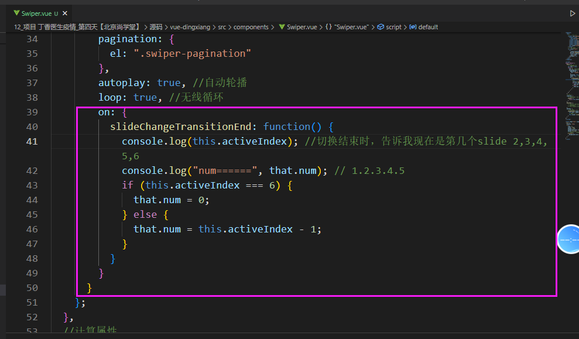

# 项目 丁香医生疫情_第三天

**主要内容**

* 疫情小导航
* Swiper使用
* 出行政策
* 城市数据

**学习目标**

 知识点| 要求 
 -| :- 
 疫情小导航 | 掌握 
 Swiper使用 | 掌握 
 出行政策 | 掌握 
 城市数据 | 掌握 


## 一、疫情小导航

### 1.1 效果图

​	


步骤：

1. 静态布局
2. 建组件
3. 配置路由规则
4. Home页面 配置路由导航，router-link


### 1.2 路由配置

```js
import Vue from 'vue'
import VueRouter from 'vue-router'
import Home from '../views/Home/Home.vue'
//异步
const Hesuan =()=>import('../views/Hesuan/index.vue')
const Area =()=>import('../views/Area/index.vue')
const Prevention =()=>import('../views/Prevention/index.vue')
const Citys = ()=>import('../views/Citys/Citys.vue')
const Travel = ()=>import('../views/Travel/Travel.vue')

Vue.use(VueRouter)

const routes = [
  {
    path: '/',
    name: 'Home',
    component: Home
  },
  {
    path:'/hesuan',
    name:'Hesuan',
    component:Hesuan
  },
  {
    path:'/area',
    name:'Area',
    component:Area
  },{
    path:'/prevention',
    name:'Prevention',
    component:Prevention
  },
  {
    path:'/citys/:cityname',
    name:'Citys',
    component:Citys,
    props:true,
  },
  {
    path:'/travel',
    name:'Travel',
    component:Travel
  }
]

const router = new VueRouter({
  routes
})

export default router

```


### 1.3 风险地图

​	

代码演示

```vue
<template>
  <div class="area">
    <div class="bg">
      <div class="content">
        <div class="th">全国风险地区汇总</div>
        <template v-if="high.length > 0">
          <div class="title">
                
                高风险区{{ high.length }}个</div>
                <ul class="list">
                    <li v-for="(item, index) in high" :key="index">
                    {{ item }}
                    </li>
                </ul>
        </template>
        <!-- 中风险 -->
        <template v-if="mid.length > 0">
          <div class="title">
               
              中风险区{{ mid.length }}个</div>
          <ul  class="list">
            <li v-for="(item, index) in mid" :key="index">
              {{ item }}
            </li>
          </ul>
        </template>
      </div>
    </div>
  </div>
</template>

<script>
import api from "../../api/index";
export default {
  data() {
    return {
      high: [], //高风险区数据
      mid: [], //低风险区域
    };
  },
  created() {
    api.getCovInfo().then((res) => {
      console.log(res.data.newslist[0]);
      let riskarea = res.data.newslist[0].riskarea;
      //解析
      this.high = riskarea.high;
      this.mid = riskarea.mid;
    });
  },
};
</script>

<style lang='less' scoped>
.area {
  background: #f5f5f5;
}
.bg {
  height: 3.6rem;
  background: url("../../assets/images/area.png") no-repeat;
  background-size: cover;
  padding-top: 2.6rem;
}
.content {
  background: #fff;
  margin-left: 0.2rem;
  margin-right: 0.2rem;
  padding: 0.2rem;
  border-radius: 0.2rem;
  min-height: 4rem;
  margin-bottom: 0.2rem;
  .th {
    margin-bottom: 0.3rem;
    font-size: 0.34rem;
  }
  .th:before {
    display: inline-block;
    width: 0.1rem;
    height: 0.3rem;
    margin-right: 0.1rem;
    background-color: #4169e2;
    content: "";
    vertical-align: middle;
  }
  .title{
      font-size: 0.3rem;
      margin-bottom: 0.3rem;
      img{
          width: 0.4rem;
          vertical-align: top;
      }
  }
  .list{
      li{
          margin-bottom: 0.2rem;
          color: #333;
          background:#f7f7f7;
          padding:0.1rem;
          border-radius: 0.1rem;
          letter-spacing: 0.01rem;
          line-height: 0.5rem;
      }
  }
}
</style>
```


### 1.4 核算检测

​	

代码演示

```vue
<template>
  <div>
     
  </div>
</template>

<script>
export default {

}
</script>

<style>

</style>
```


### 1.5 防疫物资

​	

代码演示

```vue
<template>
  <div class="wuzi">
    <!-- 顶部logo -->
    
    <!-- 物资内容 -->
    <div class="wrapper">
      <!-- 选项卡：1. 自己写  2. vant库里面  -->
      <!-- vant库-tabs标签 -->
      <van-tabs v-model="active" animated>
        <van-tab v-for="item in arr" :title="item.title" :key='item.title'>
            <!--  -->
            
        </van-tab>
      </van-tabs>

    </div>
  </div>
</template>

<script>
//导入图片
import img1 from '../../assets/images/jiujing.png'
import img2 from '../../assets/images/kouzhao.png'
export default {
  data() {
    return {
      active: 0,
      arr:[
          {
              img:img1,
              title:'消毒剂'
          },
          {
              img:img2,
              title:'口罩'
          }
      ]
    };
  },
};
</script>

<style lang='less' scoped>
.wuzi {
  background: #3343ff;
}
.wrapper {
  background: #3343ff;
  padding: 0.2rem;
}
</style>
```


## 二、Swiper使用
### 2. 1 效果图

​	


方式一：

1. Vant 轮播图

2. Swiper 

   https://www.swiper.com.cn/

​	

https://github.com/surmon-china/vue-awesome-swiper/tree/v4.1.1


接口：

```js
bannerUrl:'http://iwenwiki.com/wapicovid19/ncovimg.php',//轮播图
```


#### 点击方块高亮步骤:

1. 先准备高亮样式类
2. 添加静态类的方式，给所有li添加===》所有都高亮了
3. 只让一个高亮，:class="{active:index===0}"
4. 提取变量   :class="{active:index===num}"
5. 点击切换  （index） this.num=index


#### 点击方块，轮播图跟着切换

```js
computed: {
      swiper() {
        return this.$refs.mySwiper.$swiper
      }
    },
    mounted() {
      console.log('Current Swiper instance object', this.swiper)
      this.swiper.slideTo(3, 1000, false)
    }
```


### 2.2  使用步骤

1. 安装： npm install swiper@5.x vue-awesome-swiper@4.x --save

2. main.js 导入文件

    ```js
    import VueAwesomeSwiper from 'vue-awesome-swiper'
    import 'swiper/css/swiper.css'
    Vue.use(VueAwesomeSwiper)
    ```

3. 组件使用


```html
 <template>

  <swiper ref="mySwiper" :options="swiperOptions">

       <swiper-slide>Slide 1</swiper-slide>

       <swiper-slide>Slide 2</swiper-slide>

      <swiper-slide>Slide 3</swiper-slide>

       <swiper-slide>Slide 4</swiper-slide>

       <swiper-slide>Slide 5</swiper-slide>

                <div class="swiper-pagination" slot="pagination"></div>

    </swiper>

  </template>  
```

4. 参数配置

```js
 <script>

    export default {

     name: 'carrousel',

      data() {

      return {

       swiperOptions: {

        pagination: {

        el: '.swiper-pagination'

       },

        // Some Swiper option/callback...

        }

      }

      },

     computed: {

      swiper() {

        return this.$refs.mySwiper.$swiper

      }

      },

     mounted() {

      console.log('Current Swiper instance object', this.swiper)

      this.swiper.slideTo(3, 1000, false)

      }

   }

 </script>
```

### 2.3 代码演示

```vue
<template>
  <div>
    <swiper ref="mySwiper" :options="swiperOptions">
      <swiper-slide v-for="item in banner" :key='item.title'>
        
      </swiper-slide>
      <div class="swiper-pagination" slot="pagination"></div>
    </swiper>
    <!-- 轮播的图片按钮 -->
    <ul class="list">
      <li
        v-for="(item,index) in banner" :key='item.title'
        :class="{ active: index == num }"
        @click="changeSwiper(index)"
      >
        {{ item.title }}
      </li>
    </ul>
  </div>
</template>

<script>
import api from '../../../api/index'
export default {
  data() {
      //接受this 
      let that = this;
    return {
      num: 0,
      arr: [1, 2, 3, 4, 5],
      banner:[],//轮播图数据
      //swiper配置内容
      swiperOptions: {
        pagination: {
          el: ".swiper-pagination",
        },
        autoplay: {
          delay: 3000,
          stopOnLastSlide: false,
          disableOnInteraction: false,
        },
        loop: true,
        on: {
            //回调函数，swiper从一个slide过渡到另一个slide开始时执行
          slideChangeTransitionStart: function () {
              if(this.activeIndex == that.arr.length+1){
                    that.num =0;
              }else{
                  that.num = this.activeIndex-1;
              }
          },
        },
      },
    };
  },
  computed: {
    //获取swiper实例对象
    swiper() {
      return this.$refs.mySwiper.$swiper;
    },
  },
  mounted() {
      api.getSwiperBanner()
      .then(res=>{
          console.log('--轮播图--',res.data);
          this.banner = res.data.result;
      })
  },
  methods: {
    changeSwiper(index) {
      //高亮选中
      this.num = index;
      //让swiper切换
      this.swiper.slideTo(index + 1, 1000, false);
    },
  },
};
</script>

<style lang='less' scoped>
.list {
  display: flex;
  li {
    flex: 1;
    padding: 0.1rem;
    font-size: 0.24rem;
    line-height: 0.32rem;
    margin: 0.1rem;
    background: #eee;
    color: #666;
    text-align: center;
    display: flex;
    align-items: center;
  }
  .active {
    background: rgb(80, 116, 173);
    color: #fff;
  }
}
</style>
```


### slideChangeTransitionEnd(swiper)

回调函数，swiper从一个slide过渡到另一个slide结束时执行。
可选Swiper实例作为参数。

```js
 on: {
    slideChangeTransitionEnd: function(){
      alert(this.activeIndex);//切换结束时，告诉我现在是第几个slide
    },
  },
```




## 三、城市界面

### 3.1 效果图

​	


### 4.2 代码演示

```vue
<template>
  <div>
    <h2>{{ cityname }}--城市界面</h2>
    <div id="main" style="width: 7.5rem; height: 9rem"></div>....
  </div>
</template>

<script>
import api from "../../api/index";
export default {
  props: ["cityname"],
  mounted() {
    //获取城市接口数据-----------
    api.getCity(this.cityname).then((res) => {
      console.log("--城市数据----", res.data);
      let arr = res.data.retdata.subList;
      let newArr = [];
      arr.forEach((ele) => {
        let obj = {};
        if ( ele.city.endsWith("区") ||ele.city.endsWith("州") ||ele.city.endsWith("盟")||ele.city.endsWith("旗")) {
          obj.name = ele.city;
        } else {
          obj.name = ele.city + "市";
        }
        obj.value = ele.confirm; //累计确诊
        newArr.push(obj);
      });
      console.log("城市处理完毕的数据", newArr);
      this.$myChart.cityMap("main", this.cityname, newArr);
    });
  },
};
</script>
```

