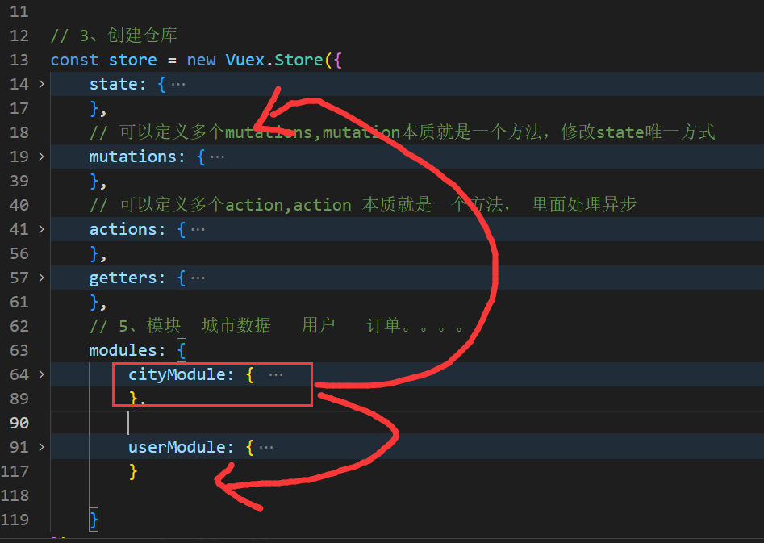

# Vuex 基础

**主要内容**

* Vuex介绍
* 安装
* store仓库
* state数据
* mutation
* action
* getter
* module

**学习目标**

 知识点| 要求 
 -| :- 
 store仓库 | 掌握 
 state | 掌握 
 mutation | 掌握 
 action | 掌握 
 getter | 掌握 
 module | 掌握 


## 回顾：组件通信方式：

1. props  适合父子之间

2. 自定义事件    适合父子之间

3. 兄弟组件  父组件做中转  子=》父=》子

4. $root   $parent    $children  $refs  Vue.prototype.

5. 跨层级比较深的组件：

   Provide  inject  ==>数据不是响应式

   事件总线机制  ==》管理不集中

6. Vuex==>任意组件


## 一、Vuex介绍===》 Redux
### 1. 1 简介

 Vuex 是一个专为 Vue.js 应用程序开发的**状态管理模式**。它采用==集中式存储==管理应用的所有组件的状态，并以相应的规则保证状态以一种==可预测==的方式发生变化。Vuex 也集成到 Vue 的官方调试工具 [devtools extension (opens new window)](https://github.com/vuejs/vue-devtools)，提供了诸如零配置的 time-travel 调试、状态快照导入导出等高级调试功能。

​	https://v3.vuex.vuejs.org/zh/


### 1.2  状态管理工具

让我们从一个简单的 Vue 计数应用开始：

状态：data里定义的数据

```js
new Vue({
  // state
  data () {
    return {
      count: 0
    }
  },
  // view
  template: `
    <div>{{ count }}</div>
  `,
  // actions
  methods: {
    increment () {
      this.count++
    }
  }
})
```

这个状态自管理应用包含以下几个部分：

- **state**，驱动应用的数据源； vue：数据驱动型    原生JS：事件驱动型
- **view**，以声明方式将 **state** 映射到视图；
- **actions**，响应在 **view** 上的用户输入导致的状态变化。

以下是一个表示“单向数据流”理念的简单示意：

​	


但是，当我们的应用遇到**多个组件共享状态**时，单向数据流的简洁性很容易被破坏：

- 多个视图依赖于同一状态。
- 来自不同视图的行为需要变更同一状态。

对于问题一，传参的方法对于多层嵌套的组件将会非常繁琐，并且对于兄弟组件间的状态传递无能为力。对于问题二，我们经常会采用父子组件直接引用或者通过事件来变更和同步状态的多份拷贝。以上的这些模式非常脆弱，通常会导致无法维护的代码。

因此，我们为什么不把组件的共享状态抽取出来，以一个全局单例模式管理呢？在这种模式下，我们的组件树构成了一个巨大的“视图”，不管在树的哪个位置，任何组件都能获取状态或者触发行为！

通过定义和隔离状态管理中的各种概念并通过强制规则维持视图和状态间的独立性，我们的代码将会变得更结构化且易维护。


vuex

​	


### 1.3 什么情况下我应该使用 Vuex？

Vuex 可以帮助我们管理共享状态，并附带了更多的概念和框架。这需要对短期和长期效益进行权衡。

​	如果您不打算开发大型单页应用，使用 Vuex 可能是繁琐冗余的。确实是如此——如果您的应用够简单，您最好不要使用 Vuex。一个简单的 [store 模式 (opens new window)](https://cn.vuejs.org/v2/guide/state-management.html#简单状态管理起步使用)就足够您所需了。但是，如果您需要构建一个中大型单页应用，您很可能会考虑如何更好地在组件外部管理状态，Vuex 将会成为自然而然的选择.


哪些数据需要放进来？

需要组件之间共享的数据，：购物车信息、用户登录，用户信息


## 二、安装

### 2.1 NPM

1. 安装

```sh
npm install vuex@3.x --save
```

yarn 

```sh
yarn add vuex
```

在一个模块化的打包系统中，您必须显式地通过 `Vue.use()` 来安装 Vuex：

2. 导入并安装

```js
import Vue from 'vue'
import Vuex from 'vuex'

Vue.use(Vuex)
```

3. 创建store对象

   ```js
   // 3、创建Strore实例
   const store = new Vuex.Store({
     // 共享数据
     state:{
       count:0
     }
   })
   ```

   

4. 


## 三、store

### 3.1 介绍

​	每一个 Vuex 应用的核心就是 store（仓库）。“store”基本上就是一个容器，它包含着你的应用中大部分的**状态 (state)**。Vuex 和单纯的全局对象有以下两点不同：

1. Vuex 的状态存储是响应式的。当 Vue 组件从 store 中读取状态的时候，若 store 中的状态发生变化，那么相应的组件也会相应地得到高效更新。
2. 你不能直接改变 store 中的状态。改变 store 中的状态的唯一途径就是显式地**提交 (commit) mutation**。这样使得我们可以方便地跟踪每一个状态的变化，从而让我们能够实现一些工具帮助我们更好地了解我们的应用


### 3.2 最简单的 Store

​	安装Vuex 之后，让我们来创建一个 store。创建过程直截了当——仅需要提供一个初始 state 对象和一些 mutation：

```js
import Vue from 'vue'
import Vuex from 'vuex'

Vue.use(Vuex)

const store = new Vuex.Store({
  state: {
    count: 0
  },
  mutations: {
    increment (state) {
      state.count++
    }
  }
})
```

现在，你可以通过 `store.state` 来获取状态对象，以及通过 `store.commit` 方法触发状态变更：

```js
store.commit('increment')

console.log(store.state.count) // -> 1
```

为了在 Vue 组件中访问 `this.$store` property，你需要为 Vue 实例提供创建好的 store。Vuex 提供了一个从根组件向所有子组件，以 `store` 选项的方式“注入”该 store 的机制：

```js
new Vue({
  el: '#app',
  store: store,
})
```


### 核心概念：

### 1、state

提供唯一的公共数据源，需要共享的数据都放到store的state中

```js
// 3、创建Strore实例
const store = new Vuex.Store({
  // 共享数据
  state:{
    count:0
  }
})
```

#### 访问数据：

#### 第一种方式：普通方式

JS中：

```js
this.$store.state.count
```

HTML模板当中：

```vue
 <p>访问state中数据的第一种方式: 
     {{$store.state.count}}---{{this.$store.state.count}}</p>
```

访问state中数据的第2种方式:

#### 第二种方式：辅助函数

```js
// 1、按需引入辅助函数
import { mapState } from "vuex";
 computed: {
    // 2、映射成当前组件需要的计算属性 【常用】   ...mapState(['','',''])
    ...mapState(["count"]),
    ...mapState({
      //mapState 对象写法
      count22: state => state.count,
      // mapState 函数写法:可以访问data数据
      count33(state) {
        return state.count+this.num;
      }
    }),
    fullname() {}
  },
  mounted() {
    console.log(this.count);
  }
```

使用数据：

```vue
 <h2>减 子组件---辅助函数</h2>
<p>访问state中数据的第二种方式：{{count}}---{{count22}}---{{count33}}</p>
```


### 2、Mutation 

更改 Vuex 的 store 中的状态的==唯一方法==是**提交** mutation （变异）

mutation  本质是方法， 方法名()     commit('mutationName')

#### （1）定义mutation：

```js
 mutations: {
    // mutation是一个方法，在此可以定义多个mutation 
    // 1、定义  mutation   作用：修改state里的数据
    add(state) {
      // 状态变更
      state.count++;
    },
    // 带参数
    addN(state, step) {
      state.count += step;
    },
    // payload {step:5,info:''}
    addN2(state, payload) {
      state.count += payload.step
    }
  }
```

#### （2）commit  mutation

```js
methods: {
    btnAdd() {
      // 2、触发mutation的第一种方式 this.$store.commit('mutation名字')
      this.$store.commit("add");
    },
    addN() {
      // 带参数，触发mutation
      this.$store.commit("addN", 3);
    },
    addN2() {
      // 带参数， 对象风格的提交方式
      this.$store.commit({
        type: "addN2",
        step: 5
      });
    }
  }
```


#### 第二种触发mutation的方法：辅助函数

映射为当前组件所需要的methods方法：	

- ```js
  // 1. 从 vuex 中按需导入 mapMutations 函数
  import { mapMutations } from 'vuex'
  ```

- 

  ```js
  // 2. 将指定的 mutations 函数，映射为当前组件的 methods 函数
  methods: {
   ...mapMutations(['add', 'addN'])
  }
  ```

  

#### Mutation 常量管理

mutation-types.js：

```js
// 定义所有mutation的类型，并导出
export const ADD_MUTATION='add_mutation'
export const SUBN_MUTATION='subn_mutation'
```

store/index.js:

```js
// 按需导入常量
import {
    ADD_MUTATION,
    SUBN_MUTATION
} from './mutation-types'

// 3、创建Store实例
const store = new Vuex.Store({
    // 共享数据
    state: {
        count: 0,
        num: 100
    },
    mutations: {
        // mutation是一个方法，在此可以定义多个mutation 
        // 1、定义  mutation   作用：修改state里的数据
        // add(state) {
        //     // 状态变更
        //     state.count++;
        // },
        [ADD_MUTATION](state) {
            // 状态变更
            state.count++;
        },
        // 传参  SUBN_MUTATION 常量的值是mutation的名字
        [SUBN_MUTATION](state, num) {
            state.count -= num;
        }
    }
})
```

add.vue

```js
// 引入常量
import { ADD_MUTATION } from "../store/mutation-types";

methods: {
    btnAdd() {
      // 2、触发mutation的第一种方式 this.$store.commit('mutation名字')
      // this.$store.commit("add");
      this.$store.commit(ADD_MUTATION);
    },
}
```

sub.vue

```js
//引入常量
import { SUBN_MUTATION } from "../store/mutation-types";


methods: {
    // ...mapMutations(['mutation名字']) 作用：將store中mutations映射成当前组件所需要的methods方法
    ...mapMutations(["sub", SUBN_MUTATION]),

    subN() {
      // this.subn_mutation
      this[SUBN_MUTATION](3);
    }
  },
```


### 3、Action 

- 说明

  Action 用于处理异步任务。如果通过异步操作变更数据，必须通过 Action，而不能使用 Mutation，但是在 Action 中还是要通过触发Mutation 的方式间接变更数据。

- 注意

  在 actions 中，不能直接修改 state 中的数据；

  必须通过 context.commit() 触发某个 mutation 才行

- 使用

#### 触发 actions 的第一种方式：

```js
// 1、定义 Action
 const store = new Vuex.Store({
     // ...省略其他代码
     mutations: {
         add(state) {
         	state.count++
         }
     },
     actions: {
         // context 相当于 new 出来的实例对象
         addAsync(context) {
             setTimeout(() => {
                // 在 actions 中，不能直接修改 state 中的数据；
        // 必须通过 context.commit() 触发某个 mutation 才行
             	context.commit('add')
             }, 1000)
         } 
     }
 })
 
 
 // 2、触发 Action
 methods: {
     handle() {
         // 触发 actions 的第一种方式
         this.$store.dispatch('addAsync')
     }
 }
 
```


#### 触发 actions 的第二种方式：

- 实现

  ```js
  // 1. 从 vuex 中按需导入 mapActions 函数
  import { mapActions } from 'vuex'
  ```

  通过刚才导入的 mapActions 函数，将需要的 actions 函数，映射为当前组件的 methods 方法：

  ```js
  // 2. 将指定的 actions 函数，映射为当前组件的 methods 函数
  methods: {
   	...mapActions(['addASync', 'addNASync'])
  }
  ```

  3、直接调用

  ```html
  <button @click="subN(3)">-N</button>
  <button @click="subNAsync(5)">-N Async</button>
  ```

  

### 4、Getter

- 说明

  Getter 用于对 Store 中的数据进行加工处理形成新的数据，==不对store中的数据进行修改，只起到一个包装的作用==。

  1. Getter 可以对 Store 中已有的数据加工处理之后形成新的数据，类似 Vue 的计算属性。
  2. Store 中数据发生变化，Getter 的数据也会跟着变化。

- 定义getters：

  ```js
  // 定义 Getter
   const store = new Vuex.Store({
       state: {
      	 count: 2
       },
       getters: {
           showNum: state => {
           	// return '当前最新的数量是【'+ state.count +'】'
               return state.count*2
           }
       }
   })
  ```

  1. **使用 getters 的第一种方式：**

  ```js
  this.$store.getters.名称
  ```

  在Addition.vue当中：

  ```html
   <!-- <h3>当前最新的count值为：{{$store.state.count}}</h3> -->
   <h3>{{$store.getters.showNum}}</h3>
  ```

  

  

  2. **使用 getters 的第二种方式：**

  ```js
  import { mapGetters } from 'vuex'
  computed: {
   ...mapGetters(['showNum'])
  }
  ```

  在Subtraction.vue子组件当中：

  ```html
   <!-- <h3>当前最新的count值为：{{count}}</h3> -->
  <h3>{{showNum}}</h3>
  ```

  


## 四、state 

### 4.1 介绍

​	Vuex 使用**单一状态树**——是的，用一个对象就包含了全部的应用层级状态。至此它便作为一个“唯一数据源”而存在。这也意味着，每个应用将仅仅包含一个 store 实例。单一状态树让我们能够直接地定位任一特定的状态片段，在调试的过程中也能轻易地取得整个当前应用状态的快照。

单状态树和模块化并不冲突——在后面的章节里我们会讨论如何将状态和状态变更事件分布到各个子模块中。

存储在 Vuex 中的数据和 Vue 实例中的 `data` 遵循相同的规则，例如状态对象必须是纯粹 (plain) 的。


### 4.2 在 Vue 组件中获得 Vuex 状态

​	那么我们如何在 Vue 组件中展示状态呢？由于 Vuex 的状态存储是响应式的，从 store 实例中读取状态最简单的方法就是在[计算属性 (opens new window)](https://cn.vuejs.org/guide/computed.html)中返回某个状态

```js
// 创建一个 Counter 组件
const Counter = {
  template: `<div>{{ count }}</div>`,
  computed: {
    count () {
      return store.state.count
    }
  }
}
```

​	每当 `store.state.count` 变化的时候, 都会重新求取计算属性，并且触发更新相关联的 DOM。

然而，这种模式导致组件依赖全局状态单例。在模块化的构建系统中，在每个需要使用 state 的组件中需要频繁地导入，并且在测试组件时需要模拟状态。

Vuex 通过 `store` 选项，提供了一种机制将状态从根组件“注入”到每一个子组件中（需调用 `Vue.use(Vuex)`）：

```js
const app = new Vue({
  el: '#app',
  // 把 store 对象提供给 “store” 选项，这可以把 store 的实例注入所有的子组件
  store,
  components: { Counter },
  template: `
    <div class="app">
      <counter></counter>
    </div>
  `
})
```

通过在根实例中注册 `store` 选项，该 store 实例会注入到根组件下的所有子组件中，且子组件能通过 `this.$store` 访问到。让我们更新下 `Counter` 的实现：

```js
const Counter = {
  template: `<div>{{ count }}</div>`,
  computed: {
    count () {
      return this.$store.state.count
    }
  }
}
```

### 4.3 mapState 辅助函数

​	当一个组件需要获取多个状态的时候，将这些状态都声明为计算属性会有些重复和冗余。为了解决这个问题，我们可以使用 `mapState` 辅助函数帮助我们生成计算属性，让你少按几次键：

```js
// 在单独构建的版本中辅助函数为 Vuex.mapState
import { mapState } from 'vuex'

export default {
  // ...
  computed: mapState({
    // 箭头函数可使代码更简练
    count: state => state.count,

    // 传字符串参数 'count' 等同于 `state => state.count`
    countAlias: 'count',

    // 为了能够使用 `this` 获取局部状态，必须使用常规函数
    countPlusLocalState (state) {
      return state.count + this.localCount
    }
  })
}
```

当映射的计算属性的名称与 state 的子节点名称相同时，我们也可以给 `mapState` 传一个字符串数组。

```js
computed: mapState([
  // 映射 this.count 为 store.state.count
  'count'
])
```

### 4.4 对象展开运算符

​	`mapState` 函数返回的是一个对象。我们如何将它与局部计算属性混合使用呢？通常，我们需要使用一个工具函数将多个对象合并为一个，以使我们可以将最终对象传给 `computed` 属性。但是自从有了[对象展开运算符 (opens new window)](https://github.com/tc39/proposal-object-rest-spread)，我们可以极大地简化写法：

```js
computed: {
  localComputed () { /* ... */ },
  // 使用对象展开运算符将此对象混入到外部对象中
  ...mapState({
    // ...
  })
}
```


## 五、 Mutation

### 5.1 介绍

​	更改 Vuex 的 store 中的状态的唯一方法是提交 mutation。Vuex 中的 mutation 非常类似于事件：每个 mutation 都有一个字符串的 **事件类型 (type)** 和 一个 **回调函数 (handler)**。这个回调函数就是我们实际进行状态更改的地方，并且它会接受 state 作为第一个参数：

```js
const store = new Vuex.Store({
  state: {
    count: 1
  },
  mutations: {
    increment (state) {
      // 变更状态
      state.count++
    }
  }
})
```

​	你不能直接调用一个 mutation handler。这个选项更像是事件注册：“当触发一个类型为 `increment` 的 mutation 时，调用此函数。”要唤醒一个 mutation handler，你需要以相应的 type 调用 **store.commit** 方法：

```js
store.commit('increment')
```

### 5.2 提交载荷（Payload）

你可以向 `store.commit` 传入额外的参数，即 mutation 的 **载荷（payload）**：

```js
// ...
mutations: {
  increment (state, n) {
    state.count += n
  }
}
store.commit('increment', 10)
```

在大多数情况下，载荷应该是一个对象，这样可以包含多个字段并且记录的 mutation 会更易读：

```js
// ...
mutations: {
  increment (state, payload) {
    state.count += payload.amount
  }
}
store.commit('increment', {
  amount: 10
})
```

### 5.3 对象风格的提交方式

提交 mutation 的另一种方式是直接使用包含 `type` 属性的对象：

```js
store.commit({
  type: 'increment',
  amount: 10
})
```

当使用对象风格的提交方式，整个对象都作为载荷传给 mutation 函数，因此 handler 保持不变：

```js
mutations: {
  increment (state, payload) {
    state.count += payload.amount
  }
}
```

### 5.4 Mutation 需遵守 Vue 的响应规则

​	既然 Vuex 的 store 中的状态是响应式的，那么当我们变更状态时，监视状态的 Vue 组件也会自动更新。这也意味着 Vuex 中的 mutation 也需要与使用 Vue 一样遵守一些注意事项：

1. 最好提前在你的 store 中初始化好所有所需属性。
2. 当需要在对象上添加新属性时，你应该

- 使用 `Vue.set(obj, 'newProp', 123)`, 或者

- 以新对象替换老对象。例如，我们可以这样写：

  ```js
  state.obj = { ...state.obj, newProp: 123 }
  ```

### 5.5 使用常量替代 Mutation 事件类型

一条重要的原则就是要记住 **mutation 必须是同步函数**。为什么？请参考下面的例子：

```js
mutations: {
  someMutation (state) {
    api.callAsyncMethod(() => {
      state.count++
    })
  }
}
```

​	现在想象，我们正在 debug 一个 app 并且观察 devtool 中的 mutation 日志。每一条 mutation 被记录，devtools 都需要捕捉到前一状态和后一状态的快照。然而，在上面的例子中 mutation 中的异步函数中的回调让这不可能完成：因为当 mutation 触发的时候，回调函数还没有被调用，devtools 不知道什么时候回调函数实际上被调用——实质上任何在回调函数中进行的状态的改变都是不可追踪的。

### 5.6 在组件中提交 Mutation

你可以在组件中使用 `this.$store.commit('xxx')` 提交 mutation，或者使用 `mapMutations` 辅助函数将组件中的 methods 映射为 `store.commit` 调用（需要在根节点注入 `store`）。

```js
import { mapMutations } from 'vuex'

export default {
  // ...
  methods: {
    ...mapMutations([
      'increment', // 将 `this.increment()` 映射为 `this.$store.commit('increment')`

      // `mapMutations` 也支持载荷：
      'incrementBy' // 将 `this.incrementBy(amount)` 映射为 `this.$store.commit('incrementBy', amount)`
    ]),
    ...mapMutations({
      add: 'increment' // 将 `this.add()` 映射为 `this.$store.commit('increment')`
    })
  }
}
```

## 六、Action 

### 6.1 介绍

Action 类似于 mutation，不同在于：

- Action 提交的是 mutation，而不是直接变更状态。
- Action 可以包含任意异步操作。

让我们来注册一个简单的 action：

```js
const store = new Vuex.Store({
  state: {
    count: 0
  },
  mutations: {
    increment (state) {
      state.count++
    }
  },
  actions: {
    increment (context) {
      context.commit('increment')
    }
  }
})
```

Action 函数接受一个与 store 实例具有相同方法和属性的 context 对象，因此你可以调用 `context.commit` 提交一个 mutation，或者通过 `context.state` 和 `context.getters` 来获取 state 和 getters。

实践中，我们会经常用到 ES2015 的来简化代码（特别是我们需要调用 `commit` 很多次的时候）：

```js
actions: {
  increment ({ commit }) {
    commit('increment')
  }
}
```

### 6.2 分发 Action

Action 通过 `store.dispatch` 方法触发：

```js
store.dispatch('increment')
```

乍一眼看上去感觉多此一举，我们直接分发 mutation 岂不更方便？实际上并非如此，还记得 **mutation 必须同步执行**这个限制么？Action 就不受约束！我们可以在 action 内部执行**异步**操作：

```js
actions: {
  incrementAsync ({ commit }) {
    setTimeout(() => {
      commit('increment')
    }, 1000)
  }
}
```

Actions 支持同样的载荷方式和对象方式进行分发：

```js
// 以载荷形式分发
store.dispatch('incrementAsync', {
  amount: 10
})

// 以对象形式分发
store.dispatch({
  type: 'incrementAsync',
  amount: 10
})
```

### 6.3 在组件中分发 Action

你在组件中使用 `this.$store.dispatch('xxx')` 分发 action，或者使用 `mapActions` 辅助函数将组件的 methods 映射为 `store.dispatch` 调用（需要先在根节点注入 `store`）：

```js
import { mapActions } from 'vuex'

export default {
  // ...
  methods: {
    ...mapActions([
      'increment', // 将 `this.increment()` 映射为 `this.$store.dispatch('increment')`

      // `mapActions` 也支持载荷：
      'incrementBy' // 将 `this.incrementBy(amount)` 映射为 `this.$store.dispatch('incrementBy', amount)`
    ]),
    ...mapActions({
      add: 'increment' // 将 `this.add()` 映射为 `this.$store.dispatch('increment')`
    })
  }
}
```

## 七、Getter

### 7.1 介绍

有时候我们需要从 store 中的 state 中派生出一些状态，例如对列表进行过滤并计数：

```js
computed: {
  doneTodosCount () {
    return this.$store.state.todos.filter(todo => todo.done).length
  }
}
```

如果有多个组件需要用到此属性，我们要么复制这个函数，或者抽取到一个共享函数然后在多处导入它——无论哪种方式都不是很理想。

Vuex 允许我们在 store 中定义“getter”（可以认为是 store 的计算属性）。就像计算属性一样，getter 的返回值会根据它的依赖被缓存起来，且只有当它的依赖值发生了改变才会被重新计算。

Getter 接受 state 作为其第一个参数：

```js
const store = new Vuex.Store({
  state: {
    todos: [
      { id: 1, text: '...', done: true },
      { id: 2, text: '...', done: false },
      { id: 3, text: '...', done: true },
      { id: 4, text: '...', done: false }
    ]
  },
  getters: {
    doneTodos: state => {
      return state.todos.filter(todo => todo.done)  []
    },
    unDoneTodos: state => {
      return state.todos.filter(todo => !todo.done)
    }
  }
})

普通方式：
this.$store.state.todos
//首页  done  true

//news  done  true
```

### 7.2 通过属性访问

Getter 会暴露为 `store.getters` 对象，你可以以属性的形式访问这些值：

```js
store.getters.doneTodos // -> [{ id: 1, text: '...', done: true }]
```

Getter 也可以接受其他 getter 作为第二个参数：

```js
getters: {
  // ...
  doneTodosCount: (state, getters) => {
    return getters.doneTodos.length
  }
}
store.getters.doneTodosCount // -> 1
```

我们可以很容易地在任何组件中使用它：

```js
computed: {
  doneTodosCount () {
    return this.$store.getters.doneTodosCount
  }
}
```

注意，getter 在通过属性访问时是作为 Vue 的响应式系统的一部分缓存其中的。

### 7.3通过方法访问

你也可以通过让 getter 返回一个函数，来实现给 getter 传参。在你对 store 里的数组进行查询时非常有用。

```js
getters: {
  // ...
  getTodoById: (state) => (id) => {
    return state.todos.find(todo => todo.id === id)  //obj
  }
}
store.getters.getTodoById(2) // -> { id: 2, text: '...', done: false }
```

注意，getter 在通过方法访问时，每次都会去进行调用，而不会缓存结果。

### 7.4 mapGetters 辅助函数

`mapGetters` 辅助函数仅仅是将 store 中的 getter 映射到局部计算属性：

```js
import { mapGetters } from 'vuex'

export default {
  // ...
  computed: {
  // 使用对象展开运算符将 getter 混入 computed 对象中
    ...mapGetters([
      'doneTodosCount',
      'anotherGetter',
      // ...
    ])
  }
}
```

如果你想将一个 getter 属性另取一个名字，使用对象形式：

```js
...mapGetters({
  // 把 `this.doneCount` 映射为 `this.$store.getters.doneTodosCount`
  doneCount: 'doneTodosCount'
})
```


## 八、Module

### 8.1 介绍

​	由于使用单一状态树，应用的所有状态会集中到一个比较大的对象。当应用变得非常复杂时，store 对象就有可能变得相当臃肿。

为了解决以上问题，Vuex 允许我们将 store 分割成**模块（module）**。每个模块拥有自己的 state、mutation、action、getter、甚至是嵌套子模块——从上至下进行同样方式的分割：

```js
const moduleA = {
  state: () => ({ ... }),
  mutations: { ... },
  actions: { ... },
  getters: { ... },
      modules:{
          
      }
}

const moduleB = {
  state: () => ({ ... }),
  mutations: { ... },
  actions: { ... }
}

const store = new Vuex.Store({
  modules: {
    a: moduleA,
    b: moduleB
  }
})

store.state.a // -> moduleA 的状态
store.state.b // -> moduleB 的状态
```

### 8.2 命名空间

默认情况下，模块内部的 action、mutation 和 getter 是注册在**全局命名空间**的——这样使得多个模块能够对同一 mutation 或 action 作出响应。

如果希望你的模块具有更高的封装度和复用性，你可以通过添加 `namespaced: true` 的方式使其成为带命名空间的模块。当模块被注册后，它的所有 getter、action 及 mutation 都会自动根据模块注册的路径调整命名。例如：

```js
const store = new Vuex.Store({
  modules: {
    account: {
      namespaced: true,

      // 模块内容（module assets）
      state: () => ({ ... }), // 模块内的状态已经是嵌套的了，使用 `namespaced` 属性不会对其产生影响
      getters: {
        isAdmin () { ... } // -> getters['account/isAdmin']
      },
      actions: {
        login () { ... } // -> dispatch('account/login')
      },
      mutations: {
        login () { ... } // -> commit('account/login')
      },

      // 嵌套模块
      modules: {
        // 继承父模块的命名空间
        myPage: {
          state: () => ({ ... }),
          getters: {
            profile () { ... } // -> getters['account/profile']
          }
        },

        // 进一步嵌套命名空间
        posts: {
          namespaced: true,

          state: () => ({ ... }),
          getters: {
            popular () { ... } // -> getters['account/posts/popular']
          }
        }
      }
    }
  }
})
```

启用了命名空间的 getter 和 action 会收到局部化的 `getter`，`dispatch` 和 `commit`。换言之，你在使用模块内容（module assets）时不需要在同一模块内额外添加空间名前缀。更改 `namespaced` 属性后不需要修改模块内的代码。

### 8.3 在带命名空间的模块内访问全局内容（Global Assets）

如果你希望使用全局 state 和 getter，`rootState` 和 `rootGetters` 会作为第三和第四参数传入 getter，也会通过 `context` 对象的属性传入 action。



若需要在全局命名空间内分发 action 或提交 mutation，将 `{ root: true }` 作为第三参数传给 `dispatch` 或 `commit` 即可。

```js
modules: {
  foo: {
    namespaced: true,

    getters: {
      // 在这个模块的 getter 中，`getters` 被局部化了
      // 你可以使用 getter 的第四个参数来调用 `rootGetters`
      someGetter (state, getters, rootState, rootGetters) {
        getters.someOtherGetter // -> 'foo/someOtherGetter'
        rootGetters.someOtherGetter // -> 'someOtherGetter'
      },
      someOtherGetter: state => { ... }
    },

    actions: {
      // 在这个模块中， dispatch 和 commit 也被局部化了
      // 他们可以接受 `root` 属性以访问根 dispatch 或 commit
      someAction ({ dispatch, commit, getters, rootGetters }) {
        getters.someGetter // -> 'foo/someGetter'
        rootGetters.someGetter // -> 'someGetter'

        dispatch('someOtherAction') // -> 'foo/someOtherAction'
        dispatch('someOtherAction', null, { root: true }) // -> 'someOtherAction'

        commit('someMutation') // -> 'foo/someMutation'
        commit('someMutation', null, { root: true }) // -> 'someMutation'
      },
      someOtherAction (ctx, payload) { ... }
    }
  }
}
```

### 8.4 在带命名空间的模块注册全局 action

若需要在带命名空间的模块注册全局 action，你可添加 `root: true`，并将这个 action 的定义放在函数 `handler` 中。例如：

```js
{
  actions: {
    someOtherAction ({dispatch}) {
      dispatch('someAction')
    }
  },
  modules: {
    foo: {
      namespaced: true,

      actions: {
        someAction: {
          root: true,
          handler (namespacedContext, payload) { ... } // -> 'someAction'
        }
      }
    }
  }
}
```


# ==Vuex基础回顾==

Vuex 做什么？  What?  Why ?  How?

状态管理机制，凌驾于所有组件之上，集中式（所有的状态都集中管理）；可预测（）

props  自定义事件   跨层级，EventBus ,$。。。。。

Vuex 

哪些数据存到Vuex?  需要共享的数据 购物车、登录状态、定位信息

==》全局对象代替Vuex的身份？

Vuex 存到里面的数据是响应式！！！


```js
//安装
Vue.use(Vuex)

//创建实例
new Vuex.Store({
    state:{
        count:1,
        obj:{
            
        }
    }，
    //变异 方法
    mutations:{
    	add(state){
    		state.count++;
		},
        sub(){
            
        }
	},
   actions:{
       //commit
       addAsync({commit}){
           setTimeout(()=>{
               //同步 commit
               commit('add')
           },2000)
       }
   }
})
```


### 1、state

所有需要共享的数据

1. 定义数据

2. 访问数据

   第一种：普通方式

   ```js
   this.$stroe.state.count  //js
   {{$stroe.state.count}}  //template
   
   ```

   第二种：辅助函数方式

   ```js
   import  {mapState} from 'vuex'
   //映射全局状态为当前组件所需要的计算属性
   computed:{
       ...mapState(['count','obj',]),
       full:{
           
       }
   }
   
   {{count}}   
   this.count
   ```


### 2、修改数据

mutation  修改数据的唯一方式；同步，不能写异步

本质方法

触发：commit('名字'，参数)

```js
this.$store.commit('add',4)
this.$store.commit({
    type:'add',
    payload:2
})
```

第二种：辅助函数

```js
import  {mapState,mapMutations} from 'vuex'
//映射全局Mutations为当前组件所需要的方法

methods:{
    ...mapMutations(['add']),
    getHttp(){
        this.add()
    }
}
```


### 3、Action 异步

本质：方法   写异步   commit()

如何触发action:

第一种：

```js
this.$store.dispatch('addAsync',参数)
```

第二种：

```js
import {mapActions} from  'vuex'
//映射全局Actions为当前组件所需要的方法

methods:{
    ...mapActions(['addAsync']),
    getHttp(){
        this.addAsync()
    }
}
```


