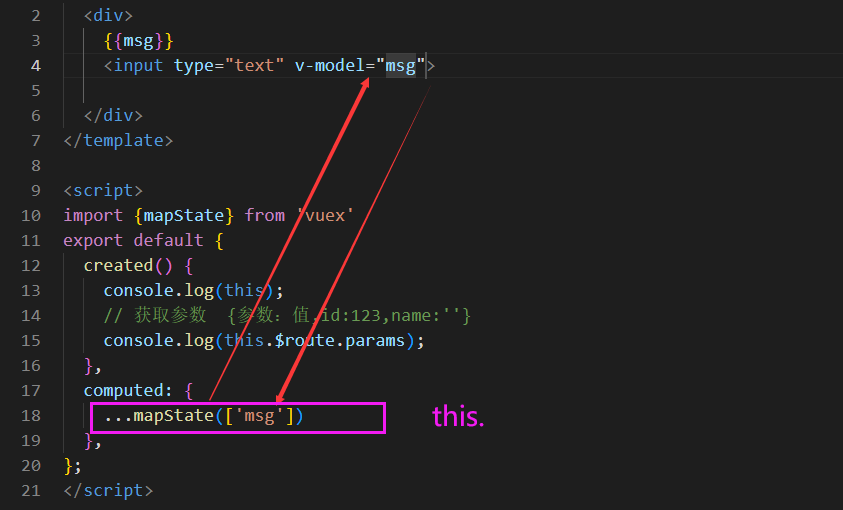

# Vuex-基础

**主要内容**

* Vue项目结构
* 插件
* 严格模式
* 表单处理
* Element库
* Vuex登录布局

**学习目标**

 知识点| 要求 
 -| :- 
 Vue项目结构 | 掌握 
 插件 | 了解 
 严格模式 | 掌握 
 表单处理 | 掌握 
 Element库 | 掌握 
 Vuex登录布局 | 掌握 


## 一、Vue项目结构
### 1.1 介绍

Vuex 并不限制你的代码结构。但是，它规定了一些需要遵守的规则：

1. 应用层级的状态应该集中到单个 store 对象中。
2. 提交 **mutation** 是更改状态的唯一方法，并且这个过程是同步的。
3. 异步逻辑都应该封装到 **action** 里面。

只要你遵守以上规则，如何组织代码随你便。如果你的 store 文件太大，只需将 action、mutation 和 getter 分割到单独的文件。

对于大型应用，我们会希望把 Vuex 相关代码分割到模块中。下面是项目结构示例

```sh
├── index.html
├── main.js
├── api
│   └── ... # 抽取出API请求
├── components
│   ├── App.vue
│   └── ...
└── store
    ├── index.js          # 我们组装模块并导出 store 的地方
    ├── actions.js        # 根级别的 action
    ├── mutations.js      # 根级别的 mutation
    └── modules
        ├── cart.js       # 购物车模块
        └── products.js   # 产品模块
```


## 二、插件（了解）

### 2.1 介绍

Vuex 的 store 接受 `plugins` 选项，这个选项暴露出每次 mutation 的钩子。Vuex 插件就是一个函数，它接收 store 作为唯一参数：

```js
const myPlugin = store => {
  // 当 store 初始化后调用
  store.subscribe((mutation, state) => {
    // 每次 mutation 之后调用
    // mutation 的格式为 { type, payload }
  })
}
```

然后像这样使用：

```js
const store = new Vuex.Store({
  // ...
  plugins: [myPlugin]
})
```


### 2.2 在插件内提交 Mutation

在插件中不允许直接修改状态——类似于组件，只能通过提交 mutation 来触发变化。

通过提交 mutation，插件可以用来同步数据源到 store。例如，同步 websocket 数据源到 store（下面是个大概例子，实际上 `createPlugin` 方法可以有更多选项来完成复杂任务）：

```js
export default function createWebSocketPlugin (socket) {
  return store => {
    socket.on('data', data => {
      store.commit('receiveData', data)
    })
    store.subscribe(mutation => {
      if (mutation.type === 'UPDATE_DATA') {
        socket.emit('update', mutation.payload)
      }
    })
  }
}
const plugin = createWebSocketPlugin(socket)

const store = new Vuex.Store({
  state,
  mutations,
  plugins: [plugin]
})
```

### 2.3 内置 Logger 插件

> ==如果正在使用 [vue-devtools ]，你可能不需要此插件。==

Vuex 自带一个日志插件用于一般的调试:

```js
import createLogger from 'vuex/dist/logger'

const store = new Vuex.Store({
  plugins: [createLogger()]
})
```

`createLogger` 函数有几个配置项：

```js
const logger = createLogger({
  collapsed: false, // 自动展开记录的 mutation
  filter (mutation, stateBefore, stateAfter) {
    // 若 mutation 需要被记录，就让它返回 true 即可
    // 顺便，`mutation` 是个 { type, payload } 对象
    return mutation.type !== "aBlocklistedMutation"
  },
  actionFilter (action, state) {
    // 和 `filter` 一样，但是是针对 action 的
    // `action` 的格式是 `{ type, payload }`
    return action.type !== "aBlocklistedAction"
  },
  transformer (state) {
    // 在开始记录之前转换状态
    // 例如，只返回指定的子树
    return state.subTree
  },
  mutationTransformer (mutation) {
    // mutation 按照 { type, payload } 格式记录
    // 我们可以按任意方式格式化
    return mutation.type
  },
  actionTransformer (action) {
    // 和 `mutationTransformer` 一样，但是是针对 action 的
    return action.type
  },
  logActions: true, // 记录 action 日志
  logMutations: true, // 记录 mutation 日志
  logger: console, // 自定义 console 实现，默认为 `console`
})
```

日志插件还可以直接通过 `<script>` 标签引入，它会提供全局方法 `createVuexLogger`。

要注意，logger 插件会生成状态快照，所以仅在开发环境使用。

## 三、严格模式

### 3.1 介绍

开启严格模式，仅需在创建 store 的时候传入 `strict: true`：

```js
const store = new Vuex.Store({
  // ...
  strict: true
})
```

在严格模式下，无论何时发生了状态变更且不是由 mutation 函数引起的，将会抛出错误。这能保证所有的状态变更都能被调试工具跟踪到。

### 3.2 开发环境与发布环境（生成环境）

**不要在发布环境下启用严格模式**！严格模式会深度监测状态树来检测不合规的状态变更——请确保在发布环境下关闭严格模式，以避免性能损失。（严格模式主要是用在开发环境限制开发人员的规范的）

类似于插件，我们可以让构建工具来处理这种情况：

```js
const store = new Vuex.Store({
  // ...生成环境   开发环境 开启
  strict: process.env.NODE_ENV !== 'production'
})
```

## 四、表单处理

### 4.1 介绍

当在严格模式中使用 Vuex 时，在属于 Vuex 的 state 上使用 `v-model` 会比较棘手：

```html
<input v-model="obj.message">
```

假设这里的 `obj` 是在计算属性中返回的一个属于 Vuex store 的对象，在用户输入时，`v-model` 会试图直接修改 `obj.message`。在严格模式中，由于这个修改不是在 mutation 函数中执行的, 这里会抛出一个错误。



用“Vuex 的思维”去解决这个问题的方法是：给 `<input>` 中绑定 value，然后侦听 `input` 或者 `change` 事件，在事件回调中调用一个方法:

```html
<input :value="message" @input="updateMessage">

```

```js
// ...
computed: {
  ...mapState({
    message: state => state.obj.message
  })
},
methods: {
  updateMessage (e) {
    this.$store.commit('updateMessage', e.target.value)
  }
}
```

下面是 mutation 函数：

```js
// ...
mutations: {
  updateMessage (state, message) {
    state.obj.message = message
  }
}
```

### 4.2 双向绑定的计算属性

必须承认，这样做比简单地使用“`v-model` + 局部状态”要啰嗦得多，并且也损失了一些 `v-model` 中很有用的特性。另一个方法是使用带有 setter 的双向绑定计算属性：

```html
<input v-model="message">
```

```js
// ...
computed: {
  message: {
    get () {
      return this.$store.state.obj.message
    },
    set (value) {
      this.$store.commit('updateMessage', value)
    }
  }
}
```

## 五、Element库

### 5.1 介绍

Element，一套为开发者、设计师和产品经理准备的基于 Vue 2.0 的桌面端组件库  PC端


vant  

​	

### 5.2 安装

1. npm 安装

推荐使用 npm 的方式安装，它能更好地和 [webpack](https://webpack.js.org/) 打包工具配合使用。

```shell
npm i element-ui -S
```

2. 使用 vue-cli@3

```shell
vue add element
```

### 5.3 引入 Element

1.完整引入

在 main.js 中写入以下内容：

```javascript
import Vue from 'vue';
import ElementUI from 'element-ui';
import 'element-ui/lib/theme-chalk/index.css';
import App from './App.vue';

Vue.use(ElementUI);

new Vue({
  el: '#app',
  render: h => h(App)
});
```

2.按需引入

借助 [babel-plugin-component](https://github.com/QingWei-Li/babel-plugin-component)，我们可以只引入需要的组件，以达到减小项目体积的目的。

首先，安装 babel-plugin-component：

```bash
npm install babel-plugin-component -D
```

然后，将 .babelrc 修改为：

```json
{
  "presets": [["es2015", { "modules": false }]],
  "plugins": [
    [
      "component",
      {
        "libraryName": "element-ui",
        "styleLibraryName": "theme-chalk"
      }
    ]
  ]
}
```

​	接下来，如果你只希望引入部分组件，比如 Button 和 Select，那么需要在 main.js 中写入以下内容：

```js
import Vue from 'vue';
import { Button, Select } from 'element-ui';
import App from './App.vue';

Vue.component(Button.name, Button);
Vue.component(Select.name, Select);
/* 或写为
 * Vue.use(Button)
 * Vue.use(Select)
 */

new Vue({
  el: '#app',
  render: h => h(App)
});
```

## 六、登录界面

### 6.1 效果展示

​	

### 6.2 代码实现

```vue
<template>
  <div class="login">
    <el-row>
      <el-col :span="8" :offset="8">
        <el-form
          :model="loginForm"
          status-icon
          :rules="rules"
          ref="ruleForm"
          label-width="100px"
        >
          <el-form-item label="账号" prop="username">
            <el-input type="text" v-model="loginForm.username"></el-input>
          </el-form-item>
          <el-form-item label="密码" prop="password">
            <el-input type="password" v-model="loginForm.password"></el-input>
          </el-form-item>

          <el-form-item>
            <el-button type="primary" @click="submitForm('ruleForm')"
              >提交</el-button
            >
            <el-button @click="resetForm('ruleForm')">重置</el-button>
          </el-form-item>
        </el-form>
      </el-col>
    </el-row>
  </div>
</template>

<script>
import api from "../api/index";
export default {
  data() {
    var validateUser = (rule, value, callback) => {
      if (value === "") {
        callback(new Error("请输入账号"));
      } else {
        callback();
      }
    };
    var validatePass = (rule, value, callback) => {
      if (value === "") {
        callback(new Error("请输入密码"));
      } else {
        callback();
      }
    };
    return {
      loginForm: {
        //表单数据对象{ }
        username: "",
        password: "",
      },
      rules: {
        //表单验证规则
        username: [{ validator: validateUser, trigger: "blur" }],
        password: [{ validator: validatePass, trigger: "blur" }],
      },
    };
  },
  methods: {
    //提交事件
    submitForm(formName) {
      this.$refs[formName].validate((valid) => {
        if (valid) {
        	 console.log("成功");
        } else {
          console.log("校验失败");
          return false;
        }
      });
    },
    //重置事件
    resetForm(formName) {
      this.$refs.ruleForm.resetFields();
    },
  },
};
</script>

<style lang='less' scoped>
.login {
  margin-top: 100px;
}
</style>
```

