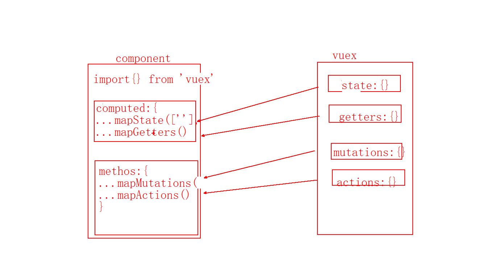
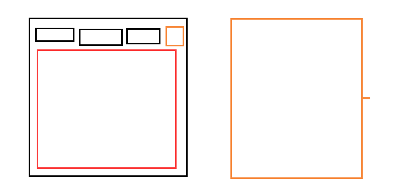
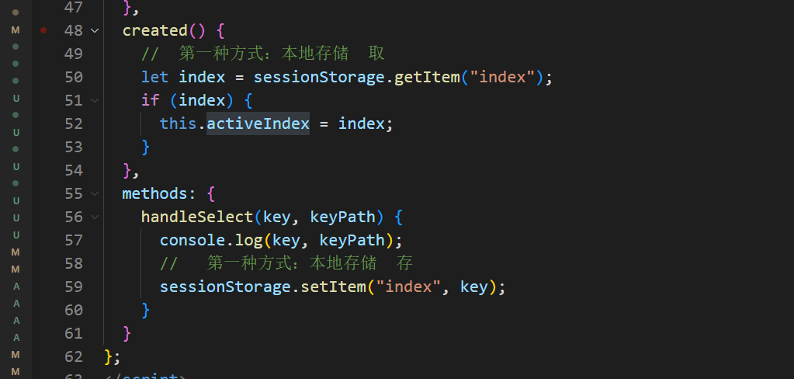
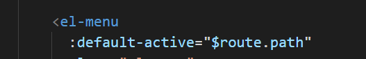
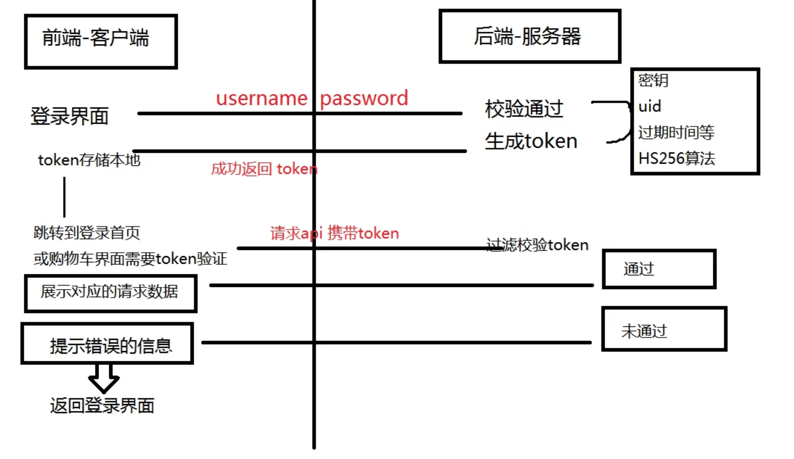

Vuex回顾：

state：

mutations：同步

actions：异步

getters

modules：分模块

namespaced:true

```js
this.$store.state.cityModule,name
this.$store.getters['cityModule/showName']

this.$store.commit('cityModule/changeName')

this.$store.dispatch('cityModule/changeNameAsync')

...mapState('cityModule',['name','id'])
...mapMutations('cityModule',['changeName'])
...mapActions('cityModule',['changeNameAsync'])
```

如何拿全局的内容？

```js
data:{
    
},
getters:{
    //。。。。
    someGetters:(state,getter,rootState, rootGetters)=>{
        reutrn 
    }
},
mutations：{
    
}
actions:{
    someOtherAction(){
        
    },
    someAction({commit,dispatch}){
		commit('someMutation') // -> 'foo/someMutation'
        commit('someMutation', null, { root: true }) // -> 'someMutation'
    	
        dispatch('someOtherAction') // -> 'foo/someOtherAction'  
        dispatch('someOtherAction', null, { root: true }) // -> 'someOtherAction'
    }
}
```





# 项目 穷游网_第一天

**主要内容**

* 导航区域
* 登录实现
* 轮播图
* 蓝莓酱
* 分页器

**学习目标**

 知识点| 要求 
 -| :- 
 导航区域 | 掌握 
 登录实现 | 掌握 
 轮播图 | 掌握 
 蓝莓酱 | 掌握 
 分页器 | 掌握 


1. 技术 
   Vue全家桶项目  技术：Vue + Vue-router + Vuex + Element-ui + axios + swiper 

2. 项目介绍
   1. pc端项目 蓝莓派项目 + 穷游官网 
   2. 登录   路由拦截 


3. 搭建项目依赖：

   \1. vue create vue-qiongyou-pc 

   \2. vue add element 

   \3. npm i axios -S 

   \4. (可以选择)

   npm install swiper@5.x vue-awesome-swiper@4.x --save

4. 项目初始化

   \1. css初始化

   \2. 无用文件删除

   \3. 创建需要的路由模块

5. 首页

   1. 轮播效果
      1. swiper 
      2. element-ui 




Layout.vue  (路由导航、路由出口)

Login.vue

```js
[
    {
        path:'/'
        
    },{
        path:'/login'
        
    }
]
```


## 一、导航区域

### 1.1 效果展示

1. 未登录效果图

   

2. 登录效果

   

方法一：



方法二：




### 1.2 代码演示

```vue
<template>
  <div class="nav">
    <el-menu
      :default-active="$route.path"
      class="el-menu-demo"
      mode="horizontal"
      background-color="#545c64"
      text-color="#fff"
      active-text-color="#ffd04b"
      router
      @select="selectMenu"
    >
      <el-menu-item index="/">首页</el-menu-item>
      <el-menu-item index="/news">新闻</el-menu-item>
      <el-menu-item index="/about">我的</el-menu-item>
      <el-menu-item index="/travel">旅游</el-menu-item>
      <!-- 右侧内容 -->
      <div class="nav-right">
        <el-button v-if="!userinfo.username" size="small" @click="login">登录</el-button>
        <template v-else>
          <span>欢迎：{{ userinfo.username }}</span>
          <i class="el-icon-switch-button" @click="loginout"></i>
        </template>
      </div>
    </el-menu>
  </div>
</template>

<script>
import { mapState, mapMutations } from "vuex";
export default {
  data() {
    return {
      activeIndex: "/",
    };
  },
  computed: {
    ...mapState("LoginModule", ["userinfo"]),
  },
  methods: {
    ...mapMutations("LoginModule", ["clearUser"]),
    //退出登录
    loginout() {
      //1. 清空vuex用户信息  2. 清空本地数据
      this.clearUser();
      localStorage.removeItem("userinfo");
      //跳转当前的url地址路径
      console.log('this.$route.path',this.$route.path);
      if (this.$route.path!== "/") {
        this.$router.push("/login");
      }
    },
    //登录
    login(){
      this.$router.push('/login')
    },

    selectMenu(index, path) {

    },
  },
  created() {

  },
};
</script>

<style lang='less' scoped>
.nav {
  background: #545c64;
}
.el-menu-demo {
  width: 1200px;
  margin: 0 auto;
}
.el-menu.el-menu--horizontal {
  border-bottom: 0;
}
.nav-right {
  float: right;
  line-height: 60px;
  color: #fff;
  span {
    padding-right: 10px;
  }
  i {
    font-size: 20px;
    vertical-align: middle;
    cursor: pointer;
  }
}
</style>
```


##### 步骤：

1. 导航栏居中显示
2. 提取轮播图组件
3. 轮播图静态布局---element走马灯组件
4. 轮播图动态数据


## 二、轮播图

### 2.1 效果图

地址：http://iwenwiki.com/api/blueberrypai/getIndexBanner.php

替换：http://www.wwtliu.com/sxtstu  为  http://iwenwiki.com/api

http://iwenwiki.com/api/blueberrypai/indexImg/banner1.jpg

http://www.wwtliu.com/sxtstu     http://iwenwiki.com/api/blueberrypai/indexImg/banner1.jpg


​	


### 2.2 代码演示

home组件

```vue
<template>
  <div class="home">
    <!-- 1. 轮播图 -->
    <Banner :banner="banner" />
  </div>
</template>

<script>
import Banner from "./Banner.vue";
export default {
  name: "Home",
  components: {
    Banner,
  },
  data() {
    return {
      banner: [],
    };
  },
  created() {
    //轮播图数据
    this.$api.getBanner().then((res) => {
      console.log(res.data);
      let banner = res.data.banner;
      //http://www.wwtliu.com/sxtstu  http://iwenwiki.com/api
      for (let i = 0; i < banner.length; i++) {
        banner[i].img = banner[i].img.replace(
          "http://www.wwtliu.com/sxtstu",
          "http://iwenwiki.com/api"
        );
      }
      console.log(banner);
      this.banner = banner;
    });
    //蓝莓酱数据---------
    this.getHttp(1);
  },
 
};
</script>
```

banner组件

```vue
<template>
  <div>
    <el-carousel trigger="click" height="500px">
      <el-carousel-item v-for="item in banner" :key="item.title">
        
      </el-carousel-item>
    </el-carousel>
  </div>
</template>

<script>
export default {
    props:{
        banner:{
            type:Array,
            default:function(){
                return []
            }
        }
    }
};
</script>

<style>
</style>
```


## 三、登录实现


#### 步骤：

1. 路由拦截  router/permission.js  
2. main.js引入，执行下该文件
3. 登录静态页面（elementUI 表单组件  自定义校验规则）


需求：

1. 首页随便进

2. 后面三个，必须登录才可以

   ==》路由拦截---》 路由守卫（7个 组件内：3个  全局 ：3个   路由独享：1个）

- 路由前置守卫（beforeEach()）
- 路由元信息 meta
- meta:{isLogin:true}

​	

### 3.1 路由配置

```js
import Vue from 'vue'
import VueRouter from 'vue-router'
import Home from '../views/Home/Home.vue'
import Layout from '../views/Layout.vue'
import Login from '../views/Login.vue'
Vue.use(VueRouter)
const routes = [
  {
    path: '',
    component: Layout,
    children: [
      {
        path: '/',
        name: 'Home',
        component: Home,
        meta: {
          isLogin: false
        }

      },
      {
        path: '/about',
        name: 'About',
        component: () => import('../views/About/About.vue'),
        meta: {
          isLogin: true
        }

      },
      {
        path: '/news',
        name: 'News',
        component: () => import('../views/News/News.vue'),
        meta: {
          isLogin: true
        }
      },
      {
        path: '/travel',
        name: 'Travel',
        component: () => import('../views/Travel/index.vue'),
        meta: {
          isLogin: true
        }
      }
    ]
  },
  {
    path: '/login',
    name: 'Login',
    component: Login
  }

]

//vue 路由相同路径跳转报错
const originalPush = VueRouter.prototype.push
VueRouter.prototype.push = function push(location) {
  return originalPush.call(this, location).catch(err => err)
}

const router = new VueRouter({
  routes
})
export default router

```


### 3.2 路由拦截

```js
import router from './index'
//导入store
import store from '../store/index'
//路由拦截
router.beforeEach((to,from,next)=>{
  console.log('-------to----');
    //1.判断当前的路由是否需要登录
    if(to.meta.isLogin){
      //2.判断当前的用户状态是否已登录
      let token = store.state.LoginModule.userinfo.token;
      if(token){
        next()
      }else{
        next('/login')
      }
    }else{//不需要登录
      next()
    }
})
```


### 3.3 登录后台接口（了解）

npm  i  express cors  -S

npm i jsonwebtoken -S


```js
//创建服务
const express = require('express')
const app = express()
const cors = require('cors')
app.use(cors())
app.use(express.urlencoded({ extended: true })) 
//生成token标识
const jwt = require('jsonwebtoken');
//密钥
const secert = require('./secret')

//登录接口
app.get('/login',(req,res)=>{
    let user = req.query.user;
    let pwd = req.query.pwd;
    //----查询数据库---省略了--- 
    //生成token
    const token = jwt.sign({user,id:123},secert.secretKey,{expiresIn:20})
    res.send({
        info:'success',
        status:200,
        token
    })
})
app.listen(8888,()=>{
    console.log(8888);
})

```


后台返回token  令牌（返回：用户标识）  java  30位  node   90位

​    作用:用户身份标识  



#### JSON Web Token 入门教程

http://www.ruanyifeng.com/blog/2018/07/json_web_token-tutorial.html

使用：https://github.com/auth0/node-jsonwebtoken

```js
var jwt = require('jsonwebtoken');
```

如果后端没有返回用户名，只返回了token ，可以要求后台加字段。若后端不加，前端可以解析token。


#### 前端获取token后 解析token字段

1. 安装：npm  i  jwt-decode  -S 

2. 导入：import jwt from 'jwt-decode'

3. 使用:  jwt(token字段)

4. 在登录页面导入

   ```js
   // 导入
   import jwt from 'jwt-decode'
   
    // 前端解析token字段
   console.log(jwt(res.token));
   //存储数据给vuex实现组件共享数据资源
   let obj={
       token:res.token,
       username:jwt(res.token).user
   }
   this.$store.commit('LoginModule/setUser',obj)
   //数据持久化
   localStorage.setItem('userinfo',JSON.stringify(obj))
   ```

   

### 3.4 登录存储vuex

#### 步骤：

1.  登录存储 vuex  ==》搭建 Vuex  LoginModule.js  setUer   delUser
2. 问题：刷新，vuex 数据丢失？===》解决：数据持久化  存本地
3. 从本地取出来===》Vuex ，什么时候取 放？  main.js
4. main.js   obj  => commit  mutations  vuex
5. 首页


登录模块js

```js
export default {
    //命名空间
    namespaced:true,
    state:{
        userinfo:{
            username:'',
            token:null,
        }
    },
    mutations:{
        //设置token 
        setUser(state,payload){
            state.userinfo = payload;
        },
        //清空用户信息
        clearUser(state){
            state.userinfo ={
                username:'',
                token:null,
            }
        }
    },
    actions:{

    }
}
```


### 3.5 退出登陆


## 四、蓝莓酱

### 4.1 效果图

​	


地址：http://iwenwiki.com/api/blueberrypai/getBlueBerryJamInfo.php?blueBerryjam_id=1

http://iwenwiki.com/api /blueberrypai/image/lanmeijiang/1.jpg

图片地址替换：http://iwen.wiki/sxtstu   替换为  http://iwenwiki.com/api

### 4.2 代码演示

home组件

```vue
<template>
  <div class="home">
    <!-- 1. 轮播图 -->
    <Banner :banner="banner" />

    <!-- 2. 蓝莓酱 -->
    <Lanmei :list="list" />

  </div>
</template>

<script>
// @ is an alias to /src
import Banner from "./Banner.vue";
import Lanmei from "./Lanmei.vue";
export default {
  name: "Home",
  components: {
    Banner,
    Lanmei,
    MyPagination,
  },
  data() {
    return {
      banner: [],
      list: [], //蓝莓数据
      total: 100,
      pageSize: 10,
    };
  },
  created() {
    //轮播图数据
    this.$api.getBanner().then((res) => {
      console.log(res.data);
      let banner = res.data.banner;
      //http://www.wwtliu.com/sxtstu  http://iwenwiki.com/api
      for (let i = 0; i < banner.length; i++) {
        banner[i].img = banner[i].img.replace(
          "http://www.wwtliu.com/sxtstu",
          "http://iwenwiki.com/api"
        );
      }
      console.log(banner);
      this.banner = banner;
    });
    //蓝莓酱数据---------
    this.getHttp(1);
  },
  methods: {
    //请求蓝莓数据方法
    getHttp(page) {
      this.$api
        .getLanmei({
          blueBerryjam_id: page,
        })
        .then((res) => {
          console.log("--蓝莓--", res.data);
          //蓝莓数据数组
          let arr = res.data.blueBerryJam;
          arr.forEach((ele) => {
            ele.img = ele.img.replace(
              "http://iwen.wiki/sxtstu",
              "http://iwenwiki.com/api"
            );
          });
          this.list = arr; //[{},..]
          this.total = res.data.maxPage;
          this.pageSize = 1;
        });
    },
  },
};
</script>

```

lanmei组件

```vue
<template>
  <div class="container">
      <h2 class="title">蓝莓酱</h2>
      <ul class="list">
          <li v-for="(item,index) in list" :key='index'>
              <div class="item">
                 
                <span>{{ item.title }}</span> 
              </div>
          </li>
      </ul>
  </div>
</template>

<script>
export default {
    props:['list']
}
</script>

<style lang='less' scoped>
.container{
    width: 1200px;
    margin:  20px auto;
}
.title{
    text-align: center;
    padding: 10px;
}
.list{
    display: flex;
    flex-wrap: wrap;
    li{
        width: 20%;
        box-sizing: border-box;
        height: 220px;
        padding:10px;
        position: relative;
        margin-bottom: 20px;
        .item{
            background: #eee;
            img{
                width: 100%;
            }
            span{
                position: absolute;
                right: 20px;
                bottom: 0px;
                background: rgba(0,0,0,0.2);
                color: #fff;
                border-radius: 4px;
                padding:4px;
            }
        }
    }
}

</style>
```

## 五、分页器

### 5.1 效果图

​	

### 5.2 代码演示

home组件

```vue
<template>
  <div class="home">
    <!-- 1. 轮播图 -->
    <Banner :banner="banner" />

    <!-- 2. 蓝莓酱 -->
    <Lanmei :list="list" />

    <!-- 3. 分页 -->
    <MyPagination :total="total" :pageSize="pageSize" @getPage="getPage" />

    <!-- 4. 返回顶部 -->
     <el-backtop></el-backtop>

  </div>
</template>

<script>
// @ is an alias to /src
import Banner from "./Banner.vue";
import Lanmei from "./Lanmei.vue";
import MyPagination from "../../components/MyPagination.vue";
export default {
  name: "Home",
  components: {
    Banner,
    Lanmei,
    MyPagination,
  },
  data() {
    return {
      banner: [],
      list: [], //蓝莓数据
      total: 100,
      pageSize: 10,
    };
  },
  created() {
    //轮播图数据
    this.$api.getBanner().then((res) => {
      console.log(res.data);
      let banner = res.data.banner;
      //http://www.wwtliu.com/sxtstu  http://iwenwiki.com/api
      for (let i = 0; i < banner.length; i++) {
        banner[i].img = banner[i].img.replace(
          "http://www.wwtliu.com/sxtstu",
          "http://iwenwiki.com/api"
        );
      }
      console.log(banner);
      this.banner = banner;
    });
    //蓝莓酱数据---------
    this.getHttp(1);
  },
  methods: {
    //获取点击的页码-----------------
    getPage(num) {
      this.getHttp(num);
      document.documentElement.scrollTop=0;
    },
    getHttp(page) {
      this.$api
        .getLanmei({
          blueBerryjam_id: page,
        })
        .then((res) => {
          console.log("--蓝莓--", res.data);
          let arr = res.data.blueBerryJam;
          arr.forEach((ele) => {
            ele.img = ele.img.replace(
              "http://iwen.wiki/sxtstu",
              "http://iwenwiki.com/api"
            );
          });
          this.list = arr; //[{},..]
          this.total = res.data.maxPage;
          this.pageSize = 1;
        });
    },
  },
};
</script>

```

分页组件

```vue
<template>
  <div class='page'>
    <el-pagination background 
        layout="total,prev, pager,next,jumper" 
        :total="total" 
        :page-size='pageSize'
        @current-change='changePage'
        >

    </el-pagination>
  </div>
</template>

<script>
export default {
    props:{
        total:{
            type:Number,
            default:100
        },
        pageSize:{
            type:Number,
            default:10
        }
    },
    methods:{
        changePage(num){
            console.log(num);
            //传递给父组件---页码
            this.$emit('getPage',num)
        }
    }
};
</script>

<style lang='less' scoped>
.page{
    text-align: center;
    margin: 30px;
}
</style>
```


## 穷游接口

1. 今日推荐：
   https://www.qyer.com/qcross/home/index.php?action=recommend&timer=1638347951752&ajaxID=59b0b70acebeb65c1882399e

 2. 穷游商城
    https://www.qyer.com/qcross/home/index/recommendbiz?page=1

 3. 热门游记 
    https://www.qyer.com/qcross/home/ajax?action=thread&timer=1638347951753&ajaxID=59b60840cebeb65c188239a8

 4. 搜索
    https://www.qyer.com/qcross/home/ajax?action=hotelsearch&keyword=%E4%BA%91&type=1

 5. 图片防盗链  ----  403 

    ```html
    <meta name="referrer" content="never">
    ```

    


​    

5. 新闻接口
   接口地址: https://3g.163.com/touch/reconstruct/article/list/'+type+'/0-10.html
       type 可选值
       export const junshi = 'BAI67OGGwangning';
       export const yaowen = 'BBM54PGAwangning';
       export const guonei = 'BA8FF5PRwangning';
       export const guoji = 'BAI6I0O5wangning';
       export const caijing = 'BA8EE5GMwangning';
       export const keji = 'BA8D4A3Rwangning';
       export const yule = 'BA8F6ICNwangning'; // 时尚  

