# 项目 易购后台管理系统_第一天

**主要内容**

* Vue项目结构
* 路由配置
* 布局界面
* 商品管理

**学习目标**

 知识点| 要求 
 -| :- 
 Vue项目结构 | 掌握 
 路由配置 | 掌握 
 布局界面 | 掌握 
 商品管理 | 掌握 


## 一、Vue项目结构
### 1.1 项目介绍

后台管理系统，包含商品管理 用户管理 订单等等信息

丁香医生、穷游 、宜居===》用户  

京东，淘宝==》买家看到 用户

后台管理系统：运维人员，后台管理员  卖家

人事、财务、学生、OA、银行 


### 1.2 项目搭建

技术栈: Vue全家桶	Vue + Vue-router  + Vuex + Element-ui + Axios  + 其他三方库


#### 项目准备

1. mysql 
2. iconfont 

#### 导入数据库

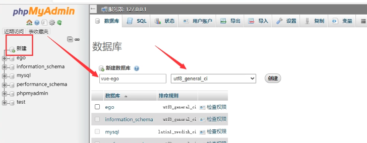

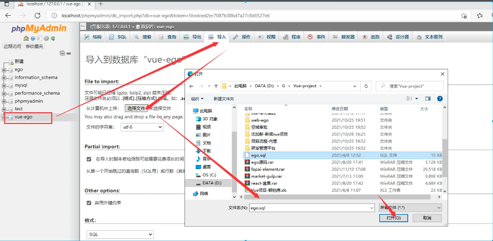


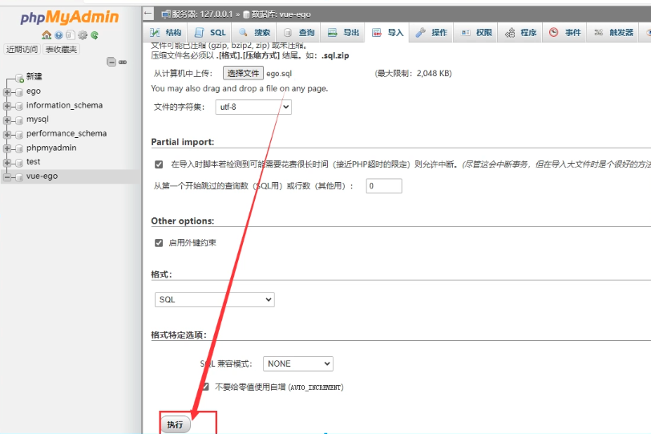

导出：

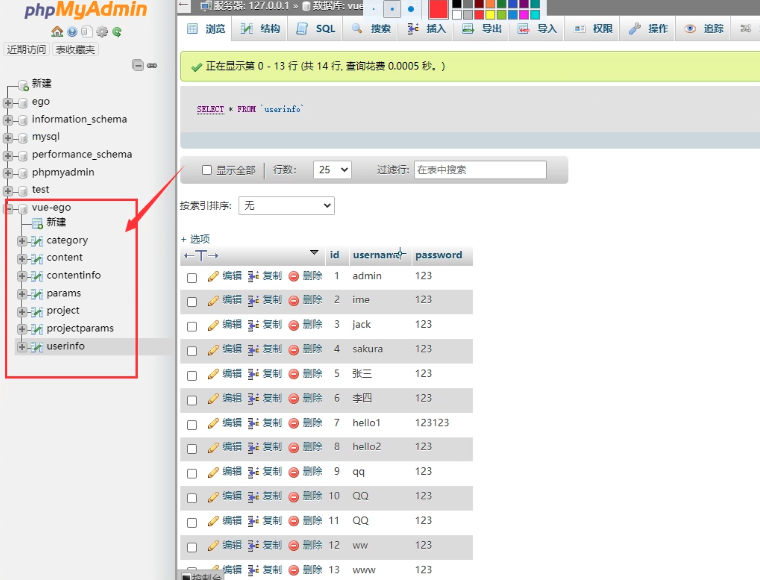


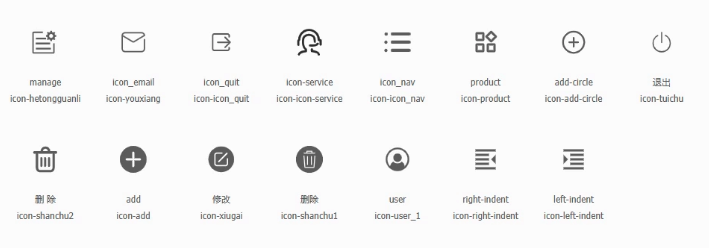

### 项目搭建

1. vue create vue-ego 

2. vue-router vuex 

3. axios  :  cnpm i axios -S

4. vue add element --(按需)  

   npm i element@2.5 -S  再装一个插件，并且配置一下

   脚手架按需引入，不需要再装其他东西了，已经做了配置。如果是npm i 安装，再按需引入，需要安装babel插件，再进行配置。

   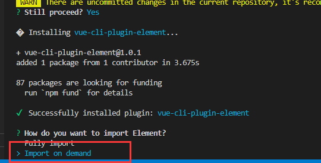


### 项目初始化

1. 删除无用的组件 home.vue about.vue hello... 

2. css初始化  

3. incofont 图标导入


### 1.3 后台服务

 node.js + express + mysql


## 二、路由配置

### 2.1 界面效果

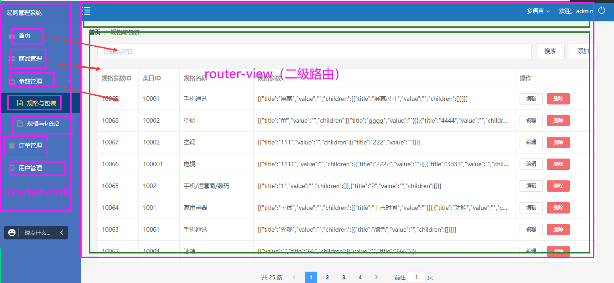

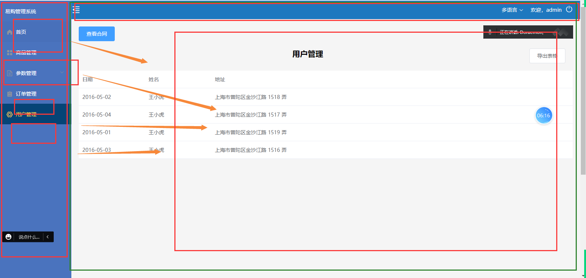

​	

​	


### 2.2 路由代码

项目结构

​	

路由代码演示

```js
import Vue from 'vue'
import VueRouter from 'vue-router'
import Layout from '../views/Layout/index.vue'
import Home from '../views/Home/index.vue'
import Login from '../views/Login/Login.vue'
//异步
const Goods = ()=>import('../views/Goods/Goods.vue')
const Params = ()=>import('../views/Params/Params.vue')
const Advert = ()=>import('../views/Advert/Advert.vue')
const Order = ()=>import('../views/Order/index.vue')
const OrderList = ()=>import('../views/Order/OrderList/index.vue')
const OrderBack = ()=>import('../views/Order/OrderBack/index.vue')

Vue.use(VueRouter)

const routes = [
  {
    path:'',
    component:Layout,
    children:[
      {
        path:'/',
        name:'Home',
        component:Home
      },
      {
        path:'/goods',
        name:'Goods',
        component:Goods
      },
      {
        path:'/params',
        name:'Params',
        component:Params
      },
      {
        path:'/advert',
        name:'Advert',
        component:Advert
      },
      {
        path:'/order',
        name:'Order',
        component:Order,
        redirect:'/order/order-list',
        children:[
          {
            path:'order-list',
            component:OrderList
          },{
            path:'order-back',
            component:OrderBack
          }
        ]
      }
    ]
  },
  {
    path:'/login',
    name:'Login',
    component:Login
  }
]

const router = new VueRouter({
  routes
})

export default router

```


## 三、布局界面

### 3.1 布局组件

```vue
<template>
  <div class="layout">
      <!-- 左侧导航区域 -->
      <MyMenu class="menu" :isCollapse='isCollapse'/>
      <!-- 右侧内容区域 -->
      <Content class="content" :class="{isActive:isCollapse}" @changeCollapse='changeCollapse' :isCollapse='isCollapse'/>
  </div>
</template>

<script>
import MyMenu from './Mymenu.vue'
import Content from './Content.vue'
export default {
    components:{
        MyMenu,
        Content
    },
    data(){
        return {
            isCollapse:false,
        }
    },
    methods:{
        changeCollapse(){
            this.isCollapse = !this.isCollapse;
        }
    }
}
</script>

<style lang='less' scoped>
.layout{
    .menu{
        background: #1b3554;
        position: fixed;
        top:0;
        bottom:0;
    }
    .content{
        margin-left: 200px;
        transition: all 0.3s;
    }
    .isActive{
        margin-left: 64px;
    }
}

</style>
```

### 3.2 左右动态滑动

内容组件

```vue
<template>
  <div>
    <div class="header">
        <i v-if='!isCollapse' @click="changeMenu" class="iconfont icon-right-indent"></i>
        <i v-else @click="changeMenu" class="iconfont icon-left-indent"></i>
        顶部区域</div>
     <!-- 内容区域---路由出口 -->
     <div class="content">
       <router-view/>
     </div>
  </div>
</template>

<script>
export default {
  props:['isCollapse'],
  methods:{
    changeMenu(){
        //点击切换按钮的时候 修改父组件的数据   isCollapse
        this.$emit('changeCollapse')
    }
  }
}
</script>

<style lang='less' scoped>
.header{
  height: 50px;
  line-height: 50px;
  color: #fff;
  background: #1e78bf;
  .iconfont{
    font-size: 24px;
  }
}

</style>
```

### 3.3 左侧导航

#### 步骤：

1. 左侧折叠、展开菜单  :collapse='isCollapse'

2. 属性定义在父组件里   isCollapse: false //是否折叠  false 展开

3. 右侧组件，通过自定义事件修改父组件的值

   ```js
   methods:{
       changeCollapse(){
           // 自定义事件，让父组件修改是否折叠状态
           this.$emit('changeMenu')
       }
   }
   ```

   

4. 父组件自己修改  this.isCollapse = !this.isCollapse;

   ```js
   // 修改折叠状态
   changeMenu() {
       this.isCollapse = !this.isCollapse;
   }
   ```

5. 右侧两个按钮，互斥展示  v-if  v-else

   ```html
   <!-- 头部 -->
   <div class="header">
       <i class="iconfont icon-zhedie" v-if="!isCollapse" @click='changeCollapse'></i>
       <i class="iconfont icon-zhankai" v-else @click='changeCollapse'></i>
   </div>
   ```

6. 左侧 取消固定宽度200px

   ```less
    .menu {
       //....
       // width: 200px;
     }
   ```

7. 右侧动态添加 类样式

   ```less
   .active {
       margin-left: 64px;
     }
   
   ```

   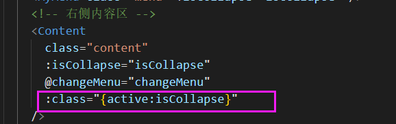


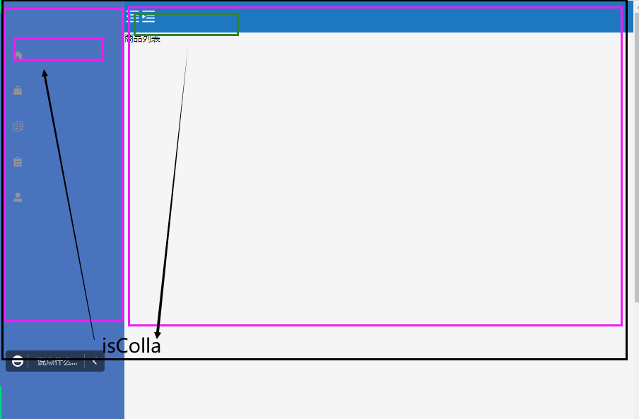

```vue
<template>
  <div>
    <el-menu
      :default-active="$route.path"
      class="el-menu-vertical-demo"
      background-color="#1b3554"
      text-color="#fff"
      active-text-color="#409EFF"
      router
      :collapse="isCollapse"
    >
      <el-menu-item>
        <span slot="title">易购后台管理系统</span>
      </el-menu-item>
      <el-menu-item index="/">
        <i class="el-icon-menu"></i>
        <span slot="title">首页</span>
      </el-menu-item>
      <el-menu-item index="/goods">
        <i class="el-icon-document"></i>
        <span slot="title">商品管理</span>
      </el-menu-item>
      <el-menu-item index="/params">
        <i class="el-icon-setting"></i>
        <span slot="title">规格参数</span>
      </el-menu-item>
      <el-menu-item index="/advert">
        <i class="el-icon-setting"></i>
        <span slot="title">广告分类</span>
      </el-menu-item>
      <el-submenu index="/order">
        <template slot="title">
          <i class="el-icon-location"></i>
          <span>订单管理</span>
        </template>
        <el-menu-item-group>
          <el-menu-item index="/order/order-list">
            <i class="el-icon-setting"></i>
            <span slot="title">订单列表</span>
          </el-menu-item>
          <el-menu-item index="/order/order-back">
            <i class="el-icon-setting"></i>
            <span slot="title">退货管理</span>
          </el-menu-item>
        </el-menu-item-group>
      </el-submenu>
    </el-menu>
  </div>
</template>

<script>
export default {
  props: ["isCollapse"],
  data() {
    return {
      // isCollapse:false
    };
  },
};
</script>

<style lang='less' scoped>
.el-menu {
  border-right: 0;
  .is-active {
    background: #054476 !important;
    color: #fff !important;
  }
}
.el-menu-vertical-demo:not(.el-menu--collapse) {
  width: 200px;
  min-height: 400px;
}
</style>
```


## 四、商品管理

### 4.1 商品列表

​	


npm  i express mysql   multer  -S


### 4.2 商品接口

```js
const express = require('express')
const router = express.Router()
//导入数据库 sqlFn('sql',[],res=>{})
const sqlFn = require('./mysql')

/**
 * 商品列表：获取分页 {total:'',arr:[{},{},{}],pagesize:8,}
 * 参数：page 页码
 */
router.get('/projectList', (req, res) => {
    const page = req.query.page || 1;
    const sqlLen = "select * from project where id";
    sqlFn(sqlLen, null, data => {
        let len = data.length;
        const sql = "select * from project order by id desc limit 8 offset " + (page - 1) * 8;
        sqlFn(sql, null, result => {
            if (result.length > 0) {
                res.send({
                    status: 200,
                    data: result,
                    pageSize: 8,
                    total: len
                })
            } else {
                res.send({
                    status: 500,
                    msg: "暂无数据"
                })
            }
        })
    })
})

module.exports = router
```


### 4.3 商品动态数据获取

```vue
<template>
  <div class="goods">
    <!-- 1. 搜索区域 -->
    <div class="header">
      <el-input v-model="input" placeholder="请输入内容"></el-input>
      <el-button type="primary">查询</el-button>
      <el-button type="primary">添加</el-button>
    </div>
    <!-- 2. 表格区域展示视图数据 -->
    <div class="wrapper">
      <el-table :data="tableData" border>
        <el-table-column type="selection" width="55"></el-table-column>
        <el-table-column prop="id" label="商品ID" width="100">
        </el-table-column>
        <el-table-column
          prop="title"
          label="商品名称"
          width="100"
          show-overflow-tooltip
        >
        </el-table-column>
        <el-table-column prop="price" label="商品价格" width="100">
        </el-table-column>
        <el-table-column prop="num" label="商品数量" width="100">
        </el-table-column>
        <el-table-column prop="category" label="规格类目" width="100">
        </el-table-column>
        <el-table-column prop="image" label="商品图片" show-overflow-tooltip>
        </el-table-column>
        <el-table-column
          prop="sellPoint"
          label="商品卖点"
          show-overflow-tooltip
        >
        </el-table-column>
        <el-table-column prop="descs" label="商品描述" show-overflow-tooltip>
        </el-table-column>
        <el-table-column label="操作" width="180">
          <template slot-scope="scope">
            <el-button size="mini" @click="handleEdit(scope.$index, scope.row)"
              >编辑</el-button
            >
            <el-button
              size="mini"
              type="danger"
              @click="handleDelete(scope.$index, scope.row)"
              >删除</el-button
            >
          </template>
        </el-table-column>
      </el-table>
    </div>

  </div>
</template>

<script>
export default {
  data() {
    return {
      input: "",
      tableData: [],
    };
  },
  methods: {
    /**
     * 编辑操作
     */
    handleEdit() {},
    /**
     * 删除操作
     */
    handleDelete() {},
    /**
     * 商品列表获取
     */
    http(page) {
      this.$api
        .getGoodsList({
          page,
        })
        .then((res) => {
          console.log(res.data);
          if (res.data.status === 200) {
            this.tableData = res.data.data; //数据列表
            this.total = res.data.total;
            this.pageSize = res.data.pageSize;
          }
        });
    },
  },
  //生命周期函数
  created() {
    this.http(1)
  },
};
</script>

<style lang='less' scoped>
.goods {
  margin: 20px;
}
.header {
  display: flex;
  button {
    margin-left: 20px;
  }
}
.wrapper {
  margin: 20px 0;
}
</style>
```


### 4.4 分页器使用

​		

​		

**代码演示**

```vue
<template>
  <div style="text-align: center; margin: 20px">
    <el-pagination
      background
      layout="total,prev, pager, next,jumper"
      :total="total"
      :page-size="pageSize"
      :current-page.sync="currentPage"
      @current-change="changePage"
    >
    </el-pagination>
  </div>
</template>

<script>
export default {
  props: {
    total: {
      type: Number,
      default: 100,
    },
    pageSize: {
      type: Number,
      default: 10,
    },
    currentPage: {
      type: Number,
      default: 3,
    },
  },
  methods: {
    changePage(page) {
      this.$emit("changePage", page);
    },
  },
  created() {},
};
</script>

<style>
</style>
```


### 4.4 搜索接口

```js
/**
 * 商品查询接口 search
 * 参数：search
 */
router.get("/search", (req, res) => {
    var search = req.query.search;
    const sql = "select * from project where concat(`title`,`sellPoint`,`descs`) like '%" + search + "%'";
    sqlFn(sql, null, (result) => {
        if (result.length > 0) {
            res.send({
                status: 200,
                result
            })
        } else {
            res.send({
                status: 500,
                msg: "暂无数据"
            })
        }
    })
})


```

### 4.5 搜索实现

​			

**代码演示**

```vue
<template>
  <div class="goods">
    <!-- 1. 搜索区域 -->
    <div class="header">
      <!-- change	仅在输入框失去焦点或用户按下回车时触发 -->
      <el-input
        @change="searchInp"
        v-model="input"
        placeholder="请输入内容"
      ></el-input>
      <el-button type="primary">查询</el-button>
      <el-button type="primary">
        <router-link to="/add-goods" style="color: #fff">页面添加</router-link>
      </el-button>
      <el-button type="primary" @click="addGoods">弹框添加</el-button>
    </div>
    <!-- 2. 表格区域展示视图数据 -->
    <div class="wrapper">
      <el-table :data="tableData" border>
        <el-table-column type="selection" width="55"></el-table-column>
        <el-table-column prop="id" label="商品ID" width="100">
        </el-table-column>
        <el-table-column
          prop="title"
          label="商品名称"
          width="100"
          show-overflow-tooltip
        >
        </el-table-column>
        <el-table-column prop="price" label="商品价格" width="100">
        </el-table-column>
        <el-table-column prop="num" label="商品数量" width="100">
        </el-table-column>
        <el-table-column prop="category" label="规格类目" width="100">
        </el-table-column>
        <el-table-column prop="image" label="商品图片" show-overflow-tooltip>
        </el-table-column>
        <el-table-column
          prop="sellPoint"
          label="商品卖点"
          show-overflow-tooltip
        >
        </el-table-column>
        <el-table-column prop="descs" label="商品描述" show-overflow-tooltip>
        </el-table-column>
        <el-table-column label="操作" width="180">
          <template slot-scope="scope">
            <el-button size="mini" @click="handleEdit(scope.$index, scope.row)"
              >编辑</el-button
            >
            <el-button
              size="mini"
              type="danger"
              @click="handleDelete(scope.$index, scope.row)"
              >删除</el-button
            >
          </template>
        </el-table-column>
      </el-table>
    </div>

    <!-- 3. 分页 -->
    <MyPagination
      :total="total"
      :pageSize="pageSize"
      @changePage="changePage"
      :currentPage='currentPage'
    />

  </div>
</template>

<script>
import MyPagination from "../../components/MyPagination.vue";
export default {
  components: {
    MyPagination,
  },
  data() {
    return {
      input: "",
      tableData: [],
      total: 10,
      pageSize: 1,
      type: 1,
      list: [],
      dialogVisible:false,
      currentPage:1,//选中的高亮页码
    };
  },
  methods: {
    /**
     * 分页页码--------------------
     */
    changePage(num) {
      this.currentPage =num;
      if (this.type == 1) {
        this.http(num); //商品列表分页
      } else {
        //搜索分页 1 2 3 4 --  list=[0,1,2,3,4,5,6,7,8]  0-3  3-6  6-9 9-12
        console.log("搜索的分页处理---");
        //（num-1）*3  num*3
        this.tableData = this.list.slice((num - 1) * 3, num * 3);
      }
    },
    /**
      搜索查询数据-----------------------
     */
    searchInp(val) {
      if (!val) {
        this.http(1);
         this.currentPage =1;
         this.type=1;
        return;
      }
      this.$api
        .getSearch({
          search: val,
        })
        .then((res) => {
          console.log("搜索---", res.data);
            this.currentPage =1;
          if (res.data.status === 200) {
            this.list = res.data.result; //获取的搜索的总数据条数---数据分割
            //假设需要分页---我们处理分页----
            this.total = res.data.result.length;
            this.pageSize = 3;
            this.tableData = res.data.result.slice(0, 3);
            this.type = 2;
            console.log('分页',this.currentPage);
          } else {
            this.tableData = [];
            this.total = 1;
            this.pageSize = 1;
            this.type = 1;
          }
        });
    },
    /**
     * 编辑操作
     */
    handleEdit() {},
    /**
     * 删除操作
     */
};
</script>
```


### 测试Bug:

1. 输入内容搜索，删除，再搜索。==》分页按照搜索分页展示

   解决：没内容搜索，应该加载 全部数据的第一页

2. 共享分页问题

   列表下，点击第2页，输入内容搜索，数据是第一页数据，但是第2页码高亮。

   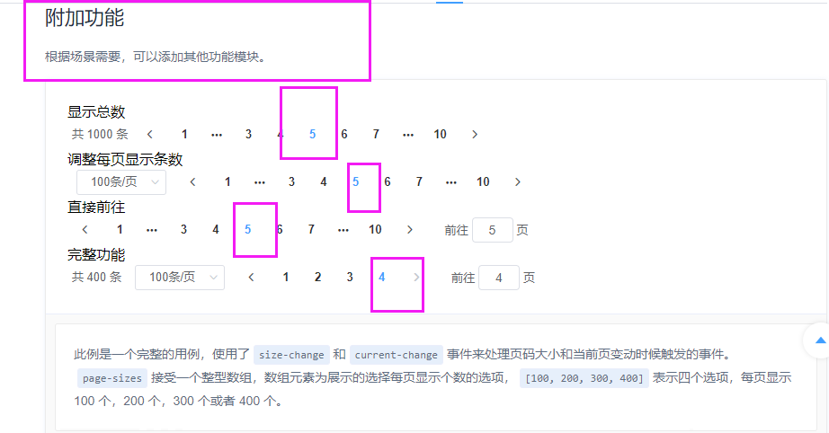

   分析：一直都是点击分页子组件，通知父组件去请求第几页数据，显示是没有问题的

   但是，当搜索的时候，搜索出内容来，此时，父组件应该主动通知子组件让第几页高亮

   用都技术：

   

   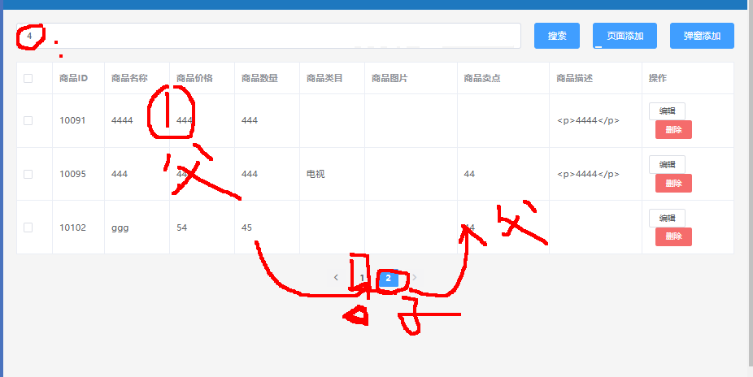

​		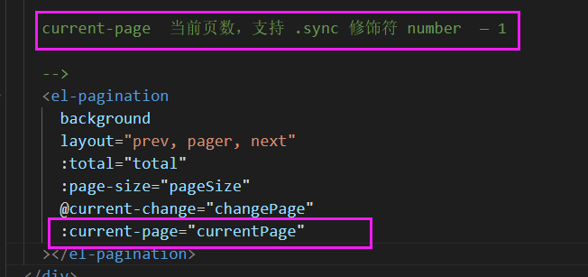


