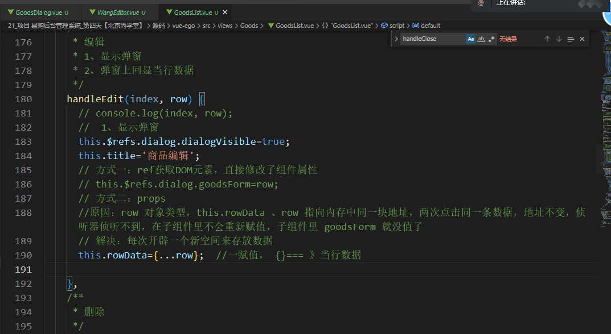

# 项目 易购后台管理系统_第三天

**主要内容**

* 富文本编辑器
* 编译商品
* 删除商品
* 国际化

**学习目标**

 知识点| 要求 
 -| :- 
 富文本编辑器 | 掌握 
 编译商品 | 掌握 
 删除商品 | 掌握 
 国际化 | 掌握 


## 一、富文本编辑器

### 1.1 效果展示

百度编辑器

wangeditor  

参考网站：https://www.wangeditor.com/

https://www.wangeditor.com/v4/


步骤：

1. 安装

   npm i wangeditor@4.x --save

2. 使用

   ```vue
    <div id="main">
        <span>werwerewr</span>
   </div>
   ```

   

   ```js
   const E = window.wangEditor;
   const editor = new E("#div1");
   
   // 配置 onchange 回调函数
   editor.config.onchange = function (newHtml) {
     console.log("change 之后最新的 html", newHtml);
   };
   // 配置触发 onchange 的时间频率，默认为 200ms
   editor.config.onchangeTimeout = 500; // 修改为 500ms
   
   editor.create();
   
   
   // 设置内容
   this.editor.txt.html("<p>用 JS 设置的内容</p>"); // 重新设置编辑器内容
   // editor.txt.html() 获取 html 。
   console.log(this.editor.txt.html());
   // editor.txt.clear() 清空编辑器内容
   this.editor.txt.clear();
   ```

   


​	


### 1.2 编译器使用

编译器组件

```vue
<template>
  <div id="main"></div>
</template>

<script>
import E from "wangeditor";
export default {
  data() {
    return {
      editor: "",
    };
  },
  mounted() {
    //创建wangeditor实例
    this.editor = new E("#main");
    // 取消自动 focus
    this.editor.config.focus = false
    // 配置 onchange 回调函数--获取输入的值内容
    this.editor.config.onchange = newHtml => {
    //   console.log("change 之后最新的 html", newHtml);
      //把获取的富文本编辑内容--传递给弹框组件--- 父组件
        this.$emit('sendEditor',newHtml)
    };
    // 配置触发 onchange 的时间频率，默认为 200ms
    this.editor.config.onchangeTimeout = 500; // 修改为 500ms
    // 配置菜单栏，删减菜单，调整顺序
    // 默认情况下，显示所有菜单
    this.editor.config.menus = [
      "head",
      "bold",
      "fontSize",
      "fontName",
      "italic",
      "underline",
      "strikeThrough",
      "indent",
      "lineHeight",
      "foreColor",
      "backColor",
      "link",
      //   "list",
      //   "todo",
      //   "justify",
      //   "quote",
      "emoticon",
      "image",
      "video",
      "table",
      "code",
      "splitLine",
      "undo",
      "redo",
    ];

    this.editor.create();
  },
};
</script>

<style>
</style>
```


### 1.3 添加商品

```vue
<template>
  <div>
    <el-dialog
      :title="title"
      :visible.sync="dialogVisible"
      width="70%"
      :before-close="clearForm"
    >
      <!-- 内容区域 -->
      <el-form
        :model="goodsForm"
        :rules="rules"
        ref="ruleForm"
        label-width="100px"
        class="demo-ruleForm"
      >
        <el-form-item label="类目选择" prop="category">
          <el-button type="primary" @click="innerVisible = true"
            >类目选择</el-button
          >
          <span style="margin-left: 10px">{{ goodsForm.category }}</span>
        </el-form-item>

        <el-form-item label="商品名称" prop="title">
          <el-input v-model="goodsForm.title"></el-input>
        </el-form-item>
        <el-form-item label="商品价格" prop="price">
          <el-input v-model="goodsForm.price"></el-input>
        </el-form-item>
        <el-form-item label="商品数量" prop="num">
          <el-input v-model="goodsForm.num"></el-input>
        </el-form-item>
        <el-form-item label="发布时间" required>
          <el-col :span="11">
            <el-form-item prop="date1">
              <el-date-picker
                type="date"
                placeholder="选择日期"
                v-model="goodsForm.date1"
                style="width: 100%"
              ></el-date-picker>
            </el-form-item>
          </el-col>
          <el-col class="line" :span="2">-</el-col>
          <el-col :span="11">
            <el-form-item prop="date2">
              <el-time-picker
                placeholder="选择时间"
                v-model="goodsForm.date2"
                style="width: 100%"
              ></el-time-picker>
            </el-form-item>
          </el-col>
        </el-form-item>
        <el-form-item label="商品卖点" prop="sellPoint">
          <el-input v-model="goodsForm.sellPoint"></el-input>
        </el-form-item>
        <el-form-item label="商品图片" prop="image">
          <el-button type="primary" @click="innerVisibleImg = true"
            >上传图片</el-button
          >
          
        </el-form-item>
        <el-form-item label="商品描述" prop="descs">
          <WangEditor ref="myEditor" @sendEditor="sendEditor" />
        </el-form-item>
      </el-form>

      <!-- 弹框底部区域 -->
      <span slot="footer" class="dialog-footer">
        <el-button @click="clearForm">取 消</el-button>
        <el-button type="primary" @click="submitForm">确 定</el-button>
      </span>

      <!-- 1. 内弹框--- 类目选择 -->
      <el-dialog
        width="40%"
        title="类目选择"
        :visible.sync="innerVisible"
        append-to-body
      >
        <TreeGoods @sendTreeData="sendTreeData" />
        <span slot="footer" class="dialog-footer">
          <el-button @click="innerVisible = false">取 消</el-button>
          <el-button type="primary" @click="showTreeData">确 定</el-button>
        </span>
      </el-dialog>

      <!-- 2. 内弹框 --- 上传图片 -->
      <el-dialog
        width="40%"
        title="上传图片"
        :visible.sync="innerVisibleImg"
        append-to-body
      >
        <UploadImg @sendImg="sendImg" ref="upload" />
        <span slot="footer" class="dialog-footer">
          <el-button @click="innerVisibleImg = false">取 消</el-button>
          <el-button type="primary" @click="showImg">确 定</el-button>
        </span>
      </el-dialog>
    </el-dialog>
  </div>
</template>

<script>
import TreeGoods from "./TreeGoods.vue";
import UploadImg from "./UploadImg.vue";
import WangEditor from "./WangEditor.vue";
export default {
  props: {
    title: {
      type: String,
      default: "添加商品",
    },
    rowData: {
      type: Object,
      default: function () {
        return {};
      },
    },
  },
  components: {
    TreeGoods,
    UploadImg,
    WangEditor,
  },
  data() {
    return {
      dialogVisible: false, //外弹框
      innerVisible: false, //内弹框
      innerVisibleImg: false, //图片弹框
      treeData: {}, //接受tree数据
      imgUrl: "",
      goodsForm: {
        //表单容器-对象
        id: "",
        title: "", //商品名称
        price: "",
        num: "",
        sellPoint: "",
        image: "",
        descs: "",
        cid: "", //类目的id
        category: "", //商品类目
        date1: "", //商品时间
        date2: "", //商品时间
      },
      rules: {
        //校验规则
        title: [
          { required: true, message: "请输入商品名称", trigger: "blur" },
          { min: 2, max: 8, message: "长度在 2 到 8 个字符", trigger: "blur" },
        ],
        price: [{ required: true, message: "请输入价格", trigger: "blur" }],
        num: [{ required: true, message: "请输入数量", trigger: "blur" }],
      },
    };
  },
  //监听器---------
  watch: {
    rowData(val) {
      console.log("监听数据变化", val);
      this.goodsForm = val;
      //设置富文本编辑的数据内容
      this.$nextTick(() => {
        this.$refs.myEditor.editor.txt.html(val.descs);
      });
    },
  },
  methods: {
    /**
     * 接受wangeditor数据
     */
    sendEditor(val) {
      this.goodsForm.descs = val;
    },
    /**
     * 显示图片的地址
     */
    sendImg(val) {
      console.log("显示图片的地址", val);
      this.imgUrl = val;
    },
    /**
     * 显示图片--确定按钮
     */
    showImg() {
      this.innerVisibleImg = false;
      this.goodsForm.image = this.imgUrl;
      //清空图片上传的列表
      this.$refs.upload.fileList = [];
    },
    /**
     * 显示tree数据
     */
    showTreeData() {
      this.innerVisible = false;
      //显示tree数据

      
      this.goodsForm.category = this.treeData.name;
      this.goodsForm.cid = this.treeData.cid;
    },
    /**
     * 获取tree数据
     */
    sendTreeData(val) {
      console.log("tree数据", val);
      this.treeData = val;
    },
    //自定义事件--通知父亲--修改dialogVisible
    close() {
      this.$emit("changeDialog");
    },
    submitForm() {
      this.$refs.ruleForm.validate((valid) => {
        if (valid) {
          console.log("获取输入的信息", this.goodsForm);
          //title cid  category sellPoint price num descs paramsInfo image
          let {
            title,
            cid,
            category,
            sellPoint,
            price,
            num,
            descs,
            image,
            id,
          } = this.goodsForm;
          //判断当前的确定按钮类型：
          if (this.title === "添加商品") {
            console.log("添加商品");
            this.$api
              .addGoods({
                title,
                cid,
                category,
                sellPoint,
                price,
                num,
                descs,
                image,
              })
              .then((res) => {
                console.log("添加---实现---", res.data);
                if (res.data.status === 200) {
                  //成功
                  this.$parent.http(1); //更新父组件列表数据
                  this.$message({
                    message: "恭喜你，添加商品成功",
                    type: "success",
                  });
                  //清空表单
                  this.clearForm();
                } else {
                  this.$message.error("错了哦，这是一条错误消息");
                }
              });
          } else {
            console.log("编辑商品");
            this.$api
              .updateGoods({
                id,
                title,
                cid,
                category,
                sellPoint,
                price,
                num,
                descs,
                image,
              })
              .then((res) => {
                console.log(res.data);
                if (res.data.status === 200) {
                  this.$parent.http(1); //更新父组件列表数据
                  this.$message({
                    message: "恭喜你，修改商品成功",
                    type: "success",
                  });
                  //清空表单
                  this.clearForm();
                } else {
                  //修改失败了--
                }
              });
          }
        } else {
          console.log("error submit!!");
          return false;
        }
      });
    },
    /**
     * 清空表单数据列表
     */
    clearForm() {
      this.dialogVisible = false; //1.关闭弹框
      // 清空表单  1 使用element里面的重置表单  2 自己手动初始化goodsForm
      // this.$refs.ruleForm.resetFields();
      this.goodsForm = {
        title: "", //商品名称
        price: "",
        num: "",
        sellPoint: "",
        image: "",
        descs: "",
        cid: "", //类目的id
        category: "", //商品类目
        date1: "", //商品时间
        date2: "", //商品时间
      };
      //单独-清空编辑器内容--editor.txt.clear()
      this.$refs.myEditor.editor.txt.clear();
    },
  },
};
</script>

<style lang='less' scoped>
.line {
  text-align: center;
}
</style>
```


### 1.4 添加商品接口

```js


/**
 * 商品添加
 * 参数： title cid  category sellPoint price num descs paramsInfo image
 */
 router.get("/backend/item/insertTbItem", (req, res) => {
    /**
     * 获取参数
     */
    var title = req.query.title || "";
    var cid = req.query.cid || "";
    var category = req.query.category || "";
    var sellPoint = req.query.sellPoint || "";
    var price = req.query.price || "";
    var num = req.query.num || "";
    var desc = req.query.descs || "";
    var paramsInfo = req.query.paramsInfo || "";
    var image = req.query.image || "";

    const sql = "insert into project values (null,?,?,?,?,?,?,?,'',1,'','',?,?)"
    var arr = [title, image, sellPoint, price, cid, category, num, desc, paramsInfo];
    sqlFn(sql, arr, result => {
        if (result.affectedRows > 0) {
            res.send({
                status: 200,
                msg: "添加成功"
            })
        } else {
            res.send({
                status: 500,
                msg: "添加失败"
            })
        }
    })
})
```

## 二、编辑商品

组件生命周期的执行顺序：

父：beforeCreate、Created、BeforeMount、

子：beforeCreate、Created、BeforeMount、Mounted   {}

父：Mounted（挂载完成）


当编辑再赋值的时候，生命周期不会再走一遍了，所以说，值是赋值不上去的。

==》  有值的时候，再赋值？  侦听器  rowData  {}  ==>有值，  goodsForm

```js
 // 侦听器
  watch: {
    rowData(val) {
      console.log("侦听到数据变了了。。。", val);
      this.goodsForm = this.rowData;
      // 处理富文本编辑器
      // 在挂载之前就已经监听到数据变化，那在挂载之前DOM元素是拿不到的。==》data,props，computed、 watch  数据代理 Object.defineproperty() ,此时，获取不到DOM元素
      // console.log(this.$refs.WangEditor);  //undefined
      // 延迟操作DOM
      this.$nextTick(() => {
        this.$refs.WangEditor.editor.txt.html(val.descs);
      });
    }
  },
```

​    


Bug2：

两次点击同一条数据的时候，弹窗数据不加载

原因：




​	

### 2.1 编辑事件

```vue
<el-table-column label="操作" width="280">
          <template slot-scope="scope">
            <el-button size="mini">查看</el-button>
            <el-button
              type="primary"
              size="mini"
              @click="handleEdit(scope.$index, scope.row)"
              icon="el-icon-edit"
            >
              编辑</el-button
            >
            <el-button
              size="mini"
              type="danger"
              @click="handleDelete(scope.$index, scope.row)"
              icon="el-icon-delete"
              >删除</el-button
            >
          </template>
        </el-table-column>
```

事件

```js
 /**
     * 编辑操作
     */
    handleEdit(index,row) {//row={}
      //1. 点击编辑按钮 显示弹框  2. 弹框上回显数据展示 -当前的行的数据 
      this.$refs.dialog.dialogVisible = true;
      this.title ='编辑商品';
      this.rowData = {...row};
      // this.$refs.dialog.goodsForm = row;//方法1：
  
    },
```

弹框监听数据

```js
  //监听器---------
  watch: {
    rowData(val) {
      console.log("监听数据变化", val);
      this.goodsForm = val;
      //设置富文本编辑的数据内容
      this.$nextTick(() => {
        this.$refs.myEditor.editor.txt.html(val.descs);
      });
    },
  },
```

编辑事件

```js
  submitForm() {
      this.$refs.ruleForm.validate((valid) => {
        if (valid) {
          console.log("获取输入的信息", this.goodsForm);
          //title cid  category sellPoint price num descs paramsInfo image
          let {
            title,
            cid,
            category,
            sellPoint,
            price,
            num,
            descs,
            image,
            id,
          } = this.goodsForm;
          //判断当前的确定按钮类型：
          if (this.title === "添加商品") {
            console.log("添加商品");
            this.$api
              .addGoods({
                title,
                cid,
                category,
                sellPoint,
                price,
                num,
                descs,
                image,
              })
              .then((res) => {
                console.log("添加---实现---", res.data);
                if (res.data.status === 200) {
                  //成功
                  this.$parent.http(1); //更新父组件列表数据
                  this.$message({
                    message: "恭喜你，添加商品成功",
                    type: "success",
                  });
                  //清空表单
                  this.clearForm();
                } else {
                  this.$message.error("错了哦，这是一条错误消息");
                }
              });
          } else {
            console.log("编辑商品");
            this.$api
              .updateGoods({
                id,
                title,
                cid,
                category,
                sellPoint,
                price,
                num,
                descs,
                image,
              })
              .then((res) => {
                console.log(res.data);
                if (res.data.status === 200) {
                  this.$parent.http(1); //更新父组件列表数据
                  this.$message({
                    message: "恭喜你，修改商品成功",
                    type: "success",
                  });
                  //清空表单
                  this.clearForm();
                } else {
                  //修改失败了--
                }
              });
          }
        } else {
          console.log("error submit!!");
          return false;
        }
      });
    },
```

### 2.2 编辑接口

```js
/**
 * 修改商品
 */
router.get("/backend/item/updateTbItem", (req, res) => {
    var id = req.query.id;
    var title = req.query.title || "";
    var sellPoint = req.query.sellPoint || "";
    var price = req.query.price || "";
    var cid = req.query.cid || "";
    var category = req.query.category || "";
    var num = req.query.num || "";
    var desc = req.query.descs || "";
    var paramsInfo = req.query.paramsInfo || "";
    var image = req.query.image || "";
    var sql = "update project set title=?,sellPoint=?,price=?,cid=?,category=?,num=?,descs=?,paramsInfo=?,image=? where id=?";
    var arr = [title, sellPoint, price, cid, category, num, desc, paramsInfo, image, id];
    sqlFn(sql, arr, result => {
        if (result.affectedRows > 0) {
            res.send({
                status: 200,
                msg: "修改成功"
            })
        } else {
            res.send({
                status: 500,
                msg: "修改失败"
            })
        }
    })
})

```


## 三、删除商品

​	

### 3.1 删除事件

```vue
    <!-- 2. 表格区域展示视图数据 -->
    <div class="wrapper">
      <el-table :data="tableData" border>
        <el-table-column type="selection" width="55"></el-table-column>
        <el-table-column prop="id" label="商品ID" width="100">
        </el-table-column>
        <el-table-column
          prop="title"
          label="商品名称"
          width="100"
          show-overflow-tooltip
        >
        </el-table-column>
        <el-table-column prop="price" sortable label="商品价格" width="120">
        </el-table-column>
        <el-table-column prop="num" sortable label="商品数量" width="120">
        </el-table-column>
        <el-table-column prop="category" label="规格类目" width="100">
        </el-table-column>
        <el-table-column prop="image" label="商品图片" show-overflow-tooltip>
        </el-table-column>
        <el-table-column
          prop="sellPoint"
          label="商品卖点"
          width="160"
          show-overflow-tooltip
        >
        </el-table-column>
        <el-table-column prop="descs" label="商品描述" show-overflow-tooltip>
        </el-table-column>
        <el-table-column label="操作" width="280">
          <template slot-scope="scope">
            <el-button size="mini">查看</el-button>
            <el-button
              type="primary"
              size="mini"
              @click="handleEdit(scope.$index, scope.row)"
              icon="el-icon-edit"
            >
              编辑</el-button
            >
            <el-button
              size="mini"
              type="danger"
              @click="handleDelete(scope.$index, scope.row)"
              icon="el-icon-delete"
              >删除</el-button
            >
          </template>
        </el-table-column>
      </el-table>
    </div>
  <!-- 全选 -- 反选 -- 批量删除 -->
  <div class="bottom">
    <el-button type='primary' size='small'>全选</el-button>
    <el-button type='primary' size='small'>反选</el-button>
    <el-button type='primary' size='small'>批量删除</el-button>
  </div>
```

删除事件

```js
 /**
     * 删除操作
     */
    handleDelete(index, row) {
      console.log("删除", index, row);
      this.$confirm("此操作将永久删除该商品, 是否继续?", "提示", {
        confirmButtonText: "确定",
        cancelButtonText: "取消",
        type: "warning",
      })
        .then(() => {
          //请求接口----
          this.$api
            .deleteGoods({
              id: row.id,
            })
            .then((res) => {
              console.log("删除", res.data);
              if (res.data.status === 200) {
                this.$message({
                  type: "success",
                  message: "删除成功!",
                });
                //视图更新
                this.http(1);
              }
            });
        })
        .catch(() => {
          this.$message({
            type: "info",
            message: "已取消删除",
          });
        });
    },
```

### 3.2 删除接口

```js

/**
 * 商品删除接口 id
 */
router.get("/backend/item/deleteItemById", (req, res) => {
    var id = req.query.id;
    const sql = "delete from project where id=?"
    const arr = [id];
    sqlFn(sql, arr, result => {
        if (result.affectedRows > 0) {
            res.send({
                status: 200,
                msg: "删除成功"
            })
        } else {
            res.send({
                status: 500,
                msg: "删除失败"
            })
        }
    })
})


/**
 * 批量删除 batchDelete  idArr Array  id标识
 * sql = "delete from A where id in (1,2,3)"  
 */
router.get("/batchDelete", (req, res) => {
    let arr = req.query.idArr;//[] 数组格式 需要传递数据是 离散的数字格式 
    // const sql =`delete from project where id in (?)`;
    let sql = '';
    function fun(arr) {//sql =`delete from project where id in (101,102,103)`;
        sql = `delete from project where id in (`
        for (let i = 0; i < arr.length; i++) {
            sql += arr[i] + ',' //101,102,
        }
        sql = sql.slice(0, -1)
        sql = sql + ')'
        // console.log(sql);
    }
    fun(arr)
    sqlFn(sql, null, result => {
        if (result.affectedRows > 0) {
            res.send({
                status: 200,
                msg: "删除成功"
            })
        } else {
            res.send({
                status: 500,
                msg: "删除失败"
            })
        }
    })
})
```


## 四、国际化

### 4.1 效果图

​	


### 4.2 I8n国际化

https://kazupon.github.io/vue-i18n/zh/introduction.html


1. 安装

```sh
npm install vue-i18n@8.x -S 
```

2. 配置

新建 lang/index.js:

```js
// 如果使用模块系统 (例如通过 vue-cli)，则需要导入 Vue 和 VueI18n ，然后调用 Vue.use(VueI18n)。
import Vue from 'vue'
import VueI18n from 'vue-i18n'
//
Vue.use(VueI18n)

// 3、准备翻译的语言环境信息
const messages = {
  en: {
    menu: {
      hello: 'hello world'，
      msg:'Message'
    },
     home:{
         title:'Title'
     }
  },
  ja: {
    menu: {
      hello: 'こんにちは、世界'
    },
      home:{
          title:'xxxxx'
      }
  },
    zh:{
        
    }
}

//4、 通过选项创建 VueI18n 实例
const i18n = new VueI18n({
  locale: 'ja', // 设置地区
  messages, // 设置地区信息
})

export default i18n;


```

4. main.js：挂载 

   ```js
   // 通过 `i18n` 选项创建 Vue 实例
   new Vue({ i18n }).$mount('#app')
   ```

   

4. html使用

```html
<div id="app">
  <p>{{ $t("message.hello") }}</p>
</div>
```


### 4.3 Element国际化使用

​	

```js
import Vue from 'vue'
import Element from 'element-ui'
import VueI18n from 'vue-i18n'
import enLocale from 'element-ui/lib/locale/lang/en'
import zhLocale from 'element-ui/lib/locale/lang/zh-CN'

Vue.use(VueI18n)

const messages = {
  en: {
    message: 'hello',
    ...enLocale // 或者用 Object.assign({ message: 'hello' }, enLocale)
  },
  zh: {
    message: '你好',
    ...zhLocale // 或者用 Object.assign({ message: '你好' }, zhLocale)
  }
}
// Create VueI18n instance with options
const i18n = new VueI18n({
  locale: 'en', // set locale
  messages, // set locale messages
})

Vue.use(Element, {
  i18n: (key, value) => i18n.t(key, value)
})

new Vue({ i18n }).$mount('#app')
```


### 4.4 国际化实现

```js
import Vue from 'vue'
import Element from 'element-ui'
import VueI18n from 'vue-i18n'
import enLocale from 'element-ui/lib/locale/lang/en'
import zhLocale from 'element-ui/lib/locale/lang/zh-CN'
//导入自己的语言包
import chinese from './chinese'
import english from './english'

Vue.use(VueI18n)
//准备语言
const messages = {
    //1. 英文
    en: {
        ...english,
        //导入element-ui里面的国际化语法
        ...enLocale,
    },
    //2. 中文
    zh: {
        ...chinese,
        ...zhLocale
    }

}

//2. 通过选项创建 VueI18n 实例
const i18n = new VueI18n({
    locale: 'zh',//选中的语言
    messages,//语言环境
})

//兼容写法
Vue.use(Element, {
    i18n: (key, value) => i18n.t(key, value)
})

//3. 导出i18n 
export default i18n

```

语言

```js
export default {
    menu: {
        home: '数据统计',
        goods: '商品管理',
        params: '规格参数'
    },
    home:{

    },
    news:{
        
    }
}
```

```js
export default {
    //页面的英文内容
    menu: {
        home: 'Data Statistics',
        goods: 'Goods Manage',
        params: 'Specification'
    },
    home:{

    },
    news:{
        
    }
}
```

