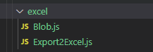
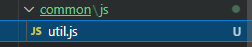

# 项目 易购后台管理系统_第五天

**主要内容**

* 商品规格参数回显
* PDF打印
* 订单列表

**学习目标**

 知识点| 要求 
 -| :- 
 商品规格参数回显 | 掌握 
 PDF打印 | 掌握 
 订单列表 | 掌握 


## 一、商品规格参数回显


### 步骤：

1. 动态渲染表单项  =》动态表单

2. 添加、修改  合并对象  this.goodsFrom   {paramsInfo:''}   Object.assign()

3. 清空表单项  resetForm    单独处理：paramsInfo=[]

4. 修改  watch（val）  是否展示参数，判断  val.paramsInfo  !=''  

   显示规格参数配置；赋值 thsi.paramsInfo=JSON.parse( val.paramsInfo)

  


### 1.1 效果图

​	


### 1.2 代码演示

```js
  /**
     * 显示tree数据
     */
    showTreeData() {
      this.innerVisible = false;
      //显示tree数据
      this.goodsForm.category = this.treeData.name;
      this.goodsForm.cid = this.treeData.cid;
      //显示规格参数--- 获取--------------
      // this.isShow = true;
      this.$api
        .categoryData({
          cid: this.treeData.cid,
        })
        .then((res) => {
          console.log("显示规格参数--- 获取-", res.data);
          if (res.data.status === 200) {
            //有类目规格配置参数-------------
            this.isShow = true;
            //存储规格参数
            let result = res.data.result[res.data.result.length - 1];
            console.log(result.paramData);
            this.groups = JSON.parse(result.paramData);
          } else {
            this.isShow = false;
          }
        });
    },
```

规格参数配置代码

```vue
  <!-- 规格参数配置 -->
        <el-form-item label="规格参数配置" v-show="isShow">
          <el-form
            ref="dynamicValidateForm"
            label-width="120px"
            class="demo-dynamic"
          >
            <el-form-item
              v-for="(item, index) in groups"
              :label="item.title"
              :key="index"
              :prop="item.value"
            >
                <el-input v-model="item.value"></el-input>
              <!-- 内层的表单项 -->
              <el-form-item
                v-for="(ele, i) in item.children"
                :label="ele.title"
                :key="i"
                :prop="ele.value"
              >
                  <el-input v-model="ele.value"></el-input>
              </el-form-item>
            </el-form-item>
          </el-form>
        </el-form-item>
      </el-form>
```


## 二、PDF打印

文档：

https://www.npmjs.com/package/vue-pdf

https://www.jianshu.com/p/d126ca551e1b


打印合同：

@click="$refs.myPdf.print()"


乱码处理：

https://github.com/FranckFreiburger/vue-pdf/pull/130/commits/253f6186ff0676abf9277786087dda8d95dd8ea7


### 2.1 效果图

​		


### 2.2 代码演示

```vue
<template>
  <el-dialog title="合同内容" :visible.sync="dialogVisible" width="50%">
    <hr />
    <el-button @click="num--">上一页</el-button>
    <el-button @click="num++">下一页</el-button>
    <hr />
    <!-- 写法一： -->
    <p>{{ currentPage }} / {{ pageCount }}</p>
    <el-button @click="print">打印合同</el-button>
    <pdf
      src="./sxt.pdf"
      ref='mypdf'
      :page="num"
      @num-pages="pageCount = $event"
      @page-loaded="currentPage = $event"
      style="display: inline-block; width: 400px"
    ></pdf>

    <span slot="footer" class="dialog-footer">
      <el-button @click="dialogVisible = false">取 消</el-button>
      <el-button type="primary" @click="dialogVisible = false">确 定</el-button>
    </span>
  </el-dialog>
</template>

<script>
//1. 安装pdf : npm i vue-pdf -S
//2. 导入pdf  3. 使用组件
import pdf from "vue-pdf";
//获取pdf文件
const source = pdf.createLoadingTask("./sxt.pdf");

export default {
  components: {
    pdf,
  },
  data() {
    return {
      dialogVisible: false,
      num: 1,
      currentPage: 0,
      pageCount: 0,
      numPages: undefined,
      src: source,
    };
  },
  mounted() {
    this.src.promise.then((pdf) => {
      this.numPages = pdf.numPages;
    });
  },
  methods:{
      //打印合同
      print(){
          this.$refs.mypdf.print();
      }
  }
};
</script>

<style>
</style>
```


### 导出Excel表格

1、安装

```bash
npm i file-saver xlsx -S      # --save
npm i script-loader -D   # 
```

2、在 src目录下新建 excel文件夹，存入Blob.js、Export2Excel.js 文件



3、在common文件夹里新建js 文件夹，再新建util.js




## 三、订单列表

### 3.1 效果图

​	


### 3.2 代码演示

```vue
<template>
  <div class="container">
    <!-- 1. 目录位置 -->
    <div class="nav">
      <el-breadcrumb separator="/">
        <el-breadcrumb-item :to="{ path: '/' }">首页</el-breadcrumb-item>
        <el-breadcrumb-item :to="{ path: '/order' }"
          >订单管理</el-breadcrumb-item
        >
        <el-breadcrumb-item>订单列表</el-breadcrumb-item>
      </el-breadcrumb>
    </div>
    <!-- 2. 搜索区域 -->
    <div class="header">
      <!-- change	仅在输入框失去焦点或用户按下回车时触发 -->
      <el-form :inline="true" :model="formInline" class="demo-form-inline">
        <el-form-item label="订单号">
          <el-input v-model="formInline.user" placeholder="订单号"></el-input>
        </el-form-item>
        <el-form-item label="商品区域">
          <el-select v-model="formInline.region" placeholder="商品区域">
            <el-option label="区域一" value="shanghai"></el-option>
            <el-option label="区域二" value="beijing"></el-option>
          </el-select>
        </el-form-item>
        <el-form-item label="商品名称">
          <el-input v-model="input" placeholder="请输入内容"></el-input>
        </el-form-item>
        <el-form-item>
          <el-button type="primary">查询</el-button>
          <el-button type="success">管理</el-button>
        </el-form-item>
      </el-form>
    </div>
    <!-- 3. 表格 -->
    <div class="order-list">
      <el-table :data="tableData" border>
        <el-table-column type="selection" width="55"></el-table-column>
        <el-table-column prop="id" label="ID" width="80"></el-table-column>
        <el-table-column prop="title" label="商品名称" show-overflow-tooltip>
        </el-table-column>
        <el-table-column prop="num" label="购买数量" width="100">
        </el-table-column>
        <el-table-column prop="user.name" label="购买人" width="100">
        </el-table-column>
        <el-table-column prop="address" label="收获地址" show-overflow-tooltip>
        </el-table-column>
        <el-table-column prop="time" label="购买日期"> </el-table-column>
        <el-table-column label="操作">
          <template slot-scope="scope">
            <el-button
              size="mini"
              type="primary"
              icon="el-icon-edit"
              @click="handleEdit(scope.$index, scope.row)"
              >编辑</el-button
            >
            <el-button
              size="mini"
              type="danger"
              @click="handleDelete(scope.$index, scope.row)"
              icon="el-icon-delete"
              >删除</el-button
            >
          </template>
        </el-table-column>
      </el-table>
    </div>

    <!-- 4. 分页 -->
    <MyPagination :total="total" :pageSize="1" @changePage="changePage" />
  </div>
</template>

<script>
import MyPagination from "../../../components/MyPagination.vue";
export default {
  components: {
    MyPagination,
  },
  data() {
    return {
      input: "",
      formInline: {
        user: "",
        region: "",
      },
      tableData: [],
      total: 1,
      pageSize: 1,
    };
  },
  methods: {
    /**
     * 点击分页
     */
    changePage(num) {
      this.http(num);
    },
    /**
     * 编辑
     */
    handleEdit() {},
    /**
     * 删除
     */
    handleDelete() {},
    /**
     * 获取订单数据
     */
    http(currPage) {
      this.$api.orderList({ currPage }).then((res) => {
        console.log(res.data);
        if (res.data.status === 200) {
          this.tableData = res.data.data.list;
          this.total = res.data.data.totalPage;
        } else {
          this.tableData = [];
          this.total = 1;
        }
      });
    },
  },
  created() {
    this.http(1);
  },
};
</script>

<style lang='less' scoped>
.container {
  margin: 10px;
}
.nav {
  padding: 10px;
}
.header {
  display: flex;
  background: #fff;
  padding: 10px;
  border: 1px solid #eee;
  button {
    margin-left: 20px;
  }
  .el-form-item {
    margin-bottom: 0;
  }
}
// 订单列表
.order-list {
  margin: 20px 0;
  padding: 16px;
  border: 1px solid #eee;
  background: #fff;
}
</style>
```


### 3.3 订单接口

```js
/**
 * 订单列表
 */
var MockRandom = Mock.Random;
var pageCount = MockRandom.integer(1, 10);//7
var haseMore = true;//是否还有更多数据  true有数据  false无更多数据 结束分页展示
var ids = 100;//自增长id
var result = {};//数据模板

router.get('/order-list', (req, res) => {
    var currPage = parseInt(req.query.currPage || 1);//页码
    ids = currPage * 100;
    if (currPage === pageCount) {
        haseMore = false;
        result = {
            'hasMore': false,
            'totalPage': pageCount,
            "list|1-10": [//最后一页的数据在1-10的区间产生
                {
                    'id|+1': ids,
                    "title": '@cword(3,20)',//随机汉字,
                    "address":'@province()/@city()/@county()',
                    "num|1-100": 1,
                    "user": {
                        "avator": MockRandom.image('200x100', '#4A7BF7'),//图片大小
                        "name": "@cname",
                        "isvip": "@integer(0,1)",
                        "level": "@integer(0,20)"
                    },
                    "created": "@date('yyyy-MM-dd-HH-mm-ss')",//日期
                    'time': MockRandom.now('yyyy-MM-dd')
                }
            ]
        }
    }else{
        result = {
            'hasMore': true,
            'totalPage': pageCount,
            "list|10": [//有分页的时候一页10条数据
                {
                    'id|+1': ids,
                    "title": '@cword(3,20)',//随机汉字,
                    "address":'@province()/@city()/@county()',
                    "num|1-100": 1,
                    "user": {
                        "avator": MockRandom.image('200x100', '#4A7BF7'),//图片大小
                        "name": "@cname",
                        "isvip": "@integer(0,1)",
                        "level": "@integer(0,20)"
                    },
                    "created": "@date('yyyy-MM-dd-HH-mm-ss')",//日期
                    'time': MockRandom.now('yyyy-MM-dd')
                }
            ]   
    }
    }
    //返回数据
    let mockData = Mock.mock(result);
    if(pageCount>=currPage){
        res.send({
            status: 200,
            data: mockData,
            total:pageCount
          });
    }else{
        res.send({
            status: 403,
            data: [],
          });
    }
})
```

## 四、广告分类

### 4.1 效果图

​	

### 4.2 代码演示

广告首页

```vue
<template>
  <div class='advert'>
    <!-- 左侧 -->
    <AdvertTree class="advert-left" @getTreeData='getTreeData' />
    <!-- 右侧 -->
    <AdvertContent class='advert-content' :treeData='treeData' />

  </div>
</template>

<script>
import AdvertTree from "./AdvertTree.vue";
import AdvertContent from './AdvertContent.vue'
export default {
  components: {
    AdvertTree,
    AdvertContent
  },
  data(){
    return{
      treeData:{name:'按钮'}
    }
  },
  methods:{
    getTreeData(val){
      console.log('----',val);
      this.treeData=val;
    }
  }
};
</script>

<style lang='scss' scoped>
.advert{
  margin: 20px;
}
  .advert-left{
    width: 300px;
    float: left;
  }
  .advert-content{
    float: left;
  }
</style>
```

广告tree导航

```vue
<template>
  <div>
    <el-tree
      :data="data"
      :expand-on-click-node="false"
      :render-content="renderContent"
      :props="props"
      lazy
      :load="loadNode"
      node-key="pid"
      :default-expanded-keys="[1001]"
      @node-click="handleNodeClick"
    >
    </el-tree>

    <!-- 弹框 -->
    <el-dialog :title="title" :visible.sync="dialogVisible" width="40%">
      <p>当前出于的广告位置：{{ advertInfo.name }}</p>
      <el-input type="text" v-model="advertName" />

      <span slot="footer" class="dialog-footer">
        <el-button @click="dialogVisible = false">取 消</el-button>
        <el-button type="primary" @click="submitAdvert">确 定</el-button>
      </span>
    </el-dialog>
  </div>
</template>


<script>
export default {
  data() {
    return {
      dialogVisible: false, //弹框状态关闭
      title: "添加广告",
      advertName: "", //广告名字
      advertInfo: {}, //点击广告节点内容
      props: {
        label: "name",
        children: "zones",
        isLeaf: "leaf",
      },
      data: [],
    };
  },
  methods: {
      //点击tree节点---发送数据
    handleNodeClick(data) {
      console.log(data);
      this.$emit('getTreeData',data)
    },
    http(){
        this.$api.getAdvertlist().then((res) => {
          console.log("广告分类", res);
          this.data=res.result;
        });
    },
    //进入组件懒加载数据
    loadNode(node, resolve) {
      if (node.level === 0) {
        //第一次请求
        this.$api.getAdvertlist().then((res) => {
          console.log("广告分类", res);
          return resolve(res.result);
        });
      }
      if (node.level >= 1) {
        this.$api
          .getAdvertlist({
            id: node.data.pid,
          })
          .then((res) => {
            console.log("广告分类---22---", res);
            if (res.status === 200) {
              return resolve(res.result);
            } else {
              return resolve([]);
            }
          });
      }
    },
    //render-content
    //增加
    append(data) {
      console.log(data);
      //显示弹框
      this.dialogVisible = true;
      this.title = "添加广告";
      //获取点击的节点内容
      this.advertInfo = data;
    },
    //删除
    remove(node, data) {},

    //修改
    update(data) {
      //显示弹框
      this.dialogVisible = true;
      this.title = "修改广告名称";
      //获取点击的节点内容
      this.advertInfo = data;
    },
    //提交确定按钮
    submitAdvert() {
      if (this.title == "添加广告") {
        console.log("添加事件");
        this.$api
          .addvertChild({
            pid: this.advertInfo.pid,
            name: this.advertName,
          })
          .then((res) => {
            console.log(res);
            if (res.status === 200) {
              //添加成功
              this.$message({
                message: "恭喜你，这是一条成功消息",
                type: "success",
              });
              //隐藏弹框--清空数据
              this.dialogVisible = false;
              this.advertName = "";
              //更新tree
              this.http()
              
            } else {
              //错误信息提示
            }
          });
      } else {
        console.log("修改事件");
      }
    },
    renderContent(h, { node, data, store }) {
      return (
        <span class="custom-tree-node">
          <span>{node.label}</span>
          <span>
            <el-button
              size="mini"
              type="text"
              on-click={() => this.append(data, "add")}
            >
              增加
            </el-button>
            <el-button
              size="mini"
              type="text"
              on-click={() => this.update(data, "update")}
            >
              修改
            </el-button>
            <el-button
              size="mini"
              type="text"
              on-click={() => this.remove(node, data)}
            >
              删除
            </el-button>
          </span>
        </span>
      );
    },
  },
};
</script>

<style>
</style>
```

### 4.3 广告内容

**效果图**

​	


**代码演示**

```vue
<template>
  <div class="content">
    <el-button @click="addContent">{{ treeData.name }}广告</el-button>
    <!-- 表格 -->
    <el-table :data="tableData" style="width: 100%" border>
      <el-table-column prop="pid" label="PID" width="180"> </el-table-column>
      <el-table-column prop="name" label="名称" width="180"> </el-table-column>
      <el-table-column prop="url" label="访问地址" min-width="240" show-overflow-tooltip>
      </el-table-column>
      <el-table-column prop="image" label="图片地址" min-width="240" show-overflow-tooltip>
      </el-table-column>
      <el-table-column label="操作">
        <template slot-scope="scope">
          <el-button
            size="mini"
            type="danger"
            @click="handleDelete(scope.$index, scope.row)"
            >删除</el-button
          >
        </template>
      </el-table-column>
    </el-table>
  </div>
</template>

<script>
export default {
  props: {
    treeData: {
      type: Object,
      default: function () {
        return { name: "按钮" };
      },
    },
  },
  data() {
    return {
      tableData: [],
    };
  },
  watch: {
    treeData: function (val) {
      //清空数据
      this.tableData=[];
      this.$api
        .addAdvertContent({
          pid: val.pid,
        })
        .then((res) => {
          console.log('监听修改',res);
          if(res.status===200){
              this.tableData=res.result;
          }else{
            //没有数据
          }
        });
    },
  },
  methods: {
    handleDelete() {},
    //增加广告内容--弹框
    addContent() {},
  },
};
</script>

<style scoped lang='scss'>
.content {
  text-align: center;
  > button {
    margin-bottom: 20px;
  }
}
</style>
```


### 4.4 广告相关接口

```js

/**
 * 内容分类管理 导航
 */
router.get("/content/selectContentCategoryByParentId", (req, res) => {
    const id = req.query.id || 1;
    const sql = "select * from content where id=?";
    sqlFn(sql, [id], result => {
        if (result.length > 0) {
            res.send({
                status: 200,
                result
            })
        } else {
            res.send({
                status: 500,
                msg: "暂无数据"
            })
        }
    })
})

/**
 * 广告分类管理 增加子导航
 */
router.get("/content/insertContentCategory", (req, res) => {
    const pid = req.query.pid;
    const name = req.query.name;
    const currentId = Math.floor(Math.random() * 10000)
    const sql = "insert into content values (?,?,?)"
    sqlFn(sql, [pid, name, currentId], result => {
        if (result.affectedRows > 0) {
            res.send({
                status: 200,
                msg: "添加成功"
            })
        } else {
            res.send({
                status: 500,
                msg: "添加失败"
            })
        }
    })
})

/**
 *  广告分类管理 修改子导航
 */
router.get("/content/updateContentCategory", (req, res) => {
    const pid = req.query.pid;
    const name = req.query.name;
    const sql = "update content set name=? where pid=?"
    sqlFn(sql, [name, pid], result => {
        if (result.affectedRows > 0) {
            res.send({
                status: 200,
                msg: "修改成功"
            })
        } else {
            res.send({
                status: 500,
                msg: "修改失败"
            })
        }
    })
})

/**
 *广告分类管理 删除子导航 pid
 */
router.get("/content/deleteContentCategoryById", (req, res) => {
    const pid = req.query.pid;
    const sql = "delete from content where pid=?"
    sqlFn(sql, [pid], result => {
        if (result.affectedRows > 0) {
            res.send({
                status: 200,
                msg: "删除成功"
            })
        } else {
            res.send({
                status: 500,
                msg: "删除失败"
            })
        }
    })
})

/**
 * 广告分类管理 内容增加
 */
router.get("/content/insertTbContent", (req, res) => {
    const pid = req.query.pid;
    const name = req.query.name;
    const contentUrl = req.query.url;
    const image = req.query.image;
    const sql = "insert into contentinfo values(null,?,?,?,?)";
    sqlFn(sql, [pid, name, contentUrl, image], result => {
        if (result.affectedRows > 0) {
            res.send({
                status: 200,
                msg: "添加成功"
            })
        } else {
            res.send({
                status: 500,
                msg: "添加失败"
            })
        }
    })
})


/**
* 广告分类管理 内容删除
*/

router.get("/content/deleteContentByIds", (req, res) => {
    const id = req.query.id;
    const sql = "delete from contentinfo where id=?"
    sqlFn(sql, [id], result => {
        if (result.affectedRows > 0) {
            res.send({
                status: 200,
                msg: "删除成功"
            })
        } else {
            res.send({
                status: 500,
                msg: "删除失败"
            })
        }
    })
})

```


## Echart

安装：

npm i echarts -S


