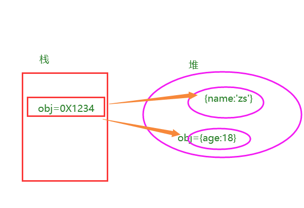
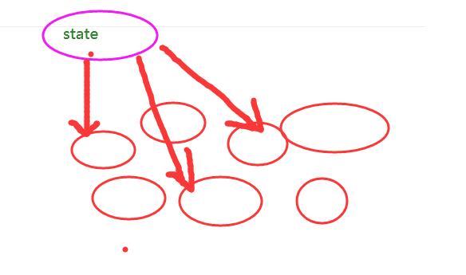

# vue2的响应式

响应式：数据变了，界面跟着变。


- 核心: 
  - 对象: 通过defineProperty对对象的==已有属性值==的读取和修改进行劫持(监视/拦截)
  - 数组: 通过重写数组更新数组一系列更新元素的方法来实现元素修改的劫持

```js
Object.defineProperty(data, 'count', {
    //依赖收集 [,,,,]
    get () {}, 
    // 通知，响应式更新
    set () {}
})
```

- 问题

  - 对象直接新添加的属性或删除已有属性, 界面不会自动更新

  - 直接通过下标替换元素或更新length, 界面不会自动更新   arr[1] = {}

    ```js
    obj:{
        a:{
            b:{
                c:10
            }
        }
    }
    ```

    


### 补充：对象更新检测

1. 说明：对象修改后 视图同步更新视图 -- 内存：栈内存 堆内存 

   可以修改已经存在的属性；

   可以修改整个对象；

   

   

   ==但是对于新添加的属性，不是响应式的。==

2. 实现对象视图同步更新

   1. Vue.set( target, propertyName/index, value )
      参数：
          {Object | Array} target
          {string | number} propertyName/index
          {any} value
          返回值：设置的值。
      用法：
          向响应式对象中添加一个 property，并确保这个新 property 同样是响应式的，且触发视图更新。它必须用于向响应式对象上添加新 property，因为 Vue 无法探测普通的新增 property (比如 this.myObject.newProperty = 'hi')

      组件内部：

      ```js
      this.$set(this.obj,'age',18)
      ```

      

    2. 代码演示

    ```js
        addAttribute(){
            // this.obj.sex='女'
            // console.log('obj',this.obj);
            //问题：vue认为 obj没有修改
            //1. ...  
            // this.obj ={...this.obj};
            //2. es6: 合并对象  Object.assign({},{},{}) 
            // this.obj=Object.assign({},this.obj)
   
            //3. vue官网解决方法：
            //向响应式对象中添加一个 property，并确保这个新 property 同样是响应式的，且触发视图更新。
            // this.$set(this.obj,'sex','女')
            Vue.set(this.obj,'fav','学习')
   
            //删除 同步视图 删除对象的 property。如果对象是响应式的，确保删除能触发更新视图。
            Vue.delete(this.obj,'age')
        }
   
    ```


### 总结：

可以修改已经存在的属性；

可以修改整个对象；

但是，对于新添加的属性不是响应式的，  Vue.set(this.obj，'age',19)

this.$set(this.obj，'age',19)

 Vue.delete(this.obj,'age')


### 补充知识：数组更新检测（数组相关API）

#### 1、变更方法（修改原始数据）：

Vue对数据的操作都是响应式的，而数组对数据的操作默认都不是响应式的。所以，Vue对数组的操作需要变成响应式的，这样，只要操作了数组中的数据，页面中的模板内容就跟着发生变化。所谓的==变更方法，就是Vue把原生的方法变成了响应式的方式。== 共性就是都会影响原始的数据。

Vue 将被侦听的数组的变更方法进行了包裹，所以它们也将会触发视图更新。这些被包裹过的方法包括：

| `push()`    | 往数组最后面添加一个元素，成功返回当前数组的长度             |
| ----------- | ------------------------------------------------------------ |
| `pop()`     | 删除数组的最后一个元素，成功返回删除元素的值                 |
| `shift()`   | 删除数组的第一个元素，成功返回删除元素的值                   |
| `unshift()` | 往数组最前面添加一个元素，成功返回当前数组的长度             |
| `splice()`  | 有三个参数，第一个是想要删除的元素的下标（必选），第二个是想要删除的个数（必选），第三个是删除 后想要在原位置替换的值 |
| `sort()`    | sort()  使数组按照字符编码默认从小到大排序,成功返回排序后的数组 |
| `reverse()` | reverse()  将数组倒序，成功返回倒序后的数组                  |


#### 2、替换数组（生成新的数组）：

变更方法，顾名思义，会变更调用了这些方法的原始数组。相比之下，也有非变更方法，例如 `filter()`、`concat()` 和 `slice()`。它们不会变更原始数组，而**总是返回一个新数组**。当使用非变更方法时，可以用新数组替换旧数组：

| filter | filter() 方法创建一个新的数组，新数组中的元素是通过检查指定数组中符合条件的所有元素。 |
| ------ | ------------------------------------------------------------ |
| concat | concat() 方法用于连接两个或多个数组。该方法不会改变现有的数组 |
| slice  | slice() 方法可从已有的数组中返回选定的元素。该方法并不会修改数组，而是返回一个子数组 |


#### 举例：变更方法

```html
<input type="text" v-model='fname'>
<button @click='add'>添加</button>
<button @click='del'>删除</button>
<button @click='change'>替换</button>

<ul>
    <li :key='index' v-for='(item,index) in list'>{{item}}</li>
</ul>
```

Js:

```js
data: {
    fname: '',
        list: ['apple','orange','banana']
},
    methods: {
        add: function(){
            this.list.push(this.fname);
        },
            del: function(){
                this.list.pop();
            },
            change: function(){
          // 截取数组  
          // 如果只是截取数组：this.list.slice(0,2);并不会影响原始数组
          // 必须得把截取后的数组重新赋值给原始数组
          this.list = this.list.slice(0,2);
        }
    }
```


#### 3、数组响应式变化：

除了用上面提供的API之后，还可以通过索引直接操作数组。但是通过索引操作并不是响应式的，但是Vue 也提供了以下两种方法：

一、通过Vue对象调用 ：

```js
Vue.set(vm.items,indexOfItem,newValue) 
```

二、通过vue示例调用

```j
vm.$set(vm.items,indexOfItem,newValue)
```

1. 参数一：要处理的数组名称
2. 参数二：要处理的数组的索引
3. 参数三：要处理的数组的值

```html
<ul>
    <li v-for='item in list'>{{item}}</li>
</ul>
<div>
    <div>{{info.name}}</div>
    <div>{{info.age}}</div>
    <div>{{info.gender}}</div>
</div>
```


```js
/*
      动态处理响应式数据      
    */
var vm = new Vue({
    el: '#app',
    data: {
        list: ['apple', 'orange', 'banana'],
        info: {
            name: 'lisi',
            age: 12
        }
    },
});
// 用索引方式修改数据并不是响应式的
// vm.list[1] = 'lemon';
// 通过对象方式调用，可以修改数组里的值
// Vue.set(vm.list, 2, 'lemon');
// 通过实例方式
vm.$set(vm.list, 1, 'lemon');

```


总结：

这两个API ==既可以来处理数组的索引，又可以处理对象的属性 变成响应式的。==


# 逻辑复用-mixin


官方话术：

\- 混入 (mixin) 提供了一种非常灵活的方式，来分发 Vue 组件中的可复用功能。一个混入对象可以包含任意组件选项。当组件使用混入对象时，所有混入对象的选项将被“混合”进入该组件本身的选项。

理解全局混入：所有组件混入了这些逻辑代码

```js
// 全局混入 全局mixin
// vue2.0 写法  Vue.mixin({})
vm.mixin({
  methods: {
    say () {
      console.log(this.$el,'在mounted中调用say函数')
    }
  },
  mounted () {
    this.say()
  }
})

```


理解局部混入：通过mixins选项进行混入

```js
// 配置对象
export const Mixin =  {
  data () {
    return {
      loading: false
    }
  },
  methods: {
    followFn () {
      this.loading = true
      // 模拟请求
      setTimeout(()=>{
        // 省略请求代码
        this.loading = false
      },2000)
    }
  }
}
```


**总结：** 在vue2.0中一些可复用的逻辑可以使用mixins来封装，但是需要考虑逻辑代码冲突问题。vue3.0的组合API很好的解决了这个问题，就不在推荐使用mixins了。


# 组件通信方式：

## 1、props 组件通信的方式：

是组件通信最常用最简单的一种方式

适用场合：适用于父子之间

父可以给子传递==函数数据==和==非函数数据==
		1、传递非函数数据，本质就是父亲给儿子传数据` <son   :msg='msg' />`

​		2、传递函数数据，本质是父亲想要儿子的数据，通过函数调用传参的方式把数据传递给父亲	

不足（不是父子就很麻烦） 兄弟关系，就必须先把一个数据给了父亲，然后通过父亲再给另一个

最基础的通信，用的也是比较多的，所以必须搞定


## 2、自定义事件：

Why：父组件通过props传递给子组件的数据，子组件不能修改。

但是可以通过自定义事件，由子组件通知父组件，让父组件自行修改。

How：自定义事件的流程：

1.  在子组件中，通过$emit(‘事件名’,参数)来触发事件。
2.  在父组件中，通过v-on来监听子组件事件。

语法 ：

1. 子组件定义事件 
   this.$emit('getData',this.msg)

 2. 父组件-调用子组件上面接受自定义事件
    <子组件 @自定义事件名='函数名'/>

    methods:{
        函数名(val){
            this.xx = val;
        }
    }

子组件：


父组件：接收


#### 传参：

子组件：


父组件：


vue自定义事件：只适用于父子


## 3、全局事件总线

==基于vue自定义事件。==适用场景：任何场景  eventBus

必须要满足的条件：

1，所有的组件对象都能找到它

2，在它身上可以使用`$emit` 和 `$on`  =》Vue

全局事件总线==本质就是一个对象==，在vue当中，选择vm作为全局事件总线。


给Vue的原型对象上添加属性，属性的值是Vue实例： Vue.prototype.$bus=this;

```js
new Vue({
  beforeCreate(){
    Vue.prototype.$bus=this; //配置事件总线，即把vm挂载到Vue的原型上，让所有组件都能找到它，并且能看到它上面的 $emit 和 $on
  },
  render: h => h(App)
}).$mount('#app')
```


## 4、`$children` `$parent`  `$refs`

### 父组件访问子组件 `$children` 

- 说明

  this.$children是一个数组类型，它包含所有子组件对象。

`$children` 的缺陷：通过 `$children` 访问子组件时，是一个数组类型，访问其中的子组件必须通过索引值。但是当子组件过多，我们需要拿到其中一个时，往往不能确定它的索引值，甚至还可能会发生变化。因此，我们想明确获取其中一个特定的组件，这个时候就可以使用$refs。


#### 子组件访问父组件`this.$parent` 

直接`this.$parent.属性 `   和 `this.$parent.方法 `  即可

- 注意

  1. 尽管在Vue中，允许通过 `$parent`访问父组件，但在真实开发中尽量不要这样做。
  2. ==子组件应该尽量避免直接访问父组件的数据，因为这样耦合度太高了。==

- 原因

  如果我们将子组件放在另外一个组件内，很可能该父组件没有对应的属性，往往会引起问题。此外，更不好做的是通过$parent直接修改父组件的状态，那么父组件中的状态将变得飘忽不定，很不利于我的调试和维护。

  

###  `$refs`  

前面讲双向数据绑定时，讲过用 "ref 来获取表单中数据"，ref 获取的其实就是Dom元素，而组件其实也就是自定义标签元素，同样可以用 ref 获取。

步骤

1，用ref给子组件命名，定义一个 **ref='header'**

```html
<v-header :title='title' ref='header'></v-header>
```

2、调用子组件的属性：**this.$refs.header.msg**

​	this.$refs.header.childRun()		//调用子组件的方法


## 5、插槽

直接用slot，实现的是父传子

作用域插槽：实现子传父

==作用域插槽 【子向父传值方式】==

1. 作用: 让插槽内容能够访问子组件中才有的数据 (插槽提供数据，让别人使用)

2. 语法：子组件

   ```html
   <slot name="footer" :msg="msg" :num='num'></slot>
   ```

   

 3. 父组件 使用插槽：

    ```html
    <template v-slot:footer='data'>
       底部区域
        <p>使用slot数据:{{ obj }}</p>
        <p>{{ obj.msg }}</p>
    </template>
    ```

    

    注意：==data一个对象 data={ msg:'',num:'',...}==


## 6、Provide/  inject

https://cn.vuejs.org/v2/api/#provide-inject

1. 说明：   

   vue组件之间的数据传递  深层数据传递 顶级向子代传递数据
   例如：
       父传递子组件 prop  父组件->孙子   父组件->曾孙子 可以的prop是实现

2. 语法
       提供数据：provide：Object 或者 () => Object
        接受数据：inject：Array<string> 或者 { [key: string]: string | Symbol | Object }

   ​	常用的是：provide是函数形式，inject是数组形式

提示：==provide 和 inject 绑定并不是可响应的。这是刻意为之的==

我们可以把依赖注入看做是大范围的 props

对于祖先不知道数据将提供给谁

对于子孙不知道数据从哪里来


## 7、路由组件传参

在组件中使用 `$route` 会使之与其对应路由形成高度耦合，从而使组件只能在某些特定的 URL 上使用，限制了其灵活性。即 本身是组件，还要用路由的属性来获取参数。

$route.params.id

使用 `props` 将组件和路由解耦：  `<User :id='id' />`

```js
const User = {
  props: ['id'],
  template: '<div>User {{ id }}</div>'
}

const router = new VueRouter({
  routes: [
    { path: '/user/:id', component: User, props: true },
      ])
```


## 8、v-model原理

element-ui表单相关项都使用到了v-model
​	官方网站也提出了怎么去使用

v-model一般用于==表单类元素==或==组件标签==上 ，==在组件标签内部也会有表单类元素==

内部实现原理：

v-bind：  ==动态绑定value属性==  `<input  :value='msg'/>`

v-on：监听input事件 `<input  :msg='msg' @input='chagne'/> `

```js
chagne(e){
   this.msg= e.target.value
}
```


- html input v-model的本质 必须要在表单类或组件标签中使用

```js
:value = “data”  //读取data数据
@input = "data = $event.target.value"  //写入data数据
```


- 组件标签上 v-model本质

  ```js
  :value = "data"  //父组件传递属性给子组件，子组件需要接受
  @input = "data = $event" //父组件当中给子组件添加的自定义事件
  	数据在父组件当中
  ```

  子组件当中必须这样写：先接受 props:['value']

  子组件表单类元素

  ```html
  <input :value = "value" @input = "$emit('input',$event.target.value)" />
  ```

  总结：干了两件事  

  1. 先显示数据  

  2. 再绑定修改数据的事件   

     只不过在html和组件标签上绑定的@input事件不同   一个是原生的 一个是自定义的事件


​		

实现父子组件双向数据同步问题 

源码查看element-ui的input是不是使用了

本质上还是自定义事件和props组合


### 区别：

 v-model 和 .sync 都实现父子数据双向同步：

1. 如果==子组件中有表单类元素 可以使用v-model==

2. 如果==子组件内部没有表单类元素 也需要实现父子同步数据功能的  可以使用.sync修饰符==


## 9、.sync 属性修饰符

实现父子组件双向数据同步问题，和 v-model 实现效果几乎一样
v-model一般用于带表单项的组件；sync属性修饰符一般用于不带表单项的组件

1. 父组件给子组件属性传递数据后面添加.sync 例如: 

```html
<!--在父组件中给子组件Child传递数据 :moeny属性名-->
<Child :moeny.sync='moeny'></Child>
```


2. 子组件修改数据 需要分发事件 `@click = $emit("update:属性名",要更新的数据)`

   ```html
   <!--在子组件中修改数据,需要使用触发事件 $emit('update:属性名',传值)-->
   <button @click="$emit('update:moeny',moeny-100)">花钱</button>
   ```

   

本质上还是自定义事件和props组合


## 10、Vuex

多组件共享状态(数据的管理)

  组件间的关系也没有限制

  功能比全局事件总线更强大, 更适用于vue项目



5个核心概念；

state:  [{id:,name:,gender:'男'},{id:,name:,gender:'男'},{id:,name:,gender:'女'}{}]

mutations:  方法

actions：异步，方法  同步 commit('mutation')   dispatc('')   网络请求 api/index.js

getters：包装数据  xx,你好！北京，欢迎你，

A  B

```js
getters:{
    nvGetter(state){
        return  state.map(item=>item.gender==='nv')
    }
}
```

modules ：分模块管理   namesaced:true

$store.state.cityModule.name


## 11、`$attrs`和`$listeners`

主要用于：==父向子 传递属性数据和事件监听数据用的。主要用来让我们自己封装组件使用的。==

​	本质就是父组件中给 子组件传递的所有属性组成的对象及自定义事件方法组成的对象

`$attrs` 如果不声明props 那么子组件当中是可以看到  如果声明了哪个属性，那么那个属性在$attrs当中看不到   `<Son msg='13'title='abc' />`
它会排除 props声明接收的属性 以及class style

==可以通过v-bind 一次性把父组件传递过来的属性添加给子组件（出了class 、style）==
==可以通过v-on   一次性把父组件传递过来的事件监听添加给子组件==


this.$attrs：收集父组件向子组件传递的所有属性（除了class 、style）组成的对象

$listeners:收集父组件向子组件传递的所有的方法组成的对象

==用处：自定义组件，距离ElementuI==

1. 对一个组件进行二次封装：


2. 父组件中使用：


elementui 二次封装


