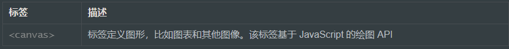

### 

首先面试最忌讳的就是紧张，要知道面试官可能比你还紧张哈哈哈，所以放轻松，会什么答什么就行

最近一次面试：原生JS写new(不会)、垂直居中、BFC、清除浮动、HTML5新元素、（var、const、let）、promise（不详细）、（bind、call、apply）、原型原型链、axios请求、替换内容方法replace()（说错了）、map（不会，主要问与set的区别）、object.keys（不会）、sort(忘了)、(sessionStorage、localStorage)(搞混了)、vue双向数据绑定原理（忘记）、常见状态码（了解）、冒泡排序、插入排序

# CSS/HTML部分

**这部分可能会先问你css3和html5都增加了那些新元素，然后扩展着问**

## **0、css布局方式**

1、table布局（现在少用）

2、flex布局

3、float布局

4、响应式布局

## 1、说一下盒子模型（常问）

标准和模型和IE盒子模型

这两个的区别主要是

IE盒子模型的宽高包括content和padding还有border，标准盒子模型 不包括，

box-sizing:content-box 标准盒模型

box-sizing:border-box IE盒模型

## 2、Html5新标签

## **canvas 新元素**



## **新多媒体元素**


## **新的语义和结构元素**

HTML5提供了新的元素来创建更好的页面结构：


## 3、BFC

`BFC`（Block Formatting Context），即块级格式化上下文，它是页面中一个独立的容器，容器中的元素不会影响到外面的元素

## **触发条件**

触发`BFC`的条件包含不限于：

- 根元素，即HTML元素
- 浮动元素：float值为left、right
- overflow值不为 visible，为 auto、scroll、hidden
- display的值为inline-block、inltable-cell、table-caption、table、inline-table、flex、inline-flex、grid、inline-grid
- position的值为absolute或fixed

## 4、浏览器运行机制

1、创建DOM树

2、构建渲染树，CSS渲染

3、布局渲染，每个元素的大小、位置

4、绘制渲染树、再画出来

重绘：改变元素的外观属性例如div的color、background-color、等属性发生改变时

重排（回流）：元素的规模尺寸、布局、隐藏改变时

代价：耗时，导致浏览器卡慢

## 5、居中的方式

### **垂直居中的方式**

行高=高

Margin auto 0

绝对定位 top50%，自身宽度的50%的负值

flex布局 align---center

### **水平居中的方式**

绝对定位

flex布局 juest---center

margin 0 auto

text-align center

## 6、rem、em、vh、px各自代表的含义？

**px**：绝对单位，页面按精确像素展示

**em**：相对单位，基准点为父节点字体的大小，如果自身定义了`font-size`按自身来计算，整个页面内`1em`不是一个固定的值

**rem**：相对单位，可理解为`root em`, 相对根节点`html`的字体大小来计算

**vh、vw**：主要用于页面视口大小布局，在页面布局上更加方便简单

## 7、有哪些方式可以隐藏页面元素？区别?

通过`css`实现隐藏元素方法有如下：

- display:none
- visibility:hidden
- opacity:0
- 设置height、width模型属性为0
- position:absolute
- clip-path

关于`display: none`、`visibility: hidden`、`opacity: 0`的区别，如下表所示：


## 8、什么是响应式设计？响应式设计的基本原理是什么？如何做？

响应式网站设计（Responsive Web design）是一种网络页面设计布局，页面的设计与开发应当根据用户行为以及设备环境(系统平台、屏幕尺寸、屏幕定向等)进行相应的响应和调整

响应式网站常见特点：

- 同时适配PC + 平板 + 手机等
- 标签导航在接近手持终端设备时改变为经典的抽屉式导航
- 网站的布局会根据视口来调整模块的大小和位置

实现响应式布局的方式有如下：

- 媒体查询（我们可以设置不同类型的媒体条件，并根据对应的条件，给相应符合条件的媒体调用相对应的样式表）
- 百分比
- vw/vh
- rem

响应式设计实现通常会从以下几方面思考：

- 弹性盒子（包括图片、表格、视频）和媒体查询等技术
- 使用百分比布局创建流式布局的弹性UI，同时使用媒体查询限制元素的尺寸和内容变更范围
- 使用相对单位使得内容自适应调节
- 选择断点，针对不同断点实现不同布局和内容展示

## 9、css选择器有哪些？优先级？

关于`css`属性选择器常用的有：

- id选择器（#box），选择id为box的元素
- 类选择器（.one），选择类名为one的所有元素
- 标签选择器（div），选择标签为div的所有元素
- 后代选择器（#box div），选择id为box元素内部所有的div元素
- 子选择器（.one>one_1），选择父元素为.one的所有.one_1的元素
- 相邻同胞选择器（.one+.two），选择紧接在.one之后的所有.two元素
- 群组选择器（div,p），选择div、p的所有元素

还有一些使用频率相对没那么多的选择器：

- 伪类选择器

```css
:link ：选择未被访问的链接
:visited：选取已被访问的链接
:active：选择活动链接
:hover ：鼠标指针浮动在上面的元素
:focus ：选择具有焦点的
:first-child：父元素的首个子元素
```

- 伪元素选择器

```css
:first-letter ：用于选取指定选择器的首字母
:first-line ：选取指定选择器的首行
:before : 选择器在被选元素的内容前面插入内容
:after : 选择器在被选元素的内容后面插入内容
```

- 属性选择器

```css
[attribute] 选择带有attribute属性的元素
[attribute=value] 选择所有使用attribute=value的元素
[attribute~=value] 选择attribute属性包含value的元素
[attribute|=value]：选择attribute属性以value开头的元素
```

在`CSS3`中新增的选择器有如下：

- 层次选择器（p~ul），选择前面有p元素的每个ul元素
- 伪类选择器

```css
:first-of-type 父元素的首个元素
:last-of-type 父元素的最后一个元素
:only-of-type 父元素的特定类型的唯一子元素
:only-child 父元素中唯一子元素
:nth-child(n) 选择父元素中第N个子元素
:nth-last-of-type(n) 选择父元素中第N个子元素，从后往前
:last-child 父元素的最后一个元素
:root 设置HTML文档
:empty 指定空的元素
:enabled 选择被禁用元素
:disabled 选择被禁用元素
:checked 选择选中的元素
:not(selector) 选择非 <selector> 元素的所有元素
```

- 属性选择器

```css
[attribute*=value]：选择attribute属性值包含value的所有元素
[attribute^=value]：选择attribute属性开头为value的所有元素
[attribute$=value]：选择attribute属性结尾为value的所有元素
```

## **优先级**

内联 > ID选择器 > 类选择器 > 标签选择器

## 10、清除浮动的方法

方法一：使用带 clear 属性的空元素

在浮动元素后使用一个空元素,并在 CSS 中赋 予.clear{clear:both;}属性即可清理浮动。

方法二：使用 CSS 的 overflow 属性

给浮动元素的容器添加 overflow:hidden;或 overflow:auto;可以清除浮动，另外在 IE6 中还 需要触发 hasLayout ，例如为父元素设置容器宽高或设置 zoom:1。 在添加 overflow 属性后，浮动元素又回到了容器层，把容器高度撑起，达到了清理浮动 的效果。

方法三：给浮动的元素的容器添加浮动

给浮动元素的容器也添加上浮动属性即可清除内部浮动，但是这样会使其整体浮动，影 响布局，不推荐使用。

方法四：使用 CSS 的:after 伪元素

结合:after 伪元素（注意这不是伪类，而是伪元素，代表一个元素之后最近的元素）和 IEhack ，可以完美兼容当前主流的各大浏览器，这里的 IEhack 指的是触发 hasLayout。 给浮动元素的容器添加一个 clearfix 的 class，然后给这个 class 添加一个:after 伪元素实 现元素末尾添加一个看不见的块元素清除浮动


## 11、常见的行内元素、块级元素

1、块级元素（div,p,h1...h6,ol,ul,table）

每个块级元素都是独自占一行、元素的高度宽度都是可以设置的

2、行内元素（span,a,img,input,strong）

可以和其他元素处于一行上，元素的高度宽度顶部和底部边距不可设置

## 12、position的属性

此处，问过相对定位和绝对定位的区别

相对定位：相对于当前元素的位子来移动；绝对定位如果不把父元素设置为相对定位，则相对与页面的左上角定位


## 13. 谈谈做好seo需要考虑什么?

- 语义化html标签
- 合理的title, description, keywords;
- 重要的html代码放前面
- 少用iframe, 搜索引擎不会抓取iframe中的内容
- 图片加上alt


# **---JavaScript部分---**


https://blog.csdn.net/qq_54753561/article/details/122149197


## 0、ES6新增了哪些方法

1、includes（）**用于判断数组是否包含给定的值** 返回一个布尔值

2、find（）**用于找出第一个符合条件的数组成员**

3、findindex（）**返回第一个符合条件的数组成员的位置，如果所有成员都不符合条件，则返回-1**

4、set数据结构，类似于数组，但是成员的值都是唯一的，没有重复的值

5、、let声明变量、const声明常量（这里就要问你var、let、const的区别了）

6、解构赋值 ...

**set 和map 的区别！！！以前被问没看过，懵逼过，所以要记住**

1.Map是键值对，Set是值的集合，键和值可以是任何的值；

2.Map可以通过get方法获取值，而set不能因为它只有值，set只能用has来判断，返回一个布尔值；

4.Set的值是唯一的可以做数组去重，Map由于没有格式限制，可以做数据存储


## 1、promiseApi

`Promise`构建出来的实例存在以下方法：

- then() 是实例状态发生改变时的回调函数，第一个参数是`resolved`状态的回调函数，第二个参数是`rejected`状态的回调函数
- catch() 用于指定发生错误时的回调函数
- finally() 用于指定不管 Promise 对象最后状态如何，都会执行的操作

`Promise`构造函数存在以下方法：

- all() 用于将多个 `Promise`实例，包装成一个新的 `Promise`实例
- race() 同样是将多个 Promise 实例，包装成一个新的 Promise 实例
- allSettled()
- resolve()
- reject()
- try()

## 2、Var、 let 、const 区别?（常问、必记）

`var`、`let`、`const`三者区别可以围绕下面五点展开：

- 变量提升
  var`声明的变量存在变量提升，即变量可以在声明之前调用，值为`undefined
  `let`和`const`不存在变量提升，即它们所声明的变量一定要在声明后使用，否则**报错**
- 暂时性死区
  `var`不存在暂时性死区
  `let`和`const`存在暂时性死区，只有等到声明变量的那一行代码出现，才可以获取和使用该变量
- 块级作用域
  `var`不存在块级作用域
  `let`和`const`存在块级作用域
- 重复声明
  `var`允许重复声明变量
  `let`和`const`在同一作用域不允许重复声明变量
- 修改声明的变量
  `var`和`let`可以
  `const`声明一个只读的常量。一旦声明，常量的值就不能改变
- 使用
  能用`const`的情况尽量使用`const`，其他情况下大多数使用`let`，避免使用`var`

## 3、== 和 ===区别

相等操作符`（==）`会做类型转换，再进行值的比较，全等运算符`(===)`不会做类型转换

```js
let result1 = ("55" === 55); // false，不相等，因为数据类型不同
let result2 = (55 === 55); // true，相等，因为数据类型相同值也相同
null` 和 `undefined` 比较，相等操作符（==）为`true`，全等为`false
let result1 = (null == undefined ); // true
let result2 = (null  === undefined); // false
```

## 4、数组常用方法

### **增**

下面前三种是对原数组产生影响的增添方法，第四种则不会对原数组产生影响

- push() 接收任意数量的参数，并将它们添加到数组末尾，返回数组的最新长度
- unshift() 开头添加
- concat() 首先会创建一个当前数组的副本，然后再把它的参数添加到副本末尾，最后返回这个新构建的数组，不会影响原始数组

### **删**

下面三种都会影响原数组，最后一项不影响原数组：

- pop() 删除数组的**最后一项**，同时减少数组的`length` 值，返回被删除的项
- shift() 删除数组的**第一项**，同时减少数组的`length` 值，返回被删除的项
- splice() 传入两个参数，分别是开始位置，删除元素的数量，返回包含删除元素的数组
- slice() 创建一个包含原有数组中一个或多个元素的新数组，不会影响原始数组

### **改**

即修改原来数组的内容，常用`splice`

传入三个参数，分别是开始位置，要删除元素的数量，要插入的任意多个元素，返回删除元素的数组，对原数组产生影响

### **查**

即查找元素，返回元素坐标或者元素值

- indexOf() 返回要查找的元素在数组中的位置，如果没找到则返回 -1
- includes() 返回要查找的元素在数组中的位置，找到返回`true`，否则`false`
- find() 返回第一个匹配的元素

## **排序方法**

数组有两个方法可以用来对元素重新排序：

- reverse() 将数组元素方向反转

下面这个被问过，所以重点展开

- **sort(首元素地址(必填), 尾元素地址的下一个地址(必填), 比较函数(非必填));**

**如果直接sort（数组名），则从小到大排序（即升序），以下为倒叙**

```text
var arr4 = [30,10,111,35,1899,50,45];
arr4.sort(function(a,b){
	return b - a;
})
console.log(arr4);//输出 [1899, 111, 50, 45, 35, 30, 10]
```

## **转换方法**

常见的转换方法有：

join()

join() 方法接收一个参数，即字符串分隔符，返回包含所有项的字符串

## **迭代方法**

常用来迭代数组的方法（都不改变原数组）有如下：

- some() 对数组每一项都运行传入的函数，如果**有一项函数返回 true** ，则这个方法返回 true
- every() 对数组每一项都运行传入的函数，如果对**每一项函数都返回 true** ，则这个方法返回 true
- forEach() 对数组每一项都运行传入的函数，没有返回值
- filter() 对数组每一项都运行传入的函数，函数返回 `true` 的项会组成数组之后返回
- map() 对数组每一项都运行传入的函数，返回由每次函数调用的结果构成的数组.


## **去重方法**

### 1、利用ES6 Set去重（ES6中最常用）

```js
function unique (arr) {
  return Array.from(new Set(arr))
}
var arr = [1,1,'true','true',true,true,15,15,false,false, undefined,undefined, null,null, NaN, NaN,'NaN', 0, 0, 'a', 'a',{},{}];
console.log(unique(arr))
 //[1, "true", true, 15, false, undefined, null, NaN, "NaN", 0, "a", {}, {}]
```


### 2、利用for嵌套for，然后splice去重（ES5中最常用）

```js
function unique(arr){            
        for(var i=0; i<arr.length; i++){
            for(var j=i+1; j<arr.length; j++){
                if(arr[i]==arr[j]){         //第一个等同于第二个，splice方法删除第二个
                    arr.splice(j,1);
                    j--;
                }
            }
        }
return arr;
}
var arr = [1,1,'true','true',true,true,15,15,false,false, undefined,undefined, null,null, NaN, NaN,'NaN', 0, 0, 'a', 'a',{},{}];
    console.log(unique(arr))
    //[1, "true", 15, false, undefined, NaN, NaN, "NaN", "a", {…}, {…}]     //NaN和{}没有去重，两个null直接消失了
```


### 3、利用indexOf去重

```js
function unique(arr) {
    if (!Array.isArray(arr)) {
        console.log('type error!')
        return
    }
    var array = [];
    for (var i = 0; i < arr.length; i++) {
        if (array .indexOf(arr[i]) === -1) {
            array .push(arr[i])
        }
    }
    return array;
}
var arr = [1,1,'true','true',true,true,15,15,false,false, undefined,undefined, null,null, NaN, NaN,'NaN', 0, 0, 'a', 'a',{},{}];
console.log(unique(arr))
   // [1, "true", true, 15, false, undefined, null, NaN, NaN, "NaN", 0, "a", {…}, {…}]  //NaN、{}没有去重
```


### 4、利用includes

```js
function unique(arr) {
    if (!Array.isArray(arr)) {
        console.log('type error!')
        return
    }
    var array =[];
    for(var i = 0; i < arr.length; i++) {
            if( !array.includes( arr[i]) ) {//includes 检测数组是否有某个值
                    array.push(arr[i]);
              }
    }
    return array
}
var arr = [1,1,'true','true',true,true,15,15,false,false, undefined,undefined, null,null, NaN, NaN,'NaN', 0, 0, 'a', 'a',{},{}];
    console.log(unique(arr))
    //[1, "true", true, 15, false, undefined, null, NaN, "NaN", 0, "a", {…}, {…}]     //{}没有去重
```


## 5、bind、call、apply 区别

- 1.call和apply会调用函数，且会改变函数内部的this指向
  2.call和apply传递的参数不一样，call传递参数aru1，aru2.形式 而apply必须是数组形式[arg]
  3.bind 不会调用函数，可以改变函数内部指向
- 应用场景：
  1.call经常做继承
  2.apply经常和数组有关系，比如借助于数学对象实现数组的max、min
  3.bind不调用函数，但改变this指向，比如改变定时器内部的this指向
- apply：调用一个对象的一个方法，用另一个对象替换当前对象。例如：B.apply(A, arguments);即 A 对象应用 B 对象的方法。 call：调用一个对象的一个方法，用另一个对象替换当前对象。例如：B.call(A, args1,args2); 即 A 对象调用 B 对象的方法。 bind 除了返回是函数以外，它的参数和 call 一样。

## 6、本地存储的方式有哪些？区别及应用场景？

`javaScript`本地缓存的方法我们主要讲述以下四种：

- cookie
- sessionStorage
- localStorage
- indexedDB

### **区别**

关于`cookie`、`sessionStorage`、`localStorage`三者的区别主要如下：

- 存储大小：`cookie`数据大小不能超过`4k`，`sessionStorage`和`localStorage`虽然也有存储大小的限制，但比`cookie`大得多，可以达到5M或更大
- 有效时间：`localStorage`存储持久数据，浏览器关闭后数据不丢失除非主动删除数据； `sessionStorage`数据在当前浏览器窗口关闭后自动删除；`cookie`设置的`cookie`过期时间之前一直有效，即使窗口或浏览器关闭
- 数据与服务器之间的交互方式，`cookie`的数据会自动的传递到服务器，服务器端也可以写`cookie`到客户端； `sessionStorage`和`localStorage`不会自动把数据发给服务器，仅在本地保存

### **应用场景**

在了解了上述的前端的缓存方式后，我们可以看看针对不对场景的使用选择：

- 标记用户与跟踪用户行为的情况，推荐使用`cookie`
- 适合长期保存在本地的数据（令牌），推荐使用`localStorage`
- 敏感账号一次性登录，推荐使用`sessionStorage`
- 存储大量数据的情况、在线文档（富文本编辑器）保存编辑历史的情况，推荐使用`indexedDB`


## 7、说说你对闭包的理解？闭包使用场景

闭包就是函数中包含另一个函数，可以让你在函数外部读取到内部的变量（就是在函数内部再定义一个函数），让这些变量的值始终保持在内存中，可以达到延长变量生命周期的效果，过多使用会导致内存泄漏的问题

（在创建私有变量和想延长变量的生命周期时会用到闭包）

## 8、深拷贝浅拷贝的区别？

**浅拷贝**，指的是创建新的数据，这个数据有着原始数据属性值的一份精确拷贝

如果属性是基本类型，拷贝的就是基本类型的值。如果属性是引用类型，拷贝的就是内存地址

在`JavaScript`中，存在浅拷贝的现象有：

- Object.assign
- Array.prototype.slice()
- Array.prototype.concat()
- 使用拓展运算符实现的复制

深拷贝开辟一个新的栈，两个对象属完成相同，但是对应两个不同的地址，修改一个对象的属性，不会改变另一个对象的属性

常见的深拷贝方式有：

- _.cloneDeep()
- jQuery.extend()
- JSON.stringify()
- 手写循环递归

## 9、JavaScript中的数据类型？

string、number、Boolean、undefined、null、object

## 10、什么是防抖和节流？

### 定义

- 防抖: n 秒后在执行该事件，若在 n 秒内被重复触发，则重新计时
- 节流: n 秒内只运行一次，若在 n 秒内重复触发，只有一次生效

电梯第一个人进来后，等待15秒。如果过程中又有人进来，15秒等待重新计时，直到15秒后开始运送，这是**防抖**

电梯第一个人进来后，15秒后准时运送一次，这是**节流**


## 11、如何解决数字精度丢失的问题?

理论上用有限的空间来存储无限的小数是不可能保证精确的，但我们可以处理一下得到我们期望的结果

当你拿到 `1.4000000000000001` 这样的数据要展示时，建议使用 `toPrecision` 凑整并 `parseFloat` 转成数字后再显示，如下：

```js
parseFloat(1.4000000000000001.toPrecision(12)) === 1.4  // True
```

封装成方法就是：

```js
function strip(num, precision = 12) {
  return +parseFloat(num.toPrecision(precision));
}
```

最后还可以使用第三方库，如Math.js、BigDecimal.js

## 12、 JavaScript 中内存泄漏的几种情况？

使用闭包

## 13、原型，原型链 ? 有什么特点？

`JavaScript` 常被描述为一种基于原型的语言——每个对象拥有一个原型对象

当试图访问一个对象的属性时，它不仅仅在该对象上搜寻，还会搜寻该对象的原型，以及该对象的原型的原型，依次层层向上搜索，直到找到一个名字匹配的属性或到达原型链的末尾

原型对象也可能拥有原型，并从中继承方法和属性，一层一层、以此类推。这种关系常被称为原型链 (prototype chain)，它解释了为何一个对象会拥有定义在其他对象中的属性和方法

## 14、如何实现上拉加载，下拉刷新？

开源社区有很多优秀的解决方案，如`iscroll`、`better-scroll`、`pulltorefresh.js`库等等

## 15、说说你对作用域链的理解

1、作用域就是变量与函数的可访问范围

2、一般情况下，变量取值到创建这个变量的函数的作用域中取值。 但是如果在当前作用域中没有查到值，就会向上级作用域去查，直到查到全局作用域，这么一个查找过程形成的链条就叫做作用域链

## 16、typeof 与 instanceof 区别

`typeof`与`instanceof`都是判断数据类型的方法，区别如下：

- `typeof`会返回一个变量的基本类型，`instanceof`返回的是一个布尔值
- `instanceof` 可以准确地判断复杂引用数据类型，但是不能正确判断基础数据类型
- 而`typeof` 也存在弊端，它虽然可以判断基础数据类型（`null` 除外），但是引用数据类型中，除了`function` 类型以外，其他的也无法判断

## 17、js基本数据类型

string、number、null、defined、boolean、object、symbol、bigint

## 18、ajax、axios、jsonp的理解

1、jsonp是一种可以解决跨域问题的方式，就是通过动态创建script标签用src引入外部文件实现跨域，script加载实际上就是一个get请求，并不能实现post请求。(其他实现跨域的方法有：iframe,window.name,postMessage,CORS...)

2、ajax是一种技术，ajax技术包含了get和post请求的，但是它仅仅是一种获取数据的技术，不能直接实现跨域，只有后台服务器配置好Access-Control-Allow-Origin，才可以实现请求的跨域。

4、axios是通过promise实现对ajax技术的一种封装，axios是ajax，ajax不止axios。

总结：

**juery的$.ajax实现get请求能跨域是因为jsonp或者因为原生ajax和服务器的配合，post请求能跨域就只能是因为原生ajax和服务器的配合。**


## 19、ajax的请求过程

```js
// ajax 提交 post 请求的数据
// 1. 创建核心对象
var xhr = new XMLHttpRequest();
// 2. 准备建立连接
xhr.open("POST", "register.php", true);
// 3. 发送请求
// 如果要POST提交数据，则需要设置请求头
// 有的面试官会问为什么要设置请求头？ 知道请求正文是以什么格式
// Content-Type: application/x-www-form-urlencoded，请求正文是类似 get 请求 url 的请求参数
// Content-Type: application/json，请求正文是一个 json 格式的字符串
xhr.setRequestHeader("Content-Type", "application/x-www-form-urlencoded");
// 发送数据
xhr.send(querystring);
// 4. 处理响应
xhr.onreadystatechange = function () {
     if (xhr.readyState === 4) { // 请求处理完毕，响应就绪
          if (xhr.status === 200) { // 请求成功
               var data = xhr.responseText;
               console.log(data);
          }
     }
}
```


## 20、ajax请求的时候get 和post方式的区别

1、get请求不安全，post安全 ；

2、get请求数据有大小限制，post无限制 ；

3、get请求参数会在url中显示，容易被他人窃取，post在请求体中，不会被窃取；

4、post需要设置请求头。

## 21、什么是事件委托以及优缺点

js事件委托就是利用冒泡的原理，把本应该添加到某个元素上的事件委托给他的父级，从而减少DOM交互达到网页优化。

**优点：**

1.可以大量节省内存占用，减少事件注册。比如ul上代理所有li的click事件就很不错。 2.可以实现当新增子对象时，无需再对其进行事件绑定，对于动态内容部分尤为合适

**缺点：**

事件代理的常用应用应该仅限于上述需求，如果把所有事件都用事件代理，可能会出现事件误判。即本不该被触发的事件被绑定上了事件。


# **--Vue部分---**

## 1、为什么使用虚拟DOM(常问)

- 创建真实DOM的代价高：真实的 DOM 节点 node 实现的属性很多，而 vnode 仅仅实现一些必要的属性，相比起来，创建一个 vnode 的成本比较低。
- 触发多次浏览器重绘及回流：使用 vnode ，相当于加了一个缓冲，让一次数据变动所带来的所有 node 变化，先在 vnode 中进行修改，然后 diff 之后对所有产生差异的节点集中一次对 DOM tree 进行修改，以减少浏览器的重绘及回流。
- 虚拟dom由于本质是一个js对象，因此天生具备跨平台的能力，可以实现在不同平台的准确显示。
- Virtual DOM 在性能上的收益并不是最主要的，更重要的是它使得 Vue 具备了现代框架应有的高级特性。

## 2、Vue组件通信


### 父组件向子组件传值

- 父组件发送的形式是以属性的形式绑定值到子组件身上。
- 然后子组件用属性props接收
- 在props中使用驼峰形式，模板中需要使用短横线的形式字符串形式的模板中没有这个限制

### 子组件向父组件传值

- 子组件用`$emit()`触发事件
- `$emit()` 第一个参数为 自定义的事件名称 第二个参数为需要传递的数据 $(event)来接收
- 父组件用v-on 缩写为@ 监听子组件的事件

### 兄弟之间的传递

- 兄弟之间传递数据需要借助于事件中心，通过事件中心传递数据

- - 提供事件中心 var hub = new Vue()


- 传递数据方，通过一个事件触发hub.$emit(方法名，传递的数据)
- 接收数据方，通过mounted(){} 钩子中 触发hub.$on()方法名
- 销毁事件 通过hub.$off()方法名销毁之后无法进行传递数据


## 3、Vue中key是用来做什么的？为什么不推介使用index作为key？

1、key的作用主要是为了高效的更新虚拟DOM（使用key，它会基于key的变化重新排列元素顺序，并且会移除key不存在的元素）

2、当以数组的下标index作为index值时，其中一个元素（如增删改查）发生了变化就有可能导致所有元素的key值发生变化

## 4、生命周期：

　　从Vue实例创建、运行、到销毁期间，伴随着的各种事件，这些事件统称为生命周期

### **生命周期函数分类：**

- 创建期间的生命周期函数：

- - **beforeCreate**：实例刚在内存中被创建出来，此时还没有初始化好data和methods属性
  - **created：**实例已经在内存中创建出来，此时的data和methods以及创建完成，但是还没有开始编译模板
  - **beforeMount：**此时已经完成了模板的编译，但是还没有挂载到页面上
  - **mounted：**已经将编译好的模板，挂载到了页面指定的容器中显示


- 运行期间的生命周期函数：

- - **beforeUpdate：**状态更新之前执行此函数，此时data中的状态值是最新的，但是界面上显示的数据还是旧的，因为此时还没有开始重新渲染DOM节点
  - **updated：**实例更新完毕之后调用此函数，此时data中的状态值和界面上显示的数据，都已经完成了更新，界面已经被重新渲染好了


- 销毁期间的生命周期函数：

- 注意 ！！！vue3，则是beforeunmount和unmount

- - **beforeDestory：**实例销毁之前调用，在这一步，实例仍然完全可用
  - **destroyed：**Vue实例销毁之后调用。调用后，Vue实例指示的所有东西都会解绑定，所有的事件监听器会被移除，所有的子实例也会被销毁


## 5、v-show和v-if的区别

v-show原理是修改元素的css属性display:none来决定是显示还是隐藏

v-if则是通过操作DOM来进行切换显示

## 6、双向数据绑定

实现mvvm的双向绑定，是采用数据劫持结合**发布者-订阅者模式**的方式，通过Object.defineProperty()来劫持各个属性的setter，getter，在数据变动时发布消息给订阅者，触发相应的监听回调。

## 7、Vue导航守卫的钩子函数有哪些？

### **全局守卫**

- router.beforeEach：全局前置守卫，进入路由之前
- router.beforeResolve：全局解析守卫，在beforeRouteEnter调用之后调用
- router.afterEach：全局后置钩子，进入路由之后

### **路由组件内的守卫**

- beforeRouteEnter()：进入路由前
- beforeRouteUpdate()：路由复用同一个组件时
- beforeRouteLeave()：离开当前路由时

## 8、vue编程式的导航跳转传参的方式有哪些？

```js
// 命名的路由
router.push({ name: 'user', params: { userId: '123' }})

// 带查询参数，变成 /register?plan=private
router.push({ path: 'register', query: { plan: 'private' }})
```


## 9、vuex是什么？怎么使用？哪种功能场景使用它？

在main.js引入store，注入。新建了一个store目录，然后….. export 。 场景：单页应用中，组件之间的共享状态和方法 **state** Vuex 使用单一状态树,即每个应用将仅仅包含一个store 实例，但单一状态树和模块化并不冲突。存放的数据状态，不可以直接修改里面的数据。 **mutations** mutations定义的方法动态修改Vuex 的 store 中的状态或数据。 **getters** 类似vue的计算属性，主要用来过滤一些数据。 **action** actions可以理解为通过将mutations里面处里数据的方法变成可异步的处理数据的方法，简单的说就是异步操作数据。view 层通过 store.dispath 来分发 action。 **modules** 项目特别复杂的时候，可以让每一个模块拥有自己的state、mutation、action、getters,使得结构非常清晰，方便管理。

## 10、mvc和mvvc的区别

### **MVC**


MVC包括view视图层、controller控制层、model数据层。各部分之间的通信都是单向的。

View 传送指令到 Controller Controller 完成业务逻辑后，要求 Model 改变状态 Model 将新的数据发送到 View，用户得到反馈

### **MVVM**


MVVM包括view视图层、model数据层、viewmodel层。各部分通信都是双向的。

采用双向数据绑定，View的变动，自动反映在 ViewModel，反之亦然。 mvvm代表框架：Angularjs、React、Vue mvvm主要解决了mvc中大量 dom操作使得页面渲染性能降低，加载速度变慢，影响用户体验


## 11、说出至少vue 3个常用事件修饰符?

.stop 阻止点击事件冒泡

.prevent 阻止默认事件

.once 只执行一次

.self 只在元素本身触发

## 12、vuex有哪几种属性

有五种,分别是State , Getter , Mutation , Action , Module (就是mapAction)

1. state：vuex的基本数据，用来存储变量
2. geeter：从基本数据(state)派生的数据，相当于state的计算属性
3. mutation：提交更新数据的方法，必须是同步的(如果需要异步使用action)。每个mutation 都有一个字符串的 事件类型 (type) 和 一个 回调函数 (handler)。回调函数就是我们实际进行状态更改的地方，并且它会接受 state 作为第一个参数，提交载荷作为第二个参数。
4. action：和mutation的功能大致相同，不同之处在于 ==》1. Action 提交的是 mutation，而不是直接变更状态。 2. Action 可以包含任意异步操作。
5. modules：模块化vuex，可以让每一个模块拥有自己的state、mutation、action、getters,使得结构非常清晰，方便管理。


## 13、Vue底层实现原理

vue.js是采用数据劫持结合发布者-订阅者模式的方式，通过Object.defineProperty()来劫持各个属性的setter和getter，在数据变动时发布消息给订阅者，触发相应的监听回调 Vue是一个典型的MVVM框架，模型（Model）只是普通的javascript对象，修改它则试图（View）会自动更新。这种设计让状态管理变得非常简单而直观

Observer（数据监听器） : Observer的核心是通过Object.defineProprtty()来监听数据的变动，这个函数内部可以定义setter和getter，每当数据发生变化，就会触发setter。这时候Observer就要通知订阅者，订阅者就是Watcher

Compile（指令解析器） : Compile主要做的事情是解析模板指令，将模板中变量替换成数据，然后初始化渲染页面视图，并将每个指令对应的节点绑定更新函数，添加鉴定数据的订阅者，一旦数据有变动，收到通知，更新试图

Watcher（订阅者） : Watcher订阅者作为Observer和Compile之间通信的桥梁，主要做的事情是：

在自身实例化时往属性订阅器(dep)里面添加自己

自身必须有一个update()方法

待属性变动dep.notice()通知时，能调用自身的update()方法，并触发Compile中绑定的回调


## 14、Vue模版编译原理。

vue中的模板template无法被浏览器解析并渲染，因为这不属于浏览器的标准，不是正确的HTML语法，所有需要将template转化成一个JavaScript函数，这样浏览器就可以执行这一个函数并渲染出对应的HTML元素，就可以让视图跑起来了，这一个转化的过程，就成为模板编译。

Vue 的编译过程就是将 template 转化为 render 函数的过程 分为以下三步

第一步是将 模板字符串 转换成 element ASTs（解析器）

第二步是对 AST 进行静态节点标记，主要用来做虚拟DOM的渲染优化（优化器）

第三步是 使用 element ASTs 生成 render 函数代码字符串（代码生成器）


vue虚拟dom，diff算法

虚拟 DOM，其实就是用对象的方式取代真实的 DOM 操作，把真实的 DOM 操作放在内存当中，在内存中的对象里做模拟操作。当页面打开时浏览器会解析 HTML 元素，构建一颗 DOM 树，将状态全部保存起来，在内存当中模拟我们真实的 DOM 操作，操作完后又会生成一颗 dom 树，两颗 DOM 树进行比较，根据 diff 算法比较两颗 DOM 树不同的地方，只渲染一次不同的地方。

（个人理解）虚拟dom他不并不是真实的 dom ，是根据模板生成一个js对象（使用createElement，方法），根据这个js对象再去生成真实的dom，对复杂的文档DOM结构，提供一种方便的工具，进行最小化的DOM操作 ，是可以快速的渲染和高效的更新元素，提高浏览器的性能，

例如，一个 ul 标签下很多个 li 标签，其中只有一个 li 有变化，这种情况下如果使用新的 ul 去替代旧的 ul,因为这些不必要的 DOM 操作而造成了性能上的浪费，但是如果直接使用虚拟节点覆盖旧节点的话，减少了很多的不必要的 DOM 操作。

我们在渲染页面的时候 会对新的虚拟dom和旧的虚拟dom进行对比 只渲染不同的地方，而不再是像之前只要发生变化，全部的真实dom都要重新渲染，所以提高了渲染的效率。

缺点：首次渲染大量DOM时，由于多了一层虚拟DOM的计算，会比innerHTML插入慢


## diff算法

diff 算法是一种通过同层的树节点进行比较的高效算法,比较方式：diff整体策略为：深度优先，同层比较

diff算法 当data发生改变 会根据新的数据生成一个新的虚拟dom ，新的虚拟dom和旧的虚拟dom进行对比，这个对比的过程就是diff算法，会找到不同地方，只去渲染不同的地方，总的来说就是减少DOM，重绘和回流。


**为什么要用虚拟DOM来描述真实的DOM呢？**

> 创建真实DOM成本比较高，如果用 js对象来描述一个dom节点，成本比较低，另外我们在频繁操作dom是一种比较大的开销。所以建议用虚拟dom来描述真实dom。


## 响应式原理

 vue的响应式原理？
   什么是响应式，“响应式”，是指当数据改变后，Vue 会通知到使用该数据的代码。例如，视图渲染中使用了数据，数据改变后，视图也会自动更新。
   Vue 的响应式原理是核心是通过 ES5 的保护对象的 Object.defindeProperty 中的访问器属性中的 get 和 set 方法，data 中声明的属性都被添加了访问器属性，当读取 data 中的数据时自动调用 get 方法，当修改 data 中的数据时，自动调用 set 方法，检测到数据的变化，会通知观察者 Wacher，观察者 Wacher自动触发重新render 当前组件（子组件不会重新渲染）,生成新的虚拟 DOM 树，Vue 框架会遍历并对比新虚拟 DOM 树和旧虚拟 DOM 树中每个节点的差别，并记录下来，最后，加载操作，将所有记录的不同点，局部修改到真实 DOM 树上。

   

Object.defineProperty怎么用， 三个参数？，有什么作用啊？
     Object.defineProperty() 方法会直接在一个对象上定义一个新属性，或者修改一个对象的现有属性，并返回此对象。
     Object.defineProperty(obj, prop, {})
     obj：需要定义属性的对象
     prop：需要定义的属性
     {}：要定义或修改的属性描述符。
     value: "18",         // 设置默认值得
     enumerable: true,    //这一句控制属性可以枚举 enumerable 改为true 就可以参与遍历了   默认值false
     writable: true,      // 控制属性可以被修改   默认值false
     configurable: true,  // 控制属性可以被删除   默认值false
      get // 当有人读取 prop 的时候  get函数就会调用,并且返回就是 sss 的值
      set // 当有人修改 prop 的时候  set函数就会调用, 有个参数这个参数就是修改后的值

Object.defineProperty 能定义symbol类型吗？ 
       在ES6中，由于 Symbol类型的特殊性，用Symbol类型的值来做对象的key与常规的定义或修改不同，而Object.defineProperty 是定        义key为Symbol的属性的方法之一。
    

### vue2和vue3的响应式原理都有什么区别呢？

vue2 用的是 Object.defindProperty 但是vue3用的是Proxy 
Object.defindProperty虽然能够实现双向绑定了，但是还是有缺点，只能对对象的属性进行数据劫持，所以会深度遍历整个对象，不管层级有多深，只要数组中嵌套有对象，就能监听到对象的数据变化无法监听到数组的变化，Proxy就没有这个问题，可以监听整个对象的数据变化，所以用vue3.0会用Proxy代替definedProperty。

上面就是一个典型的例子，当我们点击按钮想要根据数组 arr 的下标改变其元素的时候，你会发现 data 中的数据改变了，但是页面中的数据并没有改变。
         我会用  this.$set( target, key, value ) 来解决
       参数：
         {Object | Array} target
         {string | number} propertyName/index
         {any} value 
         第一参数时指定要修改的数据 （target）
         第二个参数就是你要设置数据的下标或者是属性名
         第三个参数就是现在要修改的数据 （重新赋的值）
改变/添加 对象属性的时候:this.$set(data 实例,"属性名(添加的属性名)","属性值(添加的属性值)")
改变/添加 数组属性的时候:this.\$set(data 实例,数组下标,"改变后的元素(添加的元素)")

原因 ： vue在创建实例的时候把data深度遍历所有属性,并使用 Object.defineProperty 把这些属性全部转为 getter/setter。让 Vue 追踪依赖，在属性被访问和修改时通知变化。所以属性必须在 data 对象上存在才能让 Vue 转换它，这样才能让它是响应的。

为什么要用  this.$set  呢？ this.$set是干什么的?
      当你发现你给对象加了一个属性，在控制台能打印出来，但是却没有更新到视图上时，也许这个时候就需要用到this.$set（）这个方法了，简单来说this.$set的功能就是解决这个问题的啦。官方解释：向响应式对象中添加一个属性，并确保这个新属性同样是响应式的，且触发视图更新。它必须用于向响应式对象上添加新属性，因为 Vue 无法探测普通的新增属性 (比如 this.myObject.newProperty = 'hi')，你会发现vue官网是vue.set，vue.set的用法

那 Vue.set 和 this.$set 有什么区别 ？
    Vue.set( ) 是将 set 函数绑定在 Vue 构造函数上，this.$set() 是将 set 函数绑定在 Vue原型上。


### vue双向数据绑定原理？

> 是采用数据劫持结合发布者-订阅者模式的方式，通过Object.defineProperty()来劫持各个属性的setter，getter，在数据变动时发布消息给订阅者，触发相应的监听回调从而达到数据和视图同步。


主要分为四部分

1、 observer 主要是负责对Vue数据进行递归便利，使其数据拥有get和set方法，当有数据给某个对象值赋值，就触发 setter 就监听到数据的变化了。（ 如有变动可拿到最新值并通知订阅者 ）

2、compile 指令解析器负责绑定数据和指令解析。 将模板中的变量替换成数据，然后初始化渲染页面视图，并将每个指令对应的节点绑定更新函数。一旦数据有变动，收到通知，更新视图

3、 订阅者 watcher ： Watcher订阅者是Observer和Compile之间通信的桥梁，主要做的事情是 负责数据监听，当数据发生改变，能调用自身的update()方法，并触发Compile中绑定的更新函数

4、实现一个订阅器 dep： 采用发布者订阅者模式，用来收集订阅者的 watcher，对监听器 observer 和订阅者 watcher 进行统一管理

### vue3的Proxy 相比于 vue2的defineProperty 的优势

在vue3 中
Vue3是通过Object.define.proxy 对对象进行代理，从而实现数据劫持。使用Proxy 的好处是它可以完美的监听到任何方式的数据改变，唯一的缺点是兼容性的问题，因为 Proxy 是 ES6 的语法

Vue3.0 摒弃了 Object.defineProperty，改为基于 Proxy 的观察者机制探索。
首先说一下 Object.defineProperty 的缺点：
① Object.defineProperty 无法监控到数组下标的变化，导致直接通过数组的下标给数组设置值，不能实施响应。 this.$set()解决
② Object.defineProperty 只能劫持对象的属性，因此我们需要对每个对象的每个属性进行遍历。Vue2.X 里，是通过递归 + 遍历 data 对象来实现对数据的监控的，如果属性值也是对象那么需要深度遍历，显然如果能劫持一个完整的对象才是更好的选择。


而要取代它的 Proxy 有以下两个优点
可以劫持整个对象，并返回一个新对象。有多种劫持操作(13 种)
补充：
Proxy 用于创建一个对象的代理，从而实现基本操作的拦截和自定义（如属性查找、赋值、枚举、函数调用等）。 mdn
Proxy 是 ES6 新增的一个属性，翻译过来的意思就是代理，用在这里表示由它来“代理”某些操作。Proxy 让我们能够以简洁易懂的方式控制外部对象的访问，其功能非常类似于设计模式中的代理模式。


1、vue 中数组中的某个对象的属性发生变化，视图不更新如何解决?
 Object.defineProperty 无法监控到数组下标的变化，导致直接通过数组的下标给数组设置值，不能实施响应。 this.$set()解决
 问题原因：因为 vue 的检查机制在进行视图更新时无法监测 数组中的对象的某个属性值的变化。解决方案如下
方案一：利用  this.set(this.obj,key,val)
例：this.set(this.obj,‘k1’,‘v1’)
方案二：就利用 Object.assign({}，this.obj)创建新对象  
如果是数组就 Object.assign([]，this.obj)
如果是对象就 Object.assign({}，this.obj)。


#### vue.js的两个核心是什么

灵活的组件应用，高效的数据绑定

渐进式框架的理解,vue数据驱动的理解
渐进式代表的含义是：主张最少——它是一个轻量级框架，只做了自己该做的事，没有做不该做的事

每个框架都不可避免会有自己的一些特点，从而会对使用者有一定的要求，这些要求就是主张，主张有强有弱，它的强势程度会影响在业务开发中的使用方式。

这里的vue数据驱动的是视图，也就是DOM元素，指的是让DOM的内容随着数据的改变而改变框架的理解

#### Vue的SSR是什么？有什么好处？

SSR全称Server Side Render

有利于SEO：由于是在服务端，将数据填充进HTML之后再推送到浏览器，所以有利于SEO的爬取

首屏渲染快

#### SSR的缺点：

开发条件会受到限制，服务器端渲染只支持beforeCreate和created两个钩子；

当需要一些外部扩展库时需要特殊处理，服务端渲染应用程序也需要处于Node.js的运行环境；

更多的服务端负载。

### vue3.0 与 vue2.0 的区别

1. 性能提升

更小巧，更快速；支持摇树优化。支持 Fragments (支持多个根节点)和跨组件渲染；支持自定义渲染器。

2. API 变动

Vue2使用 选项类型API（Options API） 对比Vue3 合成型API（Composition API）

optionsApi 使用传统api中，新增一个需求，要在data，methods，computed中修改

compositionApi 我们可以更加优雅的组织我们的代码，函数，让我们的代码更加有序的组合在一起

3. 重写虚拟 DOM (Virtual DOM Rewrite)

随着虚拟 DOM 重写，减少 运行时（runtime）开销。重写将包括更有效的代码来创建虚拟节点。

vue3 没有了过滤器

双向数据绑定 从 Object.defineProperty() 变成了 proxy，通过下标修改数组变化了试图数据没发生变化 this.$set() vue3不需要

双向数据绑定原理发生了改变，使用proxy替换Object.defineProerty,使用Proxy的优势：

可直接监听数组类型的数据变

监听的目标为对象本身，不需要像Object.defineProperty一样遍历每个属性，有一定的性能提升

可直接实现对象属性的新增/删除

setup 函数

3.0新加入了TypeScript以及PWA支持

默认使用懒加载

可以不用加上key

vue3 的watch监听可以进行终止监听

#### 生命周期有了一定的区别 Vue2--------------vue3

beforeCreate  -> setup()    开始创建组件之前，创建的是data和method
created    -> setup()
beforeMount  -> onBeforeMount   组件挂载到节点上之前执行的函数。
mounted    -> onMounted 组件挂载完成后执行的函数
beforeUpdate  -> onBeforeUpdate 组件更新之前执行的函数。
updated    -> onUpdated 组件更新完成之后执行的函数。
beforeDestroy -> onBeforeUnmount    组件挂载到节点上之前执行的函数。
destroyed   -> onUnmounted  组件卸载之前执行的函数。
activated   -> onActivated  组件卸载完成后执行的函数
deactivated  -> onDeactivated

## vue 与 react的区别

相同点 ：

都是使用了虚拟dom

组件化开发

父子之间通信单项数据流

都支持服务端渲染

不同点：

reacct 的jsx vue的是 template

数据变化，react 手动 setState vue自动响应式处理 proxy object.DefineProperty

react 单向数据流 ，vue双向数据流

react 的 redux mobx vue 的vuex 。pinia


vue生命周期（11个进行扩展延伸）
声明周期那几个？每一个生命周期的特点,可以做什么。
beforeCreate() 创建前，这个时候data中的数据，还未定义，所以不能使用
created()创建后 最早开始使用 data和methods中数据的钩子函数

beforeMount()挂载前 指令已经解析完毕内存中已经生成dom树，但是尚未挂载到页面中去，此时页面还是旧的。
mounted()挂载后 dom已经渲染完毕，此时页面和内存中都是最新的数据，最早可以操作DOM元素钩子函数

 beforeUpdate()更新前 当视图层的数据发生改变会执行这个钩子 内存更新，但是DOM节点还未更新，数据没有与页面同步
 updated()更新后 数据更新完成以后触发的方法，DOM节点已经更新

 beforeDestroy()即将销毁 data和methods中的数据此时还是可以使用的，可以做一些释放内存的操作
 destroyed()销毁完毕  组件已经全部销毁，Vue实例已经被销毁，Vue中的任何数据都不可用

 其他三个：
activated  被 keep-alive 缓存的组件激活时调用。
deactivated 被 keep-alive 缓存的组件停用时调用。
errorCaptured 2.5.0+ 新增当捕获一个来自子孙组件的错误时被调用

Vue3.0中的生命周期做了一些改动：
beforeCreate  -> setup()    开始创建组件之前，创建的是data和method
created       -> setup()
beforeMount   -> onBeforeMount  组件挂载到节点上之前执行的函数。
mounted       -> onMounted  组件挂载完成后执行的函数
beforeUpdate  -> onBeforeUpdate 组件更新之前执行的函数。
Update        - > onUpdated组件更新完成之后执行的函数。
beforeDestroy -> onBeforeUnmount    组件挂载到节点上之前执行的函数。
destroyed     -> onUnmounted    组件卸载之前执行的函数。


- vue的实例加载完成是在哪个声明周期完成呢
beforeCreate
- vue的dom挂载完成是在哪个声命周期里呢
mounted

1、created mounted 的区别？
created 模板渲染成html前调用，即通常初始化某些属性值，然后再渲染成视图。
mounted：在模板渲染成html后调用，通常是初始化页面完成后，再对html的dom节点进行一些需要的操作。


2、怎么在created里面操作dom?
this.$nextTick()将回调延迟到下次 DOM 更新循环之后执行。在修改数据之后立即使用它，然后等待 DOM 更新。它跟全局方法 Vue.nextTick 一样，不同的是回调的 this 自动绑定到调用它的实例上。
可以根据打印的顺序看到，在created()钩子函数执行的时候DOM 其实并未进行任何渲染，而此时进行DOM操作并无作用，而在created()里使用this.$nextTick()可以等待dom生成以后再来获取dom对象，而通过this.$nextTick()获取到的值为dom更新之后的值

 setTimeout(() => {
      console.log(this.$refs.button);
 });


3、那 setTimeout this.$nextTick 什么区别呢？
setTimeout 将同步转换为异步 this.$nextTick 

 this.$nextTick 将回调延迟到下次 DOM 更新循环之后执行。在修改数据之后立即使用它，

4、this.$nextTick()是宏任务还是微任务啊？ 
 优先是Promise.then方法，是个微任务，这样可以避免多一次队列，进而少一次UI渲染，节省性能


5、a页面跳转到b页面周期执行
页面a----beforeCreate undefined
页面a----created 1
页面a----beforeMount 1
页面a----mounted 1
页面b----beforeCreate undefined
页面b----created 1
页面b----beforeMount 1
页面a----beforeDestroy 1
页面a----destroyed 1
页面b----mounted 1


6、组件 和 页面周期 的执行顺序
- 页面beforeCreate undefined
- 页面created 1
- 页面beforeMount 1
- 组件beforeCreate undefined
- 组件created 5555
- 组件beforeMount 5555
- 组件mounted 5555
- 页面mounted 1

7、父子组件生命周期执行顺序
加载渲染过程
父beforeCreate->父created->父beforeMount->子beforeCreate->子created->子beforeMount->子mounted->父mounted
代码更新过程
父beforeUpdate->子beforeUpdate->子updated->父updated
代码销毁过程
父beforeDestroy->子beforeDestroy->子destroyed->父destroyed
代码常用钩子简易版
父create->子created->子mounted->父mounted


8、补充单一组件钩子执行顺序

activated, deactivated 是组件keep-alive时独有的钩子
beforeCreate
created
beforeMount
mounted
beforeUpdate
updated
activated
deactivated
beforeDestroy
destroyed
errorCaptured


watch
仅仅是数据发生改变的时候会侦听到；
只是会检测到你写在watch里的那些属性,没写的就不会触发。

updated
执行到它的时候时候是数据发生变化且界面更新完毕；
不能监听到路由数据(例如网址中的参数)；
所有的数据发生变化都会调用(消耗性能)；
每次触发的代码都是同一个

#### computed

1、监控自己定义的变量，不用再data里面声明，函数名就是变量名
2、适合多个变量或对象进行处理后返回一个值(结果)。若这多个变量发生只要有一个发生变化，结果都会变化。
3、计算的结果具有缓存,依赖响应式属性变化，响应式属性没有变化，直接从缓存中读取结果。
4、在内部函数调用的时候不用加()。
5、必须用return返回
6、不要在computed 中对data中的数据进行赋值操作，这会形成一个死循环。

methods不会被缓存：方法每次都会去重新计算结果。methods 方法表示一个具体的操作，主要书写业务逻辑；
使用 methods 方法编写的逻辑运算，在调用时 add() 一定要加“()”，methods 里面写的多位方法，调用方法一定要有（）。methods方法页面刚加载时调用一次，以后只有被调用的时候才会被调用。我们在长度框和宽度框的值输入完以后，点击“+” methods 方法调用一次。这里很明显我们采用 methods 会更节省资源。


使用场景？

#### watch：

1、watch 函数是不需要调用的。
2、重点在于监控，监控数据发生变化的时候，执行回调函数操作。
3、当我们需要在数据变化时执行异步或开销较大的操作时，应该使用 watch
4、函数名就是你要监听的数据名字
5、监控一些input框值的特殊处理，适合一个数据影响多个数据。
6、数据变化时，执行一些异步操作，或开销比较大的操作

#### computed：

在模板中放入太多的逻辑会让模板过重且难以维护，在需要对数据进行复杂处理，且可能多次使用的情况下，尽量采取计算属性的方式
一个需要的结果受多个数据影响的时候，比如购物车结算金额(受到很多处的价格结算)。
操作某个属性，执行一些复杂的逻辑，并在多处使用这个结果。
内部函数中多处要使用到这个结果的。
1、监控自己定义的变量，不用再data里面声明，函数名就是变量名
2、适合多个变量或对象进行处理后返回一个值(结果)。若这多个变量发生只要有一个发生变化，结果都会变化。
3、计算的结果具有缓存,依赖响应式属性变化，响应式属性没有变化，直接从缓存中读取结果。
4、在内部函数调用的时候不用加()。
5、必须用return返回
6、不要在computed 中对data中的数据进行赋值操作，这会形成一个死循环。


### nextTick 使用场景和原理

在下次DOM更新循环结束后执行延迟回调。在修改数据之后立即使用这个方法，获取更新后的DOM。使用场景是：可以在created钩子函数中拿到dom节点

nextTick 中的回调是在下次 DOM 更新循环结束之后执行的延迟回调。在修改数据之后立即使用这个方法，获取更新后的 DOM。主要思路就是采用微任务优先的方式调用异步方法去执行 nextTick 包装的方法


### vue的项目中问题

单页面应用和多页面应用区别以及优缺点，
单页面：只有一个html页面，跳转方式是组件之间的切换

优点：跳转流畅、组件化开发、组件可复用、开发便捷

缺点：首屏加载过慢

多页面：有多个页面，跳转方式是页面之间的跳转

优点：首屏加载块

缺点：跳转速度慢


### vue 中使用了哪些设计模式

1.工厂模式 - 传入参数即可创建实例 虚拟 DOM 根据参数的不同返回基础标签的 Vnode 和组件 Vnode 

2.单例模式 - 整个程序有且仅有一个实例 vuex 和 vue-router 的插件注册方法 install 判断如果系统存在实例就直接返回掉 

3.发布-订阅模式 (vue 事件机制) 

4.观察者模式 (响应式数据原理) 

5.策略模式 策略模式指对象有某个行为,但是在不同的场景中,该行为有不同的实现方案-比如选项的合并策略

### 如何解决vue首屏加载过慢？

① 把不常改变的库放到 index.html 中，通过 cdn 引入

然后找到 build/webpack.base.conf.js 文件，在 module.exports = { } 中添加以下代码：

externals: {
'vue': 'Vue',
'vue-router': 'VueRouter',
'element-ui': 'ELEMENT',
}
②vue 路由懒加载，图片懒加载，使用异步组件，按需加载

③ 不生成 map 文件，找到 config/index.js 文件，修改为 productionSourcceMap：false

④vue 组件尽量不要全局引入

⑤ 使用更轻量级的工具库

⑥ 开启 gzip 压缩：这个优化是两方面的，前端将文件打包成.gz 文件，然后通过 nginx 的配置，让浏览器直接解析.gz 文件。

⑦ 首页单独做服务端渲染：如果首页真的有瓶颈，可以考虑用 node 单独做服务端渲染，而下面的子页面仍用 spa 单页的方式交互。这里不推荐直接用 nuxt.js 服务端渲染方案，因为这样一来增加了学习成本，二来服务端的维护成本也会上升，有时在本机测试没问题，在服务端跑就有问题，为了省心，还是最大限度的使用静态页面较好。


### Vue和JQuery的区别在哪?为什么放弃JQuery用Vue?

jQuery是直接操作DOM，Vue不直接操作DOM，Vue的数据与视图是分开的，Vue只需要操作数据就行它是个框架

jQuery的操作DOM行为是频繁的，而Vue利用虚拟DOM的技术，大大提高了更新DOM时的性能它是个库

Vue中不倡导直接操作DOM，开发者只需要把大部分精力放在数据层面上

Vue集成了一些库，大大提高开发效率，例如Route、Vuex等等


## 你都做过哪些Vue的性能优化？

尽量减少data中的数据，data中的数据都会增加getter和setter，会收集对应的watcher v-if和v-for不能连用 v-if 和 v-show 区分使用场景 v-for 遍历必须加 key，key 最好是 id 值，且避免同时使用 v-if 如果需要使用v-for给每项元素绑定事件时使用事件代理

SPA 页面采用keep-alive缓存组件 在更多的情况下，使用v-if替代v-show 使用路由懒加载、异步组件

防抖、节流 第三方模块按需导入

长列表滚动到可视区域动态加载,不需要响应式的数据不要放到 data 中（可以Object.freeze() 冻结数据）

图片懒加载

SEO优化 预渲染

服务端渲染SSR 打包优化,

压缩代码 Tree Shaking/Scope Hoisting

使用cdn加载第三方模块 多线程打包happypack splitChunks抽离公共文件 sourceMap优化 骨架屏

PWA 还可以使用缓存(客户端缓存、服务端缓存)优化、服务端开启gzip压缩等。防止内部泄漏，组件销毁后把全局变量和事件销毁


## HTTP

## 1、说一下http和https

http：超文本传输协议，是一个客户端和服务器端请求和应答的标准（TCP）

https：是以安全为目标的HTTP通道，即HPPT下加入SSL层，比http更安全

区别：

http传输的数据都是未加密的（明文），https协议是由https和SSL协议构建的可进行加密传输和身份认证的网络协议，需要ca证书，费用较高

## 2、tcp三次握手，一句话概括

客户端和服务端都需要直到各自可收发，因此需要三次握手

## 3、HTTP状态码

### 1xx Informational（信息性状态码） 接受的请求正在处理

### 2xx Success（成功状态码） 请求正常处理完毕

（1）、**200 OK：**表示从客户端发送给服务器的请求被正常处理并返回；

（2）、204 No Content：表示客户端发送给客户端的请求得到了成功处理，但在返回的响应报文中不含实体的主体部分（没有资源可以返回）；

（3）、206 Patial Content：表示客户端进行了范围请求，并且服务器成功执行了这部分的GET请求，响应报文中包含由Content-Range指定范围的实体内容。

### 3xx Redirection（重定向） 需要进行附加操作以完成请求

（1）、301 Moved Permanently：永久性重定向，表示请求的资源被分配了新的URL，之后应使用更改的URL；

（2）、302 Found：临时性重定向，表示请求的资源被分配了新的URL，希望本次访问使用新的URL；

（3）、301与302的区别：前者是永久移动，后者是临时移动（之后可能还会更改URL）

（4）、303 See Other：表示请求的资源被分配了新的URL，应使用GET方法定向获取请求的资源；

（5）、302与303的区别：后者明确表示客户端应当采用GET方式获取资源

（6）、304 Not Modified：表示客户端发送附带条件（是指采用GET方法的请求报文中包含if-Match、If-Modified-Since、If-None-Match、If-Range、If-Unmodified-Since中任一首部）的请求时，服务器端允许访问资源，但是请求为满足条件的情况下返回改状态码；

（7）、307 Temporary Redirect：临时重定向，与303有着相同的含义，307会遵照浏览器标准不会从POST变成GET；（不同浏览器可能会出现不同的情况）；

### 4xx Client error（客户端错误） 客户端请求出错，服务器无法处理请求

400 Bad Request：表示请求报文中存在语法错误；

401 Unauthorized：未经许可，需要通过HTTP认证；

403 Forbidden：服务器拒绝该次访问（访问权限出现问题）

**404 Not Found**：表示服务器上无法找到请求的资源，除此之外，也可以在服务器拒绝请求但不想给拒绝原因时使用；

### 5xx Server Error（服务器错误） 服务器处理请求出错

500 Inter Server Error：表示服务器在执行请求时发生了错误，也有可能是web应用存在的bug或某些临时的错误时；

503 Server Unavailable：表示服务器暂时处于超负载或正在进行停机维护，无法处理请求；

## **问你项目描述：**

1.你这个项目的整体描述，需求，功能；

2.你这个项目所用到的技术栈，以及选择该技术栈的原因；

3.你这个项目中所遇到的问题，以及解决方法。

## 问你前端优化：

1、降低请求量：合并资源，减少HTTP请求数，minify/gzip压缩

2、加快请求速度：预解析DNS，减少域名数，并行加载

3、缓存：HTTP协议缓存请求，离线缓存manifest，离线数据缓存localStorage

4、渲染：JS/CSS优化，加载顺序，服务端渲染


# js高频手写大全

在前端面试中，手撕代码显然是不可避免的，并且占很大的一部分比重。

一般来说，如果代码写的好，即使理论知识答得不够清楚，也能有大概率通过面试。并且其实很多手写往往背后就考察了你对相关理论的认识。

编程题主要分为这几种类型:

* 算法题
* 涉及js原理的题以及ajax请求
* 业务场景题: 实现一个具有某种功能的组件
* 其他(进阶，对计算机综合知识的考察，考的相对较少)：实现订阅发布者模式；分别用面向对象编程，面向过程编程，函数式编程实现把大象放进冰箱等等

本文涵盖了前端面试常考的各种重点手写。
建议优先掌握：

- instanceof (考察对原型链的理解)
- new (对创建对象实例过程的理解)
- call&apply&bind (对this指向的理解)
- 手写promise (对异步的理解)
- 手写原生ajax (对ajax原理和http请求方式的理解，重点是get和post请求的实现)
- 事件订阅发布 (高频考点)
- 其他：数组，字符串的api的实现，难度相对较低。只要了解数组，字符串的常用方法的用法，现场就能写出来个大概。(ps：笔者认为数组的reduce方法比较难，这块有余力可以单独看一些，即使面试没让你实现reduce，写其他题时用上它也是很加分的)

### 1. 手写instanceof

instanceof作用:

**判断一个实例是否是其父类或者祖先类型的实例。**

**instanceof** **在查找的过程中会遍历左边变量的原型链，直到找到右边变量的 prototype**查找失败，返回 false

```js
let myInstanceof = (target,origin) => {
     while(target) {
         if(target.__proto__===origin.prototype) {
            return true
         }
         target = target.__proto__
     }
     return false
 }
 let a = [1,2,3]
 console.log(myInstanceof(a,Array));  // true
 console.log(myInstanceof(a,Object));  // true
```

### 2. 实现数组的map方法

数组的**map()** 方法会返回一个新的数组，这个新数组中的每个元素对应原数组中的对应位置元素调用一次提供的函数后的返回值。

**用法：**

```js
const a = [1, 2, 3, 4];
const b = array1.map(x => x * 2);
console.log(b);   // Array [2, 4, 6, 8]
```

实现前，我们先看一下map方法的参数有哪些

map方法有两个参数，一个是操作数组元素的方法fn，一个是this指向(可选)，其中使用fn时可以获取三个参数，实现时记得不要漏掉，这样才算完整实现嘛

**原生实现：**

```js
Array.prototype.myMap = function(fn, thisValue) {
     let res = []
     thisValue = thisValue||[]
     let arr = this
     for(let i in arr) {
        res.push(fn(arr[i]))
     }
     return res
 }
```

### 3. reduce实现数组的map方法

利用数组内置的reduce方法实现map方法，考察对reduce原理的掌握

```js
Array.prototype.myMap = function(fn,thisValue){
     var res = [];
     thisValue = thisValue||[];
     this.reduce(function(pre,cur,index,arr){
         return res.push(fn.call(thisValue,cur,index,arr));
     },[]);
     return res;
}

var arr = [2,3,1,5];
arr.myMap(function(item,index,arr){
 console.log(item,index,arr);
})
```

### 4. 手写数组的reduce方法

reduce() 方法接收一个函数作为累加器，数组中的每个值（从左到右）开始缩减，最终为一个值，是ES5中新增的又一个数组逐项处理方法

**参数：**

- callback（一个在数组中每一项上调用的函数，接受四个函数：）

- - previousValue（上一次调用回调函数时的返回值，或者初始值）
  - currentValue（当前正在处理的数组元素）
  - currentIndex（当前正在处理的数组元素下标）
  - array（调用reduce()方法的数组）


- initialValue（可选的初始值。作为第一次调用回调函数时传给previousValue的值）

```js
function reduce(arr, cb, initialValue){
     var num = initValue == undefined? num = arr[0]: initValue;
     var i = initValue == undefined? 1: 0
     for (i; i< arr.length; i++){
        num = cb(num,arr[i],i)
     }
     return num
 }
 
 function fn(result, currentValue, index){
     return result + currentValue
 }
 
 var arr = [2,3,4,5]
 var b = reduce(arr, fn,10) 
 var c = reduce(arr, fn)
 console.log(b)   // 24
```


### 5. 数组扁平化

数组扁平化就是把多维数组转化成一维数组

**1. es6提供的新方法 flat(depth)**

```text
let a = [1,[2,3]]; 
a.flat(); // [1,2,3] 
a.flat(1); //[1,2,3]
```

其实还有一种更简单的办法，无需知道数组的维度，直接将目标数组变成1维数组。 depth的值设置为Infinity。

```text
let a = [1,[2,3,[4,[5]]]]; 
a.flat(Infinity); // [1,2,3,4,5]  a是4维数组
```

**2. 利用cancat**

```js
function flatten(arr) {
     var res = [];
     for (let i = 0, length = arr.length; i < length; i++) {
     if (Array.isArray(arr[i])) {
     res = res.concat(flatten(arr[i])); //concat 并不会改变原数组
     //res.push(...flatten(arr[i])); //或者用扩展运算符 
     } else {
         res.push(arr[i]);
       }
     }
     return res;
 }
 let arr1 = [1, 2,[3,1],[2,3,4,[2,3,4]]]
flatten(arr1); //[1, 2, 3, 1, 2, 3, 4, 2, 3, 4]
```

**补充：指定deep的flat**

只需每次递归时将当前deep-1，若大于0，则可以继续展开

```javascript
     function flat(arr, deep) {
        let res = []
        for(let i in arr) {
            if(Array.isArray(arr[i])&&deep) {
                res = res.concat(flat(arr[i],deep-1))
            } else {
                res.push(arr[i])
            }
        }
        return res
    }
    console.log(flat([12,[1,2,3],3,[2,4,[4,[3,4],2]]],1));
```

### 6. 函数柯里化

柯里化的定义：接收一部分参数，返回一个函数接收剩余参数，接收足够参数后，执行原函数。

当柯里化函数接收到足够参数后，就会执行原函数，如何去确定何时达到足够的参数呢？

有两种思路：

1. 通过函数的 length 属性，获取函数的形参个数，形参的个数就是所需的参数个数
2. 在调用柯里化工具函数时，手动指定所需的参数个数

将这两点结合一下，实现一个简单 curry 函数：

```text
/**
 * 将函数柯里化
 * @param fn    待柯里化的原函数
 * @param len   所需的参数个数，默认为原函数的形参个数
 */
function curry(fn,len = fn.length) {
 return _curry.call(this,fn,len)
}

/**
 * 中转函数
 * @param fn    待柯里化的原函数
 * @param len   所需的参数个数
 * @param args  已接收的参数列表
 */
function _curry(fn,len,...args) {
    return function (...params) {
         let _args = [...args,...params];
         if(_args.length >= len){
             return fn.apply(this,_args);
         }else{
          return _curry.call(this,fn,len,..._args)
         }
    }
}
```


我们来验证一下：

```text
let _fn = curry(function(a,b,c,d,e){
 console.log(a,b,c,d,e)
});

_fn(1,2,3,4,5);     // print: 1,2,3,4,5
_fn(1)(2)(3,4,5);   // print: 1,2,3,4,5
_fn(1,2)(3,4)(5);   // print: 1,2,3,4,5
_fn(1)(2)(3)(4)(5); // print: 1,2,3,4,5
```

我们常用的工具库 lodash 也提供了 curry 方法，并且增加了非常好玩的 placeholder 功能，通过占位符的方式来改变传入参数的顺序。

比如说，我们传入一个占位符，本次调用传递的参数略过占位符， 占位符所在的位置由下次调用的参数来填充，比如这样：

直接看一下官网的例子：


接下来我们来思考，如何实现占位符的功能。

对于 lodash 的 curry 函数来说，curry 函数挂载在 lodash 对象上，所以将 lodash 对象当做默认占位符来使用。

而我们的自己实现的 curry 函数，本身并没有挂载在任何对象上，所以将 curry 函数当做默认占位符

使用占位符，目的是改变参数传递的顺序，所以在 curry 函数实现中，每次需要记录是否使用了占位符，并且记录占位符所代表的参数位置。

直接上代码：

```text
/**
 * @param  fn           待柯里化的函数
 * @param  length       需要的参数个数，默认为函数的形参个数
 * @param  holder       占位符，默认当前柯里化函数
 * @return {Function}   柯里化后的函数
 */
function curry(fn,length = fn.length,holder = curry){
 return _curry.call(this,fn,length,holder,[],[])
}
/**
 * 中转函数
 * @param fn            柯里化的原函数
 * @param length        原函数需要的参数个数
 * @param holder        接收的占位符
 * @param args          已接收的参数列表
 * @param holders       已接收的占位符位置列表
 * @return {Function}   继续柯里化的函数 或 最终结果
 */
function _curry(fn,length,holder,args,holders){
 return function(..._args){
 //将参数复制一份，避免多次操作同一函数导致参数混乱
 let params = args.slice();
 //将占位符位置列表复制一份，新增加的占位符增加至此
 let _holders = holders.slice();
 //循环入参，追加参数 或 替换占位符
 _args.forEach((arg,i)=>{
 //真实参数 之前存在占位符 将占位符替换为真实参数
 if (arg !== holder && holders.length) {
     let index = holders.shift();
     _holders.splice(_holders.indexOf(index),1);
     params[index] = arg;
 }
 //真实参数 之前不存在占位符 将参数追加到参数列表中
 else if(arg !== holder && !holders.length){
     params.push(arg);
 }
 //传入的是占位符,之前不存在占位符 记录占位符的位置
 else if(arg === holder && !holders.length){
     params.push(arg);
     _holders.push(params.length - 1);
 }
 //传入的是占位符,之前存在占位符 删除原占位符位置
 else if(arg === holder && holders.length){
    holders.shift();
 }
 });
 // params 中前 length 条记录中不包含占位符，执行函数
 if(params.length >= length && params.slice(0,length).every(i=>i!==holder)){
 return fn.apply(this,params);
 }else{
 return _curry.call(this,fn,length,holder,params,_holders)
 }
 }
}
```

验证一下：；

```text
let fn = function(a, b, c, d, e) {
 console.log([a, b, c, d, e]);
}

let _ = {}; // 定义占位符
let _fn = curry(fn,5,_);  // 将函数柯里化，指定所需的参数个数，指定所需的占位符

_fn(1, 2, 3, 4, 5);                 // print: 1,2,3,4,5
_fn(_, 2, 3, 4, 5)(1);              // print: 1,2,3,4,5
_fn(1, _, 3, 4, 5)(2);              // print: 1,2,3,4,5
_fn(1, _, 3)(_, 4,_)(2)(5);         // print: 1,2,3,4,5
_fn(1, _, _, 4)(_, 3)(2)(5);        // print: 1,2,3,4,5
_fn(_, 2)(_, _, 4)(1)(3)(5);        // print: 1,2,3,4,5
```

至此，我们已经完整实现了一个 curry 函数~~


### 7. 实现深拷贝

**浅拷贝和深拷贝的区别：**

浅拷贝：只拷贝一层，更深层的对象级别的只拷贝引用

深拷贝：拷贝多层，**每一级别的数据都会拷贝**。这样更改拷贝值就不影响另外的对象

ES6浅拷贝方法：Object.assign(target,...sources)

```text
let obj={
 id:1,
 name:'Tom',
 msg:{
 age:18
 }
}
let o={}
//实现深拷贝  递归    可以用于生命游戏那个题对二维数组的拷贝，
//但比较麻烦，因为已知元素都是值，直接复制就行，无需判断
function deepCopy(newObj,oldObj){
     for(var k in oldObj){
         let item=oldObj[k]
         //判断是数组？对象？简单类型？
         if(item instanceof Array){
             newObj[k]=[]
             deepCopy(newObj[k],item)
         }else if(item instanceof Object){
             newObj[k]={}
             deepCopy(newObj[k],item)
         }else{  //简单数据类型，直接赋值
             newObj[k]=item
         }
     }
}
```

深拷贝和浅拷贝是只针对Object和Array这样的引用数据类型的。

**浅拷贝和深拷贝的区别：**

浅拷贝：创建一个新对象，这个对象有着原始对象属性值的一份精确拷贝。如果属性是基本类型，拷贝的就是基本类型的值，如果属性是引用类型，拷贝的就是内存地址，如果其中一个对象改变了引用类型的属性，就会影响到另一个对象。

深拷贝：将一个对象从内存中完整的复制一份出来,从堆内存中开辟一个新区域存放。这样更改拷贝值就不影响旧的对象

#### 浅拷贝实现：

方法一：

```xquery
function shallowCopy(target, origin){
    for(let item in origin) target[item] = origin[item];
    return target;
}
```

其他方法(内置api)：

1. Object.assign

```arcade
var obj={a:1,b:[1,2,3],c:function(){console.log('i am c')}}
var tar={};
Object.assign(tar,obj);
```

当然这个方法只适合于对象类型，如果是数组可以使用slice和concat方法

1. Array.prototype.slice

```apache
var arr=[1,2,[3,4]];
var newArr=arr.slice(0);
```

1. Array.prototype.concat

```apache
var arr=[1,2,[3,4]];
var newArr=arr.concat();
```

测试同上(assign用对象测试、slice concat用数组测试)，结合浅拷贝深拷贝的概念来理解效果更佳

#### 深拷贝实现：

**方法一：**

转为json格式再解析
`const a = JSON.parse(JSON.stringify(b))`

**方法二：**

```haxe
// 实现深拷贝  递归
function deepCopy(newObj,oldObj){
     for(var k in oldObj){
         let item=oldObj[k]
         // 判断是数组、对象、简单类型？
         if(item instanceof Array){
             newObj[k]=[]
             deepCopy(newObj[k],item)
         }else if(item instanceof Object){
             newObj[k]={}
             deepCopy(newObj[k],item)
         }else{  //简单数据类型，直接赋值
             newObj[k]=item
         }
     }
}
```

### 8. 手写call, apply, bind

**手写call**

```js
Function.prototype.myCall=function(context=window){  // 函数的方法，所以写在Fuction原型对象上
 if(typeof this !=="function"){   // 这里if其实没必要，会自动抛出错误
    throw new Error("不是函数")
 }
 const obj=context||window   //这里可用ES6方法，为参数添加默认值，js严格模式全局作用域this为undefined
 obj.fn=this      //this为调用的上下文,this此处为函数，将这个函数作为obj的方法
 const arg=[...arguments].slice(1)   //第一个为obj所以删除,伪数组转为数组
 res=obj.fn(...arg)
 delete obj.fn   // 不删除会导致context属性越来越多
 return res
}
//用法：f.call(obj,arg1)
function f(a,b){
 console.log(a+b)
 console.log(this.name)
}
let obj={
 name:1
}
f.myCall(obj,1,2) //否则this指向window

obj.greet.call({name: 'Spike'}) //打出来的是 Spike
```

**手写apply**(arguments[this, [参数1，参数2.....] ])

```text
Function.prototype.myApply=function(context){  // 箭头函数从不具有参数对象！！！！！这里不能写成箭头函数
 let obj=context||window
 obj.fn=this
 const arg=arguments[1]||[]    //若有参数，得到的是数组
 let res=obj.fn(...arg)
 delete obj.fn
 return res
} 
function f(a,b){
 console.log(a,b)
 console.log(this.name)
}
let obj={
 name:'张三'
}
f.myApply(obj,[1,2])  //arguments[1]
```


**手写bind**

```text
this.value = 2
var foo = {
 value: 1
};
var bar = function(name, age, school){
 console.log(name) // 'An'
 console.log(age) // 22
 console.log(school) // '家里蹲大学'
}
var result = bar.bind(foo, 'An') //预置了部分参数'An'
result(22, '家里蹲大学') //这个参数会和预置的参数合并到一起放入bar中
```

简单版本

```text
Function.prototype.bind = function(context, ...outerArgs) {
 var fn = this;
 return function(...innerArgs) {   //返回了一个函数，...rest为实际调用时传入的参数
 return fn.apply(context,[...outerArgs, ...innerArgs]);  //返回改变了this的函数，
 //参数合并
 }
}
```

new失败的原因：

例：

```text
// 声明一个上下文
let thovino = {
 name: 'thovino'
}

// 声明一个构造函数
let eat = function (food) {
 this.food = food
 console.log(`${this.name} eat ${this.food}`)
}
eat.prototype.sayFuncName = function () {
 console.log('func name : eat')
}

// bind一下
let thovinoEat = eat.bind(thovino)
let instance = new thovinoEat('orange')  //实际上orange放到了thovino里面
console.log('instance:', instance) // {}
```

生成的实例是个空对象

在`new`操作符执行时，我们的`thovinoEat`函数可以看作是这样：

```text
function thovinoEat (...innerArgs) {
 eat.call(thovino, ...outerArgs, ...innerArgs)
}
```

在new操作符进行到第三步的操作`thovinoEat.call(obj, ...args)`时，这里的`obj`是new操作符自己创建的那个简单空对象`{}`，但它其实并没有替换掉`thovinoEat`函数内部的那个上下文对象`thovino`。这已经超出了`call`的能力范围，因为这个时候要替换的已经不是`thovinoEat`函数内部的`this`指向，而应该是`thovino`对象。

**换句话说，我们希望的是`new`操作符将`eat`内的`this`指向操作符自己创建的那个空对象。但是实际上指向了`thovino`，`new`操作符的第三步动作并没有成功**！

可new可继承版本

```text
Function.prototype.bind = function (context, ...outerArgs) {
 let that = this;

function res (...innerArgs) {
     if (this instanceof res) {
         // new操作符执行时
         // 这里的this在new操作符第三步操作时，会指向new自身创建的那个简单空对象{}
         that.call(this, ...outerArgs, ...innerArgs)
     } else {
         // 普通bind
         that.call(context, ...outerArgs, ...innerArgs)
     }
     }
     res.prototype = this.prototype //！！！
     return res
}
```

### 9. 手动实现new

new的过程文字描述：

1. 创建一个空对象 obj;
2. 将空对象的隐式原型（**proto**）指向构造函数的prototype。
3. 使用 call 改变 this 的指向
4. 如果无返回值或者返回一个非对象值，则将 obj 返回作为新对象；如果返回值是一个新对象的话那么直接直接返回该对象。

```text
function Person(name,age){
 this.name=name
 this.age=age
}
Person.prototype.sayHi=function(){
 console.log('Hi！我是'+this.name)
}
let p1=new Person('张三',18)

////手动实现new
function create(){
 let obj={}
 //获取构造函数
 let fn=[].shift.call(arguments)  //将arguments对象提出来转化为数组，arguments并不是数组而是对象    ！！！这种方法删除了arguments数组的第一个元素，！！这里的空数组里面填不填元素都没关系，不影响arguments的结果      或者let arg = [].slice.call(arguments,1)
 obj.__proto__=fn.prototype
 let res=fn.apply(obj,arguments)    //改变this指向，为实例添加方法和属性
 //确保返回的是一个对象(万一fn不是构造函数)
 return typeof res==='object'?res:obj
}

let p2=create(Person,'李四',19)
p2.sayHi()
```

细节：

```text
[].shift.call(arguments)  也可写成：
 let arg=[...arguments]
 let fn=arg.shift()  //使得arguments能调用数组方法,第一个参数为构造函数
 obj.__proto__=fn.prototype
 //改变this指向，为实例添加方法和属性
 let res=fn.apply(obj,arg)
```

### 10. 手写promise(常见promise.all, promise.race)

```text
// Promise/A+ 规范规定的三种状态
const STATUS = {
 PENDING: 'pending',
 FULFILLED: 'fulfilled',
 REJECTED: 'rejected'
}

class MyPromise {
 // 构造函数接收一个执行回调
 constructor(executor) {
     this._status = STATUS.PENDING // Promise初始状态
     this._value = undefined // then回调的值
     this._resolveQueue = [] // resolve时触发的成功队列
     this._rejectQueue = [] // reject时触发的失败队列
    
 // 使用箭头函数固定this（resolve函数在executor中触发，不然找不到this）
 const resolve = value => {
     const run = () => {
         // Promise/A+ 规范规定的Promise状态只能从pending触发，变成fulfilled
         if (this._status === STATUS.PENDING) {
             this._status = STATUS.FULFILLED // 更改状态
             this._value = value // 储存当前值，用于then回调
            
             // 执行resolve回调
             while (this._resolveQueue.length) {
                 const callback = this._resolveQueue.shift()
                 callback(value)
             }
         }
     }
     //把resolve执行回调的操作封装成一个函数,放进setTimeout里,以实现promise异步调用的特性（规范上是微任务，这里是宏任务）
     setTimeout(run)
 }

 // 同 resolve
 const reject = value => {
     const run = () => {
         if (this._status === STATUS.PENDING) {
         this._status = STATUS.REJECTED
         this._value = value
        
         while (this._rejectQueue.length) {
             const callback = this._rejectQueue.shift()
             callback(value)
         }
     }
 }
     setTimeout(run)
 }

     // new Promise()时立即执行executor,并传入resolve和reject
     executor(resolve, reject)
 }

 // then方法,接收一个成功的回调和一个失败的回调
 function then(onFulfilled, onRejected) {
  // 根据规范，如果then的参数不是function，则忽略它, 让值继续往下传递，链式调用继续往下执行
  typeof onFulfilled !== 'function' ? onFulfilled = value => value : null
  typeof onRejected !== 'function' ? onRejected = error => error : null

  // then 返回一个新的promise
  return new MyPromise((resolve, reject) => {
    const resolveFn = value => {
      try {
        const x = onFulfilled(value)
        // 分类讨论返回值,如果是Promise,那么等待Promise状态变更,否则直接resolve
        x instanceof MyPromise ? x.then(resolve, reject) : resolve(x)
      } catch (error) {
        reject(error)
      }
    }
  }
}

  const rejectFn = error => {
      try {
        const x = onRejected(error)
        x instanceof MyPromise ? x.then(resolve, reject) : resolve(x)
      } catch (error) {
        reject(error)
      }
    }

    switch (this._status) {
      case STATUS.PENDING:
        this._resolveQueue.push(resolveFn)
        this._rejectQueue.push(rejectFn)
        break;
      case STATUS.FULFILLED:
        resolveFn(this._value)
        break;
      case STATUS.REJECTED:
        rejectFn(this._value)
        break;
    }
 })
 }
 catch (rejectFn) {
  return this.then(undefined, rejectFn)
}
// promise.finally方法
finally(callback) {
  return this.then(value => MyPromise.resolve(callback()).then(() => value), error => {
    MyPromise.resolve(callback()).then(() => error)
  })
}

 // 静态resolve方法
 static resolve(value) {
      return value instanceof MyPromise ? value : new MyPromise(resolve => resolve(value))
  }

 // 静态reject方法
 static reject(error) {
      return new MyPromise((resolve, reject) => reject(error))
    }

 // 静态all方法
 static all(promiseArr) {
      let count = 0
      let result = []
      return new MyPromise((resolve, reject) =>       {
        if (!promiseArr.length) {
          return resolve(result)
        }
        promiseArr.forEach((p, i) => {
          MyPromise.resolve(p).then(value => {
            count++
            result[i] = value
            if (count === promiseArr.length) {
              resolve(result)
            }
          }, error => {
            reject(error)
          })
        })
      })
    }

 // 静态race方法
 static race(promiseArr) {
      return new MyPromise((resolve, reject) => {
        promiseArr.forEach(p => {
          MyPromise.resolve(p).then(value => {
            resolve(value)
          }, error => {
            reject(error)
          })
        })
      })
    }
}
```


### 11. 手写原生AJAX

**步骤**

1. 创建 XMLHttpRequest 实例
2. 发出 HTTP 请求
3. 服务器返回 XML 格式的字符串
4. JS 解析 XML，并更新局部页面不过随着历史进程的推进，XML 已经被淘汰，取而代之的是 **[JSON](https://link.zhihu.com/?target=https%3A//www.json.org/json-zh.html)。**

了解了属性和方法之后，根据 AJAX 的步骤，手写最简单的 GET 请求。

version 1.0：

```text
myButton.addEventListener('click', function () {
  ajax()
})

function ajax() {
  let xhr = new XMLHttpRequest() //实例化，以调用方法
  xhr.open('get', 'https://www.google.com')  //参数2，url。参数三：异步
  xhr.onreadystatechange = () => {  //每当 readyState 属性改变时，就会调用该函数。
    if (xhr.readyState === 4) {  //XMLHttpRequest 代理当前所处状态。
      if (xhr.status >= 200 && xhr.status < 300) {  //200-300请求成功
        let string = request.responseText
        //JSON.parse() 方法用来解析JSON字符串，构造由字符串描述的JavaScript值或对象
        let object = JSON.parse(string)
      }
    }
  }
  request.send() //用于实际发出 HTTP 请求。不带参数为GET请求
}
```


promise实现

```text
function ajax(url) {
  const p = new Promise((resolve, reject) => {
    let xhr = new XMLHttpRequest()
    xhr.open('get', url)
    xhr.onreadystatechange = () => {
      if (xhr.readyState == 4) {
        if (xhr.status >= 200 && xhr.status <= 300) {
          resolve(JSON.parse(xhr.responseText))
        } else {
          reject('请求出错')
        }
      }
    }
    xhr.send()  //发送hppt请求
  })
  return p
}
let url = '/data.json'
ajax(url).then(res => console.log(res))
  .catch(reason => console.log(reason))
```

### 12. 手写节流防抖函数

```dart
函数节流与函数防抖都是为了限制函数的执行频次，是一种性能优化的方案，比如应用于window对象的resize、scroll事件，拖拽时的mousemove事件，文字输入、自动完成的keyup事件。
```


**节流**：连续触发事件但是在 n 秒中只执行一次函数

例:（连续不断动都需要调用时用，设一时间间隔），像dom的拖拽，如果用消抖的话，就会出现卡顿的感觉，因为只在停止的时候执行了一次，这个时候就应该用节流，在一定时间内多次执行，会流畅很多。

**防抖**：指触发事件后在 n 秒内函数只能执行一次，如果在 n 秒内又触发了事件，则会重新计算函数执行时间。

例:（连续不断触发时不调用，触发完后过一段时间调用），像仿百度搜索，就应该用防抖，当我连续不断输入时，不会发送请求；当我一段时间内不输入了，才会发送一次请求；如果小于这段时间继续输入的话，时间会重新计算，也不会发送请求。


#### 防抖：

```js
function debounce(fn, delay) {
     if(typeof fn!=='function') {
        throw new TypeError('fn不是函数')
     }
     let timer; // 维护一个 timer
     return function () {
         var _this = this; // 取debounce执行作用域的this(原函数挂载到的对象)
         var args = arguments;
         if (timer) {
            clearTimeout(timer);
         }
         timer = setTimeout(function () {
            fn.apply(_this, args); // 用apply指向调用debounce的对象，相当于_this.fn(args);
         }, delay);
     };
}
// 调用
input1.addEventListener('keyup', debounce(() => {
 console.log(input1.value)
}), 600)
```


#### 节流：

```js
function throttle(fn, delay) {
  let timer;
  return function () {
    var _this = this;
    var args = arguments;
    if (timer) {
      return;
    }
    timer = setTimeout(function () {
      fn.apply(_this, args); // 这里args接收的是外边返回的函数的参数，不能用arguments
      // fn.apply(_this, arguments); 需要注意：Chrome 14 以及 Internet Explorer 9 仍然不接受类数组对象。如果传入类数组对象，它们会抛出异常。
      timer = null; // 在delay后执行完fn之后清空timer，此时timer为假，throttle触发可以进入计时器
    }, delay)
  }
}

div1.addEventListener('drag', throttle((e) => {
  console.log(e.offsetX, e.offsetY)
}, 100))
```

### 13. 手写Promise加载图片

```js
function getData(url) {
  return new Promise((resolve, reject) => {
    $.ajax({
      url,
      success(data) {
        resolve(data)
      },
      error(err) {
        reject(err)
      }
    })
  })
}
const url1 = './data1.json'
const url2 = './data2.json'
const url3 = './data3.json'
getData(url1).then(data1 => {
  console.log(data1)
  return getData(url2)
}).then(data2 => {
  console.log(data2)
  return getData(url3)
}).then(data3 =>
  console.log(data3)
).catch(err =>
  console.error(err)
)
```

### 14. 函数实现一秒钟输出一个数

(!!!这个题这两天字节校招面试被问到了，问var打印的什么，改为let为什么可以？
有没有其他方法实现？我自己博客里都写了不用let的写法第二种方法,居然给忘了~~~白学了)

**ES6**：用let块级作用域的原理实现

```text
for(let i=0;i<=10;i++){   //用var打印的都是11
 setTimeout(()=>{
    console.log(i);
 },1000*i)
}
```

**不用let的写法**： 原理是用立即执行函数创造一个块级作用域

```arcade
for(var i = 1; i <= 10; i++){
    (function (i) {
        setTimeout(function () {
            console.log(i);
        }, 1000 * i)
    })(i);
}
```

### 15. 创建10个标签，点击的时候弹出来对应的序号？

```js
var a
for(let i=0;i<10;i++){
 a=document.createElement('a')
 a.innerHTML=i+'<br>'
 a.addEventListener('click',function(e){
     console.log(this)  //this为当前点击的<a>
     e.preventDefault()  //如果调用这个方法，默认事件行为将不再触发。
     //例如，在执行这个方法后，如果点击一个链接（a标签），浏览器不会跳转到新的 URL 去了。我们可以用 event.isDefaultPrevented() 来确定这个方法是否(在那个事件对象上)被调用过了。
     alert(i)
 })
 const d=document.querySelector('div')
 d.appendChild(a)  //append向一个已存在的元素追加该元素。
}
```

## 16. 实现事件订阅发布(eventBus)

实现EventBus类，有 on off once trigger功能，分别对应绑定事件监听器，解绑，执行一次后解除事件绑定，触发事件监听器。 这个题目面字节和快手都问到了，最近忙，答案会在后续更新

```javascript
class EventBus {
    on(eventName, listener) {}
    off(eventName, listener) {}
    once(eventName, listener) {}
    trigger(eventName) {}
}

const e = new EventBus();
// fn1 fn2
e.on('e1', fn1)
e.once('e1', fn2)
e.trigger('e1') // fn1() fn2()
e.trigger('e1') // fn1()
e.off('e1', fn1)
e.trigger('e1') // null
```

实现：

      //声明类
      class EventBus {
        constructor() {
          this.eventList = {} //创建对象收集事件
        }
        //发布事件
        $on(eventName, fn) {
          //判断是否发布过事件名称? 添加发布 : 创建并添加发布
          this.eventList[eventName]
            ? this.eventList[eventName].push(fn)
            : (this.eventList[eventName] = [fn])
        }
        //订阅事件
        $emit(eventName) {
          if (!eventName) throw new Error('请传入事件名')
          //获取订阅传参
          const data = [...arguments].slice(1)
          if (this.eventList[eventName]) {
            this.eventList[eventName].forEach((i) => {
              try {
                i(...data) //轮询事件
              } catch (e) {
                console.error(e + 'eventName:' + eventName) //收集执行时的报错
              }
            })
          }
        }
        //执行一次
        $once(eventName, fn) {
          const _this = this
          function onceHandle() {
            fn.apply(null, arguments)
            _this.$off(eventName, onceHandle) //执行成功后取消监听
          }
          this.$on(eventName, onceHandle)
        }
        //取消订阅
        $off(eventName, fn) {
          //不传入参数时取消全部订阅
          if (!arguments.length) {
            return (this.eventList = {})
          }
          //eventName传入的是数组时,取消多个订阅
          if (Array.isArray(eventName)) {
            return eventName.forEach((event) => {
              this.$off(event, fn)
            })
          }
          //不传入fn时取消事件名下的所有队列
          if (arguments.length === 1 || !fn) {
            this.eventList[eventName] = []
          }
          //取消事件名下的fn
          this.eventList[eventName] = this.eventList[eventName].filter(
            (f) => f !== fn
          )
        }
      }
      const event = new EventBus()
    
      let b = function (v1, v2, v3) {
        console.log('b', v1, v2, v3)
      }
      let a = function () {
        console.log('a')
      }
      event.$once('test', a)
      event.$on('test', b)
      event.$emit('test', 1, 2, 3, 45, 123)
    
      event.$off(['test'], b)
    
      event.$emit('test', 1, 2, 3, 45, 123)