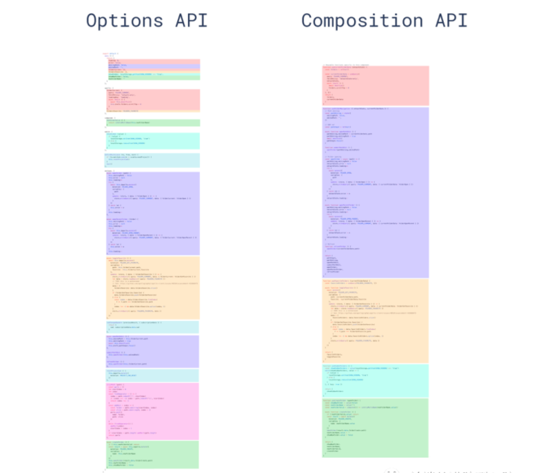

# Vue3新特性

**主要内容**

* Vue3介绍
* setup函数
* Vue组件数据
* 计算属性和监听器
* Vue组件之间通信

**学习目标**

 知识点| 要求 
 -| :- 
 Vue3介绍 | 掌握 
 setup函数 | 掌握 
 Vue组件数据 | 掌握 
 计算属性和监听器 | 掌握 
 Vue组件之间通信 | 掌握 


## 一、Vue3介绍

### 1.1 Vue3现状

- 2020年09月18日，正式发布vue3.0版本。但是由于刚发布周边生态不支持，大多数开发者处于观望。
- 现在主流组件库都已经发布了支持vue3.0的版本，其他生态也在不断地完善中，这是趋势。
  - element-plus 基于 Vue 3.0 的桌面端组件库
  - vantvant3.0版本，有赞前端团队开源移动端组件库
  - [ant-design-vue (opens new window)](https://2x.antdv.com/components/overview/)Ant Design Vue 2.0版本，社区根据蚂蚁 ant design 开发

Vue3优点：

- 最火框架，它是国内最火的前端框架之一，[官方文档 (opens new window)](https://v3.vuejs.org/)[中文文档(opens new window)](https://v3.cn.vuejs.org/)
- 性能提升，运行速度事vue2.x的1.5倍左右
- 体积更小，按需编译体积比vue2.x要更小
- ==类型推断，更好的支持Ts（typescript）==这个也是趋势 
- 高级给予，暴露了更底层的API和提供更先进的内置组件 vue.js  reactive  runtime
- ==**★组合API (composition api)**== ，能够更好的组织逻辑，封装逻辑，复用逻辑

Vue3展望：

- 这是趋势，越来越多的企业将来肯定会升级到Vue3.0
- ==大型项目==，由于对Ts的友好越来越多大型项目可以用Vue3.0

**总结：** 为什么要学 vue3 ?

- 适应市场学习流行的技术提高提升自己竞争力，给自己加薪。


### 1.2 vite基本使用

vite是什么：[官方文档(opens new window)](https://cn.vitejs.dev/)

- 它是一个更加轻量（热更新速度快，打包构建速度快）的vue项目脚手架工具。
- 相对于vue-cli它默认安装的插件非常少，随着开发过程依赖增多，需要自己额外配置。
- **所以：** 在单纯学习vue3语法会使用它，后面做项目的时候我们还是使用vue-cli
- 什么是vite？—— 新一代前端构建工具。
- 优势如下：
  - 开发环境中，无需打包操作，可快速的冷启动。
  - 轻量快速的热重载（HMR）。
  - 真正的按需编译，不再等待整个应用编译完成。

vite基本使用：

- 创建项目 `npm init vite-app 项目名称` 或者 `yarn create vite-app 项目名称`

- 安装依赖 `npm i` 或者 `yarn`

- 启动项目 `npm run dev` 或者 `yarn dev`

  ```bash
  ## 安装
  npm init vite@latest
  
  ## 创建工程
  npm init vite-app <project-name>
  ## 进入工程目录
  cd <project-name>
  ## 安装依赖
  npm install
  ## 运行
  npm run dev
  ```
  
  

**总结：** vite是什么？

- 使用vite创建项目学习vue3语法，使用vue-cli创建项目正式开发
- 传统构建 与 vite构建对比图


vue-cli:


Vite:


### 1.3 创建vue项目

1. 安装最新版本的Vue-cli工具，最新版本工具已经提供Vue3-preview

```js
npm install -g @vue/cli
# OR
yarn global add @vue/cli
```

2. 创建项目选择


​	

**根实例初始化**

在2.x中，通过`new Vue()`的方法来初始化


```js
import Vue from 'vue'

new Vue({
  router,
  store,
  render: h => h(App)
}).$mount('#app')
```

在3.x中Vue不再是一个构造函数，通过createApp方法初始化

```js
createApp(App).use(store).use(router).mount('#app')
```

install  


### 1.4 组合式 API

api：方法   文档

#### 选项API和组合API




- 代码风格：一个功能逻辑的代码组织在一起（包含数据，函数...）
- 优点：功能逻辑复杂繁多情况下，各个功能逻辑代码组织再一起，便于阅读和维护
- 缺点：需要有良好的代码组织能力和拆分逻辑能力，PS：大家没问题。
- 补充：为了能让大家较好的过渡到vue3.0的版本来，`也支持vue2.x选项API写法`

**更好的逻辑复用与代码组织**

我们都因 Vue 简单易学而爱不释手，它让构建中小型应用程序变得轻而易举。但是随着 Vue 的影响力日益扩大，许多用户也开始使用 Vue 构建更大型的项目。这些项目通常是由多个开发人员组成团队，在很长一段时间内不断迭代和维护的。多年来，我们目睹了其中一些项目遇到了 Vue 当前 API 所带来的编程模型的限制。这些问题可归纳为两类:

1. 随着功能的增长，复杂组件的代码变得越来越难以阅读和理解。这种情况在开发人员阅读他人编写的代码时尤为常见。根本原因是 Vue 现有的 API 迫使我们通过选项组织代码，但是有的时候通过逻辑关系组织代码更有意义。
2. 目前缺少一种简洁且低成本的机制来提取和重用多个组件之间的逻辑。 RFC 中提出的 API 为组件代码的组织提供了更大的灵活性。现在我们不需要总是通过选项来组织代码，而是可以将代码组织为==处理特定功能的函数==。这些 API 还使得在组件之间甚至组件之外逻辑的提取和重用变得更加简单。我们会在设计细节这一节展示达成的效果。

**更好的类型推导**

另一个来自大型项目开发者的常见需求是更好的 TypeScript 支持。Vue 当前的 API 在集成 TypeScript 时遇到了不小的麻烦，其主要原因是 Vue 依靠一个简单的 this 上下文来暴露 property，我们现在使用 this 的方式是比较微妙的。（比如 methods 选项下的函数的 this 是指向组件实例的，而不是这个 methods 对象）。 换句话说，Vue 现有的 API 在设计之初没有照顾到类型推导，这使适配 TypeScript 变得复杂。

当前，大部分使用 TypeScript 的 Vue 开发者都在通过 vue-class-component 这个库将组件撰写为 TypeScript class (借助 decorator)。我们在设计 3.0 时曾有一个已废弃的 RFC，希望提供一个内建的 Class API 来更好的解决类型问题。然而当讨论并迭代其具体设计时，我们注意到，想通过 Class API 来解决类型问题，就必须依赖 decorator——一个在实现细节上存在许多未知数的非常不稳定的 stage 2 提案。基于它是有极大风险的。(关于 Class API 的类型相关问题请移步这里)

相比较过后，本 RFC 中提出的方案更多地利用了天然对类型友好的普通变量与函数。用该提案中的 API 撰写的代码会完美享用类型推导，并且也不用做太多额外的类型标注。

这也同样意味着你写出的 JavaScript 代码几乎就是 TypeScript 的代码。即使是非 TypeScript 开发者也会因此得到更好的 IDE 类型支持而获益


## 二、setup函数

### 2.1 setup函数介绍

- `setup` 是一个新的组件选项，作为组件中使用==组合API的起点==。
- 从组件生命周期来看，它的执行在组件实例创建之前`vue2.x的beforeCreate`执行。
- 这就意味着在`setup`函数中 `this` 还不是组件实例，==`this` 此时是 `undefined`==
- 在模版中需要使用的数据和函数，需要在 `setup` 返回。

```vue
<template>
  <div class="container">
    <h1 @click="say()">{{msg}}</h1>
  </div>
</template>
<script>
export default {
  setup () {
    console.log('setup执行了')
    console.log(this)
    // 定义数据和函数
    const msg = 'hi vue3'
    const say = () => {
      console.log(msg)
    }

    return { msg , say}
  },
  beforeCreate() {
    console.log('beforeCreate执行了')
    console.log(this)
  }
}
</script>
```

**总结：** `setup` 组件初始化之前执行，它返回的数据和函数可在模版使用。

### 2.2 组合API-生命周期

回顾vue2.x生命周期钩子函数： 11  个   keep-alive  

- beforeCreate
- created
- beforeMount
- mounted
- beforeUpdate
- updated
- beforeDestroy
- destroyed

认识vue3.0生命周期钩子函数(7)

- `setup` 创建实例前
- `onBeforeMount` 挂载DOM前
- `onMounted` 挂载DOM后
- `onBeforeUpdate` 更新组件前
- `onUpdated` 更新组件后
- `onBeforeUnmount` 卸载销毁前
- `onUnmounted` 卸载销毁后

代码演示

```vue
<template>
  <div class="container">
    container
  </div>
</template>
<script>
import { onBeforeMount, onMounted } from 'vue'
export default {
  setup () {
    onBeforeMount(()=>{
      console.log('DOM渲染前',document.querySelector('.container'))
    })
    onMounted(()=>{
      console.log('DOM渲染后1',document.querySelector('.container'))
    })
    onMounted(()=>{
      console.log('DOM渲染后2',document.querySelector('.container'))
    })
  },
}
</script>
```

​	


#### 注意：

组合API的生命周期钩子有7个，可以多次使用同一个钩子，执行顺序和书写顺序相同。

生命周期可以写多遍，可以把两个功能写在两个不同的生命周期里。去实现不同的逻辑

特点：

1. 生命周期需要写在setup里
2. 生命周期函数需要从vue按需引入
3. 生命周期函数在回调里写逻辑
4. 可以多次使用同一个生命周期函数，执行顺序和书写顺序相同


## 三、Vue组件数据

### 3.1 介绍

**ref或者reactive替代data中的变量**

在2.x中：通过组件data的方法来定义一些当前组件的数据

```js
data() {
  return {
    name: 'iwen',
    list: [],
  }
}
```

在3.x中：通过ref或者reactive创建响应式对象

```js
import { ref,reactive } from "vue"
export default {
  name: 'HelloWorld',
  setup(){
      const name = ref("iwen")
      const state = reactive({
          list:[]
      })

    return{
        name,
        list
    }
  }
}
```


### 3.2 组合API-ref函数

定义响应式数据：

- ref函数，==常用于简单数据类型定义为响应式数据==
  - 再修改值，获取值的时候，需要==.value==
  - 在模板中使用ref申明的响应式数据，可以省略.value

代码演示

```vue
<template>
  <div class="container">
    <div>{{name}}</div>
    <div>{{age}}</div>
    <button @click="updateName">修改数据</button>
  </div>
</template>
<script>
import { ref } from 'vue'
export default {
  name: 'App',
  setup () {
    // 1. name数据
    const name = ref('ls')
    console.log(name)
    const updateName = () => {
      name.value = 'zs'
    }
    // 2. age数据
    const age = ref(10)

    // ref常用定义简单数据类型的响应式数据
    // 其实也可以定义复杂数据类型的响应式数据
    // 对于数据未之的情况下 ref 是最适用的
    // const data = ref(null)
    // setTimeout(()=>{
    //   data.value = res.data
    // },1000)

    return {name, age, updateName}
  }
}
</script>
```


模板在解析的时候，会判断是不是ref形式创建的数据，直接取出value。所以在模板中使用的时候，省略 .value


**使用场景：**

- **其他情况使用ref**
- **当你明确知道需要的是一个响应式数据 ==对象== 那么就使用 reactive 即可**


### 3.3 组合API-reactive函数

定义响应式数据：

- reactive是一个函数，它可以定义一个复杂数据类型，成为响应式数据。{} []
- 通常是用来定义响应式**对象数据**

演示代码：

```vue
<template>
    <div>
        <p>{{obj.name}}</p>
        <p><button @click="updateName">修改名字</button></p>
    </div>
</template>

<script>
import { reactive } from 'vue'
export default {
    setup () {
        // 普通数据
        // const obj={
        //     name:'zs',
        //     age:18
        // }

        const obj=reactive({
            name:'zs，我是响应式的',
            age:18
        })

        const updateName=()=>{
            console.log('updateName....');
            obj.name='lisi'
        }

        return {obj,updateName}
    }
}
</script>
```


### 3.4 toRef函数

toRef是函数，转换**响应式对象**中**某个**属性为单独响应式数据，并且==**跟原来是数据的值是关联的**==。

如上例中，只想访问响应式对象obj中name属性，而不需要name.

通过对象解构出来的数据，不是响应式的。需要使用toRef

```vue
<template>
  <div>
    <p>{{ name }}</p>
    <p><button @click="updateName">修改</button></p>
  </div>
</template>

<script>
import { reactive, toRef } from "@vue/reactivity";
export default {
  setup() {
    // 定义响应式数据
    const obj = reactive({
      name: "zs",
      age: 18,
    });
    // 模块中只使用name,
    // 注意：从响应式数据中解构出来的数据不再是响应式的！！！
    // let {name}=obj;
    let name = toRef(obj, "name");

    const updateName = () => {
      console.log("updateName、、、、");
      // toRef转换响应式数据包装成对象，value存放值的位置
      name.value = "我是修改之后的lisi 啊";
    };

    return { name, updateName };
  },
};
</script>
```


使用场景：有一个响应式对象数据，但是模版中只需要使用其中一项数据。


### 3.5 toRefs是函数

- toRefs是函数，转换**响应式对象**中==所有属性==为单独响应式数据，对象成为普通对象，并且==**值是关联的**==

  ```vue
  <template>
    <div>
      <p>{{ name }}</p>
      <p>{{ age }}</p>
      <p><button @click="updateName">修改</button></p>
    </div>
  </template>
  
  <script>
  import { reactive, toRef, toRefs } from "@vue/reactivity";
  export default {
    setup() {
      // 定义响应式数据
      const obj = reactive({
        name: "zs",
        age: 18,
      });
      const obj2={...obj};
      console.log(obj2);
      const obj3=toRefs(obj)
      console.log(obj3);
    
      const updateName = () => {
        console.log("updateName、、、、");
        obj3.name.value='改了哦、、、'
        // 也可以改原来的数据，因为【值是关联的】
        // obj.name='也可以改原来的数据'
      };
  
      return { ...obj3, updateName };
    },
  };
  </script>
  ```

  


使用场景：剥离响应式对象（解构|展开），想使用响应式对象中的多个或者所有属性做为响应式数据。


可以理解的是，用户会纠结用 ref 还是 reactive。而首先你要知道的是，这两者你都必须要了解，才能够高效地使用组合式 API。只用其中一个很可能会使你的工作无谓地复杂化，或反复地造轮子。 使用 ref 和 reactive 的区别，可以通过如何撰写标准的 JavaScript 逻辑来比较

```js
// 风格 1: 将变量分离
let x = 0
let y = 0

function updatePosition(e) {
  x = e.pageX
  y = e.pageY
}

// --- 与下面的相比较 ---

// 风格 2: 单个对象
const pos = {
  x: 0,
  y: 0,
}

function updatePosition(e) {
  pos.x = e.pageX
  pos.y = e.pageY
}
```

- 如果使用 ref，我们实际上就是将风格 (1) 转换为使用 ref (为了让基础类型值具有响应性) 的更细致的写法。
- 使用 reactive 和风格 (2) 一致。我们只需要通过 reactive 创建这个对象。

总结一下，一共有两种变量风格：

1. 就像你在普通 JavaScript 中区别声明基础类型变量与对象变量时一样区别使用 ref 和 reactive。我们推荐你在此风格下结合 IDE 使用类型系统。
2. 所有的地方都用 reactive，然后记得在组合函数返回响应式对象时使用 toRefs。这降低了一些关于 ref 的心智负担，但并不意味着你不需要熟悉这个概念。

在这个阶段，我们认为现在就强制决定 ref vs. reactive 的最佳实践还为时过早。我们建议你对以上两种方式都进行尝试，选择与你的心智模型更加配合的风格。我们将持续收集周边生态中的用户反馈，并最终在这个问题上提供更明确、更统一的实践指导建议


### 3.6 知识运用案例

基本步骤：

- 记录鼠标坐标 
  - 定义一个响应式数据对象，包含x和y属性。 ===>响应式数据对象 { x:  y:}
  - 在组件渲染完毕后，监听document的鼠标移动事件  ==>事件绑定，DOM, onMounted  解绑：onUnmounted
  - 指定move函数为事件对应方法，在函数中修改坐标==>修改响应式对象的数据
  - 在setup返回数据，模版中使用
- 累加1功能
  - 定义一个简单数据类型的响应式数据 
  - 定义一个修改数字的方法
  - 在setup返回数据和函数，模板中使用

落的代码：

```vue
<template>
  <div class="container">
    <div>坐标</div>
    <div>x: {{x}}</div>
    <div>y: {{y}}</div>
    <hr>
    <div>{{count}} <button @click="add">累加1</button></div>
  </div>
</template>
<script>
import { onMounted, onUnmounted, reactive , ref, toRefs} from 'vue'
const useMouse = () => {
    // 1. 记录鼠标坐标
    // 1.1 声明一个响应式数据，他是一个对象，包含x y
    const mouse = reactive({
      x: 0,
      y: 0
    })
    // 1.3 修改响应式数据
    const move = (e) => {
      mouse.x = e.pageX
      mouse.y = e.pageY
    }
    // 1.2 等dom渲染完毕。去监听事件
    onMounted(()=>{
      document.addEventListener('mousemove', move)
    })
    // 1.4 组件销毁，删除事件
    onUnmounted(()=>{
      document.removeEventListener('mousemove', move)
    })

    return mouse
}
export default {
  name: 'App',
  setup () {
	const mouse = useMouse()
    
    // 2. 数字累加
    const count = ref(0) 
    const add = () => {
      count.value ++   //一定记得.value
    }
    //单纯 ...mouse 解构是不可以的，需要 toRefs,再解构
    return { ...toRefs(mouse), count, add }
  }
}
</script>
<style scoped lang="less"></style>
```


#### 封装：

```js
const useMouse = () => {
  // 声明响应式数据
  const mouse = reactive({
    x: 0,
    y: 0,
  });
  // 修改响应式数据
  const move = (e) => {
    // console.log(e.pageX);
    // console.log(e.pageY);
    mouse.x = e.pageX;
    mouse.y = e.pageY;
  };
  // 等dom渲染完毕。去监听事件
  onMounted(() => {
    document.addEventListener("mousemove", move);
  });
  // 组件卸载，删除事件
  onUnmounted(() => {
    document.removeEventListener("mousemove", move);
  });
  // 一定要return 出去！！！！
  return mouse;
};

export default {
  setup() {
    const mouse = useMouse();

    // 定义响应式数据
    let count = ref(0);
    const add = () => {
      count.value++; //一定记得.value
    };

    // return { mouse };
    //单纯 ...mouse 解构是不可以的，需要 toRefs,再解构
    return { ...toRefs(mouse), count, add };
  },
};
```


## 补充：ref属性：

Vue2 :

ref 属性： 1）获取DOM元素  2）获取子组件实例

Vue3： 


## 四、计算属性和监听器

### 4.1 计算属性

在2.x中  ：由计算得来的属性

```js
computed: {
    storeData () {
      return this.$store.state.storeData
    },
}
```

在3.x中

```js
import {computed} from 'vue'
setup(){
  const storeData = computed(() => store.state.storeData)

  return {
      storeData
  }
}
```


#### 计算属性双向绑定：

```js
let newMoney=computed({
        get(){
            return money.value * 6;
        },
        set(val){
            money.value=val/6
        }
    })
```


总结：

计算属性的两种写法：

1. 给计算属性传函数，返回值就是计算属性的值
2. 给计算属性传对象，ge() 返回值就是计算属性的值；set(val) 是给计算属性设置的值


### 4.2 watch监听器

在2.x版本的时候代码如下

```js
export default {
  data() {
    return {
      counter: 0
    }
  },
  watch: {
    counter(newValue, oldValue) {
      console.log('The new counter value is: ' + this.counter)
    }
  }
}
```

在3.x版本的时候代码如下

```js
import { ref, watch } from 'vue'

const counter = ref(0)
watch(counter, (newValue, oldValue) => {
  console.log('The new counter value is: ' + counter.value)
})
```

**watch函数**

watch函数，是用来定义侦听器的

监听ref定义的响应式数据

监听多个响应式数据数据

监听reactive定义的响应式数据

监听reactive定义的响应式数据，某一个属性

深度监听

默认执行

```vue
<template>
  <div class="container">
    <div>
      <p>count的值：{{count}}</p>
      <button @click="add">改数据</button>
    </div>
    <hr>
    <div>
      <p>{{obj.name}}</p>
      <p>{{obj.age}}</p>
      <p>{{obj.brand.name}}</p>
      <button @click="updateName">改名字</button>
      <button @click="updateBrandName">改品牌名字</button>
    </div>
  </div>
</template>
<script>
import { reactive, ref, watch } from 'vue'
export default {
  name: 'App',
  setup () {
    const count = ref(0)
    const add = () => {
      count.value++
    }
    // 当你需要监听数据的变化就可以使用watch
    // 1. 监听一个ref数据
    // watch(count, (newVal,oldVal)=>{
    //   console.log(newVal,oldVal)
    // })

    const obj = reactive({
      name: 'ls',
      age: 10,
      brand: {
        id: 1,
        name: '宝马'
      }
    })
    const updateName = () => {
      obj.name = 'zs'
    }
    const updateBrandName = () => {
      obj.brand.name = '奔驰'
    }
    // 2. 监听一个reactive数据
    watch(obj, ()=>{
      console.log('数据改变了')
    })

    watch(()=>obj.brand, ()=>{
      console.log('brand数据改变了')
    },{
      deep: true,
      immediate: true
    })

    return {count, add, obj, updateName, updateBrandName}
  }
}
</script>
```


## 五、Vue组件之间通信

### 5.1 组合API-父子通讯

父传子：

```vue
<template>
  <div class="container">
    <h1>父组件</h1>
    <p>{{money}}</p>
    <hr>
    <Son :money="money" />
  </div>
</template>
<script>
import { ref } from 'vue'
import Son from './Son.vue'
export default {
  name: 'App',
  components: {
    Son
  },
  // 父组件的数据传递给子组件
  setup () {
    const money = ref(100)
    return { money }
  }
}
</script>
```

```vue
<template>
  <div class="container">
    <h1>子组件</h1>
    <p>{{money}}</p>
  </div>
</template>
<script>
import { onMounted } from 'vue'
export default {
  name: 'Son',
  // 子组件接收父组件数据使用props即可
  props: {
    money: {
      type: Number,
      default: 0
    }
  },
  setup (props) {
    // 获取父组件数据money
    console.log(props.money)
  }
}
</script>
```


#### 子传父

##### ==子组件：setup (props, {emit})== 

context可以提供emit方法，通知父组件

```diff
<template>
  <div class="container">
    <h1>子组件</h1>
    <p>{{money}}</p>
+    <button @click="changeMoney">花50元</button>
  </div>
</template>
<script>
import { onMounted } from 'vue'
export default {
  name: 'Son',
  // 子组件接收父组件数据使用props即可
  props: {
    money: {
      type: Number,
      default: 0
    }
  },
  // props 父组件数据
  // emit 触发自定义事件的函数
+  setup (props, {emit}) {
    // 获取父组件数据money
    console.log(props.money)
    // 向父组件传值
+    const changeMoney = () => {
+      emit('change-money', 50)
+    }
+    return {changeMoney}
  }
}
</script>
```


##### 父组件监听：

```vue
<template>
  <div class="container">
    <h1>父组件</h1>
    <p>{{money}}</p>
    <hr>
+    <Son :money="money" @change-money="updateMoney" />
  </div>
</template>
<script>
import { ref } from 'vue'
import Son from './Son.vue'
export default {
  name: 'App',
  components: {
    Son
  },
  // 父组件的数据传递给子组件
  setup () {
    const money = ref(100)
+    const updateMoney = (newMoney) => {
+      money.value = newMoney
+    }
+    return { money , updateMoney}
  }
}
</script>

```


### setup的参数

- setup(props, context) / setup(props, {attrs, slots, emit})

- props: 包含props配置声明且传入了的所有属性的对象

  得到父级组件向子级组件传递过来的数据

- attrs: 包含没有在props配置中声明的属性的对象, 相当于 this.$attrs 

  得到父级组件向子级组件传递过来的数据==并且没有通过props接受过的数据==

- slots: 包含所有传入的插槽内容的对象, 相当于 this.$slots

- emit: 用来分发父级组件向子级组件传递的自定义事件的函数, 相当于 this.$emit


#### 父组件：

```vue
<template>
  <h2>App</h2>
  <p>msg: {{msg}}</p>
  <button @click="fn('--')">更新</button>

  <child :msg="msg" msg2="cba" @fn="fn"/>
</template>

<script>
import {
  reactive,
  ref,
} from 'vue'
import child from './child.vue'

export default {
  components: {
    child
  },

  setup () {
    const msg = ref('abc')
    function fn (content) {
      msg.value += content
    }
    return {
      msg, fn
    }
  }
}
</script>
```


#### 子组件：

```vue
<template>
  <div>
    <h3>{{n}}</h3>
    <h3>{{m}}</h3>

    <h3>msg: {{msg}}</h3>
    <h3>msg2: {{$attrs.msg2}}</h3>

    <slot name="xxx"></slot>

    <button @click="update">更新</button>
  </div>
</template>

<script lang="ts">

import {
  ref,
  defineComponent
} from 'vue'

export default defineComponent({
  name: 'child',
  props: ['msg'],
  emits: ['fn'], // 可选的, 声明了更利于程序员阅读, 且可以对分发的事件数据进行校验

  data () {
    console.log('data', this)
    return {
      // n: 1
    }
  },

  beforeCreate () {
    console.log('beforeCreate', this)
  },

  methods: {
    // update () {
    //   this.n++
    //   this.m++
    // }
  },

  // setup (props, context) {
  setup (props, {attrs, emit, slots}) {
	// 组件未创建，this 没法使用，所以给传递 props
    console.log('setup', this)
    console.log(props.msg, attrs.msg2, slots, emit)

    const m = ref(2)
    const n = ref(3)

    function update () {
      // console.log('--', this)
      // this.n += 2 
      // this.m += 2

      m.value += 2
      n.value += 2

      // 分发自定义事件
      emit('fn', '++')
    }

    return {
      m,
      n,
      update,
    }
  },
})
</script>
```


### 5.2 Provide / Inject

适用场景：深层传递

这里要值得一说的是Provide / Inject的应用，他们在3.x中得到了增强

- provide() 和 inject() 可以实现嵌套组件之间的数据传递。
- 这两个函数只能在 setup() 函数中使用。
- 父级组件中使用 provide() 函数向下传递数据。
- 子级组件中使用 inject() 获取上层传递过来的数据。
- 不限层级 父组件：

```vue
<template>
  <div>
    <provideAndInject />
  </div>
</template>
 
<script>
import { provide } from "@vue/composition-api";  // 父组件引入 provide
import provideAndInject from "./components/provideAndInject";  // 引入子组件
 
export default {
  name: "app",
  components: {
    provideAndInject
  },
  setup() {
    // provide('数据名称', 要传递的数据)
    provide("customVal", "我是父组件向子组件传递的值"); 
  }
};
</script>
```

子组件

```vue
<template>
  <div>
    <h3>{{ customVal }}</h3>
  </div>
</template>
 
<script>
// 子组件导入 inject
import { inject } from "@vue/composition-api";
 
export default {
  setup() {
    //调用 inject 函数，通过指定的数据名称，获取到父级共享的数据
    const customVal = inject("customVal");
 
    return {
      customVal
    };
  }
};
</script>
```


##### 向后代提供数据，还可以提供方法

```vue
<template>
  <div class="container">
    <h1>父组件 {{money}} <button @click="money=1000">发钱</button></h1>
    <hr>
    <Son />
  </div>
</template>
<script>
import { provide, ref } from 'vue'
import Son from './Son.vue'
export default {
  name: 'App',
  components: {
    Son
  },
  setup () {
    const money = ref(100)
    // 谁定义，谁修改原则
    const changeMoney = (saleMoney) => {
      console.log('changeMoney',saleMoney)
      money.value = money.value - saleMoney
    }
    
    // 将数据提供给后代组件 provide
    provide('money', money)
      
    // 将函数提供给后代组件 provide
    provide('changeMoney', changeMoney)

    return { money }
  }
}
</script>
<style scoped lang="less"></style>

```


子组件：

```vue
<template>
  <div class="container">
    <h2>子组件 {{money}}</h2>
    <hr>
    <GrandSon />
  </div>
</template>
<script>
import { inject } from 'vue'
import GrandSon from './GrandSon.vue'
export default {
  name: 'Son',
  components: {
    GrandSon
  },
  setup () {
    // 接收祖先组件提供的数据
    const money = inject('money')
    return { money }
  }
}
</script>
<style scoped lang="less"></style>

```

孙组件

```vue
<template>
  <div class="container">
    <h2>子组件 {{money}}</h2>
    <hr>
    <GrandSon />
  </div>
</template>
<script>
import { inject } from 'vue'
import GrandSon from './GrandSon.vue'
export default {
  name: 'Son',
  components: {
    GrandSon
  },
  setup () {
    // 接收祖先组件提供的数据
    const money = inject('money')
    return { money }
  }
}
</script>
<style scoped lang="less"></style>

```


#### 总结：

\- provide函数提供数据和函数给后代组件使用
\- inject函数给当前组件注入provide提供的数据和函数
\- 数据通信：遵循单向数据流的原则，谁定义，谁修改


### 5.3 Vuex引用

在2.x版本对store对象的引用是通过this对象

```js
import Vue from 'vue'
import Vuex from 'vuex'

Vue.use(Vuex)

const store = new Vuex.Store({
  state: {
    count: 0
  },
  mutations: {
    increment (state) {
      state.count++
    }
  }
})
```

在3.x版本对store引用变为createStore方法

```js
import { createApp } from 'vue'
import { createStore } from 'vuex'

// Create a new store instance.
const store = createStore({
  state () {
    return {
      count: 0
    }
  },
  mutations: {
    increment (state) {
      state.count++
    }
  }
})

const app = createApp({ /* your root component */ })

// Install the store instance as a plugin
app.use(store)
```

在组件中引用store对象

```js
import { useStore } from "vuex"

setup(){
    const store = useStore();
    const storeData = computed(() =>store.state.counter)

    return{
        storeData
    }
}
```

值得注意的是，我们在使用vuex大多会引用扩展运算符，如果使用扩展运算符根据目前官网vuex文档[4.x版本 (opens new window)](https://next.vuex.vuejs.org/guide/mutations.html#committing-mutations-in-components)，仍然需要在methods中进行处理

**代码组织能力**

在2.x版本中，data和methods代码过多的时候，会不容易维护，过多的属性和过多的方法无论是阅读还是维护都给开发者造成了很大的困扰。 在3.x版本中，我们可以更好组织代码，例子如下：

我们分离一个数据处理文件`helloworld.js`

```js
import { ref,reactive } from "vue"
export function article(){  
    const currentArt = ref("测试数据");
    const artLists = reactive({
        name:"标题",
        content:"内容"
    })

    function changeArt(){
        currentArt.value = "新测试数据"
    }

    return{
        currentArt,
        artLists,
        changeArt
    }
}
```

我们可以在分离一个网络请求文件处理`NetWork.js`

```js
import { ref,reactive } from "vue"
import axios from "axios"
export function getBanner(){
    const netState = reactive({
        banner:{}
    })

    function http(url){
        axios.get(url).then(res =>{
            netState.banner = res.data
        })
    }

    return {
        netState,
        http
    }
}
```

我们可以在主业务文件中如下引入:

```js
import { article } from "./HelloWorld";
import { getBanner } from "./NetWork";

export default {
  setup(props, ctx) {

    const { netState, http } = getBanner();

    onMounted(() => {
      http("http://iwenwiki.com/api/blueberrypai/getIndexBanner.php")
    });

    const { currentArt, artLists, changeArt } = article();

    return {
      currentArt,
      artLists,
      changeArt,
      netState
    };
  },
};
```

**状态管理**

Vuex是一个很棒的状态管理库，它简单易懂，且与Vue集成良好。为什么不直接使用Vuex？因为即将发布的Vue3公开了底层的响应式系统，并引入了构建应用程序的新方法。新的响应式系统功能强大，可用于共享状态管理。

**你需要一个共享状态吗**

在某些情况下，多个组件之间数据共享困难，以至于需要集中的状态管理。情况包括：

- 多个组件使用相同数据
- 多个根模块需要单独接入数据
- 深层嵌套的组件需要与其它组件进行数据通讯

如果上述情况都不存在，那么很容易做决定：你不需要它。 如果存在上述情况呢？最直接的答案就是使用Vuex，这是一个经过实战检验的解决方案，而且效果不错。 如果不想添加另一个依赖项或者不想做过多的配置？那么现在就可以与Composition API一起，用新的Vue3内置的方法解决这些问题。

**新的解决方案**

共享状态必须符合两个标准：

- 响应式：当状态改变时，使用它们的组件也相应更新
- 可用性：可以在任何组件中访问

**响应式**

Vue3对外暴露了其响应式系统的众多函数，你可以使用`reactive`函数创建一个`reactive`变量（也可以使用`ref`函数）

```js
import { reactive } from 'vue';

export const state = reactive({ counter: 0 });
```

从响应式函数返回的对象是一个`Proxy`对象，它可以监听其属性的更改。当在组件模板中使用时，每当响应值发生变化时，组件就会重新渲染：

```html
<template>
  <div>{{ state.counter }}</div>
  <button type="button" @click="state.counter++">Increment</button>
</template>

<script>
  import { reactive } from 'vue';
  export default {
    setup() {
      const state = reactive({ counter: 0 });
      return { state };
    }
  };
</script>
```

**可用性**

上面的示例非常适合单个组件，但多组件共享状态就不适用了。为了克服这个问题，你可以使用Vue3的`provide`与`inject`：

```js
import { reactive, provide, inject } from 'vue';

export const stateSymbol = Symbol('state');
export const createState = reactive({ counter: 0 });

export const setCounter = (num) =>{
    createState.counter = num
}

export const useState = () => inject(stateSymbol);
export const provideState = () => provide(
  stateSymbol, 
  createState
);
```

当你将`Symbol`作为键值传递给`provide`时，该值将通过`inject`方法使任何组件可用。键在提供和检索时使用相同的`Symbol`名称。

​	

如上图，如果你在最上层的组件上提供值，那么它将在所有组件中都可用，或者你也可以在应用的主文件上调用provide

```js
import { createApp } from 'vue';
import App from './App.vue';
import { stateSymbol, createState } from './store';

createApp(App).provide(stateSymbol, createState).mount('#app');
<template>
  <div class="about">
    <h1>This is an about page</h1>
    <p>{{ state.counter }}</p>
    <button @click="changeCounter">修改</button>
  </div>
</template>
<script>

import { useState,setCounter } from "../store"
export default{
  setup(){

    function changeCounter(){
      setCounter(100)
    }

    return{
      state:useState(),
      changeCounter
    }
  }
}

</script>
```

通过使用Vue3的响应式系统和依赖注入机制，我们已经从局部状态管理变为全局状态管理，本方案可以在小型应用中取代Vuex。 但是如果大型项目或者有使用Vuex的特性的情况下，这种方案就不合适了，例如：你不知道谁做的状态更改，因为状态可以直接更改，不受任何限制。 所以基于此，大型项目仍然需要使用Vuex。


### 5.5 无法使用EventBus

this.$emit()   v-on  

this.$on

任何组件：

1. $emit()、.$on    =》 {}
2. 任何组件都能   this   vm ===》   Vue.prototype   

在2.x中通过EventBus的方法来实现组件通信

```js
var EventBus = new Vue()
Vue.prototype.$EventBus = EventBus
...
this.$EventBus.$on()  this.$EventBus.$emit()


new Vue({
    cretead(){
        Vue.prototype.$EventBus =this;
    }
})
```

在3.x中移除了$on, $off等方法（参考rfc），而是推荐使用mitt方案来代替

```js
import mitt from 'mitt'
const emitter = mitt()
// listen to an event
emitter.on('foo', e => console.log('foo', e) )
// fire an event
emitter.emit('foo', { a: 'b' })
```


安装：

```bash
npm i mitt -S
```


### 使用mitt库

1. 可以在单独的文件暴露出事件总线对象

   utils/eventbus.js:

   ```js
   // mitt库默认导出的是一个函数，我们需要执行它从而得到事件总线的对象
   /* eventbus.js */
   // 这里我们在js中暴露这个事件总线对象
   import mitt from "mitt";
   const emitter = mitt();
   export default emitter;
   ```

   

2. 在指定组件中导入并使用它！

   ```js
   // 导入事件总线
   import emitter from "../../util/eventbus";
   
   const toSon2 = () => {
       // 触发自定义总线why，并传入一个对象
       emitter.emit("toSon2", { name: "张三", age: 19 }
   };
   return { toSon2 };
   ```

   

3. Son2.vue

   ```js
   // 导入事件总线
   import emitter from "../../util/eventbus";
   
   
   // 在创建vue实例时，注册why事件总线
   created(){
       emitter.on("why",msg=>{
           console.log("HomeContent接收到得About发送得数据了：",msg);
       }
   setup(props) {
       emitter.on("toSon2", (msg) => {
         console.log("HomeContent接收到得About发送得数据了：", msg);
       });
       // emitter.on的第一个参数如果是 * 代表监听所有的事件触发！
       // 这时，回调函数的参数就会有2个，1是事件的类型，2是实际实参
       emitter.on("*", (eventType, item) => {
         console.log(`* 监听到的事件类型是：${eventType},接收的参数为：`, item);
       });
     },
   ```

   


# ==回顾：==

### Vue3 新特性

1. 速度快、效率高、体积小

2. 引入Typescript，可以进行类型推断

3. 引入组合API，更好的逻辑复用、封装逻辑    Vue2：选项API

   ```js
   new Vue({
       router、
       vuex
   })
   ```

4. Vue3对Vue2完全支持 ，升级方便


### 区别：

1. 创建组件实例   =>Vue3 Hook

   ```js
   import {createApp} from 'vue'
   new Vue({
       router、
       vuex
   })
   
   createApp()
   ```

   

2. setup：组合API的起点，比Vue2 beforeCreate还要早，==没有this , undefined==  不能访问data、methods里方法的、 this.

   ```js
   setup(){
       let msg='123'
       
       return {msg,,,,,,}
   }
   ```

   

3. 生命周期：

   Vue2（11个）Vue组件从创建到销毁的过程。:   8个   beforeCreated、created（最早发送网络请求，this）、beforeMount、Mounted（挂载完成 ，DOM，绑定事件，开启定时器）、beforeUpdate(数据更新之后，界面更新更新之前)、updated、beforeDestory(销毁之前，收尾工作，清除定时器、解绑事件、注册表单：可以友好提醒)、Destoryed

   Vue3：

   setup   OnMounted   OnUnmounted

   生命周期都要写在setup 中

   ```js
   import {onMounted} from  'vue'
   data(){
       
   },
   methods:{
       
   },
   mounted(){
       
   }
   setup(){
       onMounted(()=>{
           // 逻辑
           //发网络请求
       })
       
       
       
       reutrn {}
   }
   ```

   

4. 定义响应式数据： 

   Vue2：data、props、computed、watch  都是响应式 

   ref  ：定义基本数据类型为响应式

   修改值，要用  .value

   ```js
   let num=ref(10)  
   // console.log(num)  
   changeNUm=()=>{
       num.value=11;
   }
   ```

   

   reactive:定义复杂数据类型为响应式  {}  []

   ```js
   const obj=reactive({})
   ```

   当不确定数据类型的时候：

   ```js
   
   const res= ref(null)
   
   ```

   

5. 数据转换   obj.name

   toRef：响应式对象数据变为某一个属性变为响应式

   ```js
     let name = toRef(obj, "name");
   
   
   ```

   toRefs：响应式数据对象变为全部属性变为响应式

   ```js
   const obj3= toRefs(obj)
   
   setup(){
       
       reutrn {...toRefs(obj)}
   }
   ```

   


