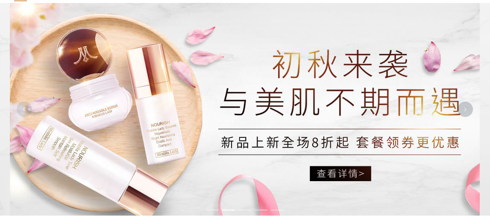

   、


# Vue3项目 网易严选_第二天

**主要内容**

* 首页轮播图
* 首页面板封装
* 首页主体内容

**学习目标**

 知识点| 要求 
 -| :- 
 首页轮播图   | 掌握 
 首页面板封装 | 掌握 
 首页主体内容 | 掌握 

## 一、首页轮播图

### 2.1 轮播图效果展示




#### 步骤：

1、先按照elementUI

2、再封装组件


#### elementUI

https://element-plus.gitee.io/zh-CN/guide/installation.html#%E7%8E%AF%E5%A2%83%E6%94%AF%E6%8C%81

安装：

```bash
npm install element-plus --save
```

main.js 引入：

```js
import ElementPlus from 'element-plus'
import 'element-plus/dist/index.css'

app.use(ElementPlus)
```


**大致步骤：**

\- 准备 AppBanner.vue 组件基础布局，全局注册
\- 准备home-banner组件，使用 AppBanner.vue 组件，再首页注册使用。
\- 深度作用AppBanner.vue 组件的默认样式


#### ==Vue 编写插件的方式：==

https://v3.cn.vuejs.org/guide/plugins.html#%E7%BC%96%E5%86%99%E6%8F%92%E4%BB%B6

```js
// plugins/i18n.js
export default {
  install: (app, options) => {
    // Plugin code goes here
  }
}
```


##### 注册全局组件：library/index.js:library

```js
import AppBanner from './AppBanner.vue'
import AppMore from './AppMore.vue'

export default {
    install(app) {
        // 全局注册组件
        app.component(AppBanner.name, AppBanner);
        app.component(AppMore.name, AppMore)
    }
}
```


#### main.js: 注册

```js
// 引入全局组件
import myElement from '@/components/library'

createApp(App).use(store).use(router).use(ElementPlus).use(myElement).mount('#app')
```


### 2.2 代码演示

```vue
<template>
  <div class="home-banner">
    <AppBanner :list='list'/>
  </div>
</template>
<script>
import AppBanner from '../../../components/app-banner.vue';
import {findBanner} from '../../../api/home';
import { ref } from '@vue/reactivity';

export default {
  name: 'HomeBanner',
  components:{
      AppBanner
  },
  setup(){
    const list = ref([])
    findBanner().then(res=>{
      console.log('轮播数据',res.data);
      list.value = res.data.result

    })

    return {list}
  }
}
</script>
<style scoped lang="less">
.home-banner {
  width: 1240px;
  height: 500px;
  position: absolute;
  left: 0;
  top: 0;
  z-index: 98
}
// /deep/ 深度穿透
::v-deep .el-carousel__arrow--left{
  left: 260px;
}
</style>
```

AppBanner组件

```vue
<template>
   <el-carousel height="500px">
      <el-carousel-item v-for="item in list" :key="item.id">
          
      </el-carousel-item>
    </el-carousel>
</template>

<script>
export default {
  name:'AppBanner',
  props:{
    list:{
      type:Array,
      default:[]
    }
  }
}
</script>

<style>

</style>
```

后台接口

```js
const banner = require('./data/banner.json')
/**
 * 轮播接口
 */
router.get('/home/banner', (req, res) => {
    res.send(banner)
})
```

json文件

```json
{
    "msg": "操作成功",
    "result": [{
        "id": "16",
        "imgUrl": "http://yjy-xiaotuxian-dev.oss-cn-beijing.aliyuncs.com/picture/2021-04-15/dfc11bb0-4af5-4e9b-9458-99f615cc685a.jpg",
        "hrefUrl": "/category/1005000",
        "type": "1"
    }, {
        "id": "18",
        "imgUrl": "http://yjy-xiaotuxian-dev.oss-cn-beijing.aliyuncs.com/picture/2021-04-15/1ba86bcc-ae71-42a3-bc3e-37b662f7f07e.jpg",
        "hrefUrl": "/category/1013001",
        "type": "1"
    }, {
        "id": "19",
        "imgUrl": "http://yjy-xiaotuxian-dev.oss-cn-beijing.aliyuncs.com/picture/2021-04-15/6d202d8e-bb47-4f92-9523-f32ab65754f4.jpg",
        "hrefUrl": "/category/1013001",
        "type": "1"
    }, {
        "id": "20",
        "imgUrl": "http://yjy-xiaotuxian-dev.oss-cn-beijing.aliyuncs.com/picture/2021-04-15/e83efb1b-309c-46f7-98a3-f1fefa694338.jpg",
        "hrefUrl": "/category/1005000",
        "type": "1"
    }, {
        "id": "17",
        "imgUrl": "http://yjy-xiaotuxian-dev.oss-cn-beijing.aliyuncs.com/picture/2021-04-15/4a79180a-1a5a-4042-8a77-4db0b9c800a8.jpg",
        "hrefUrl": "/category/1019000",
        "type": "1"
    }]
}
```


## 二、首页面板封装

### 3.1 面板封装

插槽：定义子组件，具体什么内容，由调用它的父组件决定

USB接口 给用户用，决定权 用户（使用者）

原则：

可变的地方，写成插槽

​	


大致思路：

- 头部
  - 标题和副标题由props传入
  - 右侧内容由插槽传入
    - 查看更多使用次数多封装成全局组件
- 主体
  - 全部由插槽传入

​	

### 3.2  代码演示

`xtx-more.vue` 定义

```vue
<template>
  <RouterLink :to="path" class="xtx-more">
    <span>查看全部</span>
    <i class="iconfont icon-angle-right"></i>
  </RouterLink>
</template>

<script>
export default {
  name: 'XtxMore',
  props: {
    path: {
      type: String,
      default: '/'
    }
  }
}
</script>

<style scoped lang='less'>
.xtx-more {
  margin-bottom: 2px;
  span {
    font-size: 16px;
    vertical-align: middle;
    margin-right: 4px;
    color: #999;
  }
  i {
    font-size: 14px;
    vertical-align: middle;
    position: relative;
    top: 2px;
    color: #ccc;
  }
  &:hover {
    span,i {
      color: @xtxColor;
    }
  }
}
</style>
```

注册组件

```js
import XtxMore from './xtx-more.vue'
export default {
    install (app) {
      app.component(XtxMore.name, XtxMore),
    }
}

```

定义首页需要的面板组件

```vue
<template>
  <div class="home-panel">
    <div class="container">
      <div class="head">
        <h3>{{ title }}<small>{{ subTitle }}</small></h3>
        <slot name="right" />
      </div>
      <slot />
    </div>
  </div>
</template>

<script>
export default {
  name: 'HomePanel',
  props: {
    title: {
      type: String,
      default: ''
    },
    subTitle: {
      type: String,
      default: ''
    }
  }
}
</script>

<style scoped lang='less'>
.home-panel {
  background-color: #fff;
  .head {
    padding: 40px 0;
    display: flex;
    align-items: flex-end;
    h3 {
      flex: 1;
      font-size: 32px;
      font-weight: normal;
      margin-left: 6px;
      height: 35px;
      line-height: 35px;
      small {
        font-size: 16px;
        color: #999;
        margin-left: 20px;
      }
    }
  }
}
</style>
```


## 三、首页主体内容

### 4.1 主体-新鲜好物

效果展示


接口：

```js
import request from '@/utils/request'

/**
 * 首页主体--新品首发
 * 接口：http://you.163.com/xhr/item/getNewItem.json
 */
export const findNew = () => {
  return request.post('/api/xhr/item/getNewItem.json')
}

```

代码演示

```vue
<template>
  <div class="home-new">
    <HomePanel title="新鲜好物" sub-title="新鲜出炉 品质靠谱">
      <template #right><XtxMore path="/" /></template>
      <!-- 面板内容 -->
      <ul class="goods-list">
        <li v-for="item in goods" :key="item.id">
          <RouterLink :to="`/product/${item.id}`">
            <!--  -->
            
            <p class="name ellipsis">{{item.name}}</p>
            <p class="price">&yen;{{item.retailPrice}} <del style="color:#999">{{item.counterPrice}}</del></p>
          </RouterLink>
        </li>
      </ul>
    </HomePanel>
  </div>
</template>
<script>
import { ref } from 'vue'
import HomePanel from './home-panel'
import { findNew } from '@/api/home'
export default {
  name: 'HomeNew',
  components: { HomePanel },
  setup () {
    const goods = ref([])
    findNew().then(res => {
        console.log('新品好物',res.data);
      goods.value = res.data.data.result.slice(0,4)
    })
    return { goods }
  }
}
</script>
<style scoped lang="less">
.goods-list {
  display: flex;
  justify-content: space-between;
  height: 406px;
  li {
    width: 306px;
    height: 406px;
    background: #f5f5f5;
    .hoverShadow();
    img {
      width: 306px;
      height: 306px;
    }
    p {
      font-size: 22px;
      padding: 12px 30px 0 30px;
      text-align: center;
    }
    .price {
      color: @priceColor;
    }
  }
}
</style>
```


### 4.2 主体-人气推荐

效果图

​	

代码演示

```vue
<template>
  <HomePanel title="人气推荐" sub-title="人气爆款 不容错过">
    <ul ref="pannel" class="goods-list">
      <li v-for="item in goods" :key="item.id">
        <RouterLink to="/">
          
          <p class="name">{{item.title}}</p>
          <p class="desc">{{item.alt}}</p>
        </RouterLink>
      </li>
    </ul>
  </HomePanel>
</template>

<script>
import { ref } from 'vue'
import HomePanel from './home-panel'
import { findHot } from '@/api/home'
export default {
  name: 'HomeNew',
  components: { HomePanel },
  setup () {
    const goods = ref([])
    findHot().then(res => {
      goods.value = res.data.result
    })
    return { goods }
  }
}
</script>

<style scoped lang='less'>
.goods-list {
  display: flex;
  justify-content: space-between;
  height: 426px;
  li {
    width: 306px;
    height: 406px;
    .hoverShadow();
    img {
      width: 306px;
      height: 306px;
    }
    p {
      font-size: 22px;
      padding-top: 12px;
      text-align: center;
    }
    .desc {
      color: #999;
      font-size: 18px;
    }
  }
}
</style>
```


后端：

```js
const hotData=require('../data/hot.json') //人气推荐

/**
 * 首页-人气推荐
 */
 router.get('/home/hot',(req,res)=>{
    res.send(hotData)
})
```


接口：

```js
findhot:'/foo/home/hot', //首页-人气推荐
```


