# 微信小程序基础-第一天

**主要内容**

* 微信小程序介绍
* 开发工具的下载、安装及使用
* 项目目录结构及配置文件
* tabbar的配置
* 各种组件的使用

**学习目标**

| 知识点                     | 要求 |
| -------------------------- | ---- |
| 微信小程序的介绍           | 了解 |
| 微信小程序的注册           | 掌握 |
| 开发工具的下载、安装及使用 | 掌握 |
| 小程序项目目录结构         | 掌握 |
| 项目配置文件的配置         | 掌握 |
| tabbar的配置               | 掌握 |
| 各种组件的使用             | 掌握 |

## 一、微信小程序介绍

### 1. 微信小程序介绍

​	微信小程序，简称小程序，是一种不需要下载安装即可使用的应用，它实现了应用”触手可及”的梦想，用户扫一扫或搜一下即可打开应用。

​	说明：

* 小程序是需要下载的，小程序的占用大小很小，感觉不到下载
* 目前大小限制2M （最终开发的小程序打包压缩后的大小），如果超过2M,就得做分包上传.之后再合并
* 进入小程序后继续网络请求数据

### 2. 小程序特点

微信小程序的特点：

* 免安装
* 接近原生（IOS，Android ）的app操作基于微信开发。使用wx提供的api开发
* 必须在微信里面使用

### 3. 小程序的优缺点

* ==方便快捷，即用即走==
* ==速度快、不占内存==
* 安全稳定、保密性强
* 功能丰富，场景丰富
* ==开发成本低、维护简便==
* ==开发周期比较短==
* 体验好

### 4.小程序开发需求

 - 不注册可以开发小程序(不能发布)  用测试号
 - 注册小程序
   - 企业注册(公司内部人员注册好了，给一个APPID)
   - 个人注册

### 5. 微信小程序的注册

微信公众平台：https://mp.weixin.qq.com/

 


 


 


注册成功，登陆邮箱去验证

 


然后打开最新的微信发送的邮件：

 


 


 


 


然后点击底下的提交按钮。

 


**到此就注册完成了。需要记录一个比较重要的信息：**

 


 


### 6. 开发工具

#### 6.1下载

* 开发工具下载地址：https://developers.weixin.qq.com/miniprogram/dev/devtools/download.html

    

  开发工具下载完后：
  
   
  
  

#### 6.2 开发工具安装

 


 


 


 


 


 


#### 6.3.开发者工具的使用


 

 


 


 


 

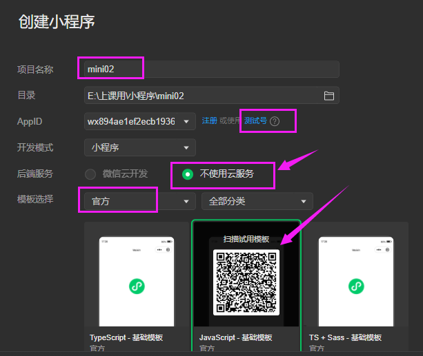

然后点击确定！

 T3G.png)


上面就是微信小程序开发工具的界面，主要有：微信小程序模拟器、项目目录、代码编写区域、控制台。


## 二、开发微信小程序

### 1. 项目目录结构介绍

#### 1.1 pages目录

​	pages目录下放的就是小程序中的各个页面。

​	在pages中创建页面的时候，会出现4个文件：

* xxx.js：页面相关的js代码可以写在这里
* xxx.wxml：这个就是页面文件，相当于我们之前的HTML，所以页面结构内容写在这里
* xxx.wxss：页面的样式内容，相当于之前的css，所以页面相关的样式可以写在这里
* xxx.json：页面有关的配置，比如页面导航栏的背景色、内容等等

比如：

​	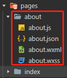

#### 1.2 app.js文件 

​	app.js文件是整个项目的一个==总体配置==。里面包含了项目运行==生命周期的回调函数==。

#### 1.3 app.json文件

​	app.json文件是==整个项目的配置文件==。里面配置了页面，窗口的设置等等。小程序根目录下的 `app.json` 文件用来对微信小程序进行全局配置，决定页面文件的路径、窗口表现、设置网络超时时间、设置多 tab 等。

#### 1.4 app.wxss文件

* app.wxss 文件是微信小程序项目的==全局样式表==，它可以应用到所有的wxml文件中。
* 微信小程序中使用 rpx 作为长度单位。1rpx = 1/750 屏幕宽度。也就是屏幕宽度等于 750rpx。
* px 也可以使用，表示的是设备独立像素。
* 建议使用长度单位 rpx。它自动做了适配。

#### 1.5 project.config.json文件

​	project.config.json文件是==小程序项目的配置文件（如开发工具的外观配置，）==，一般不需要修改，我们目前就改一个地方：

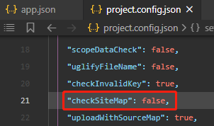 


`"checkSiteMap":false`

这的作用是==控制台不要有一些没用的警告==。


Sitemap：搜索功能文件，指定哪些页面可以被搜索，可被配置。是在搜索小程序的时候，指定哪些页面允许被搜索到。


### 2.app.json

小程序根目录下的 `app.json` 文件用来对微信小程序进行全局配置，决定页面文件的路径、窗口表现、设置网络超时时间、设置多 tab 等。

小程序根目录下的 `app.json` 文件用来对微信小程序进行全局配置。文件内容为一个 JSON 对象，有以下属性：

https://developers.weixin.qq.com/miniprogram/dev/reference/configuration/app.html

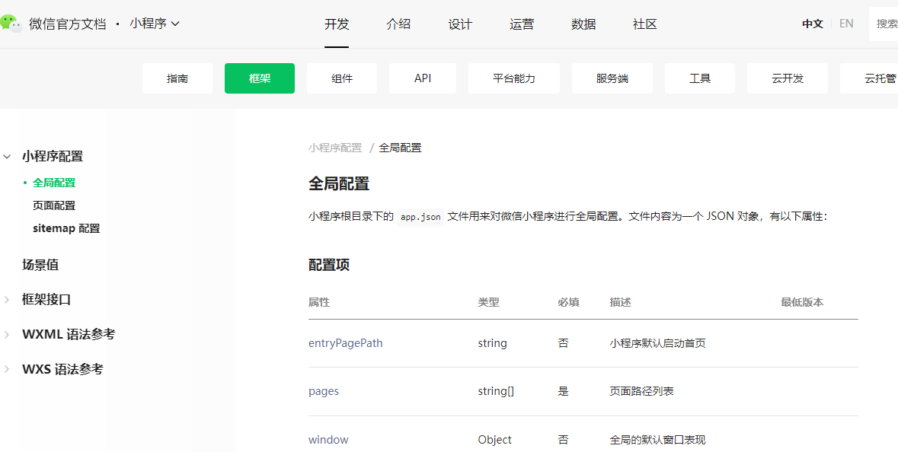


###  tabbar的配置

​	小程序根目录下的 `app.json` 文件用来对微信小程序进行全局配置，决定页面文件的路径、窗口表现、设置网络超时时间、设置多 tab 等。（只有全局的app.json 才有）

​	如果小程序是一个多 tab 应用（客户端窗口的底部或顶部有 tab 栏可以切换页面），可以通过 tabBar 配置项指定 tab 栏的表现，以及 tab 切换时显示的对应页面。

| 属性            | 类型     | 必填 | 默认值 | 描述                                                         |
| :-------------- | :------- | :--- | :----- | :----------------------------------------------------------- |
| color           | HexColor | 是   |        | tab 上的文字默认颜色，仅支持十六进制颜色                     |
| selectedColor   | HexColor | 是   |        | tab 上的文字选中时的颜色，仅支持十六进制颜色                 |
| backgroundColor | HexColor | 是   |        | tab 的背景色，仅支持十六进制颜色                             |
| borderStyle     | string   | 否   | black  | tabbar 上边框的颜色， 仅支持 `black` / `white`               |
| list            | Array    | 是   |        | tab 的列表，详见 `list` 属性说明，最少 2 个、最多 5 个 tab   |
| position        | string   | 否   | bottom | tabBar 的位置，仅支持 `bottom` / `top`                       |
| custom          | boolean  | 否   | false  | 自定义 tabBar，见[详情](https://developers.weixin.qq.com/miniprogram/dev/framework/ability/custom-tabbar.html) |

其中 list 接受一个数组，**只能配置最少 2 个、最多 5 个 tab**。tab 按数组的顺序排序，每个项都是一个对象，其属性值如下：

| 属性             | 类型   | 必填 | 说明                                                         |
| :--------------- | :----- | :--- | :----------------------------------------------------------- |
| pagePath         | string | 是   | 页面路径，必须在 pages 中先定义                              |
| text             | string | 是   | tab 上按钮文字                                               |
| iconPath         | string | 否   | 图片路径，icon 大小限制为 40kb，建议尺寸为 81px * 81px，不支持网络图片。 **当 `position` 为 `top` 时，不显示 icon。** |
| selectedIconPath | string | 否   | 选中时的图片路径，icon 大小限制为 40kb，建议尺寸为 81px * 81px，不支持网络图片。 **当 `position` 为 `top` 时，不显示 icon。** |

### 3. 案例1—配置tabbar

#### 3.1 需求

​	做出如下效果，在小程序底部有3个tab选项。

​	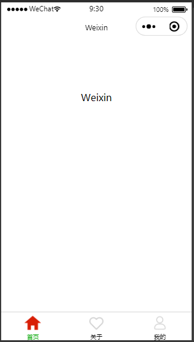 

#### 3.2 具体实现

1. 创建图片目录，并粘贴进去几张图片。注意，往目录中粘贴图片需要在硬盘找到目录位置去粘贴，直接在工具中不能粘贴图片。

   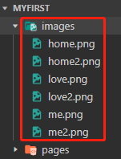 

2. 在pages目录下创建目录about，然后创建页面。

   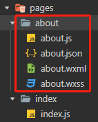 

3. 在pages目录下创建目录me，然后创建页面。

   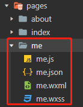 

   右键新建Page

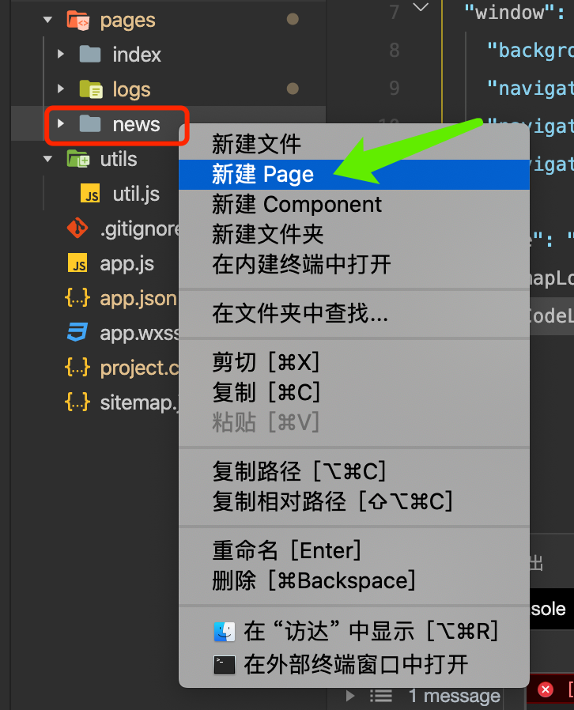

4. 编辑app.json文件中的`pages`的配置：页面路径；==第一个位置的路径是页面首页==

​	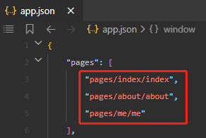 

5.  编辑app.json文件中的`tabbar`的配置：

```json
"tabBar": {
    "list": [
        {
            "pagePath": "pages/index/index",
            "text": "首页",
            "iconPath": "images/home.png",
            "selectedIconPath": "images/home2.png"
        },
        {
            "pagePath": "pages/about/about",
            "text": "关于",
            "iconPath": "images/love.png",
            "selectedIconPath": "images/love2.png"
        },
        {
            "pagePath": "pages/me/me",
            "text": "我的",
            "iconPath": "images/me.png",
            "selectedIconPath": "images/me2.png"
        }
    ]
}
```

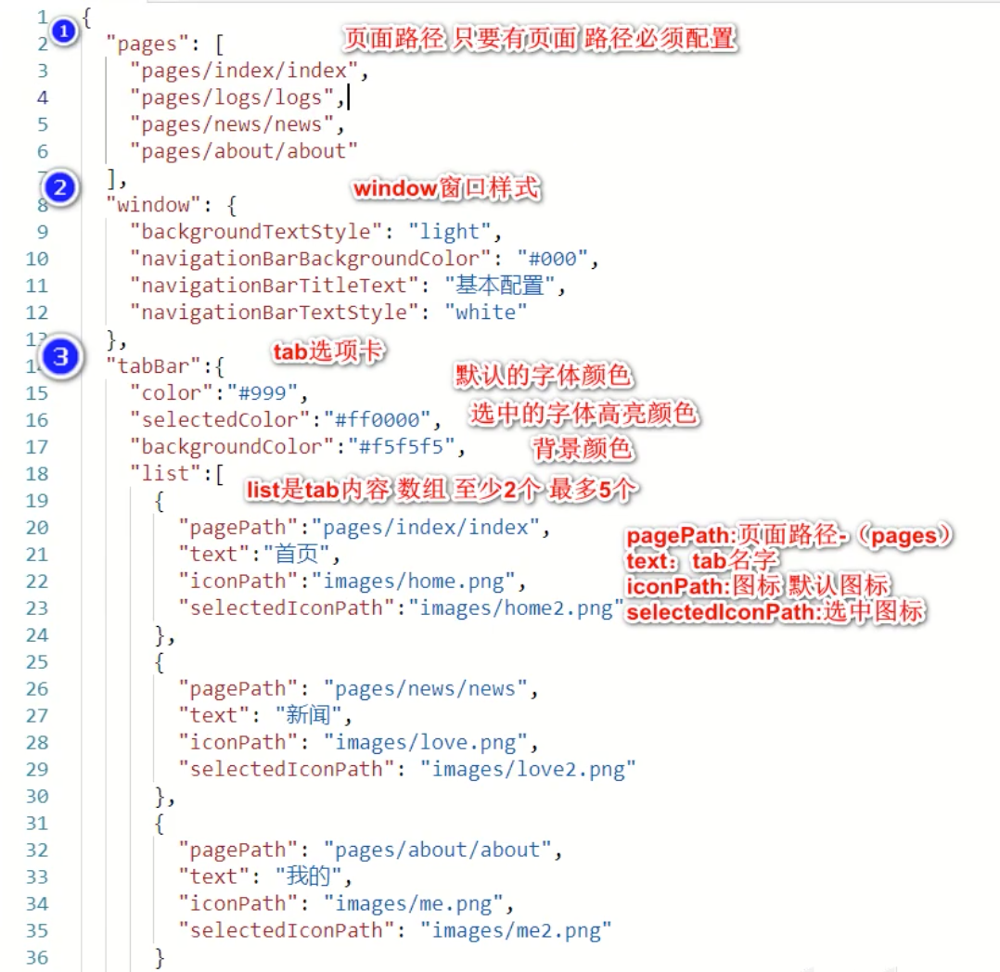

### 4. 案例2

#### 4.1 需求

​	修改每个tab页面显示的导航标题。

​	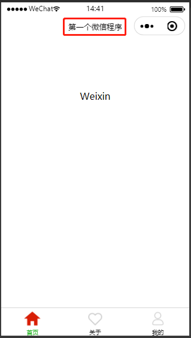 

#### 4.2 具体实现

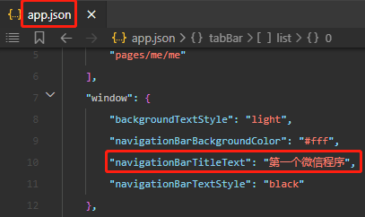 

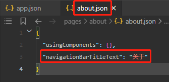 

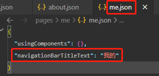 

#### 效果：

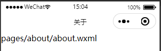 

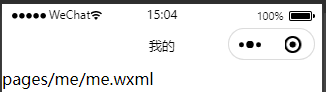


### WXSS

https://developers.weixin.qq.com/miniprogram/dev/framework/view/wxss.html

WXSS (WeiXin Style Sheets)是一套样式语言，用于描述 WXML 的组件样式。

WXSS 用来决定 WXML 的组件应该怎么显示。

为了适应广大的前端开发者，WXSS 具有 CSS 大部分特性。同时为了更适合开发微信小程序，WXSS 对 CSS 进行了==扩充以及修改==。

与 CSS 相比，WXSS 扩展的特性有：

- 尺寸单位
- 样式导入

### 尺寸单位

- rpx（responsive pixel）: 可以根据屏幕宽度进行自适应。规定屏幕宽为750rpx。如在 iPhone6 上，屏幕宽度为375px，共有750个物理像素，则750rpx = 375px = 750物理像素，1rpx = 0.5px = 1物理像素。


尺寸单位：750的设计稿(物理像素)刚好等于750rpx，即，750px=750rpx

样式导入：从一个.wxss导入到另一个.wxss

```css
@import 'wxss的相对路径';
```


## 三、微信小程序组件

html：div、span、ul、li 、img

小程序：上面所有的标签都没有，称为组件。view+text+image

view 块元素，类似div

```html
<view>块元素，可以嵌套view和其他元素</view>
```


#### 5.1 介绍

​	微信小程序中的组件就相当于之前HTML中的标签。但是小程序中的组件除了包裹功能，还具有样式和js功能。

​	 

#### 5.2 view组件

​	视图容器，view组件就相当于之前HTML中的div标签。

* 在index.wxml中编写如下代码：

  ```html
  <view style="background-color: pink;" class="wrapper">我的第一个微信程序</view>
  ```

* 在index.wxss中编写如下代码：

  ```css
  .wrapper{
      width: 100%;
      height: 100rpx;
      text-align: center;
      line-height: 100rpx;
      background-color: skyblue;
  }
  ```

* 效果：

   

总结：可以发现在微信小程序中写样式和我们的css基本一样！

#### 5.3 text组件

​	文本组件，相当于HTML中的span标签。

```html
<text>啦啦啦啦</text>
```

#### 5.4 swiper组件

​	滑块视图容器。其中只可放置`swiper-item`组件，否则会导致未定义的行为。

​	也就是说swiper内部只能放swiper-item组件，而swiper-item组件中就可以随便放其它组件及内容了。

##### 5.4.1默认效果

```html
<swiper class="banner">
  <swiper-item>item1</swiper-item>
  <swiper-item>item2</swiper-item>
  <swiper-item>item3</swiper-item>
</swiper>
```

```css
.banner{
    height: 80rpx;
    text-align: center;
    line-height: 80rpx;
}
```

可以看到swiper组件有轮播图的效果。而且它有默认的高度(150px)。


swiper组件有很多属性，大家可以参照参考文档去体验一下。地址：https://developers.weixin.qq.com/miniprogram/dev/component/swiper.html

##### 5.4.2swiper的属性

| 更多操作 属性          | 类型    |                   | 默认值必填 | 说明                 |
| :--------------------- | :------ | :---------------- | :--------- | :------------------- |
| indicator-dots         | boolean | false             | 否         | 是否显示面板指示点   |
| indicator-color        | color   | rgba(0, 0, 0, .3) | 否         | 指示点颜色           |
| indicator-active-color | color   | #000000           | 否         | 当前选中的指示点颜色 |
| autoplay               | boolean | false             | 否         | 是否自动切换         |
| current                | number  | 0                 | 否         | 当前所在滑块的 index |
| interval               | number  | 5000              | 否         | 自动切换时间间隔     |
| duration               | number  | 500               | 否         | 滑动动画时长         |
| circular               | boolean | false             | 否         | 是否采用衔接滑动     |
| vertical               | boolean | false             | 否         | 滑动方向是否为纵向   |

```html
<swiper class="banner" 	indicator-dots="true" autoplay="true" 	interval="2000" circular="true">
  <swiper-item>item1</swiper-item>
  <swiper-item>item2</swiper-item>
  <swiper-item>item3</swiper-item>
</swiper>
```


#### 5.5 scroll-view组件

​	可滚动视图区域。后面我们会用一下。它里面可以放置好多view组件。

横向滚动区域：需要设置：

1. 一行显示，不换行，溢出隐藏
2. 下面包含的组件要显示成行内块

```html
<!-- 可滚动视图区域。 -->
<scroll-view class="navs" scroll-x="true">
  <text>滑块1</text>
  <text>滑块2</text>
  <text>滑块3</text>
  <text>滑块4</text>
  <text>滑块5</text>
  <text>滑块6</text>
  <text>滑块7</text>
  <text>滑块8</text>
  <text>滑块9</text>
  <text>滑块10</text>
  <text>滑块11</text>
  <text>滑块12</text>
</scroll-view>
```


```css
/*wxss页面*/
.navs{
  height: 100rpx;
  line-height: 100rpx;
  background-color: #eee;
  /* 必须加 */
  white-space: nowrap;
}
.navs text{
  margin: 0 10px;
  display: inline-block;
}
```


#### 5.6 icon组件

​	icon组件就是在页面可以显示一个图标。

type  string    是  icon的类型，有效值：success, success_no_circle, info, warn, waiting, cancel, download, search, clear

```html
<icon type="success"></icon>
<icon type="success" size="50"></icon>
<icon type="warn"></icon>
```


#### 5.7 案例1

##### 5.7.1 创建项目

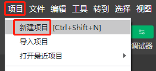 

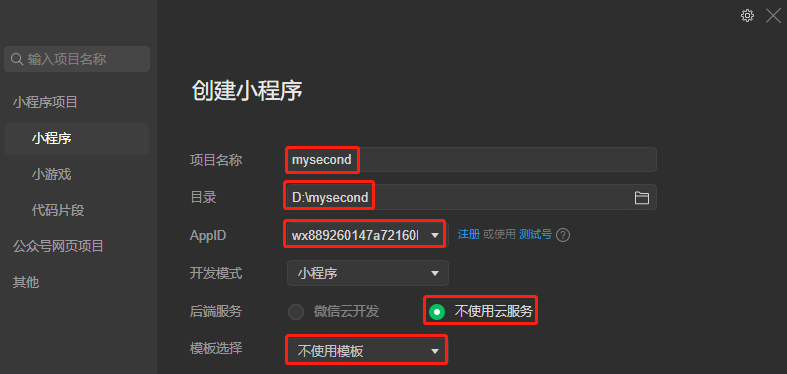 

##### 5.7.2 复制图片

创建图片文件夹，复制进去几张图片：

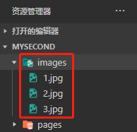 

##### 5.7.3 编写页面

```html
<swiper indicator-dots="true" autoplay="true" interval="2000" circular="true">
  <swiper-item>
    <image src="../../images/1.jpg"></image>
  </swiper-item>
  <swiper-item>
    <image src="../../images/2.jpg"></image>
  </swiper-item>
  <swiper-item>
    <image src="../../images/3.jpg"></image>
  </swiper-item>
</swiper>
```

##### 5.7.4 编写样式

```css
swiper image{
    width: 100%;
    height: 400rpx;
}

swiper{
    height: 400rpx;
}
```

##### 5.7.5 模拟器效果

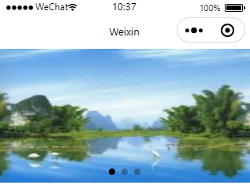  

##### 5.7.6 真实手机效果

点击预览会生成一个二维码，然后使用微信扫码即可看到真实的效果。

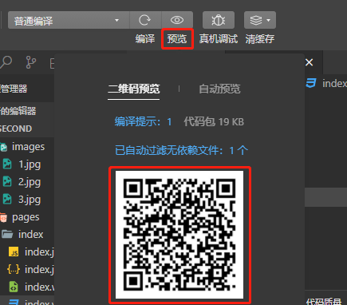 


#### 5.8 案例2

接着上面的案例编写即可。

##### 5.8.1 编写页面

```html
<scroll-view scroll-x="true">
  <text>文本1</text>
  <text>文本2</text>
  <text>文本3</text>
  <text>文本4</text>
  <text>文本5</text>
  <text>文本6</text>
  <text>文本7</text>
  <text>文本8</text>
  <text>文本9</text>
  <text>文本10</text>
  <text>文本11</text>
</scroll-view>
```

##### 5.8.2 编写样式

```css
scroll-view{
    height: 70rpx;
    background-color: #bfa;
    line-height: 70rpx;
    text-align: center;
}

scroll-view text{
    display: inline-block;
    width: 150rpx;
}
```

#### 5.9 进度条

progress，进度条。

案例：

```html
<progress percent="20" show-info="true" border-radius="5" stroke-width="10"></progress>

<progress percent="20" show-info />
<progress percent="40" stroke-width="12" />
<progress percent="60" color="pink" />
<progress percent="80" active />
```

效果：

 


#### 5.10 按钮

button，按钮。

案例：

```html
<button size="default">按钮1</button>
<button size="mini">按钮2</button>
<button size="mini" type="primary">按钮3</button>
<button size="mini" type="primary" open-type="share">按钮4</button>

<input type="text" placeholder="没有边框，需要自己写样式" name="" id="" />

<!-- 图片：必须写大小，不写默认大小 -->
<image src="../../images/recommendSong.jpg"></image>
```


效果：

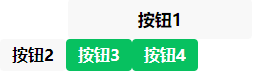 


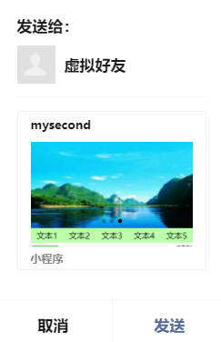 


#### 5.11 navigator组件

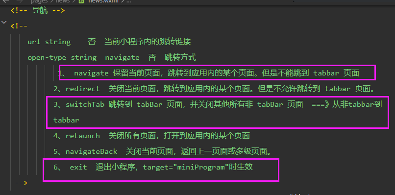

navigator组件就相当于HTML中的超链接标签。

```html
<!-- 
  navigator组件相当于HTML的超链接标签。
    target属性：在哪个目标上发生跳转，默认self-当前小程序；
    url属性：当前小程序内的跳转链接
    open-type属性：指定跳转方式，默认是navigate
      navigate：保留当前页面，跳转到应用内的某个页面。但是不能跳到 tabbar 页面。
      redirect：关闭当前页面，跳转到应用内的某个页面。但是不允许跳转到 tabbar 页面。
      switchTab：跳转到 tabBar 页面，并关闭其他所有非 tabBar 页面
      reLaunch：关闭所有页面，打开到应用内的某个页面
      navigateBack：关闭当前页面，返回上一页面或多级页面。
 -->
<navigator target="self" url="../about/about" open-type="switchTab">点我跳转</navigator>
```


```html
<!-- 导航 
跳转到页面，都不写后缀名
1、open-type='navigate' 跳转方式:
保留当前页面，跳转应用内的某个页面，但不跳转tabber页面
2、open-type="redirect 关闭当前页面，跳转到应用内的某个页面。但是不允许跳转到 tabbar 页面。 没返回，有返回首页
3、open-type="switchTab"  跳转到 tabBar 页面，并关闭其他所有非 tabBar 页面
4、reLaunch 关闭所有页面，打开到应用内的某个页面
5、navigateBack 关闭当前页面，返回上一页面或多级页面。标签的话，就是返回上一页。用方法的话，可以指定返回多少级
6、exit	退出小程序，`target="miniProgram"`时生效 需要用真机去测

-->
<navigator url="../detail/detail">进入详情页</navigator>
<navigator url="../detail/detail" open-type="redirect">redirect 进入详情页</navigator>
<navigator url="../index/index" open-type="switchTab">跳转到首页</navigator>
<!-- 还可以调tabBar -->
<navigator url="../detail/detail" open-type="reLaunch">reLaunch 到详情页</navigator>
<navigator open-type="exit" target="miniProgram">退出小程序</navigator>
```


#### 5.12 audio组件

audio组件，音频组件。

```html
<audio src="" controls="true" name="你好呀" author="张三"></audio>
```

#### 5.13 map组件

map组件是地图组件。

```html
<!-- 
  latitude：维度
  longitude：经度
 -->
<map longitude="115" latitude="39"></map>
```


