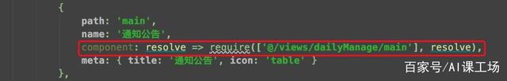

# 补充：接口规范

## 一、前后端交互

- 说明

  所谓前后端交互，就是通过浏览器去调用后台接口，拿到后台数据，再做前端的数据渲染的过程。

- 接口调用方式

  1. 原生ajax（相对麻烦）

  2. 基于jQuery的ajax

     但是Jquery是居于Dom操作，Vue很少涉及Dom，所以jQuery就用不到了

  3. fetch

     可以说是ajax的升级版，标准化组织制定的一套新的规范，不需要引入

  4. axios

     第三方库，可以更加方便的调用库，相比fetch来说，更加强大。

- 通讯模式

  

  

### 2、url 地址格式

- 传统的url

  格式：schema://host:port/path?query#fragment

  https://www.baidu.com/s?tn=88093251_47_hao_pg&ie=utf-8&wd=restful%20api%E6%8E%A5%E5%8F%A3%E8%A7%84%E8%8C%83

  1. schema：协议，例如http、https、ftp等。
  2. host：域名或者IP地址。
  3. port：端口，http默认端口80，可以省略。
  4. path：路径，例如/abc/a/b/c
  5. query：查询参数，例如uname=lisi&age=12
  6. fragment：锚点（哈希Hash），用于定位页面的某个位置

  符合规则的URL:

  1. http://www.abc.com
  2. http://www.abc.com/dev/web/shanchu?id=123
  3. http://www.abc.com/dev/web/update?id=123
  4. http://www.abc.com/dev/web?id=1#nav

  

- Restful形式的url（目前用的最多）

  HTTP的请求方式密切相关。

  1. HTTP请求方式  ajax.get  ajax.post  ajax.put  

     GET			查询

     POST          添加

     PUT			修改

     DELETE	  删除

  2. 符合规则的URL地址

     以下链接，==虽然URL地址完全相同，但是根据提交方式的不同，表示的含义是完全不一样的。==

     http://www.jd.com/orders			GET   ajax.get   

     axios.get('http://www.jd.com/orders')  ==>查询所有的订单列表

     http://www.jd.com/orders			POST

     axios.post('http://www.jd.com/orders',)   添加数据

     http://www.jd.com/orders/123	PUT

     axios.put('http://www.jd.com/orders/123')   修改  id=123

     http://www.jd.com/orders/123	DELETE	  

     axios.delete('http://www.jd.com/orders/123')   删除

     Restful的传参，可以直接 `/参数`，传统式  `?参数` 的方式

用哪种方式，需要后台支持。


# ==Vue性能优化==

众所周知，是一个轻量级的框架，源码仅仅为72.9KB，但是也有它自己的缺点，就是首屏加载会比较慢，因为和传统项目相比，Vue会在首屏加载的时候加载出所有的组件和插件，并且向服务器请求数据，导致可能有时候首屏加载的时间就会到4、5秒的样子。

但是这样做很明显是在挑战用户的耐心，按照惯例，最好能把加载时间控制在1秒左右。接下来小编讲一下Vue性能优化的两个个方向。

## 1、源码优化

### （1）代码模块化

把很多常用的地方封装成单独的组件，在需要用到的地方引用，而不是写过多重复的代码，每一个组件都要明确含义，复用性越高越好，可配置型越强越好，包括咱们的css也可以通过less和sass的自定义css变量来减少重复代码。

### （2）for循环设置key值

在用v-for进行数据遍历渲染的时候，为每一项都设置唯一的key值，为了让Vue内部核心代码能更快地找到该条数据，当旧值和新值去对比的时候，可以更快的定位到diff。


### （3）Vue路由设置成懒加载

当首屏渲染的时候，能够加快渲染速度。



### （4）更加理解Vue的生命周期，

不要造成内部泄漏，使用过后的全局变量在组件销毁后重新置为null。

### （5）可以使用keep-alive，

keep-alive是Vue提供的一个比较抽象的组件，用来==对组件进行缓存，从而节省性能==。


## 2、打包优化

### （1）修改vue.config.js中的配置项，

==把productionSourceMap设置为false==，不然最终打包过后会生成一些map文件，如果不关掉，生产环境是可以通过map去查看源码的，并且可以开启gzip压缩，使打包过后体积变小。


### （2）使用cdn的方式外部加载一些资源

比如vue-router、axios等Vue的周边插件，在webpack.config.js里面，externals里面设置一些不必要打包的外部引用模块。然后在入门文件index.html里面通过cdn的方式去引入需要的插件。

打包 vender 时不打包 vue、vuex、vue-router、axios 等，换用国内的bootcdn直接引入到根目录的 index.html 中。


### （3）减少图片使用

因为对于网页来说，图片会占用很大一部分体积，所以，优化图片的操作可以有效的来加快加载速度。可以用一些==css3的效果来代替图片效果==，或者使用雪碧图来减少图片的体积。

### （4）按需引入

使用的一些第三方库可以通过按需引入的方式加载。避免引入不需要使用的部分，无端增加项目体积。比如在使用element-ui库的时候，可以只引入需要用到的组件。


### （5）组件的异步加载（按需加载组件）

在平时的demo中，可能不会遇见这个需求。当页面很多，组件很多的时候，SPA页面在首次加载的时候，就会变的很慢。这是因为vue首次加载的时候把可能一开始看不见的组件也一次加载了，这个时候就需要对页面进行优化，就需要异步组件了。

## 3、提高首屏加载速度的优化方案: 

- 1、采用路由懒加载 
- 2、将一些静态js css放到其他地方（如OSS），减小服务器压力 
- 3、按需加载三方资源，如iview,建议按需引入iview中的组件 
- 4、使用nginx开启gzip减小网络传输的流量大小 
- 5、webpack开启gzip压缩 
- 6、若首屏为登录页，可以做成多入口，登录页单独分离为一个入口 
- 7、图片


### 补充：

for： 最基本循环，用来专门遍历数组下标；可以使用break和continue

for in ：专门用来遍历对象可迭代的属性，效率低，因为除了遍历自身，还遍历原型上的

for of：专门遍历可迭代的数据，比如数组、map、set

​			注意：对象不可以，因为没有迭代器

forEach：数组方法，效率极高。遍历数组，但是不可以使用break和continue


开发中遇到的问题：

1、动态路由传参 params + name 

路由表中就注册一个id，传参数的时候传多个id，首次打开可以，当再次刷新页面的时候，就只有一个参数，其他参数都丢失了。


总结：

在使用 动态加命名的方式，传递参数时，传递参数的个数必须要跟注册的参数个数相等


# 常见面试题

### 1、vuex是什么？怎么使用？哪种功能场景使用它？

答：vue框架中状态管理。在main.js引入store，注入。
新建了一个目录store.js，….. export 。
场景有：单页应用中，组件之间的状态。音乐播放、登录状态、加入购物车

### 2、vuex有哪几种属性？

答：有五种，分别是 State、 Getter、Mutation 、Action、 Module
state => 基本数据(数据源存放地)
getters => 从基本数据派生出来的数据
mutations => 提交更改数据的方法，同步！
actions => 像一个装饰器，包裹mutations，使之可以异步。
modules => 模块化Vuex

### 3、Vue.js中ajax请求代码应该写在组件的methods中还是vuex的actions中？

答：如果请求来的数据是不是要被其他组件公用，仅仅在请求的组件内使用，就不需要放入vuex 的state里。
如果被其他地方复用，这个很大几率上是需要的，如果需要，请将请求放入action里，方便复用。

### 4、vue的数据双向绑定 

- vue的数据双向绑定 将MVVM作为数据绑定的入口，整合Observer，Compile和Watcher三者，通过Observer来监听自己的model的数据变化，通过Compile来解析编译模板指令（vue中是用来解析 {{}}），最终利用watcher搭起observer和Compile之间的通信桥梁，达到数据变化 —>视图更新；视图交互变化（input）—>数据model变更双向绑定效果。
- 具体过程
  1. 实现一个监听器Observer，用来劫持并监听所有属性，如果有变动的，就通知订阅者。
  2. 实现一个订阅者Watcher，可以收到属性的变化通知并执行相应的函数，从而更新视图。
  3. 实现一个解析器Compile，可以扫描和解析每个节点的相关指令，并根据初始化模板数据以及初始化相应的订阅器。

### 5、Vue组件间的参数传递 

（1）父组件与子组件传值 父组件传给子组件：子组件通过props方法接受数据；子组件传给父组件：$emit方法传递参数 

（2）非父子组件间的数据传递，兄弟组件传值 eventBus，就是创建一个事件中心，相当于中转站，可以用它来传递事件和接收事件。项目比较小时，用这个比较合适。（虽然也有不少人推荐直接用VUEX，具体来说看需求咯。技术只是手段，目的达到才是王道。）


### 6、Vue的路由实现：hash模式 和 history模式

- hash模式：在浏览器中符号“#”，#以及#后面的字符称之为hash，用window.location.hash读取；
  特点：hash虽然在URL中，但==不被包括在HTTP请求中==；用来指导浏览器动作，对服务端安全无用，==hash不会重加载页面==。
  hash 模式下，仅 hash 符号之前的内容会被包含在请求中，如 http://www.xxx.com，因此对于后端来说，即使没有做到对路由的全覆盖，也不会返回 404 错误。

- history模式：==history采用HTML5的新特性==；且提供了两个新方法：pushState（），replaceState（）可以对浏览器历史记录栈进行修改，以及popState事件的监听到状态变更。
  history 模式下，前端的 URL 必须和实际向后端发起请求的 URL 一致，如 http://www.xxx.com/items/id。后端如果缺少对 /items/id 的路由处理，将返回 404 错误。Vue-Router 官网里如此描述：“不过这种模式要玩好，还需要后台配置支持……所以呢，你要在服务端增加一个覆盖所有情况的候选资源：如果 URL 匹配不到任何静态资源，则应该返回同一个 index.html 页面，这个页面就是你 app 依赖的页面。”

### 7、vue路由的钩子函数

首页可以控制导航跳转，beforeEach，afterEach等，一般用于页面title的修改。一些需要登录才能调整页面的重定向功能。

beforeEach主要有3个参数to，from，next：

to：route即将进入的目标路由对象，

from：route当前导航正要离开的路由

next：function一定要调用该方法resolve这个钩子。执行效果依赖next方法的调用参数。可以控制网页的跳转。

### 8、Vuex 

使用单一状态树,即每个应用将仅仅包含一个store 实例，但单一状态树和模块化并不冲突。存放的数据状态，不可以直接修改里面的数据。
mutations
mutations定义的方法动态修改Vuex 的 store 中的状态或数据。
getters
类似vue的计算属性，主要用来过滤一些数据。
action

actions可以理解为通过将mutations里面处里数据的方法变成可异步的处理数据的方法，简单的说就是异步操作数据。view 层通过 store.dispath 来分发 action。

```js
const store = new Vuex.Store({ //store实例
    state: {
    	count: 0
    },
	mutations: {
            increment (state) {
            state.count++
    	}
	},
	actions: {
        increment (context) {
        context.commit(‘increment’)
    	}
	}
})

```


### 9、modules

项目特别复杂的时候，可以让每一个模块拥有自己的state、mutation、action、getters,使得结构非常清晰，方便管理。

```js
const moduleA = {
    state: { … },
    mutations: { … },
    actions: { … },
	getters: { … }
}
const moduleB = {
    state: { … },
    mutations: { … },
    actions: { … }
  }

const store = new Vuex.Store({
    modules: {
        a: moduleA,
        b: moduleB
      })

```


### 10、如何理解渐进式

对渐进式的理解其实就两个字：自由。

当我们要用==Angular框架时要知道它是强主张的==，必须要遵循以下三条规则：

[if !supportLists]·    [endif]**必须使用它的模块机制**

[if !supportLists]·    [endif]**必须使用它的依赖注入**

[if !supportLists]·    [endif]**必须使用它的特殊形式定义组件**（这一点每个视图框架都有，难以避免）

而==React的主张主要是函数式编程的理念==，比如说，你需要知道什么是**副作用**，什么是**纯函数**，如何**隔离副作用**。它的侵入性看似没有Angular那么强，主要因为它是软性侵入。

但是Vue就比较自由了你想把你的页面分的更加具体，分成更小的可控单元，那就用组件系统其他可以不用，当然声明式渲染我们还是得用的，应为我们都希望DOM的更新是自动的，而非手动去更新的。

这也就是Vue现在这么受欢迎的原因之一吧！

###  11、Vue组件如何通信

- `props/$emit+v-on`: 通过==props将数据自上而下传递==，而通过==$emit和v-on来向上传递信息==。
- 中央事件总线`EventBus`: ==通过EventBus进行信息的发布与订阅==，实现非父子组件之间的通信
- vuex: 是全局数据管理库，可以通过vuex管理全局的数据流
- `v-model`方式：直接绑定父组件变量，把数据从子组件传回父组件

### 12、vue组件中的data为什么是一个函数？

组件是可复用的vue实例，一个组件被创建好之后，就可能被用在各个地方，而组件不管被复用了多少次，组件中的data数据都应该是相互隔离，互不影响的，基于这一理念，组件每复用一次，data数据就应该被复制一次，之后，当某一处复用的地方组件内data数据被改变时，其他复用地方组件的data数据不受影响。

类似于给每个组件实例创建一个私有的数据空间，让各个组件实例维护各自的数据。而单纯的写成对象形式，就使得所有组件实例共用了一份data，就会造成一个变了全都会变的结果。

### 13、computed和watch有什么区别?

- **computed:**

  1、computed是==计算属性，也就是计算值==

  2、computed具有缓存性,computed的值在getter执行后是会缓存的，==只有在它依赖的属性值改变之后，下一次获取computed的值时才会重新调用对应的getter来计算==

  3、computed==适用于计算比较消耗性能的计算场景==

  ```js
  data: {
      message: 'Hello'
    },
   computed: {
      // 计算属性的 getter
      reversedMessage: function () {
        // `this` 指向 vm 实例
        return this.message.split('').reverse().join('')
      }
    }
  ```

- **watch**

  1、Vue 提供了一种更通用的方式来观察和响应 Vue 实例上的数据变动：侦听属性。 2、==无缓存性，页面重新渲染时值不变化也会执行==

  ```js
    watch: {
      // 如果 `question` 发生改变，这个函数就会运行
      question: function (newQuestion, oldQuestion) {
        this.answer = 'Waiting for you to stop typing...'
        this.debouncedGetAnswer()
      }
    },
  ```


# 1、[Vue.$nextTick详解](https://www.cnblogs.com/00feixi/p/11762932.html)

所指定的回调，会在DOM节点更新之后，再执行。

作用：==在下一次DOM更新结束后==，执行指定的回调

什么时候用：当改变数据后，要基于更新后的新DOM进行某些操作时，要再nextTick所指定的回调函数中执行。      

**$nextTick(操作DOM的时候会用到)**

- Vue在观察数据变化时并不是直接更新DOM，而是开启一个队列，并缓冲在同一事件循环中发生的所有数据改变

- 在缓冲时会去除重复数据，从而避免不必要的计算和DOM操作

- 然后，在下一个事件循环tick中，Vue刷新队列并执行实际（已去重的）工作。所以，如果你用一个for循环来动态改变数据100次，其实它只会应用最后一次改变，如果没有这种机制，DOM就要重绘100次，这固然是个很大的开销。

  ```html
  <div>
      <button @click="show">$nextTick</button>
      <div id="next" v-if="isShow">{{next}}</div>
  </div>
  
  <script>
  show(){
      this.isShow = true
      // let dv = document.getElementById("next")
      // console.log(dv) // null
      
      this.$nextTick(() => {
          let dv = document.getElementById("next")
          console.log(dv) // <div>1</div>
      })
  }
  </script>
  ```

  

事实上，在执行this.isShow = true的同时，div还没有被创建出来，直到写一个Vue事件循环，才开始创建。$nextTick就是用来知道什么时候DOM更新完成的。

理论上，我们应该不用主动去操作DOM，因为Vue的核心思想就是数据驱动DOM，但是在很多业务里，我们避免不了会使用一些第三方库，比如popper、sweper等，这些原生基于javaScript的库都有创建和更新及销毁的完整生命周期，与Vue配合使用，就要利用好$nextTick。


# 2、[深入理解vue .sync修饰符](https://www.cnblogs.com/00feixi/p/11526057.html)

.sync是vue中用于实现简单的“双向绑定”的语法糖，在平时的开发中是非常使用的。

vue的prop是单向下行绑定：父级的prop的更新会向下流动到子组件中，但是反过来不行。可是有些情况，我们需要对prop进行“双向绑定”。这个时候，就可以用.sync来解决

**.sync用法**

```html
<text-document :title.sync="doc.title"></text-document>

当子组件需要更新 title 的值时，它需要显式地触发一个更新事件：
this.$emit('update:title', newValue)
```

这样title的属性在子组件内部更新，父组件也能感知的到，实现了“双向绑定”。

**.sync应运实例**

[](javascript:void(0);)

```html
<template>
    <div class="details">
        <myComponent :show.sync='valueChild' style="padding: 30px 20px 30px 5px;border:1px solid #ddd;margin-bottom: 10px;"></myComponent>
        <button @click="changeValue">toggle</button>
    </div>
</template>
<script>
import Vue from 'vue'
Vue.component('myComponent', {
      template: `<div v-if="show">
                    <p>默认初始值是{{show}}，所以是显示的</p>
                    <button @click.stop="closeDiv">关闭</button>
                 </div>`,
      props:['show'],
      methods: {
        closeDiv() {
          this.$emit('update:show', false); //触发 input 事件，并传入新值
        }
      }
})
export default{
    data(){
        return{
            valueChild:true,
        }
    },
    methods:{
        changeValue(){
            this.valueChild = !this.valueChild
        }
    }
}
</script>
```

[](javascript:void(0);)

如果未触发事件 this.$emit('update:show', false); 则外部感知不到子组件内部对show的改变，依然认为此事的值是true，导致弹框点击打开一次之后，后面再不会打开。

### 响应式原理

Vue内部使用了Object.defineProperty() 来实现数据响应式，通过这个函数可以监听到set和get的事件。


# 十一、面试

### 1. Vue的优点？Vue的缺点？

优点：渐进式，组件化，轻量级，虚拟dom，响应式，单页面路由，数据与视图分开

缺点：单页面不利于seo，不支持IE8以下，首屏加载时间长

### 2. 为什么说Vue是一个渐进式框架？

渐进式：通俗点讲就是，你想用啥你就用啥，咱也不强求你。你想用component就用，不用也行，你想用vuex就用，不用也可以

### 3. Vue跟React的异同点？

相同点：

- 1.都使用了虚拟dom
- 2.组件化开发
- 3.都是单向数据流(父子组件之间，不建议子修改父传下来的数据)
- 4.都支持服务端渲染

不同点：

- 1.React的JSX，Vue的template
- 2.数据变化，React手动(setState)，Vue自动(初始化已响应式处理，Object.defineProperty)
- 3.React单向绑定，Vue双向绑定
- 4.React的Redux，Vue的Vuex

### 4. MVVM是什么？和MVC有何区别呢？

#### MVC：后端三层架构的概念

- Model(模型)：负责从数据库中取数据

- View(视图)：负责展示数据的地方

- Controller(控制器)：==用户交互的地方，例如点击事件==等等

- 思想：==Controller将Model的数据展示在View上==

  

#### MVVM：前端概念

- VM：也就是View-Model，做了两件事达到了数据的双向绑定 一是==将【模型】转化成【视图】==，即将后端传递的数据转化成所看到的页面。实现的方式是：==数据绑定==。二是将==【视图】转化成【模型】==，即将所看到的页面转化成后端的数据。实现的方式是：==DOM 事件监听==。

- 思想：实现了 View 和 Model 的自动同步，也就是当 Model 的属性改变时，我们不用再自己手动操作 Dom 元素，来改变 View 的显示，而是改变属性后该属性对应 View 层显示会自动改变（对应Vue数据驱动的思想）

  

- 区别

  整体看来，MVVM 比 MVC 精简很多，不仅简化了业务与界面的依赖，还解决了数据频繁更新的问题，==不用再用选择器操作 DOM 元素==。因为==在 MVVM 中，View 不知道 Model 的存在，Model 和 ViewModel 也观察不到 View，这种低耦合模式提高代码的可重用性。==

- Vue是不是MVVM框架？

  Vue是MVVM框架，但是不是严格符合MVVM，因为MVVM规定Model和View不能直接通信，而Vue的`ref`可以做到这点


### 5. Vue和JQuery的区别在哪？为什么放弃JQuery用Vue？

- 1.jQuery是直接操作DOM，Vue不直接操作DOM，Vue的数据与视图是分开的，Vue只需要操作数据即可
- 2.jQuery的操作DOM行为是频繁的，而Vue利用虚拟DOM的技术，大大提高了更新DOM时的性能
- 3.Vue中不倡导直接操作DOM，开发者只需要把大部分精力放在数据层面上
- 4.Vue集成的一些库，大大提高开发效率，比如Vuex，Router等


### 7. 为什么data是个函数并且返回一个对象呢？

`data`之所以只一个函数，是因为一个组件可能会多处调用，而每一次调用就会执行`data函数`并返回新的数据对象，这样，可以避免多处调用之间的`数据污染`。

### 8. 使用过哪些Vue的修饰符呢？

可以看我这篇文章**「百毒不侵」面试官最喜欢问的13种Vue修饰符**[2]

**「百毒不侵」面试官最喜欢问的13种Vue修饰符**[2]


### 9. 使用过哪些Vue的内部指令呢？


### 10. 组件之间的传值方式有哪些？

- 父组件传值给子组件，子组件使用`props`进行接收
- 子组件传值给父组件，子组件使用`$emit+事件`对父组件进行传值
- 组件中可以使用`$parent`和`$children`获取到父组件实例和子组件实例，进而获取数据
- 使用`$attrs`和`$listeners`，在对一些组件进行二次封装时可以方便传值，例如A->B->C
- 使用`$refs`获取组件实例，进而获取数据
- 使用`Vuex`进行状态管理
- 使用`eventBus`进行跨组件触发事件，进而传递数据
- 使用`provide`和`inject`，官方建议我们不要用这个，我在看`ElementUI`源码时发现大量使用
- 使用浏览器本地缓存，例如`localStorage`


### 11. 路由有哪些模式呢？又有什么不同呢？

- hash模式：通过`#号`后面的内容的更改，触发`hashchange`事件，实现路由切换
- history模式：通过`pushState`和`replaceState`切换url，触发`popstate`事件，实现路由切换，需要后端配合

### 12. 如何设置动态class，动态style？

- 动态class对象：

  `<div :class="{ 'is-active': true, 'red': isRed }"></div>`

- 动态class数组：

  `<div :class="['is-active', isRed ? 'red' : '' ]"></div>`

- 动态style对象：

  `<div :style="{ color: textColor, fontSize: '18px' }"></div>`

- 动态style数组：

  `<div :style="[{ color: textColor, fontSize: '18px' }, { fontWeight: '300' }]"></div>`

### 13. v-if和v-show有何区别？

- 1.`v-if`是通过控制dom元素的删除和生成来实现显隐，==每一次显隐都会使组件重新跑一遍生命周期，因为显隐决定了组件的生成和销毁==
- 2.`v-show`是通过控制dom元素的css样式来实现显隐，不会销毁
- 3.频繁或者大数量显隐使用`v-show`，否则使用`v-if`

### 14. computed和watch有何区别？

- 1.`computed`是==依赖已有的变量来计算一个目标变量==，大多数情况都是`多个变量`凑在一起计算出`一个变量`，并且`computed`具有`缓存机制`，依赖值不变的情况下其会直接读取缓存进行复用，`computed`不能进行`异步操作`

- 2.==`watch`是监听某一个变量的变化，并执行相应的回调函数==，通常是==`一个变量`的变化决定`多个变量`的变化==，`watch`可以进行`异步操作`  

- 3.简单记就是：一般情况下==`computed`是`多对一`，`watch`是`一对多`==

  


### 15. Vue的生命周期，讲一讲？


### 16. 为什么v-if和v-for不建议用在同一标签？

在Vue2中，`v-for`优先级是高于`v-if`的，咱们来看例子

```html
<div v-for="item in [1, 2, 3, 4, 5, 6, 7]" v-if="item !== 3">
    {{item}}
</div>
```

上面的写法是`v-for`和`v-if`同时存在，会先把7个元素都遍历出来，然后再一个个判断是否为3，并把3给隐藏掉，这样的坏处就是，渲染了无用的3节点，增加无用的dom操作，建议使用computed来解决这个问题：

```html
<div v-for="item in list">
    {{item}}
</div>

computed() {
    list() {
        return [1, 2, 3, 4, 5, 6, 7].filter(item => item !== 3)
    }
  }
```


### v-for与v-if的优先级   面试题

```
v-for的优先级高: 解析v-for遍历产生多个标签, 接着在每个标签上解析v-if
v-for与v-if同时使用
	问题: 效率低, 多执行了一些v-if的解析判断
	解决: 
		情况1: 如果v-if的判断是根据数组的每一项来判断的 ==> 解决办法就是定义计算提前对数组进行过滤处理
		情况2: 如果v-if的判断是根据其它数据判断的 ==> 解决办法就是在外边加一层标签并在它上用v-if  ==> 只执行一次v-if判断


```


### 17. vuex的有哪些属性？用处是什么？


- State：定义了应用状态的数据结构，可以在这里设置默认的初始状态。
- Getter：允许组件从 Store 中获取数据，mapGetters 辅助函数仅仅是将 store 中的 getter 映射到局部计算属性。
- Mutation：是唯一更改 store 中状态的方法，且必须是同步函数。
- Action：用于提交 mutation，而不是直接变更状态，可以包含任意异步操作。
- Module：允许将单一的 Store 拆分为多个 store 且同时保存在单一的状态树中。

### 18. 不需要响应式的数据应该怎么处理？

在我们的Vue开发中，会有一些数据，从始至终都`未曾改变过`，这种`死数据`，既然`不改变`，那也就`不需要对他做响应式处理`了，不然只会做一些无用功消耗性能，比如==一些写死的下拉框，写死的表格数据，这些数据量大的`死数据`，如果都进行响应式处理，那会消耗大量性能==。

```js
// 方法一：将数据定义在data之外
data () {
    this.list1 = { xxxxxxxxxxxxxxxxxxxxxxxxxxxxxxx }
    this.list2 = { xxxxxxxxxxxxxxxxxxxxxxxxxxxxxxx }
    this.list3 = { xxxxxxxxxxxxxxxxxxxxxxxxxxxxxxx }
    this.list4 = { xxxxxxxxxxxxxxxxxxxxxxxxxxxxxxx }
    this.list5 = { xxxxxxxxxxxxxxxxxxxxxxxxxxxxxxx }
    return {}
 }
    
// 方法二：Object.freeze()
data () {
    return {
        list1: Object.freeze({xxxxxxxxxxxxxxxxxxxxxxxx}),
        list2: Object.freeze({xxxxxxxxxxxxxxxxxxxxxxxx}),
        list3: Object.freeze({xxxxxxxxxxxxxxxxxxxxxxxx}),
        list4: Object.freeze({xxxxxxxxxxxxxxxxxxxxxxxx}),
        list5: Object.freeze({xxxxxxxxxxxxxxxxxxxxxxxx}),
    }
 }

```

### 19. watch有哪些属性，分别有什么用？

当我们监听一个基本数据类型时：

```js
watch: {
    value () {
        // do something
    }
}
```

当我们监听一个引用数据类型时：

```js
watch: {
    obj: {
       handler () { // 执行回调
           // do something
       },
       deep: true, // 是否进行深度监听
       immediate: true // 是否初始执行handler函数
    }
}
```

### 20. 父子组件生命周期顺序

父beforeCreate -> 父created -> ==父beforeMount==-> 子beforeCreate -> 子created -> 子beforeMount -> 子mounted -> ==父mounted==

### 21. 对象新属性无法更新视图，删除属性无法更新视图，为什么？怎么办？

- 原因：`Object.defineProperty`没有对对象的新属性进行属性劫持
- 对象新属性无法更新视图：使用`Vue.$set(obj, key, value)`，组件中`this.$set(obj, key, value)`
- 删除属性无法更新视图：使用`Vue.$delete(obj, key)`，组件中`this.$delete(obj, key)`

### 22. 直接arr[index] = xxx无法更新视图怎么办？为什么？怎么办？

- 原因：Vue没有对数组进行`Object.defineProperty`的属性劫持，所以直接arr[index] = xxx是无法更新视图的
- 使用数组的splice方法，`arr.splice(index, 1, item)`
- 使用`Vue.$set(arr, index, value)`

### 23. 自定义指令

建议看这篇文章**8个非常实用的Vue自定义指令**[3]

### 24. 插槽的使用以及原理？

建议看我这篇文章**「Vue源码学习」你真的知道插槽Slot是怎么“插”的吗**[4]


### 25. 为什么不建议用index做key，为什么不建议用随机数做key？

举个例子：

```vue
<div v-for="(item, index) in list" :key="index">{{item.name}}</div>

list: [
    { name: '小明', id: '123' },
    { name: '小红', id: '124' },
    { name: '小花', id: '125' }
]

渲染为
<div key="0">小明</div>
<div key="1">小红</div>
<div key="2">小花</div>

现在我执行 list.unshift({ name: '小林', id: '122' })

渲染为
<div key="0">小林</div>
<div key="1">小明</div>
<div key="2">小红</div>
<div key="3">小花</div>


新旧对比

<div key="0">小明</div>  <div key="0">小林</div>
<div key="1">小红</div>  <div key="1">小明</div>
<div key="2">小花</div>  <div key="2">小红</div>
                         <div key="3">小花</div>

可以看出，如果用index做key的话，其实是更新了原有的三项，并新增了小花，虽然达到了渲染目的，但是损耗性能

现在我们使用id来做key，渲染为

<div key="123">小明</div>
<div key="124">小红</div>
<div key="125">小花</div>

现在我执行 list.unshift({ name: '小林', id: '122' })，渲染为

<div key="122">小林</div>
<div key="123">小明</div>
<div key="124">小红</div>
<div key="125">小花</div>

新旧对比

                           <div key="122">小林</div>
<div key="123">小明</div>  <div key="123">小明</div>
<div key="124">小红</div>  <div key="124">小红</div>
<div key="125">小花</div>  <div key="125">小花</div>

可以看出，原有的三项都不变，只是新增了小林这个人，这才是最理想的结果
复制代码
```

用`index`和用`随机数`都是同理，`随机数`每次都在变，做不到专一性，很`渣男`，也很消耗性能，所以，拒绝`渣男`，选择`老实人`

### 26. 说说nextTick的用处？

我举个例子，在vue中：

```
this.name = '林三心'
this.age = 18
this.gender = '男'
复制代码
```

我们修改了三个变量，那问题来了，是每修改一次，DOM就更新一次吗？不是的，==Vue采用的是`异步更新`的策略，通俗点说就是，`同一事件循环内`多次修改，会`统一`进行一次`视图更新`，这样才能节省性能嘛==

看懂了上面，那你应该也看得懂下面的例子了吧：

```html
<div ref="testDiv">{{name}}</div>

name: '小林'

this.name = '林三心'
console.log(this.$refs.testDiv.innerHTML) // 这里是啥呢
```

答案是“小林”，前面说了，Vue是`异步更新`，所以数据一更新，视图却还没更新，所以拿到的还是上一次的旧视图数据，那么想要拿到最新视图数据怎么办呢？

```js
this.name = '林三心'
this.$nextTick(() => {
    console.log(this.$refs.testDiv.innerHTML) // 林三心
})
```

###  27. Vue的SSR是什么？有什么好处？

- `SSR`就是服务端渲染
- 基于`nodejs serve`服务环境开发，所有`html`代码在服务端渲染
- 数据返回给前端，然后前端进行“激活”，即可成为浏览器识别的html代码
- `SSR`首次加载更快，有更好的用户体验，有更好的seo优化，因为爬虫能看到整个页面的内容，如果是vue项目，由于数据还要经过解析，这就造成==爬虫并不会等待你的数据加载完成==，所以其实Vue项目的seo体验并不是很好

## 最强王者

### 28. Vue响应式是怎么实现的？

整体思路是 ==数据劫持+观察者模式==

对象内部通过 `defineReactive` 方法，使用 `Object.defineProperty` 将属性进行劫持（只会劫持已经存在的属性），数组则是通过重写数组方法来实现。当页面使用对应属性时，每个属性都拥有自己的`dep`属性，存放他所依赖的 `watcher`（依赖收集），当属性变化后会通知自己对应的 `watcher` 去更新(派发更新)。

想详细了解过程，建议阅读我的**Vue源码解析系列**[5]

```js
const { arrayMethods } = require('./array')

class Observer {
    constructor(value) {
        Object.defineProperty(value, '__ob__', {
            value: this,
            enumerable: false,
            writable: true,
            configurable: true
        })
        if(Array.isArray(value)) {
            value.__proto__ = arrayMethods
            this.observeArray(value)
        } else {
            this.walk(value)
        }
    }

    walk(data) {
        let keys = Object.keys(data)
        for(let i = 0; i < keys.length; i++) {
            const key = keys[i]
            const value = data[key]
            defineReactive(data, key, value)
        }
    }

    observeArray(items) {
        for(let i = 0; i < items.length; i++) {
            observe(items[i])
        }
    }
}

function defineReactive(data, key, value) {
    const childOb = observe(value)

    const dep = new Dep()

    Object.defineProperty(data, key, {
        get() {
            console.log('获取值')
            if (Dep.target) {
                dep.depend()

                if (childOb) {
                    childOb.dep.depend()

                    if (Array.isArray(value)) {
                        dependArray(value)
                    }
                }
            }
            return value
        },
        set(newVal) {
            if (newVal === value) return
            observe(newVal)
            value = newVal
            dep.notify()
        }
    })
}

function observe(value) {
    if (Object.prototype.toString.call(value) === '[object Object]' || Array.isArray(value)) {
        return new Observer(value)
    }
}

function dependArray(value) {
    for(let e, i = 0, l = value.length; i < l; i++) {
        e = value[i]

        e && e.__ob__ && e.__ob__.dep.depend()

        if (Array.isArray(e)) {
            dependArray(e)
        }
    }
}

// array.js
const arrayProto = Array.prototype

const arrayMethods = Object.create(arrayProto)

const methodsToPatch = [
    'push',
    'pop',
    'shift',
    'unshift',
    'splice',
    'reverse',
    'sort'
]

methodsToPatch.forEach(method => {
    arrayMethods[method] = function (...args) {
        const result = arrayProto[method].apply(this, args)

        const ob = this.__ob__

        var inserted

        switch (method) {
            case 'push':
            case 'unshift':
                inserted = args
                break;
            case 'splice':
                inserted = args.slice(2)
            default:
                break;
        }

        if (inserted) ob.observeArray(inserted)

        ob.dep.notify()

        return result
    }
})

复制代码
```


### 29. 为什么只对对象劫持，而要对数组进行方法重写？

因为对象最多也就几十个属性，拦截起来数量不多，但是数组可能会有几百几千项，拦截起来非常耗性能，所以直接重写数组原型上的方法，是比较节省性能的方案

### 30. Vue的模板编译原理？

因为这个问题讲起来可能比较长，所以：

建议看我这篇**「Vue源码学习\(二\)」你不知道的-模板编译原理**[6]

### 31. Vue的computed和watch的原理？

因为这个问题讲起来可能比较长，所以：

建议看我这篇**「Vue源码学习\(四\)」立志写一篇人人都看的懂的computed，watch原理**[7]

### 32. Vue.set方法的原理？

```js
function set(target, key, val) {
    // 判断是否是数组
    if (Array.isArray(target)) {
        // 判断谁大谁小
        target.length = Math.max(target.length, key)
        // 执行splice
        target.splice(key, 1, val)
        return val
    }

    const ob = target.__ob__

    // 如果此对象没有不是响应式对象，直接设置并返回
    if (key in target && !(key in target.prototype) || !ob) {
        target[key] = val
        return val
    }

    // 否则，新增属性，并响应式处理
    defineReactive(target, key, val)
    return val
}
复制代码
```

### 33. Vue.delete方法的原理？

```js
function del (target, key) {
    // 判断是否为数组
    if (Array.isArray(target)) {
        // 执行splice
        target.splice(key, 1)
        return
    }

    const ob = target.__ob__

    // 对象本身就没有这个属性，直接返回
    if (!(key in target)) return


    // 否则，删除这个属性
    delete target[key]

    // 判断是否是响应式对象，不是的话，直接返回
    if (!ob) return
    // 是的话，删除后要通知视图更新
    ob.dep.notify()
}
复制代码
```


### 34. nextTick的原理？

```js
let callbacks = []; //回调函数
let pending = false;
function flushCallbacks() {
  pending = false; //把标志还原为false
  // 依次执行回调
  for (let i = 0; i < callbacks.length; i++) {
    callbacks[i]();
  }
}
let timerFunc; //先采用微任务并按照优先级优雅降级的方式实现异步刷新
if (typeof Promise !== "undefined") {
  // 如果支持promise
  const p = Promise.resolve();
  timerFunc = () => {
    p.then(flushCallbacks);
  };
} else if (typeof MutationObserver !== "undefined") {
  // MutationObserver 主要是监听dom变化 也是一个异步方法
  let counter = 1;
  const observer = new MutationObserver(flushCallbacks);
  const textNode = document.createTextNode(String(counter));
  observer.observe(textNode, {
    characterData: true,
  });
  timerFunc = () => {
    counter = (counter + 1) % 2;
    textNode.data = String(counter);
  };
} else if (typeof setImmediate !== "undefined") {
  // 如果前面都不支持 判断setImmediate
  timerFunc = () => {
    setImmediate(flushCallbacks);
  };
} else {
  // 最后降级采用setTimeout
  timerFunc = () => {
    setTimeout(flushCallbacks, 0);
  };
}

export function nextTick(cb) {
  callbacks.push(cb);
  if (!pending) {
    pending = true;
    timerFunc();
  }
}
复制代码
```

### 35. key有什么用？说说diff算法吧？

直接看这篇吧：**为什么 Vue 中不要用 index 作为 key？（diff 算法详解）**[8]

我讲的没他好

## 冷门的知识点

### 36. 如果子组件改变props里的数据会发生什么

- 改变的props数据是基本类型

> 如果修改的是基本类型，则会报错

```
props: {
    num: Number,
  }
created() {
    this.num = 999
  }
复制代码
```


- 改变的props数据是引用类型

  ```js
  props: {
      item: {
        default: () => {},
      }
    }
  created() {
      // 不报错，并且父级数据会跟着变
      this.item.name = 'sanxin';
      
      // 会报错，跟基础类型报错一样
      this.item = 'sss'
    },
  ```

  

### 37. props怎么自定义验证

```js
props: {
    num: {
      default: 1,
      validator: function (value) {
          // 返回值为true则验证不通过，报错
          return [
            1, 2, 3, 4, 5
          ].indexOf(value) !== -1
    }
    }
  }
复制代码
```

### 38. watch的immediate属性有什么用？

> 比如平时created时要请求一次数据，并且当搜索值改变，也要请求数据，我们会这么写：

```js
created(){
  this.getList()
},
watch: {
  searchInputValue(){
    this.getList()
  }
}
复制代码
```

> 使用`immediate`完全可以这么写，当它为`true`时，会初始执行一次

```js
watch: {
  searchInputValue:{
    handler: 'getList',
    immediate: true
  }
```

### 39. watch监听一个对象时，如何排除某些属性的监听

> 下面代码是，params发生改变就重新请求数据，无论是a，b，c，d属性改变

```
data() {
    return {
      params: {
        a: 1,
        b: 2,
        c: 3,
        d: 4
      },
    };
  },
watch: {
    params: {
      deep: true,
      handler() {
        this.getList;
      },
    },
  }
复制代码
```

> 但是如果我只想要a，b改变时重新请求，c，d改变时不重新请求呢？

```js
mounted() {
    Object.keys(this.params)
      .filter((_) => !["c", "d"].includes(_)) // 排除对c，d属性的监听
      .forEach((_) => {
        this.$watch((vm) => vm.params[_], handler, {
          deep: true,
        });
      });
  },
data() {
    return {
      params: {
        a: 1,
        b: 2,
        c: 3,
        d: 4
      },
    };
  },
watch: {
    params: {
      deep: true,
      handler() {
        this.getList;
      },
    },
  }
复制代码
```

### 40. 审查元素时发现data-v-xxxxx，这是啥？


### 

这是在标记vue文件中css时使用scoped标记产生的，因为要保证各文件中的css不相互影响，给每个component都做了唯一的标记，所以每引入一个component就会出现一个新的'data-v-xxx'标记


### 41. computed如何实现传参？

```js
// html
<div>{{ total(3) }}

// js
computed: {
    total() {
      return function(n) {
          return n * this.num
         }
    },
  }
```

### 42. vue的hook的使用

- 同一组件中使用

> 这是我们常用的使用定时器的方式

```
export default{
  data(){
    timer:null  
  },
  mounted(){
      this.timer = setInterval(()=>{
      //具体执行内容
      console.log('1');
    },1000);
  }
  beforeDestory(){
    clearInterval(this.timer);
    this.timer = null;
  }
}
复制代码
```

> 上面做法不好的地方在于：得全局多定义一个timer变量，可以使用hook这么做：上面

```js
export default{
  methods:{
    fn(){
      const timer = setInterval(()=>{
        //具体执行代码
        console.log('1');
      },1000);
      this.$once('hook:beforeDestroy',()=>{
        clearInterval(timer);
        timer = null;
      })
    }
  }
}
复制代码
```

- 7.2 父子组件使用

> 如果子组件需要在mounted时触发父组件的某一个函数，平时都会这么写：

```vue
//父组件
<rl-child @childMounted="childMountedHandle"
/>
method () {
  childMountedHandle() {
  // do something...
  }
},

// 子组件
mounted () {
  this.$emit('childMounted')
},
```

> 使用hook的话可以更方便：

```vue
//父组件
<rl-child @hook:mounted="childMountedHandle"
/>
method () {
  childMountedHandle() {
  // do something...
  }
},
```

### 43. provide和inject是响应式的吗？

```js
// 祖先组件
provide(){
    return {
   // keyName: { name: this.name }, // value 是对象才能实现响应式，也就是引用类型
      keyName: this.changeValue // 通过函数的方式也可以[注意，这里是把函数作为value，而不是this.changeValue()]
   // keyName: 'test' value 如果是基本类型，就无法实现响应式
    }
  },
data(){
  return {
 name:'张三'
}
  },
  methods: {
   changeValue(){
    this.name = '改变后的名字-李四'
   }
  }  
  
  // 后代组件
  inject:['keyName']
  create(){
 console.log(this.keyName) // 改变后的名字-李四
}
复制代码
```

### 44.Vue的el属性和$mount优先级？

> 比如下面这种情况，Vue会渲染到哪个节点上

```js
new Vue({
  router,
  store,
  el: '#app',
  render: h => h(App)
}).$mount('#ggg')
```

> 这是官方的一张图，可以看出`el`和`$mount`同时存在时，`el优先级` > `$mount`


### 45. 动态指令和参数使用过吗？

```vue
<template>
    ...
    <aButton @[someEvent]="handleSomeEvent()" :[someProps]="1000" />...
</template>
<script>
  ...
  data(){
    return{
      ...
      someEvent: someCondition ? "click" : "dbclick",
      someProps: someCondition ? "num" : "price"
    }
  },
  methods: {
    handleSomeEvent(){
      // handle some event
    }
  }  
</script>
```

### 46. 相同的路由组件如何重新渲染？

> 开发人员经常遇到的情况是，多个路由解析为同一个Vue组件。问题是，Vue出于性能原因，默认情况下共享组件将不会重新渲染，如果你尝试在使用相同组件的路由之间进行切换，则不会发生任何变化。

```js
const routes = [
  {
    path: "/a",
    component: MyComponent
  },
  {
    path: "/b",
    component: MyComponent
  },
];
```

> 如果依然想重新渲染，怎么办呢？可以使用`key`

```html
<template>
    <router-view :key="$route.path"></router-view>
</template>
```


### 47. 自定义v-model

> 默认情况下，v-model 是 @input 事件侦听器和 :value 属性上的语法糖。但是，你可以在你的Vue组件中指定一个模型属性来定义使用什么事件和value属性——非常棒！

```js
export default: {
  model: {
    event: 'change',
    prop: 'checked'  
  }
}
```

### 48. 如何将获取data中某一个数据的初始状态？

> 在开发中，有时候需要拿初始状态去计算。例如

```js
data() {
    return {
      num: 10
  },
mounted() {
    this.num = 1000
  },
methods: {
    howMuch() {
        // 计算出num增加了多少，那就是1000 - 初始值
        // 可以通过this.$options.data().xxx来获取初始值
        console.log(1000 - this.$options.data().num)
    }
  }
```

### 49.为什么不建议v-for和v-if同时存在

```html
<div v-for="item in [1, 2, 3, 4, 5, 6, 7]" v-if="item !== 3">
    {{item}}
</div>
```

> 上面的写法是v-for和v-if同时存在，会先把7个元素都遍历出来，然后再一个个判断是否为3，并把3给隐藏掉，这样的坏处就是，渲染了无用的3节点，增加无用的dom操作，建议使用computed来解决这个问题：

```html
<div v-for="item in list">
    {{item}}
</div>

computed() {
    list() {
        return [1, 2, 3, 4, 5, 6, 7].filter(item => item !== 3)
    }
  }
```


# 遇到问题

1、


## day2:

### 12_vuex多模块编程的mapState使用：

#### 1、回调函数返回的值，就是计算属性的值：


#### 2、mapGetters代替mapState：

不用每次取数据的时候加 ||[]


## 使用vuex管理组件状态数据

```js
1) vuex用来做什么?
    vuex用来管理多个组件共享的状态数据
    从后台动态获取数据

2) vuex的基本使用
    store相关: index / state / mutations / actions / getters 
    注册store: vm中注册store  ==> 组件中通过$store得到store对象
    	.state
    	.getters
    	.dispatch(actionName, data)
    	.commit(mutationName, data)
    组件:  通过$store来读取或更新vuex管理的state数据
          也可以通过mapState() / mapGetters() / mapMutations() / mapActions()

3) vuex的多模块编程的必要性
    vuex单模块问题: 需要的管理状态数据比较多, 那对应的mutations/actions模块就会变得比较大
        如果添加新的数据管理, 需要修改现在文件(不断向其添加内容) 
    vuex多模块编程: 对各个功能模块的数据分别进行管理, 这样更加具有扩展性
    什么时候需要用vuex多模块编程?  需要vuex管理的数据比较多时使用

4) 多模块编程的总state结构:
    {
        home:{
            categoryList: [], // 分类列表
            xxx: {},
            yyy: 'atguigu'
        }
        user: {
            userInfo: {}
        }
    }

5) 针对三级分类使用vuex管理
  a. api
  	接口请求函数: reqCategoryList
  b. vuex   home.js
  	state: categoryList: []
  	mutations: RECEIVE_CATEGORY_LIST(state, categoryList) {}
  	action:
  		async getCategoryList ({commit}) {
  			// 发异步ajax请求, 获取数据
  			const result = await reqCategoryList()
  			// 如果成功了, 取出数据, 提交给mutation
  			if (result.code===200) {
  				commit('RECEIVE_CATEGORY_LIST', result.data)
  			}
  		}
  	getters
  
  c. component
  	分发异步action: dispatch('getCategoryList')
  	读取state数据: 
  		$store.state.home.categoryList
  		mapState({categoryList: state => state.home.categoryList})
  	模板中动态显示
  		v-for
  		{{}}
```


## 14_分类列表的交互效果

### 1) 点击分类项跳转到搜索界面, 携带分类id与分类名称

```
实现: 使用声明式路由导航
问题: 显示太慢 
原因:  <router-link>太多了, 产生的组件对象太多
```


### 2) 使用编程式导航代替声明式导航

```
好处: 显示更快
原因: 不用再产生router-link的组件对象
问题: 每个分类项都绑定了点击监听, 数量太多  ==> 能不能只绑定一个监听
```


### 3) 使用事件委托/委派/代理

```
给所有的分类项的父元素绑定点击监听, 通过event.target得到分类项
好处: 只用绑定一个点击监听了, 提高事件处理效率
问题: 不知道你点击的是哪个分类项(也就是它的数据)
```


### 4) 使用标签的data自定义属性

```js
解决: 携带分类数据
编码: 
	在每个分类项的a标签上使用 data-xxx属性来携带分类ID与分类name数据
	在点击回调中, 通过event.target.dataset中取出data自定义属性值 (注意大小写)
```


## Day3

### 根据分类/关键字条件进行搜索

搜索的条件
1. 关键字搜索: keyword
2. 分类搜索: category1Id / category2Id / category3Id / categoryName

初始化搜索:
	在created中收集参数数据到options中, 并发送搜索的请求

1、问题: 当前已经在搜索页面, 再添加别的搜索条件, 不会再发请求?
原因: 从搜索跳转到搜索, 搜索组件对象不会重新创建, 初始化的勾子不会重新执行 ==> 不会再发请求
解决: 监视路由参数的变化  watch: $route  一旦参数发生了变化, 监视的回调就会自动调用


1、问题: 删除分类和关键字条件, 地址栏还有参数数据
原因: 删除时没有去除路径上的参数数据
解决: 重新跳转到search, 不再携带删除的条件所对应的参数

2、问题: 删除关键字条件, 搜索框中的数据没有清除
解决: 使用全局事件总线进行兄弟组件间通信
	1) 创建或指定事件总线对象, 保存到Vue的原型上
	2). 在Header中绑定自定义事件监听, 在回调中清除数据
	3). 在Search中分发事件
	4). 在Header组件死亡之前解绑事件监听: 在beforeDestory中


3、问题: 在搜索界面多次跳转后, 点击返回不能一次性跳转到首页
原因: 跳转到搜索界面都是用的push
解决:
	从首页到搜索页: push()
	从搜索到搜索页: replace()


代码优化: 使用watch的immediate为true让监视的回调初始执行一次


## Day5

怎么样让一个函数，成为一个对象的方法调用？

[].slice() 调用

Array.prototype.slice.call(伪数组)   相当于 伪数组.slice()


### 1、问题: 优化减少没必要的请求参数

	原因: 当前的后台接口不需要空串参数或空数组参数
	解决: 在发请求前(在异步action中), 删除空串或数组数据
		对对象进行浅拷贝操作: {...obj}  / [...arr]
		
		数组很多方法可以做浅拷贝：
	[...arr],map(直接reutrn item),filter(直接return  true),slice()


## Day10、登录


