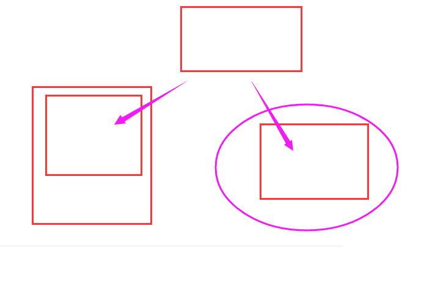

# 微信小程序基础-第二天

**主要内容**

* 数据绑定

* 事件处理

* 模板使用

  

  

**学习目标**

| 知识点   | 要求 |
| -------- | ---- |
| 数据绑定 | 掌握 |
| 事件处理 | 掌握 |
| 模板使用 | 掌握 |


1. 优缺点

2. 组件(标签)

     view  text image swiper button input  

     navigator open-type  

   navigate：跳转新页面，保留当前页面（返回），非tabbar页面

   redirect:跳转新页面，不保留当前页面（没返回），非tabbar页面

   switchTab：跳转新页面，tabbar页面，-==》从非tabbar页面到tabbar页面

   exit 退出

3. wxss 

   单位：rpx  750px（物理像素）=750rpx

   样式导入 ：@import ''

   


## 一、数据绑定

### 1.渲染层和逻辑层

#### 1.1小程序的宿主环境

​	小程序依赖于微信客户端提供的环境--宿主环境，小程序借助这个宿注环境提供的功能，可以实现网页无法实现的功能。让小程序更接近原生的app体验。

原生的app：IOS、Android 开发 

原生APP嵌H5页面==》原生提供 webview   混合App  Hybrid   App

一个页面两端适用，



PC端、移动端（手机、pad）

App：混合开发     原生和H5

WebApp: 在移动端浏览器上浏览


​	整个小程序的框架分为两部分：<font color='red'>逻辑层（javascript） 和 视图层（界面层 渲染层）</font>

​    <font color='red'>逻辑层和渲染层分离</font>


​	首先，我们来简单了解下小程序的运行环境。小程序的运行环境分成渲染层和逻辑层，其中 WXML 模板和 WXSS 样式工作在渲染层，JS 脚本工作在逻辑层。

​	小程序的渲染层和逻辑层分别由2个线程管理：渲染层的界面使用了WebView 进行渲染；逻辑层采用JsCore线程运行JS脚本。一个小程序存在多个界面，所以渲染层存在多个WebView线程，这两个线程的通信会经由微信客户端（下文中也会采用Native来代指微信客户端）做中转，逻辑层发送网络请求也经由Native转发，小程序的通信模型下图所示。


注意：

==没有BOM(document)、DOM(window)==

不需要处理浏览器兼容性


### 2.逻辑层js文件

#### 2.1<font color='red'>app.js 小程序全局逻辑</font>

​	每个小程序都需要在 app.js 中调用 App 方法注册小程序实例，绑定生命周期回调函数、错误监听和页面不存在监听函数等。

​	App(object)注册小程序。接受一个 `Object` 参数，其指定小程序的生命周期回调等。

```javascript
App({})
```

​	<font color='red'>**App() 必须在** app.js **中调用，必须调用且只能调用一次。不然会出现无法预期的后果。**</font>

​	生命周期回调函数：小程序从创建到销毁的整个过程，小程序会自动创建一些函数，在每个阶段会自动触发，不需要调用。

​	包含的内容：

​	1）生命周期函数 （自动创建的--使用的时候直接在函数里面写）

​	2）错误监听等函数

​	3）小程序的全局变量 globalData:{} 

​	4）自定义函数 

```javascript
App({

  /**
   * 生命周期回调—监听小程序初始化
	 小程序初始化完成时触发，全局只触发一次。 当小程序初始化完成时，会触发 onLaunch（全局只触发一次）
   */
  onLaunch: function () {
    
  },

  /**
   * 当小程序启动，或从后台进入前台显示，会触发 onShow
   */
  onShow: function (options) {
    
  },

  /**
   * 当小程序从前台进入后台，会触发 onHide
   */
  onHide: function () {
    
  },

  /**
   * 当小程序发生脚本错误，或者 api 调用失败时，会触发 onError 并带上错误信息
   */
  onError: function (msg) {
    
  },
  /*
    小程序的全局变量，可以实现页面共享数据
  */
  globalData: {
    userName:'admin',//账号
  }
})
```

​	整个小程序只有一个 App 实例，是全部页面共享的。开发者可以通过<font color='red'> `getApp` </font>方法获取到全局唯一的 App 实例，获取App上的数据或调用开发者注册在 `App` 上的函数。

```javascript
// xxx.js
//引入app.js文件
const app=getApp();
console.log(app); 
```


#### 2.2pages.js当前页面逻辑

​	对于小程序中的每个页面，都需要在页面对应的 js 文件中进行注册，指定页面的初始数据、生命周期回调、事件处理函数等

包含的内容：

1）data界面视图的数据内容

2）生命周期函数

3）事件处理函数，比如下拉触发函数

4）自定义函数

​	简单的页面可以使用 <font color='red'>`Page()` </font>进行构造。

```javascript
Page({

  /**
   * 页面的初始数据
   */
  data: {

  },

  /**
   * 生命周期函数--监听页面加载
   * 页面加载时触发。一个页面只会调用一次，可以在 onLoad 的参数中获取打开当前页面路径中的参数。
   */
  onLoad: function (options) {
   
  },

  /**
   * 生命周期函数--监听页面初次渲染完成
   */
  onReady: function () {
   
  },

  /**
   * 生命周期函数--监听页面显示
   */
  onShow: function () {
   
  },

  /**
   * 生命周期函数--监听页面隐藏
   */
  onHide: function () {
   
  },

  /**
   * 生命周期函数--监听页面卸载
   */
  onUnload: function () {

  },

  /**
   * 页面相关事件处理函数--监听用户下拉动作
   */
  onPullDownRefresh: function () {

  },

  /**
   * 页面上拉触底事件的处理函数
   */
  onReachBottom: function () {},

  /**
   * 用户点击右上角分享
   */
  onShareAppMessage: function () {

  }
})
```


#### 2.3 JS模块使用

遵循commonjs 规范：

导出语法：

```js
//1、直接暴露函数名字
module.exports=fun;

//2、直接暴露对象{属性名:函数}
module.exports={
    fun:fun,
    demo:demo
}
```

引入语法：

```js
const obj=require('../')
```


ES6 导入导出：

默认：

import xx from ‘./’

export default {}

按需：

import { msg  ,fn } from './'

export const msg='123'

export const fn=()=>{}


### 3.数据绑定

​	WXML 中的动态数据均来自对应 Page 的 data。

#### 3.1内容

​	数据绑定使用 Mustache 语法<font color='red'>（双大括号）将变量包起来</font>。

```html
<!--语法-->
<组件>{{变量}}</组件>
```

```javascript
//wxml
//<view>数据绑定{{msg}}--{{num}}</view>
//<view>{{arr[0]}}</view>
//<view>书名：{{book.bookName}}  价格：{{book.price}}</view>

data: {
    msg:"hello 小程序",
    num:20,
    arr:[10,20,30],
    book:{
         bookName:'西游记',
         price:109
    }
},
```

#### 3.2组件属性(需要在双引号之内)

```html
<组件 class="{{}}" data-xx="{{}}"></组件>
```

```javascript
//<view class="{{active}}">属性获取数据绑定</view>
//相当于 class="red"
data: {
    active:'red'
},
```

#### 3.3三目运算

```html
{{三目运算}}
```

```javascript
//<view class="{{flag?'red':'green'}}">是否加样式</view>
data: {
    flag:false,
},
```

### 4.列表渲染

#### 4.1wx:for

​	在组件上使用 `wx:for` 控制属性绑定一个<font color='red'>数组</font>，即可使用数组中各项的数据重复渲染该组件。

​	默认数组的当前项的<font color='red'>下标</font>变量名默认为<font color='red'> `index`</font>，数组<font color='red'>当前项</font>的变量名默认为<font color='red'> `item`</font>

【例子1】

```html
<view wx:for="{{info}}">
  {{index}}:{{item}}
</view>
```

```javascript
Page({
  data: {
    info: ['周一', '周二', '周三', '周四', '周五'],
  }
})
```

【例子2】

```html
<view wx:for="{{objArr}}">
  <view>
    标题：{{item.title}}
  </view>
  <view>
    内容：{{item.desc}}
  </view>
</view>
```

```javascript
Page({
  data: {
    objArr: [{
        title: '新闻1',
        desc: '最新消息，xxxx'
      },
      {
        title: '新闻1',
        desc: '最新消息，xxxx'
      },
      {
        title: '新闻1',
        desc: '最新消息，xxxx'
      },
    ]
  }
})
```

使用 `wx:for-item` 可以指定数组当前元素的变量名，

使用 `wx:for-index` 可以指定数组当前下标的变量名：

默认不修改，循环嵌套的时候必须修改。

```html
<view wx:for="{{objArr}}" wx:for-index="i" wx:for-item="itemName">
  {{i}}: {{itemName.message}}
</view>
```

#### 4.2block wx:for

​	可以将 `wx:for` 用在`<block/>`标签上，以渲染一个包含多节点的结构块。block只起到包裹作用，不会被渲染。

```html
<block wx:for="{{objArr}}">
  <view>{{item.title}}</view>
  <view>{{item.desc}}</view>
</block>
```

#### 4.3wx:key

​	如果列表中项目的位置会动态改变或者有新的项目添加到列表中，并且希望列表中的项目保持自己的特征和状态，需要使用 `wx:key` 来指定列表中项目的<font color='red'>唯一的标识符</font>。

​	`wx:key` 的值以两种形式提供

1. <font color='red'>字符串</font>，代表在 for 循环的 array 中 item 的某个 property，该 property 的值需要是列表中唯一的字符串或数字，且不能动态改变。
2. 保留关键字 `*this` 代表在 for 循环中的 item 本身，这种表示需要 item 本身是一个唯一的字符串或者数字。

**如不提供 `wx:key`，会报一个 `warning`， 如果明确知道该列表是静态，或者不必关注其顺序，可以选择忽略。**

```html
<block wx:for="{{objArr}}" wx:key="index">
  <view>{{item.title}}</view>
  <view>{{item.desc}}</view>
</block>
```


### 5. 条件渲染

#### 5.1wx:if

​	在框架中，使用 `wx:if=""` 来判断是否需要渲染该代码块：

```html
<!--语法-->
<组件 wx:if="{{变量、表达式}}"></组件>
```

​	说明：

​	变量、表达式值为true时显示组件

​	变量、表达式值为false时隐藏组件

```html
<view wx:if="{{!falg}}">去吗？配吗？战吗？站啊！</view>
```

​	也可以用 `wx:elif` 和 `wx:else` 来添加一个 else 块：

```html
<view wx:if="{{length > 5}}"> 1 </view>
<view wx:elif="{{length > 2}}"> 2 </view>
<view wx:else> 3 </view>
```

​	常用wx:if="{{}}"和wx:else来判断：

```html
<view wx:if="{{flag}}">是否显示：wx:if</view>
<view wx:else>取反操作：wx:else</view>
```

#### 5.2block wx:if

​	因为 `wx:if` 是一个控制属性，需要将它添加到一个标签上。如果要一次性判断多个组件标签，可以使用一个 `<block/>` 标签将多个组件包装起来，并在上边使用 `wx:if` 控制属性。

```html
<block wx:if="{{true}}">
  <view> view1 </view>
  <view> view2 </view>
</block>
```

​	**注意：** `<block/>` 并不是一个组件，它仅仅是一个包装元素，不会在页面中做任何渲染，只接受控制属性。

#### 5.3`hidden`

​	表示是否隐藏该代码块。

```html
<!--语法-->
<组件 hidden="{{变量、表达式}}"></组件>
```

```html
<view hidden="{{3<2}}">易烊千玺</view>
```

#### 5.4`wx:if` vs `hidden`

​	wx:if：控制组件显示隐藏通过控制组件是否==添加和删除==

​	hidden：控制组件显示隐藏是==通过控制wxss样式display属性==

​	一般来说，`wx:if` 有更高的切换消耗而 `hidden` 有更高的初始渲染消耗。因此，如果需要频繁切换的情景下，用 `hidden` 更好，如果在运行时条件不大可能改变则 `wx:if` 较好。


## 二、事件处理

### 1.事件


#### 1.1 什么是事件

- 事件是视图层到逻辑层的通讯方式。
- 事件可以将用户的行为反馈到逻辑层进行处理。
- 事件可以绑定在组件上，当达到触发事件，就会执行逻辑层中对应的事件处理函数。
- 事件对象可以携带额外信息，如 id, dataset, touches。


#### 1.2 事件分类

​	事件分为冒泡事件和非冒泡事件：

- 冒泡事件：当一个组件上的事件被触发后，该事件会向父节点传递。

- 非冒泡事件：当一个组件上的事件被触发后，该事件不会向父节点传递。

  WXML的冒泡事件列表：

| 类型        | 触发条件                             | 最低版本 |
| :---------- | :----------------------------------- | :------- |
| touchstart  | 手指触摸动作开始                     |          |
| touchmove   | 手指触摸后移动                       |          |
| touchcancel | 手指触摸动作被打断，如来电提醒，弹窗 |          |
| touchend    | 手指触摸动作结束                     |          |
| tap         | 手指触摸后马上离开（点击）           |          |

​	**注：除上表之外的其他组件自定义事件如无特殊声明都是非冒泡事件，如 [form](https://developers.weixin.qq.com/miniprogram/dev/component/form.html) 的`submit`事件，[input](https://developers.weixin.qq.com/miniprogram/dev/component/input.html) 的`input`事件，[scroll-view](https://developers.weixin.qq.com/miniprogram/dev/component/scroll-view.html) 的`scroll`事件，**


#### 1.3 普通事件绑定

​	事件绑定的写法类似于组件的属性，语法如下：

```html
冒泡事件：<组件 bind事件名="函数名"></组件>  bindtap
非冒泡事件：<组件 catch事件名="函数名"></组件>  catchtap

//js
函数名(){}
```

```html
<view bindtap="demo">
  点我试试
  <view bindtap="child">试试就试试</view>
</view>
```

```javascript
//ES6写法
demo(){
    console.log('儿子我是你爸爸');
},
child(){
    console.log('我有爸爸了');
},
```

​	如果用户点击这个 view ，则对应的函数会被调用。


#### 1.4 绑定并阻止事件冒泡

​	除 `bind` 外，也可以用 `catch` 来绑定事件。与 `bind` 不同， `catch` 会阻止事件向上冒泡。

```html
<view bindtap="demo">
  点我试试
  <view catchtap="child">试试就试试</view>
</view>
```


#### 1.5 事件传参

​	在组件节点中可以附加一些自定义数据。这样，在事件中可以获取这些自定义的节点数据，用于事件的逻辑处理。

​	在 WXML 中，这些自定义数据以 `data-` 开头，多个单词由连字符 `-` 连接。这种写法中，连字符写法会转换成驼峰写法，而大写字符会自动转成小写字符。如：

- `data-element-type` ，最终会呈现为 `event.currentTarget.dataset.elementType` ；
- `data-elementType` ，最终会呈现为 `event.currentTarget.dataset.elementtype` 。

```html
<view 
bindtap="getParams" 
data-id="8090" 
data-user="{{user}}"
data-user-name="admin">
    事件传参
</view>
```

```javascript
data: {
    user:'张三'
  },
  //参数的传递
  getParams(e){
    console.log(e);
    console.log(e.target.dataset.id);
  },
```


#### 1.6setData方法

​	`setData` 函数用于将数据从逻辑层发送到视图层，同时改变对应的 `this.data` 的值。

​	**注意：**

1. **直接修改 this.data 而不调用 this.setData 是无法改变页面的状态的，还会造成数据不一致**。
2. 单次设置的数据不能超过1024kB，请尽量避免一次设置过多的数据。

```html
<button type="primary" bindtap="change">点击切换显示隐藏</button>
<view class="box" wx:if="{{flag}}"></view>
```

```javascript
//视图同步修改
this.setData({
    flag:!this.data.flag
});

//vue
this.flag=!this.flag

this.setState({
    
})
```


### 2.小案例

 点击的当前元素添加背景颜色

```html
<view wx:for="{{arr}}" class="{{index===num?'bg':''}}" data-index="{{index}}" bindtap="changeBg" >
  {{item}}
</view>
```

```javascript
data: {
    num: 0,
    arr: ['周六', '周日', '周五', '周四', '周三'],
  },
  //给点击的当前行添加背景颜色
  changeBg(e) {
    //点击当前行的时候获取index下标，赋值给data数据里面的num
    this.setData({
      num: e.target.dataset.index
    })
  },
```

 


## 三、模板使用

https://developers.weixin.qq.com/miniprogram/dev/reference/wxml/template.html

### 1.模板

​	WXML提供模板（template），可以在模板中定义代码片段（wxml、wxss），然后在不同的地方调用。

### 2.定义模板

​	使用 <font color='red'>name 属性</font>，作为模板的名字。然后在`<template/>`内定义代码片段，使用步骤如下：

```html
1.创建模板文件(template)
2.定义模板
    <template name="模板名字">
        <!-- 真实的模板内容template不会渲染起包裹作用 -->
        ...
    </template>
3.引入模板
	wxml中引入：<import src="相对路径"></import>
	wxss中引入：@import "路径";
4.使用模板
	<template is="模板名称"></template>
```

### 3.使用模板

​	使用<font color='red'> is 属性</font>，声明需要的使用的模板

```html
//例子
1.定义模板
<template name="list">
    <view class="item">
      <view class="left"></view>
      <view class="content"></view>
    </view>
</template>
2.wxml中引入模板
<import src="../../template/list/list"></import>
3.wxss中引入模板
@import "../../template/list/list.wxss";
4.使用模板
<template is="list"></template>
```

 


### 4.模板传递数据

```html
<template is="模板名称" data={{数据变量}}></template>
```

```html
//语法1
//定义模板
<template name="list">
  <view class="item">
    <view class="left">{{item.img}}</view>
    <view class="content">{{item.info}}</view>
  </view>
</template>

//导入模板
<import src="../../template/list/list"></import>

//使用模板
<view wx:for="{{arr}}" wx:key="index">
  <template is="list" data="{{item}}"></template>
</view>
```

```html
//语法2
//定义模板
<template name="list">
  <view class="item">
    <view class="left">{{img}}</view>
    <view class="content">{{info}}</view>
  </view>
</template>

//导入模板
<import src="../../templatet/list"></import>

//使用模板
<view wx:for="{{arr}}" wx:key="index">
  <template is="list" data="{{...item}}"></template>
</view>
```


