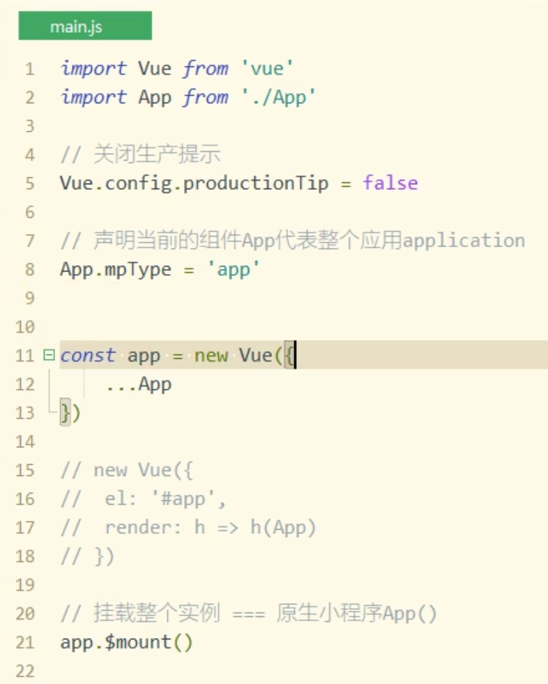
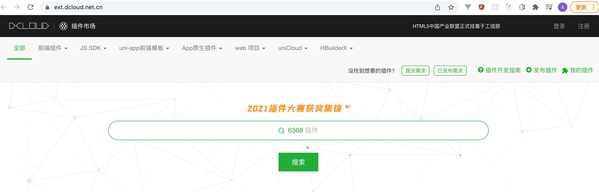

#         一、uni-app简介

官网：https://uniapp.dcloud.io/

1. uni-app是一个使用[Vue.js](https://vuejs.org/)开发所有前端应用的框架，支持Vue语法 + 小程序标签/API

2. 跨终端： 开发者编写一套代码，可发布到iOS、Android、Web（响应式）、以及各种小程序（微信/支付宝/百度/头条/飞书/QQ/快手/钉钉/淘宝）、快应用（华为、小米）等多个平台。

3. DCloud 国产

4. 支持平台: 

   


# 二、快速上手

## 2.1 开发工具

下载地址: https://www.dcloud.io/hbuilderx.html

安装示意图: 

 

 

下载开发版，开箱即用：

 


## 2.2 开箱即用

1. 下载后在找到HbuilderX.exe文件双击启动即可

 


## 2.3 初始化项目


 

 

 

 

## 2.4 运行项目


 


# 三、开发微信小程序

## 3.1 相关配置

1. Uni-app项目运行至小程序开发工具需要提前设置小程序开发工具的安装路径

2. 同时设置小程序开发工具拒绝访问问题

   第一次使用需设置小程序开发工具的安装路径，否则无法打开开发工具

   


在小程序的开发工具中，设置/安全设置 开启端口：


 

运行：

 

运行之后，编译完的项目会放到  unpackage文件夹下。

源文件：vue语法开发

加载到小程序里，还原成原生小程序的语法。


# 四、语法介绍

## 4.1 官网使用指南

1. 框架： 配置信息，框架接口(页面，页面生命周期等)

2. 组件： 同小程序组件一样,用于布局

3. API：  用于实现指定的功能

   a) 全局对象uni    wx.    uni.

   b) 组成: ECMAScript的jsAPI + uni扩展api组成

   c) 示例: uni.request || uni.setStorage   wx.request 


入口文件：main.js



App.vue

会分别编译成 app.js 和app.wxss


pages.json 相当于 app.json

manifest.json配置：


既支持小程序的生命周期钩子函数，也支持vue的钩子函数


## 4.2 温馨提示

1. Uni-app的组件同原生小程序一样

2. Uni-app支持Vue语法

3. 学好Vue + 原生小程序之后可快速上手uni-app


pages.json 自动生成：


# 五、插件安装

## 5.1 内置插件安装

 


 


### stylus特点：

预处理语言：less  sass   webpack==> css

作用：方便开发人员，快速高效的写CSS      

浏览器只认CSS

```less
@color:#fff
.test{
    color:@color;
    .title{
        font-size:17px;
    }
}

```


1. 省略大括号

2. 省略键值对的分号和冒号

3. 支持样式缩进、嵌套

   ```stylus
   .test
   	color red
   	.title
           font-size 17px
   ```

   


## 5.2 插件市场


  

 


# 六、跨域处理


小程序：是不存在跨域！！不需要做兼容性处理。


## 6.1 方式一:vue.config.js配置


 

## 6.2 方式二:mainfest.json配置

在mainfest.json中，针对H5进行跨域设置：


 

 


