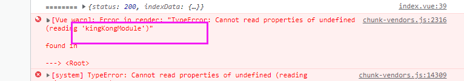

## 一、全局配置

### 1.1 设置全局样式：


## 二、首页

### 2.1 效果图


### 2.2 布局

nav-item 横向处理：

```html
<!-- 导航区域 -->
<scroll-view class="navScroll" scroll-x="true" enable-flex>
    <view class="navItem active">推荐</view>
    <view class="navItem">
        居家生活
    </view>
    <view class="navItem">推荐</view>
    <view class="navItem">
        居家生活
    </view>
    <view class="navItem">推荐</view>
</scroll-view>
```


### 2.3 样式

```stylus
// 导航区域
        .navScroll
            display flex
            //不换行
            white-space nowrap
            .navItem
                height 40rpx
                padding 10rpx 
                font-size 24rpx
                // & 父级引用
                &.active
                    border-bottom 3rpx solid red
```


## 三、服务器端搭建

### 3.1 搭建步骤

1. 创建包说明书：

```bash
npm init -y
```

2. 安装 express

Index.js:

```js
const express=require('express')
const router=require('./router')
// 创建服务器
const app=express();

app.use('/',router)


app.listen('7788',()=>{
	console.log('服务端启动成功啦。。。。。');
	console.log('http://localhost:7788');
})
```


router.js:

```js
const express=require('express')
// 路由
const router=express.Router();

router.get('/test',(req,res)=>{
	res.send({
		data:'测试成功'
	})
})

// 引入首页数据
const indexData=require('../datas/index.json');
// 注册index页接口
router.get('/getIndexData',(req,res)=>{
	res.send({
		status:200,
		indexData,
	})
})


module.exports=router;
```


### 动态加载导航栏

==数据：kingKongModule==


## 四、发送请求

### 4.1 封装发请求方法

utils/request.js

```js
import cofig from './config.js'
export default (url,data={},method='GET')=>{
	return  new Promise((resolve,reject)=>{
		uni.request({
			url:cofig.host+url,
			data,
			method,
			success(res) {
				resolve(res.data);
			},
			fail(err) {
				reject(err);
			}
		})
	})
}
```

config.js:

```js
export default {
	host:'http://localhost:3000'
}
```


### 4.2 发送请求

vue  axios   

wx.

uni.

 

小程序里不存在跨域，但是如果是H5的项目存在跨域：

根目录下创建 vue.config.js：

```js
// 设置vue脚手架一些相关的配置
module.exports = {
  devServer: {
    proxy: {
      '/api': {
        target: 'http://localhost:7788',
        ws: true,
        changeOrigin: true,
		pathRewrite:{
			'^/api':''
		}
      }
    }
  }
}

```

#### 修改发送请求：

```js
// 获取首页数据
async getIndexData() {
    const res = await request('/getIndexData');  //小程序
    // const res = await request('/api/getIndexData');  //H5
    console.log('========',res);
    this.indexData=res.indexData;
},
```


原因：

==Vue 的模板解析比发网络请求要快==


##### v-if  v-for 他两不能同时在一个标签上， 为什么呢？

v-for 优先级高，

v-if  放到父元素上

##### ===》为什么小程序不报错？

小程序是经过编译之后，运行到微信开发工具中的

H5边读取，边解析 ；读到模板，还没有网络数据


### 4.3 动态加载导航栏

数据：kingKongModule


```html
<!-- 导航区域 -->
<scroll-view class="navScroll" scroll-x="true" enable-flex>
    <view class="navItem" :class="{active:navIndex===-1}" @click="changeIndex(-1)">
        推荐
    </view>
    <view class="navItem" :class="{active:navIndex===index}" @click="changeIndex(index)" v-for="(item,index) in indexData.kingKongModule.kingKongList" :key='item.L1Id'>
        {{item.text}}
    </view>
</scroll-view>
```

方法：

```js
methods:{
    async getIndexData(){
        this.indexData=await request('/getIndexData'); //小程序
        // this.indexData=await request('/api/getIndexData'); //H5
        console.log(this.indexData)
    },
    //切换索引
        changeIndex(index){
            this.navIndex=index;
        }
}
```


## H5

a.b.c报错？




为什么在小程序里不报？

原因：小程序编译之后的代码，放到开发工具里，加载，所以不会出现上面的情况


面试题：

v-if ：添加删除  DOM

v-show：显示、隐藏 DOM   display:none


面试题： v-if  和 v-for 可以放在同一个标签上吗? 为什么

答案：不能。  v-for优先级高，需要同时使用的话， v-if 放到父元素上去


