## 一、搭建仓库

请求回的首页数据，需要被多个组件共享使用，要么组件通信，要么使用vuex集中管理数据。

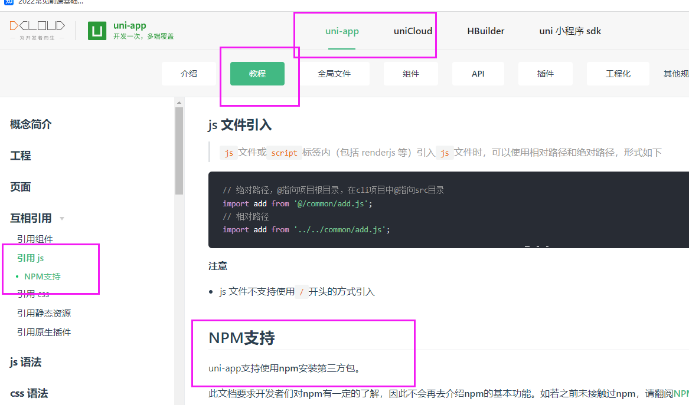


初始化package.json：

npm init -y

下载vuex：

npm install vuex@3.x -S


### 1.1 回顾Vuex：

作用：

1. 集中式管理状态
2. 多个组件之间共享数据

核心：

1. state 存储状态

2. mutations：每个都是方法，同步修改state数据

   面试题：可以异步修改，但是vuex调试工具里，你看不到数据变化

   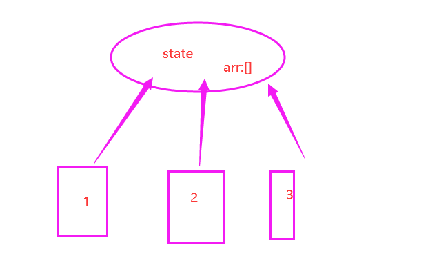

3. actions：每个都是方法，异步修改state数据。  同步触发mutations

4. getters：对state已有的数据加工处理，返回计算属性

5. module :分模块管理  


### 1.2 引入Vuex-基本结构

store/index.js:

```js
import Vue from 'vue';
import Vuex from 'vuex'
import home from './modules/home.js'

Vue.use(Vuex);
const store=new Vuex.Store({
	modules:{
		home
	}
})

export default store;
```

modules/home.js:

```js
const state={
	test:'测试数据'
}
const mutations={	
}
const actions={	
}
const getters={	
}
export default {
	state,
	mutations,
	actions,
	getters
}
```

测试：

```js
mounted() {
    // 测试
    console.log(this.$store.state.home.test)
    this.getIndexData();
},
```


## 二、从Vuex获取首页数据

之前，数据都是在首页发送request请求获取的。接下来，所有的数据需要从Vuex中获取。先得往Vuex的state里存数据，然后再取。

```js
import request from '../../utils/request.js'
const state={
	indexData:{}
}

const mutations={
	// 修改首页数据对象
	changeIndexDataMutation(state,indexData){
        //同步修改数据
		state.indexData=indexData
	}
}

const actions={
	async getIndexDataAction({commit}){
		console.log('getIndexDataAction')
		// 1、执行异步任务，获取数据
		let result =await request('/getIndexData');
		 // 2、触发mutation，修改数据
		 commit('changeIndexDataMutation',result)
	}
	
}
```

index.vue:

```js
mounted() {
    // 第一种方式：
    // this.$store.dispatch('getIndexDataAction')
    this.getIndexDataAction();
},
 methods:{
     //第二种方式：
     ...mapActions({
         getIndexDataAction:'getIndexDataAction'
     }),
computed:{
    //获取数据
    ...mapState({
        indexData:state=>state.home.indexData
    })
},     
```


## 三、内容区

### 效果图

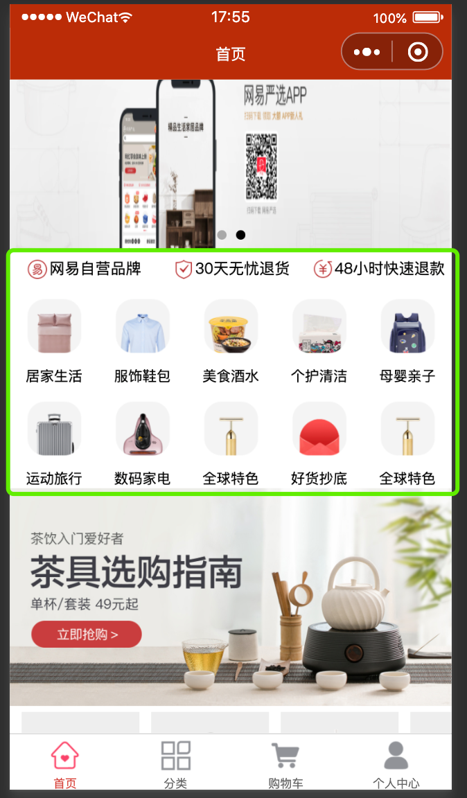

### 3.1 推荐模块

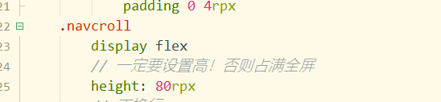

Recommend/Recommend.vue

轮播图：

```vue
<view class="recommendContainer">
		<!-- 轮播图 -->
		<swiper class="banner" :indicator-dots="true" :autoplay="true" :interval="3000" :duration="1000">
			<swiper-item>
				<view class="swiper-item">
					<image src="https://yanxuan.nosdn.127.net/0fae504f6958db87ee919c38bac02c9b.png?type=webp&imageView&quality=95&thumbnail=1920x420" mode=""></image>
				</view>
			</swiper-item>
			<swiper-item>
				<view class="swiper-item">
					<image src="https://yanxuan.nosdn.127.net/228e70f4622ff4956c09f5758dd7d46b.jpeg?type=webp&imageView&quality=95&thumbnail=1920x420" mode=""></image>
				</view>
			</swiper-item>
		</swiper>
    <!-- 小图标区域  数据：index.json中的 policyDescList -->
</view>
```


```stylus
.recommendContainer
		margin-top 10rpx
		.banner
			width 100%
			height 350rpx
			image
				width 100%
				height 350rpx
```


### 3.2 三个小图标

小图标区域  数据：index.json中的 policyDescList

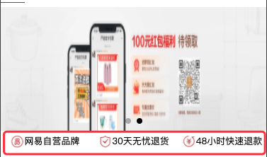


```html
<!-- 小图标区域  数据：index.json中的 policyDescList -->
<view class="policyList">
    <view class="policyItem" v-for="(item,index) in indexData.policyDescList" :key='item.desc'>
        <image :src="item.icon" mode=""></image>
        <text>{{item.desc}}</text>
    </view>
</view>
```

从Vuex中获取数据：

```js
computed:{
    ...mapState({
        indexData:state=>state.home.indexData
    })
}
```

样式：

```stylus
		.policyList
			margin 5rpx 0
			display flex
			.policyItem
				flex 1
				text-align center
				image
					width 40rpx
					height 40rpx
					// 文字在图片中间对齐
					vertical-align middle
				text
					font-size 26rpx
```


### 3.3 10个导航图标

数据：kingKongModule

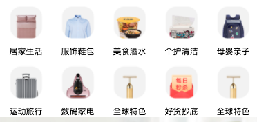

```html
<!-- 10个小图标 数据：kingKongModule -->
<view class="kingKongList" v-if="indexData.kingKongModule">
    <view class="kingKongItem" v-for="item in indexData.kingKongModule.kingKongList" :key='item.L1Id'>
        <image class="kingKongImg" :src="item.picUrl" mode=""></image>
        <text class="kingKongText">{{item.text}}</text>		
    </view>
</view>
```


```stylus
.kingKongList
			display flex
			flex-wrap wrap
			.kingKongItem
				width 20%
				display flex
				flex-direction column
				// 居中
				align-items center
				.kingKongImg
					width 100rpx
					height 100rpx
					margin 20rpx 0
				.kingKongText
					font-size 24rpx
```


### 3.4 分类区

数据：categoryModule 

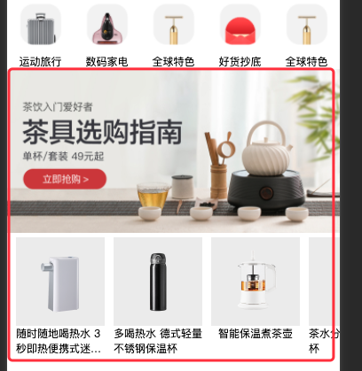

```html
<!-- 分类区 数据：categoryModule -->
<view class="categoryList" v-if="indexData.categoryModule">
    <view class="categoryItem" v-for='item in indexData.categoryModule' :key='item.titlePicUrl'>
        <image class="categoryImg" :src="item.titlePicUrl" mode=""></image>
        <scroll-view class="categoryScroll" scroll-x="true" enable-flex>
            <view class="goodsItem" v-for="goodsItem in item.itemList" :key='goodsItem.id'>
                <image class="goodsImg" :src="goodsItem.showPicUrl" mode=""></image>
                <text class="goodsText">{{goodsItem.name}}</text>
            </view>
            
            <view class="goodsItem more" >
                查看更多>
            </view>
        </scroll-view>
    </view>

</view>
```


```stylus
.categoryList
    .categoryItem
        margin-bottom 20rpx
                .categoryImg
                    width 100%
                    height 370rpx
                .categoryScroll
                    display flex
                    // 让scrollview不换行
                    white-space nowrap
                    // scrollview 会全屏撑开
                    height 300rpx
                    .goodsItem
                        width 200rpx
                        margin-left 20rpx
                        // 横向排列 解决老版本不横向排列问题
                        display inline-block
                        display flex
                        flex-direction column
                        align-items center
                        .goodsImg
                            width 200rpx
                            height 200rpx
                        .goodsText
                            font-size 24rpx
                            // 让文本换行
                            white-space pre-wrap
                            display -webkit-box
                            -webkit-line-clamp 2
                            -webkit-box-orient vertical
                            text-overflow ellipsis
                            overflow hidden
                         &.more
							width 200rpx
							height 200rpx
							background-color #eee
							line-height 200rpx
	
```


## 四、底部tabBar

### 效果图

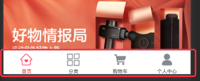

### 新建分类页

pages 右键 “新建页面”：cart、category、personal

### 设置 tabBar 样式 page.json:

```js
"tabBar": {
    "color": "#666",
    "selectedColor": "#D43C33",
    "list": [{
        "pagePath": "pages/index/index",
        "text": "首页",
        "iconPath": "/static/images/tabBar/tab-home.png",
        "selectedIconPath": "/static/images/tabBar/tab-home-current.png"
    }, {
        "pagePath": "pages/category/category",
        "text": "分类",
        "iconPath": "/static/images/tabBar/tab-cate.png",
        "selectedIconPath": "/static/images/tabBar/tab-cate-current.png"
    }, {
        "pagePath": "pages/cart/cart",
        "text": "购物车",
        "iconPath": "/static/images/tabBar/tab-cart.png",
        "selectedIconPath": "./static/images/tabBar/tab-cart-current.png"
    }, {
        "pagePath": "pages/personal/personal",
        "text": "个人中心",
        "iconPath": "/static/images/tabBar/tab-my.png",
        "selectedIconPath": "./static/images/tabBar/tab-my-current.png"
    }]
}

```

### 单独设置每个页面的标题

```js
"pages": [ //pages数组中第一项表示应用启动页，参考：https://uniapp.dcloud.io/collocation/pages
    {
        "path": "pages/index/index",
        "style": {
            "navigationBarTitleText": "首页"
        }
    }, {
        "path": "pages/cart/cart",
        "style": {
            "navigationBarTitleText": "购物车"
        }
    }, {
        "path": "pages/personal/personal",
        "style": {
            "navigationBarTitleText": "个人中心"
        }
    }, {
        "path": "pages/category/category",
        "style": {
            "navigationBarTitleText": "分类"
        }
    }
]
```


## 五、首页里-分类列表

首页 scrollView 导航中，除了推荐，其他的几个列表都是一样的。并且跟推荐都展示在一块区域。所以，需要封装组件 cateList

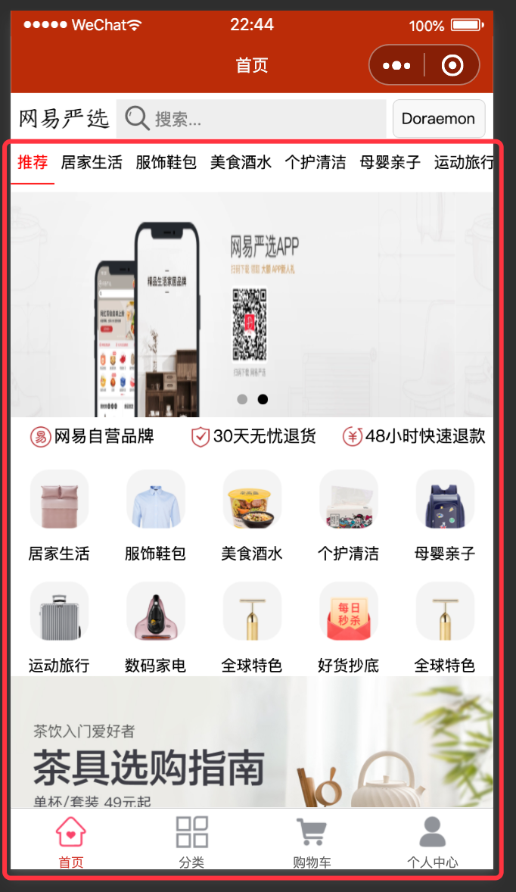

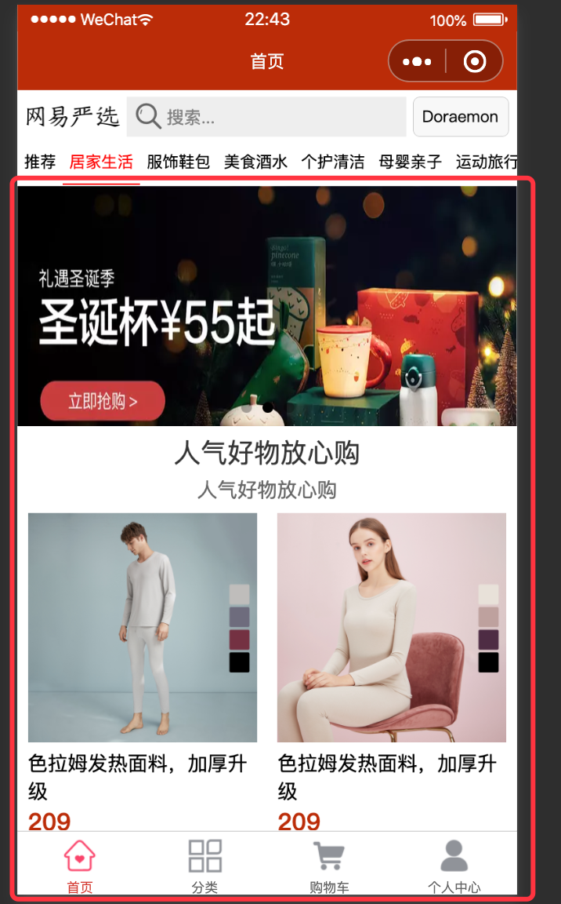


##### 步骤：

1. 准备组件  components/CateList.vue
2. 推荐跟公用分类组件的互斥效果
3. CateList.vue  发网络请求；前提后台先准备接口
4. 实现点击哪个导航，获取指定数据  ==》计算属性  [ ]       find


### 分类列表

除了推荐之外的分类列表

数据：前三列表

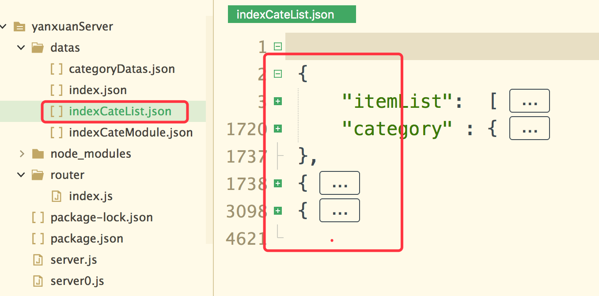

从index.vue 到 CateList.vue，传递L1Id

```html
<!-- 其他分类列表 -->
<CateList v-else :L1Id='L1Id'></CateList>
```


CateList.vue

```vue
<template>
	<view class="cateListContainer">
		<!-- 轮播图 -->
		<swiper class="banners" :indicator-dots="true" :autoplay="true" :interval="3000" :duration="1000">
			<swiper-item v-for="item in cateObj.category.bannerUrlList" :key='item'>
				<view class="swiper-item">
					<image class="bannerImg" :src="item" mode=""></image>
				</view>
			</swiper-item>
		</swiper>
		
		<view class="title">
			{{cateObj.category.frontName}}
		</view>
		<view class="desc">
			{{cateObj.category.frontDesc}}
		</view>
		
		<!-- 列表区域 -->
		<view class="goodsList">
			<view class="goodsItem" @click="toDetail(item)" v-for="item in cateObj.itemList" :key='item.id'>
				<image class="goodsImg" :src="item.listPicUrl" mode=""></image>
				<view class="goodsDesc">
					{{item.simpleDesc}}
				</view>
				<view class="goodsPrice">
					{{item.retailPrice}}
				</view>
			</view>
		</view>
	</view>
</template>
```


```js
import request from '../../utils/request.js'
	export default{
		props:['L1Id'],
		data() {
			return {
				cateList:[]
			}
		},
		mounted(){
			this.getCateList()
		},
		methods:{
			async getCateList(){
				this.cateList=await request('/indexCateList');
				// console.log(this.cateList);
			},
			toDetail(item){
				// 通过路由传递整个对象到详情页
				wx.navigateTo({
					url:'/pages/detail/detail?goodsItem='+JSON.stringify(item)
				})
			}
		},
		computed:{
			cateObj(){
				// 找传递过来的L1Id下的所有 item
				return this.cateList.find(item=>item.category.parentId===this.L1Id)
			}
		}
	}
```

### 


